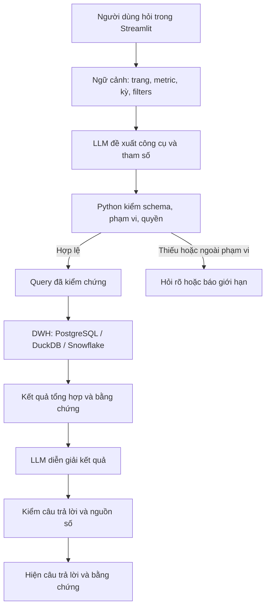

# Kế hoạch AI Explain: chat hỏi dữ liệu PS1–PS5

Ngày soạn: **2026-10-01**.

**Trạng thái:** đề xuất triển khai để thảo luận và giao việc. Đã có định hướng chat PS1–PS5, skill và tiêu chí eval; chưa có runtime chat trong app, chưa chọn provider/model, chưa gọi API hoặc triển khai cloud trong đợt lập tài liệu này.

**Cập nhật 2026-10-03:** đã làm AI0–AI1 cho lát cắt R 2019/2018 → PS4 → PS5. Kết quả gate, ma trận khả năng và số đối chứng ghi ở [ai_explain_ai0_ai1.md](ai_explain_ai0_ai1.md). Đã đạt trên DuckDB và PostgreSQL chỉ đọc (role `retail_ai_ro`); chưa có LLM, chờ PM chọn provider/model/chi phí.

**Cập nhật 2026-10-05:** đã code AI2: provider DeepSeek/OpenAI theo cấu hình, bộ điều phối, kiểm claim, trang chat. Kiểm bằng mô hình giả, **chưa chạy model thật** vì chưa có khóa API. Xem [ai_explain_ai2.md](ai_explain_ai2.md).

**Rà lại ngày 2026-10-02:** bổ sung điều kiện trước khi build, phát hiện từ code/kết nối local và chỉ dẫn giao việc cho Claude. §0 là điểm bắt đầu; §11–§14 quy định xử lý câu hỏi, bộ kiểm chứng và trình tự thực hiện. Các yêu cầu mới ở đây là tiêu chí đề xuất cho lần triển khai AI, không phải chức năng đã có.

## 0. Làm gì trước khi build?

**Làm AI0 trước: chốt hợp đồng câu hỏi và kết quả đúng.** Với mỗi nhóm câu hỏi, xác định người dùng muốn biết gì, định nghĩa KPI nào áp dụng, kỳ/bộ lọc nào được hỗ trợ, query nào cung cấp câu trả lời và nguồn nào dùng đối chứng. Sau đó làm AI1 để công cụ trả số đúng mà chưa cần LLM. Chọn model và viết prompt ở AI2.

Ví dụ “Vì sao R năm 2019 giảm?” phải được hiểu là so R 2019 với 2018, chỉ đơn delivered, theo ngày đặt hàng. Công cụ lấy `r_start`, `r_end`, `delta_r`, `contrib_n/u/p` từ đúng dòng `driver_period`. Câu trả lời mô tả đóng góp theo N → U → P; không được tự đổi thành tác động marketing, churn hay thiếu tồn kho.

Không có cơ sở cam kết một LLM trả đúng mọi câu hỏi tự do. Mục tiêu nghiệm thu là: **trả lời có bằng chứng trong phạm vi đã kiểm, hỏi rõ khi thiếu nghĩa, báo giới hạn khi thiếu khả năng/dữ liệu**. Đúng số nhưng sai kỳ, bộ lọc, đơn vị hoặc nghiệp vụ vẫn là FAIL.

### 0.1. Kết quả rà hiện trạng

Đã đọc hợp đồng KPI, correction trong kế hoạch app/nhật ký PM, model reporting, macro, lớp kết nối/query/cache và test liên quan. Phát hiện dưới đây áp dụng cho checkout local được đọc trong lần rà này.

| Thành phần | Bằng chứng hiện tại | Điều kiện cho AI Explain |
|---|---|---|
| Nền KPI | [Hợp đồng §3](star_schema.md), [macro](../retail_dbt/macros/reporting.sql), [detail reporting](../retail_dbt/models/reporting/int_reporting_order_items.sql) đã có R/G/N/Q/C và grain rõ | Lập catalog có version từ các nguồn này; không sáng tác công thức trong prompt |
| Truy vấn PS1–PS5 | [queries.py](../apps/retail_app/dwh/queries.py) đọc bảng reporting; `app.py` chưa có trang chat, chưa thấy module `ai_explain` trong cây app | Xây adapter/tool registry và bộ điều phối; các tên tool ở §4 vẫn là đề xuất |
| PostgreSQL | Kiểm metadata quyền bằng chính cấu hình kết nối app: `rolsuper=true`, `can_update_reporting=true`, `default_transaction_read_only=off`, `statement_timeout=0` | Chặn kết nối AI bằng credential này; chuẩn bị role riêng chỉ đọc các nguồn cho phép, không kế thừa quyền ghi/owner/superuser; kiểm quyền thực tế trước AI2 |
| Kết nối | [connection.py](../apps/retail_app/dwh/connection.py): DuckDB có `read_only=True`; PostgreSQL có `connect_timeout=5`, API `read_sql(sql, backend)` chưa nhận params | Thêm truyền tham số qua driver khi query động; timeout kết nối không phải timeout thực thi query; cấu hình deadline và giới hạn kết quả |
| Cache | [ui/common.py](../apps/retail_app/ui/common.py): `load(query_name, backend_name)`, TTL 600 giây; chưa có version dữ liệu trong khóa | Lớp AI phải gắn kết quả với đúng tham số, nguồn, version dữ liệu và quyền truy cập nếu có; không dùng lại số cũ chỉ vì tên query giống |
| Snapshot/build | [rpt_build_info](../retail_dbt/models/reporting/rpt_build_info.sql) có giờ bắt đầu build và min/max ngày đặt hàng; [rpt_health_run](../retail_dbt/models/reporting/rpt_health_run.sql) chỉ thấy run sau hook kết thúc | `data_end_date` chứng minh phạm vi ngày đặt hàng, không tự chứng minh thời điểm trích/chốt trạng thái nguồn. Build marker và health xanh chưa bảo đảm tất cả bảng cùng bản publish |
| Bộ lọc | Query hiện tại chủ yếu trả cả bảng; [segment_yearly](../retail_dbt/models/reporting/rpt_revenue_segment_yearly.sql) có grain một chiều × nhóm × năm, không chứa N/C theo giao nhiều chiều | V1 chỉ chọn dòng ở grain có sẵn. Câu lọc đồng thời category × region, khoảng ngày tùy ý hoặc C nhiều nhóm cần M6/query detail được kiểm chứng |
| Số đưa cho model | `connection.py` đổi `Decimal` thành `float64` | Hợp đồng tool phải giữ độ chính xác tiền/đơn vị, quy định làm tròn; số hiển thị gọn trên thẻ không được dùng làm đầu vào tính toán |
| Tài liệu lịch sử | `CLAUDE.md` §5 nói `sales.csv.Revenue` gross; §3 của star schema định nghĩa R net delivered. README và vài bảng trạng thái cũ còn mô tả giai đoạn trước | Với chat PS1–PS5, `sales.csv.Revenue` là đối chứng G, không thay R. Không nạp toàn bộ tài liệu cũ thành chỉ dẫn runtime có cùng độ ưu tiên |

**Kiểm đã chạy trong lần rà này:**

```powershell
.venv/Scripts/python.exe -m pytest apps/retail_app/tests/test_backends.py -q -p no:cacheprovider --disable-warnings --maxfail=1
```

Kết quả: **43 passed**. Gồm đối chiếu query với bảng nguồn, parity reporting giữa PostgreSQL/DuckDB và kiểm phép so bắt sai lệch. Đây không phải đối chứng độc lập toàn bộ CSV, không phải toàn bộ test app và không phải live-model eval.

Đọc trực tiếp `rpt_health_summary`: cả hai backend trả `status_code=tot`, `tests_are_current=true`, `tests_are_complete=true`, `n_tests_run=158`, `n_tests_not_pass=0`. Đây là **nhật ký đã lưu**, không phải 158 test vừa chạy lại. Build marker PostgreSQL là `2026-09-29 14:44:10 UTC`, DuckDB là `2026-10-02 15:15:43 UTC`; phạm vi ngày đặt hàng đọc được ở cả hai là `2012-07-04` đến `2022-12-31`. Không rebuild/ingest trong lần rà, chưa kiểm cloud/API/model thật.

### 0.2. Ba quy ước nghiệp vụ cần ghi đúng trạng thái

[Nhật ký PM/BA §9, M3/M4](dwh_huong_dan_pm_ba.md) vẫn ghi các quy ước sau **chờ PM/BA chốt**, kể cả sau nghiệm thu M4. Khi chuẩn bị catalog, đối chiếu quyết định mới nhất; nếu chưa có quyết định bổ sung thì giữ nhãn đề xuất:

| Quy ước code hiện dùng | Cách xử lý trong AI0 |
|---|---|
| PS4 theo giai đoạn: cộng phần góp từng năm; khác phân rã một lần từ đầu đến cuối | Ghi `method` tương ứng, dẫn `rpt_driver_period.sql`; không dùng lẫn hai cách. Có thể mở trước phân rã theo năm |
| `driver_rule.min_abs_delta_rate=0.01` để đánh dấu ΔR nhỏ | Ghi version seed/trạng thái đề xuất, không gọi 1% là ngưỡng thống kê đã chứng minh. Ưu tiên số tiền và hạn chế kết luận tỷ lệ khi mẫu số nhỏ |
| PS3: năm ranh giới thuộc giai đoạn kết thúc ở năm đó; giai đoạn đầu gồm năm đầu | Đọc `first_year/last_year` từ `rpt_calendar_phase*`; không áp dụng ngầm ranh giới PS2 cho PS3 |

Không cần dừng toàn bộ AI0–AI1 để chờ các quyết định này. Hoàn thiện phần đã rõ; tính năng phụ thuộc quy ước chưa chốt phải hiển thị phương pháp/nhãn đề xuất hoặc chưa mở trong v1. Đơn vị tiền tệ: **VND**, PM chốt ngày 2026-10-05 (dữ liệu nguồn không ghi đơn vị; đây là quy ước PM, catalog ghi ở `DECISIONS["currency_vnd"]`). Không tự ghi USD hay quy đổi đơn vị.

## 1. Tài liệu nền đã có

- [Kế hoạch app](gd2_app_plan.md), phần bổ sung ngày 2026-09-29: AI chat PS1–PS5 là hướng mở rộng đã chọn.
- [Skill retail-ai-explain](../.agents/skills/retail-ai-explain/SKILL.md): quy trình phát triển.
- [Hợp đồng bằng chứng và eval](../.agents/skills/retail-ai-explain/references/chat_evaluation.md): các tình huống phải kiểm.
- [Hợp đồng KPI](star_schema.md), §3: định nghĩa metric, grain, thời gian và giới hạn.
- [Query hiện có](../apps/retail_app/dwh/queries.py): điểm tái sử dụng kết quả reporting đã kiểm chứng.

Skill hướng dẫn coding agent xây tính năng. Để người dùng chat trong Streamlit, cần triển khai giao diện, bộ điều phối, công cụ truy vấn và kết nối LLM thực tế.

## 2. Sản phẩm v1

Người xem hỏi bằng tiếng Việt và nhận được:

1. Câu trả lời ngắn theo đúng câu hỏi và kỳ phân tích.
2. Bảng số hoặc biểu đồ khi giúp đối chiếu.
3. Phần **Xem bằng chứng**: metric, kỳ, bộ lọc, bảng nguồn, truy vấn và tham số, backend, snapshot/thời điểm đọc.
4. Giới hạn kết luận: quan sát, đóng góp số học hay giả thuyết.

Ví dụ câu hỏi:

- PS1: “R và G năm 2019 chênh nhau bao nhiêu?”
- PS2: “Giai đoạn nào doanh thu giảm mạnh nhất?” — làm rõ so tốc độ trung bình năm hay mức giảm bằng tiền nếu context chưa xác định.
- PS3: “Tháng 8 năm lẻ có luôn thấp hơn năm chẵn không?”
- PS4: “R năm 2019 giảm chủ yếu ở số đơn, số món hay giá?”
- PS5: “Ngành hàng nào đóng góp nhiều nhất vào mức giảm năm 2019?”
- Follow-up: “Còn theo khu vực?” — giữ năm và metric, đổi chiều phân tích.

V1 hỗ trợ các kỳ và chiều đã có trong reporting. Khoảng ngày tùy ý hoặc lọc đồng thời nhiều chiều chỉ mở khi query M6 tương ứng đã được nghiệm thu; không âm thầm bỏ điều kiện người dùng yêu cầu.

## 3. Kiến trúc đề xuất



Vai trò:

- **dbt/DWH:** thực hiện công thức metric và phân rã.
- **Python:** xác thực yêu cầu, gọi query, kiểm kết quả, gắn bằng chứng và xử lý lỗi.
- **LLM:** nhận diện câu hỏi, chọn công cụ được cung cấp và diễn giải số đã trả về.
- **Streamlit:** nhận câu hỏi, giữ context hội thoại và trình bày kết quả.

Đề xuất v1 dùng công cụ với tham số có cấu trúc, ánh xạ sang truy vấn cố định. LLM không nhận công cụ thực thi SQL tùy ý, shell hoặc ghi dữ liệu.

## 4. Các công cụ cần xây

Tên dưới đây là **đề xuất**, chưa phải hàm đã có trong repo.

| Công cụ | Tham số chính | Nguồn tái sử dụng |
|---|---|---|
| `get_revenue_summary` | metric R/G, năm hoặc tháng được hỗ trợ | `revenue_yearly`, `revenue_monthly`, `revenue_total` |
| `get_revenue_gap` | kỳ được bảng bridge hỗ trợ | `revenue_bridge` |
| `get_revenue_trend` | năm/tháng/giai đoạn, loại so sánh | `revenue_phase`, `revenue_turning_point`, `direction_change`, monthly/yearly |
| `get_calendar_pattern` | nhịp, năm/giai đoạn/cửa sổ được hỗ trợ | monthly/yearly, `calendar_phase`, `calendar_phase_month`, `calendar_stability`, `august_parity` |
| `get_revenue_drivers` | mã kỳ năm/giai đoạn | `driver_period`, `driver_bridge` |
| `get_segment_contribution` | năm, một chiều category/region/acquisition_channel | `segment_yearly` |
| `get_order_drivers` | năm, phạm vi toàn công ty | phần C/F của `driver_period` |

Ví dụ đề xuất một lần gọi công cụ:

```json
{
  "tool": "get_revenue_drivers",
  "arguments": {
    "period_type": "year",
    "period_code": "2019"
  }
}
```

Backend suy ra từ cấu hình/ngữ cảnh đáng tin của app. Python kiểm mã kỳ tồn tại, dùng query đúng grain rồi trả số thực. LLM không được tự thay backend, credentials hoặc tên bảng.

Các hàm query hiện tại phần lớn trả cả bảng. Adapter AI cần lọc đúng dòng/kỳ hoặc bổ sung query tham số hóa ở lớp `dwh/`, kiểm chứng với query hiện hành. Không chuyển công thức KPI sang prompt hay tự tính lại trong câu trả lời.

## 5. Bằng chứng và giới hạn thực thi

### Kết quả một công cụ

Lưu ít nhất: `request_id`, tool và tham số hợp lệ, metric/version định nghĩa, grain, kỳ/filters đã áp dụng, backend, snapshot hoặc build marker, thời điểm đọc, nguồn/query thực thi và kết quả tổng hợp.

- `request_id` do app tạo; chỉ gọi là database query ID nếu driver thực sự trả ID của lần chạy.
- Lưu kết quả gắn với từng lượt chat. Đổi năm, chiều, backend hay snapshot thì context và bằng chứng phải đổi cùng nhau.
- Kiểm tính nhất quán khi đọc nhiều bảng trong lúc build; phát hiện snapshot không nhất quán thì không ghép thành một câu trả lời thành công.

### Thực thi

- Dùng kết nối với quyền chỉ đọc được thực thi ở database; việc code hiện chỉ chứa SELECT chưa chứng minh quyền DB đã bị giới hạn.
- Tool có danh sách metric/chiều cho phép, kiểm kiểu dữ liệu và phạm vi; giá trị query được tham số hóa.
- Đặt giới hạn số lượt gọi tool, thời gian query, số dòng trả về và dung lượng context trước khi mở live API.
- Model chỉ nhận định nghĩa metric cần thiết và dữ liệu tổng hợp tối thiểu; credentials nằm ở server.
- Câu hỏi và nhãn nhóm là nội dung không đáng tin để điều khiển quyền thực thi. Không thực hiện chỉ dẫn lấy từ một ô dữ liệu.

### Câu trả lời

- Số quan trọng được render từ kết quả query. Các nhận định của LLM cần chỉ rõ evidence field tương ứng; kiểm giá trị, dấu, kỳ và nhóm trước khi hiển thị như kết quả đã xác minh.
- Dùng claim có cấu trúc cho số và so sánh (xem §11); ứng dụng tra evidence rồi render giá trị. Không stream câu trả lời số/khẳng định nghiệp vụ chưa qua kiểm tra ra UI; có thể hiện trạng thái đang truy vấn/đang kiểm.
- Không lấy “LLM nói đã kiểm” làm validator. Kiểm tự động được phần số có cấu trúc; vẫn cần eval cho nhận định bằng ngôn ngữ.
- Khi kiểm câu trả lời thất bại, hiển thị bảng số và trạng thái chưa tạo được diễn giải, không thêm số thay thế.
- “N đóng góp lớn nhất vào ΔR” là phân rã số học. “Marketing kém làm doanh thu giảm” cần bằng chứng khác mà PS1–PS5 hiện chưa cung cấp.
- R dùng delivered, sau chiết khấu, theo order_date; returned bị loại cả đơn. C giảm chưa chứng minh churn. Tiền ghi VND theo quyết định PM ngày 2026-10-05; không ghi đơn vị khác.

## 6. Các mốc triển khai đề xuất

| Mốc | Việc làm | Điều kiện hoàn tất |
|---|---|---|
| AI0 — Hợp đồng | Danh sách câu hỏi, công cụ, kỳ/filters hỗ trợ; cấu trúc bằng chứng; trạng thái lỗi | Mỗi câu hỏi có query đối chứng và expected behavior; nêu rõ câu cần M6 |
| AI1 — Công cụ query | Xây tool registry/validation/adapters; kiểm quyền chỉ đọc thực tế | Tool trả đúng số/kỳ/chiều, không bỏ filters, xử lý rỗng/NULL/timeout; chưa cần gọi LLM |
| AI2 — Lát cắt đầu tiên | Chọn provider/model, nối API; thử PS4 năm 2019 và follow-up PS5 theo ngành hàng | Luồng hỏi → tool → DB → diễn giải → bằng chứng chạy thật; theo dõi chi phí và thời gian |
| AI3 — Giao diện và đủ 5 PS | Trang chat, lịch sử/context, bằng chứng, trạng thái hỏi rõ/lỗi; mở các tool còn lại | Bao phủ PS1–PS5, follow-up thay kỳ/chiều không lấy nhầm số cũ |
| AI4 — Eval và bàn giao | Bộ câu hỏi chuẩn, câu mơ hồ, câu ngoài phạm vi và tình huống lỗi; chạy lặp với model thật | Có báo cáo riêng cho query tests, AppTest và live-model eval; sửa các lỗi chặn nghiệm thu |
| AI5 — Snowflake | Dùng adapter Snowflake sau khi DWH/cloud connection đã đối soát | Cùng bộ câu hỏi và snapshot cho số khớp local; bằng chứng ghi đúng backend |

AI0–AI4 có thể phát triển trên local. Nếu Snowflake đã sẵn sàng thì dùng nó ngay sau khi quyền đọc và số liệu được kiểm chứng. AI5 là tiêu chí tương đương nền tảng, không bắt buộc đợi cuối mới nghĩ tới kết nối cloud.

M6 là phụ thuộc của câu hỏi có filters động, không phải phụ thuộc của mọi câu hỏi AI. Chỉ mở tính năng được backend hỗ trợ thật.

## 7. Tổ chức code đề xuất

```text
apps/retail_app/
  ai_explain/
    contracts.py       # cấu trúc request/result/evidence
    metric_catalog.py  # ánh xạ định nghĩa có version và phạm vi hỗ trợ
    tools.py           # tool registry và validation
    service.py         # điều phối lượt chat, context, lỗi và giới hạn
    provider.py        # adapter LLM, chọn khi triển khai API
    evidence.py        # gắn nguồn, kiểm tham chiếu và số trả lời
  views/
    ai_explain.py      # trang chat đề xuất
  dwh/
    queries.py         # tái sử dụng hoặc thêm query tham số hóa
  tests/
    test_ai_tools.py
    test_ai_ui.py
```

Đề xuất tạo fixture/eval riêng với snapshot và expected results. Bộ eval dùng model thật phải lưu model/config, prompt version, lần chạy, câu hỏi, tool calls, kết quả, nhận xét và chi phí; không commit secrets hoặc dữ liệu khách hàng.

## 8. Tiêu chí nghiệm thu

Áp dụng đầy đủ [chat_evaluation.md](../.agents/skills/retail-ai-explain/references/chat_evaluation.md). Các ca tối thiểu:

- R/G mơ hồ; thiếu năm hoặc thiếu kỳ so sánh.
- Câu hỏi hợp lệ ở từng PS; follow-up đổi chiều và đổi năm.
- Yêu cầu cộng số khách giữa các nhóm hoặc lọc nhiều chiều chưa hỗ trợ.
- Nhóm rỗng, thời gian ngoài lịch sử, mẫu số 0, thiếu năm trước.
- Yêu cầu khẳng định nguyên nhân marketing/churn hoặc dự báo 2023.
- Yêu cầu ghi/xóa DB, đổi nguồn, bỏ quy tắc; chỉ dẫn độc hại trong nhãn dữ liệu.
- Query lỗi, timeout, snapshot thay đổi hoặc dữ liệu quá hạn.

Lỗi truy cập ngoài phạm vi, thao tác ghi, số sai hoặc bằng chứng giả chặn nghiệm thu. Với mức độ tự nhiên/đúng ý của câu trả lời, chốt rubric và mục tiêu trước live eval; ghi số ca và số lần lặp. PASS trên mock không thay thế kết quả model thật.

## 9. Những lựa chọn còn mở

- Provider/model LLM, cách xác thực và hạn mức chi phí. Claude đang viết code không có nghĩa runtime bắt buộc dùng model Claude.
- Địa điểm chạy app và backend đầu tiên cho live demo.
- Giới hạn thời gian, số lượt tool và retention log phù hợp môi trường demo/production.
- V1 mở những filters nào của M6, dựa trên phần đã được nghiệm thu.

Có thể thực hiện AI0–AI1 trước khi chọn provider. Kết nối API trả phí và triển khai runtime thuộc bước thực hiện tiếp, chưa được làm bởi tài liệu này.

## 10. Tài liệu kỹ thuật tham khảo

- [Streamlit chat elements](https://docs.streamlit.io/develop/api-reference/chat): `st.chat_input`, `st.chat_message`, vùng trạng thái và hiển thị bảng/biểu đồ trong chat.
- [Tool use — tài liệu Anthropic](https://platform.claude.com/docs/en/agents-and-tools/tool-use/overview): ví dụ cơ chế model đề xuất lời gọi có cấu trúc, ứng dụng thực thi và trả kết quả. Dùng làm tham khảo kiến trúc; chưa chọn Anthropic làm provider.

Tài liệu chính thức được kiểm ngày 2026-10-01. Khi viết adapter API, kiểm lại SDK/model và tài liệu của provider thực tế được chọn.

Bổ sung kiểm ngày 2026-10-02: truyền **giá trị** query qua tham số driver, không nội suy từ câu hỏi; tên bảng/cột lấy từ allowlist do ứng dụng quản lý. Xem [Psycopg: query parameters](https://www.psycopg.org/psycopg3/docs/basic/params.html).

Khi một câu trả lời đọc nhiều bảng, chọn cơ chế đọc nhất quán và chỉ đọc bản dữ liệu đã publish. PostgreSQL `REPEATABLE READ` giữ cùng snapshot cho các SELECT trong một transaction, nhưng không biến chuỗi build nhiều bảng thành một lần publish nguyên tử. Xem [PostgreSQL: transaction isolation](https://www.postgresql.org/docs/current/transaction-iso.html). Với demo local có thể dùng bản DB cố định đã kiểm, không build lên bản đang phục vụ chat; production cần version/publish gate được thiết kế và thử riêng.

## 11. Quy trình bắt buộc khi nhận một câu hỏi

### 11.1. Hiểu nghĩa và kiểm khả năng trước khi query

1. **Xác định yêu cầu có cấu trúc:** intent (tra số/so sánh/xếp hạng/phân rã), metric, kỳ hiện tại, kỳ gốc, grain, group_by, filters và ý nghĩa từ “giảm mạnh nhất”. Ghi trường nào từ câu hỏi, trường nào kế thừa context.
2. **Giải quyết mơ hồ:** câu mới tường minh có ưu tiên hơn context cũ. Nếu UI và hội thoại xung đột hoặc không biết “còn năm đó” là năm nào, hỏi một câu ngắn trước khi query. “Doanh thu” chưa rõ R/G thì hỏi hoặc trả cả hai có nhãn. “Năm nay” dùng thời điểm hỏi thật, không tự dịch thành năm cuối dataset.
3. **Kiểm catalog:** mỗi tool quy định tổ hợp metric × kỳ × grain × chiều × filters được hỗ trợ, không chỉ whitelist từng trường rời rạc. Tham số ngoài schema hoặc filter không hỗ trợ phải bị từ chối rõ ràng; không âm thầm bỏ rồi trả tổng toàn công ty.
4. **Kiểm nguồn đủ điều kiện:** backend do server chọn, dữ liệu đúng version, query được cấp quyền, quality gate phù hợp và kỳ đủ. Thiếu dữ liệu nguồn khác với nhóm thật sự có giá trị 0.

Catalog cần tối thiểu: `metric_id`, `definition_version`, nhãn/alias tiếng Việt, đơn vị/scale, công thức nguồn, trạng thái/ngày áp dụng, grain/key, phép tổng hợp, xử lý NULL/0, tập capability, phương pháp phân rã, `decision_status`, đường dẫn model/test/evidence. Dùng version/hash thật được sinh khi triển khai; không coi timestamp build là version của định nghĩa KPI.

**Các lỗi nghiệp vụ phải bắt ngay tại bước này:**

- G mọi trạng thái, chưa trừ chiết khấu; R chỉ delivered và trừ `discount_amount` một lần. Returned loại cả đơn theo quy ước; không trừ refund thêm lần nữa. Dùng giá giao dịch, không dùng `current_price`.
- N là số đơn phân biệt; C là số khách phân biệt trong đúng tập lọc. Không cộng C các năm/tháng, N/C giữa các category; tỷ lệ phải tính lại tử/mẫu. Query gộp kỳ chỉ được dùng nếu tồn tại và đã kiểm.
- `region` là vùng của khách trong snapshot; `acquisition_channel` là kênh thu hút khách, không tự đổi thành nơi giao hàng, `order_source` hay kênh marketing tạo ra doanh thu.
- PS4 theo thứ tự N → U → P; C → F phân rã ΔN. Phần góp bằng tiền cộng về ΔR; % đổi N/U/P không cộng thành % đổi R. Phân rã theo năm và theo giai đoạn phải đúng phương pháp.
- PS5 xếp “kéo giảm nhiều nhất” theo ΔR âm nhất, không chọn `delta_r_rank=1` (model hiện xếp ΔR giảm dần). Giữ mẫu số toàn công ty của `share`/`contribution_to_delta` nếu chỉ chọn hiển thị một nhóm. Muốn đổi tập mẫu số phải có query mới được kiểm.
- 2012 là năm thiếu, YoY năm chính thức từ 2014, YoY tháng từ 08/2013, rolling đủ từ 07/2013 theo model. Không dùng NULL thành 0 để tạo tăng trưởng giả.
- `%` khác `điểm %`; `share_shift_pp` đã nhân 100, không nhân lần nữa. Đóng góp vào ΔR có thể âm hoặc trên 100%; không clip cho đẹp.

### 11.2. Lấy số, kiểm claim, rồi mới trả lời

5. **Thực thi tool đã kiểm:** schema strict, query cố định/tham số hóa, đủ điều kiện lọc, giới hạn số tool/thời gian/dòng. Tính delta, YoY, tỷ lệ và rank tại lớp nghiệp vụ đã kiểm. Nếu metric chưa có thì thêm model/query/test tương ứng, không giao LLM tự tính.
6. **Đóng gói evidence:** `request_id`, `context_id`, tool/query version, params thực thi, định nghĩa metric, method, kỳ/filters **đã áp dụng**, backend và định danh nguồn, data version, coverage, read time UTC, query/source, khóa dòng và giá trị chưa làm tròn, trạng thái chất lượng. Chỉ gắn database query ID khi driver cung cấp ID thật. Không gửi customer-level rows cho model nếu chỉ cần tổng hợp.
7. **Kiểm và trình bày:** nhận claim có cấu trúc từ model; ứng dụng kiểm đúng evidence, field, nhóm, kỳ, dấu, mức chênh, xếp hạng và scope trước khi render. Câu trả lời thành công gồm kết quả chính, giải thích ngắn, bằng chứng và giới hạn.

Ví dụ **cấu trúc claim đề xuất**, không phải API hiện có:

```json
{
  "claim_type": "change",
  "evidence_ref": "<id do server tra ve>",
  "row_key": {"period_type": "year", "period_code": "2019"},
  "value_field": "delta_r",
  "comparison": {"baseline_year": 2018, "current_year": 2019}
}
```

Model không tự điền số vào claim này; renderer tra giá trị bằng reference. Claim xếp hạng còn phải kiểm toàn bộ tập so sánh, chiều và tie policy; một ô số đúng không chứng minh câu “lớn nhất”. Claim nhân quả phải có loại bằng chứng phù hợp; PS1–PS5 v1 chỉ cung cấp quan sát/phân rã. Có thể dùng câu mẫu xác định cho phần số và hạn chế phần diễn giải tự do trong v1. LLM thứ hai chấm câu trả lời chỉ là kiểm bổ sung.

Các trạng thái đề xuất: `ok`, `needs_clarification`, `unsupported`, `no_data`, `quality_blocked`, `query_error`, `answer_validation_failed`. Khi query lỗi/quality không đạt, không tạo số. Khi chỉ diễn giải thất bại nhưng query đã đạt, hiện bảng số có bằng chứng và báo chưa tạo được diễn giải. Không đưa câu chưa kiểm vào lịch sử như câu đã xác minh.

### 11.3. Context, cache và phiên bản dữ liệu

- Lưu context có cấu trúc theo lượt và theo session, không khôi phục filters bằng cách đọc lại văn xuôi của assistant. Giữ bằng chứng của lượt cũ nguyên trạng.
- “Còn theo khu vực?” chỉ đổi chiều nếu intent mới nằm trong capability. PS5 phân bổ R theo region không có nghĩa hỗ trợ phân rã N/U/P riêng từng region; chuyển intent phải nói rõ hoặc hỏi lại.
- Đổi metric R → G phải kiểm lại tool: các công cụ driver/trend hiện có nhiều chỉ tiêu chỉ tính R. Không tái sử dụng contrib R để diễn giải G.
- Khóa cache AI gồm backend/nguồn, data version, metric/query version, tham số chuẩn hóa và phạm vi quyền nếu có. TTL chỉ hỗ trợ hiệu năng. Kiểm data version/quality khi dùng lại cache; cache miss hoặc data version mới phải tạo evidence mới.
- Một lượt đọc nhiều bảng phải dùng cùng bản đã publish. Không chỉ so `built_at_utc` trước/sau: marker có thể chưa đổi trong khi một bảng đang build. Nhật ký health hiện được ghi khi kết thúc, không chứng minh “không có build đang chạy”.
- Dữ liệu lịch sử 2012–2022 không tự là dữ liệu lỗi vì cũ so với ngày hiện tại; phân biệt coverage của dataset với việc bản publish chưa được kiểm hoặc nguồn đã đổi. Câu hỏi ngoài coverage phải báo đúng phạm vi thực.

## 12. Bộ câu hỏi chuẩn cần tạo ở AI0

Mỗi case lưu `case_id`, câu hỏi, context ban đầu, plan/tool/params kỳ vọng, trạng thái kỳ vọng, query đối chứng, expected rows/claims, snapshot/version, dung sai và điều không được nói. Bảng dưới là spec để xây fixture, **chưa phải bộ eval đã chạy**.

| Case | Câu hỏi / tình huống | Kết quả và điều phải kiểm |
|---|---|---|
| E01 | “R và G năm 2019?” | `revenue_yearly`, đúng năm, R/G tách nhãn; R đối chiếu payments delivered, G đối chiếu sales |
| E02 | “Doanh thu năm 2019?” chưa có context | Hỏi R/G hoặc trả cả hai có nhãn; không chọn ngầm |
| E03 | “R năm 2019 giảm bao nhiêu so với 2018?” | `r_prior_year/r/delta_r/yoy_rate` đúng dòng năm; so đồng thời tiền, dấu và % |
| E04 | “Vì sao R năm 2019 giảm?” | `driver_period(year,2019)`, contrib N/U/P và tổng ΔR đúng; phân rã số học, không khẳng định nguyên nhân |
| E05 | “Ngành hàng nào kéo giảm R mạnh nhất năm 2019?” | `segment_yearly(category,2019)`, tìm ΔR nhỏ nhất, kiểm nhóm và số; không nhầm top doanh thu với top đóng góp |
| E06 | “Còn theo khu vực?” sau E05 | Giữ R/năm/so sánh; đổi dimension sang region, query/evidence mới |
| E07 | “Còn G?” sau E04 | Không dùng contrib R; báo phân rã N/U/P cho G chưa được catalog hỗ trợ |
| E08 | “R ngành A ở vùng B từ 15/3 đến 10/6/2019?” | Tổ hợp chưa có trong query hiện tại → unsupported hoặc yêu cầu mở M6; không bỏ ngày/chiều |
| E09 | “Cộng số khách các ngành là tổng khách đúng không?” | Giải thích distinct; muốn số phải query C đúng hợp của tập lọc, không cộng nhóm |
| E10 | “C năm 2018–2019?” | Không cộng C hai năm; hiện chưa có query cho kỳ này thì báo giới hạn, trừ khi đã bổ sung và kiểm |
| E11 | “R tăng trưởng năm 2013?”; “YoY tháng 7/2013?” | Năm/tháng gốc thiếu kỳ → không tự sinh YoY chính thức |
| E12 | “Tháng 8 năm lẻ luôn thấp hơn năm chẵn?” | Hỏi rõ so R tuyệt đối hay month_index; với index dùng cả max_index_odd/min_index_even và năm của mẫu, không suy từ trung bình; không suy ra tương lai |
| E13 | “Giai đoạn nào giảm mạnh nhất?” | Chốt so tiền ΔR hay CAGR, dùng `revenue_phase`, không trộn tiêu chí; nói phương pháp nếu phụ thuộc quy ước đề xuất |
| E14 | “R giảm do marketing kém/churn đúng không?” | Không xác nhận nguyên nhân; chỉ kết luận dữ liệu/phân rã có bằng chứng |
| E15 | “Doanh thu năm nay?” hoặc “Dự báo năm 2023?” | Kiểm ngày hỏi/coverage; không đổi thành 2022, không lấy sample_submission làm thực tế/forecast |
| E16 | Nhóm hợp lệ bằng 0; tên nhóm không tồn tại; NULL; mẫu số 0 | Phân biệt zero/no_data/không tính được. Quy tắc 0 của lưới PS5 không áp cho mọi metric/tool |
| E17 | ΔR gần 0; % góp >100%; `share_shift_pp` | Đọc số tiền/cảnh báo theo version rule, không clip % hoặc nhầm điểm % |
| E18 | Yêu cầu DROP/UPDATE, đọc bảng ngoài scope, chỉ dẫn trong nhãn nhóm | Không gọi SQL tùy ý, không đổi quyền/nguồn, không thực thi nội dung dữ liệu |
| E19 | Timeout, query fail, health thiếu/cũ; snapshot đổi giữa hai tool | Trả trạng thái lỗi đúng; không ghép số hai phiên bản, không lấy câu cũ làm kết quả mới |
| E20 | Đổi backend/session/UI filter, rerun sau khi đã trả lời | Cách ly context; cache/evidence đúng nguồn; không gọi API lại vô ý do rerun |
| E21 | Model bịa số/reference hoặc nói “tăng” với ΔR âm | Validator chặn; chỉ render evidence đã kiểm, có fallback rõ |
| E22 | Hỏi “lớn nhất” nhưng có đồng hạng hoặc kết quả bị truncate | Tool phải kiểm đủ tập cần xếp hạng; áp tie policy, không suy top từ phần bảng bị cắt tùy ý |

**Nguồn expected độc lập:** R từ `payments.csv` join `orders.csv` delivered theo order_date; G từ `sales.csv` cho kỳ tổng hợp. N/C từ orders delivered, Q/phân nhóm từ dòng hàng và dimension nguồn có kiểm cardinality. Payments không phân bổ được R theo category; case nhóm phải tính từ dòng hàng nguồn. Kiểm khóa trước join, giữ từng dòng hàng, không dedup `(order_id, product_id)`, không join bridge promotion trực tiếp rồi SUM doanh thu. Nếu dùng staging đã nạp, lưu hash nguồn và bằng chứng staging khớp CSV.

Đối chiếu các test đang có: `assert_rpt_reconciles`, `assert_rpt_decomposition_additive`, `assert_rpt_driver`, `assert_daily_sales_matches_source`, `assert_payment_value_matches_payments` và notebook `star_schema_validation.ipynb`. Expected không được sinh bằng chính tool đang test. Phép so hai backend chỉ chứng minh parity; hai backend có thể cùng thực thi một lỗi định nghĩa.

## 13. Điều kiện chuyển mốc và nghiệm thu

| Mốc | Bằng chứng cần bàn giao | Lỗi chặn chuyển mốc |
|---|---|---|
| AI0 → AI1 | Ma trận capability; catalog có version/trạng thái quyết định; spec cases §12; ít nhất lát cắt R 2019/2018 có query và expected độc lập trên snapshot xác định | Chưa biết metric/kỳ/filter/nghĩa hoặc chỉ có số chép từ deck |
| AI1 → AI2 | Tool tests không LLM; mọi capability mở đều có expected; quyền chỉ đọc thật; params/timeout/giới hạn; bản dữ liệu cố định đã kiểm; evidence đúng | Số sai, bỏ filter, truy cập ngoài nguồn, quyền ghi, lẫn version hoặc bằng chứng giả |
| AI2 → AI3 | Lát cắt chạy model thật: R 2019/2018 → phân rã → PS5 category; case mơ hồ và thất bại đi đúng nhánh | Chỉ có mock; model tạo số không qua kiểm; câu kết luận vượt evidence |
| AI3 → AI4 | UI/context/evidence, các tool PS1–PS5 dự định mở; bộ test app liên quan và hồi quy sau thay đổi | Follow-up sai metric/kỳ/chiều, rò context, stream câu chưa kiểm |
| AI4 → demo/release | Báo cáo tách query tests, AppTest, live-model eval; version model/prompt/catalog/data; kết quả từng case và từng lần thử | Lỗi bắt buộc còn tồn tại; test bị skip/không chạy nhưng báo PASS |

Đề xuất live eval ban đầu: ít nhất 3 cách diễn đạt cho mỗi intent được mở, 3 lần chạy mỗi cách, cộng ca biên/đối kháng và chuỗi follow-up ở §12. Chốt rubric trước khi chạy: đúng intent/capability, metric/kỳ/filter, số, dẫn nguồn, giới hạn suy luận và nhánh hỏi lại/từ chối. Không dùng một điểm trung bình đẹp để bù lỗi số hoặc quyền. Không trả lời gì cho mọi câu cũng là FAIL vì không hoàn thành các case hợp lệ.

Mọi ca bắt buộc về số, ngữ nghĩa, quyền và evidence trong bộ nghiệm thu phải đạt; với ca không đủ điều kiện thì trạng thái hỏi rõ/từ chối đúng được tính đạt. Lưu số lần chạy thực tế, lỗi, latency/token/chi phí và phần chưa kiểm. Nâng model/prompt/catalog/query phải chạy lại bộ bị ảnh hưởng. Đây là bằng chứng trên bộ kiểm, không bảo đảm tuyệt đối với mọi câu chưa thấy.

Dung sai phải theo kiểu số và có lý do: tiền đối chiếu Decimal theo precision của kho (hai chữ số hiện tại), số đếm nguyên chính xác, tỷ lệ/phân rã DOUBLE dùng tolerance được ghi riêng; NULL và 0 không tương đương. Kiểm trước làm tròn và kiểm riêng renderer. Không dùng ngưỡng 2% của `scripts/verify/verify_problem_to_kpi.py` để nghiệm thu tool tiền tệ: script đó so con số diễn giải của artifact, không phải hợp đồng chính xác cho chat.

Health hiện tại cần bổ sung kiểm version/publish/coverage của các test để làm gate cho AI. `tot` là tín hiệu có ích nhưng chưa đủ: view hiện chọn run test gần nhất, không phản ánh đầy đủ build đang chạy; `tests_are_complete` so số test với metadata của lần chạy đã lưu, chưa gắn với hash code/catalog đang phục vụ chat. Không đổi database quyền hoặc rebuild chỉ để ghi nhận checklist; các thay đổi đó thực hiện và kiểm tại AI1 trong môi trường được giao.

## 14. Chỉ dẫn giao việc cho Claude

Dán prompt sau trong Claude Code khi bắt đầu **triển khai AI0–AI1**. Đây là phạm vi giao việc kế tiếp, không có nghĩa runtime đã được build bởi đợt rà tài liệu này.

```text
/retail-ai-explain Triển khai AI0–AI1 cho chat PS1–PS5 theo docs/ai_explain_plan.md.

Đọc AGENTS.md, CLAUDE.md, docs/agent_workflows.md, docs/ai_explain_plan.md
(đặc biệt §0, §11–§13), star_schema.md §3 và correction mới nhất trong
gd2_app_plan.md / dwh_huong_dan_pm_ba.md. Rà code/query/test hiện tại trước khi sửa.

Làm trước:
1. Dùng retail-metric-design lập catalog và ma trận câu hỏi → metric/grain/kỳ/
   filters → query → expected độc lập. Giữ nhãn các quy ước chờ BA chốt.
2. Tạo hợp đồng request/result/evidence, capability validation và bộ cases §12.
   Bắt đầu lát cắt R năm 2019 so 2018, PS4 N/U/P và PS5 theo category.
3. Xây tool adapters bằng query reporting hiện có, chưa cần LLM.
   Backend/nguồn do server chọn; không thêm công cụ SQL tùy ý cho model.
4. Xử lý quyền đọc thực tế, params, timeout, giới hạn và version dữ liệu/cache
   theo §0/§11 trước khi cho tool phục vụ model. Bảo vệ dữ liệu và diff hiện có.
5. Kiểm tool với nguồn đối chứng độc lập; kiểm NULL/0, câu mơ hồ, filter chưa hỗ trợ,
   follow-up đổi ngữ cảnh và các trạng thái lỗi. Ghi lệnh, backend, snapshot,
   kết quả thật; phân biệt test vừa chạy với log lịch sử và phần chưa chạy.

Nếu cần bổ sung metric/query/dbt, dùng retail-analytics-engineering; khi làm UI
dùng retail-bi-product và developing-with-streamlit nếu có. Không tự chọn
provider hoặc trả phí để hoàn thành AI0–AI1. Tiếp tục phần đã rõ; chỉ hỏi quyết định
nghiệp vụ còn thiếu có ảnh hưởng trực tiếp đến phần đang làm.

Bàn giao code AI0–AI1, catalog/capability, bộ expected và báo cáo gate.
Chỉ chuyển AI2 khi gate AI1 đạt và provider/model/cấu hình chi phí đã được chọn.
```

Thứ tự đọc nguồn cho runtime cũng phải được thể hiện trong catalog: hợp đồng KPI và quyết định mới nhất → SQL/query được kiểm → kết quả tool của đúng lượt. Tài liệu giải thích giúp tra định nghĩa; số hiện hành lấy từ truy vấn. Nếu dùng tìm kiếm tài liệu sau này, chỉ mục cần version/trạng thái để không kéo một quyết định lịch sử vào câu trả lời hiện tại.
