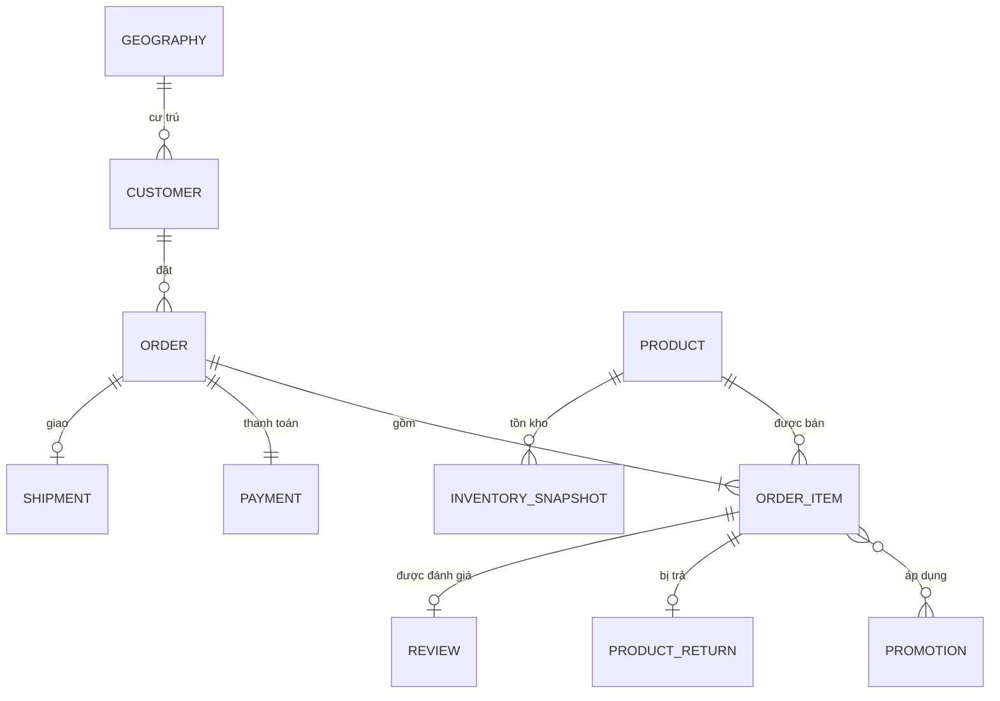

# Ghi chú hiểu business dataset bán lẻ

Tài liệu này giải thích 14 file dữ liệu theo **câu chuyện vận hành của một cửa hàng bán lẻ**, trước
khi chuyển sang ERD và relational diagram. Mục tiêu là hiểu mỗi bảng đại diện cho điều gì trong
business, không học thuộc tên bảng một cách rời rạc.

Các kết luận trong tài liệu là phần diễn giải lại những kiểm chứng đã có trong `notebooks/01_exploration/eda.ipynb`,
`notebooks/02_design/data_model.ipynb`, `notebooks/02_design/normalization.ipynb`, `normalized_schema.md` và `star_schema.md`.

---

## 1. Câu thần chú để nhớ toàn bộ business

> **Khách ở một nơi, khách đặt nhiều đơn, đơn chứa nhiều dòng hàng, mỗi dòng bán một sản phẩm;
> promotion tác động lên dòng hàng, payment và shipment tác động lên đơn, return và review quay
> lại dòng hàng.**

Có thể ghi nhớ dataset bằng chuỗi sáu câu hỏi:

1. **Ai mua?** — `customers`
2. **Khách ở đâu?** — `geography`
3. **Khách đặt đơn nào?** — `orders`
4. **Trong đơn mua sản phẩm gì?** — `order_items`, `products`
5. **Giảm giá, thanh toán và giao hàng thế nào?** — `promotions`, `payments`, `shipments`
6. **Sau khi mua có trả hàng hoặc đánh giá không?** — `returns`, `reviews`

Ba nhóm dữ liệu bổ sung là tồn kho (`inventory`), traffic website (`web_traffic`) và báo cáo/dự
báo theo ngày (`sales`, `sample_submission`).

---

## 2. Một đơn hàng thật kể toàn bộ câu chuyện

Ví dụ dưới đây lấy trực tiếp từ `order_id = 46270` trong dataset.

### 2.1 Khách hàng sống ở một khu vực

Khách `customer_id = 44051` có thông tin:

- giới tính `Male`, nhóm tuổi `35-44`;
- sống tại `zip = 21122`;
- zip này thuộc `Bac Ninh`, `District #05`, vùng `East`.

Ý nghĩa business:

```text
GEOGRAPHY 1 ─── N CUSTOMER
```

Một zip có thể có nhiều khách hàng; mỗi khách hàng thuộc đúng một zip.

### 2.2 Khách đặt một đơn hàng

Ngày `2013-02-04`, khách đặt đơn `46270`:

- trạng thái: `delivered`;
- phương thức thanh toán: `paypal`;
- thiết bị: `mobile`;
- nguồn đơn hàng: `social_media`.

Ý nghĩa business:

```text
CUSTOMER 1 ─── 0..N ORDER
```

Một khách có thể chưa mua lần nào hoặc mua nhiều đơn; mỗi đơn thuộc đúng một khách.

### 2.3 Đơn hàng chứa sản phẩm

Đơn `46270` có một dòng hàng:

- `product_id = 2254`, tên `VietMotion RP-51`;
- category `Outdoor`, segment `Activewear`;
- size `L`, màu `white`;
- số lượng `4`, giá lúc bán `615.65` mỗi đơn vị.

Ý nghĩa business:

```text
ORDER 1 ─── 1..N ORDER_ITEM
PRODUCT 1 ─── 0..N ORDER_ITEM
```

`orders` là **phần đầu đơn hàng**: ai mua, ngày nào, trạng thái và kênh mua. `order_items` là
**chi tiết từng sản phẩm** nằm trong đơn. Một đơn luôn có ít nhất một dòng hàng; một sản phẩm có
thể chưa từng được bán hoặc xuất hiện trong nhiều dòng hàng.

### 2.4 Promotion giảm giá cho dòng hàng

Dòng hàng dùng `PROMO-0006`, tên `Rural Special 2013`:

- giảm `15%`;
- áp dụng cho category `Outdoor`;
- có hiệu lực từ `2013-01-31` đến `2013-03-01`.

Giá trị giao dịch:

```text
Gross = 4 × 615.65 = 2,462.60
Discount = 369.39
Net payment = 2,462.60 − 369.39 = 2,093.21
```

Promotion thuộc **dòng hàng**, không thuộc toàn bộ đơn. Một dòng có thể không dùng promotion hoặc
dùng nhiều promotion; một promotion có thể được dùng trên nhiều dòng hàng:

```text
ORDER_ITEM M ─── N PROMOTION
```

Hai cột `promo_id` và `promo_id_2` trong CSV chỉ là cách lưu phẳng. Khi thiết kế quan hệ, phải
thay chúng bằng bảng nối `order_item_promotion`.

### 2.5 Đơn được thanh toán và giao hàng

Payment của đơn:

- `payment_value = 2,093.21`;
- trả góp `3` kỳ.

Shipment của đơn:

- xuất kho ngày `2013-02-06`;
- giao đến khách ngày `2013-02-10`;
- phí giao hàng `25.24`.

Ý nghĩa business:

```text
ORDER 1 ─── 1 PAYMENT
ORDER 1 ─── 0..1 SHIPMENT
```

Mọi đơn trong dữ liệu đều có payment. Một đơn có thể chưa có shipment, chẳng hạn đơn mới tạo,
đang thanh toán hoặc đã bị hủy.

### 2.6 Sau khi mua: trả hàng hoặc đánh giá

Khách không trả sản phẩm trong ví dụ mà đánh giá vào `2013-03-10`:

- rating `5`;
- title `Very satisfied`.

Return và review phải gắn với **dòng hàng**, không chỉ gắn với đơn. Một đơn có thể chứa nhiều sản
phẩm nhưng chỉ một sản phẩm bị trả hoặc được đánh giá.

```text
ORDER_ITEM 1 ─── 0..1 PRODUCT_RETURN
ORDER_ITEM 1 ─── 0..1 REVIEW
```

---

## 3. Data dictionary theo ngôn ngữ business

| File | Grain — một dòng đại diện cho | Vai trò business | Khóa từ nguồn |
|---|---|---|---|
| `geography.csv` | một mã zip | Danh mục khu vực: city, district, region | `zip` |
| `customers.csv` | một khách hàng | Hồ sơ khách và nơi cư trú | `customer_id` |
| `products.csv` | một SKU/biến thể sản phẩm | Sản phẩm có size, color, giá và giá vốn | `product_id` |
| `promotions.csv` | một đợt khuyến mãi | Quy tắc, thời gian và phạm vi áp dụng | `promo_id` |
| `orders.csv` | một đơn hàng | Header của giao dịch bán | `order_id` |
| `order_items.csv` | một dòng sản phẩm trong đơn | Số lượng, giá bán, discount và promotion | chưa có khóa hợp lệ |
| `payments.csv` | payment của một đơn | Giá trị thanh toán và số kỳ trả góp | `order_id` |
| `shipments.csv` | shipment của một đơn | Ngày gửi, ngày giao và phí giao | `order_id` |
| `returns.csv` | một lần trả dòng hàng | Lý do, số lượng và tiền hoàn | `return_id` |
| `reviews.csv` | một đánh giá dòng hàng | Ngày đánh giá, rating và title | `review_id` |
| `inventory.csv` | một sản phẩm tại một mốc cuối tháng | Snapshot tình trạng tồn kho | `(snapshot_date, product_id)` |
| `web_traffic.csv` | tổng traffic của một ngày | Hoạt động website ở mức ngày | `date` |
| `sales.csv` | tổng bán hàng của một ngày lịch sử | Revenue và COGS thực tế | `Date` |
| `sample_submission.csv` | một ngày cần dự báo | Khung output Revenue và COGS tương lai | `Date` |

### 3.1 Bốn cụm dữ liệu

#### Cụm A — Khách hàng và địa lý

```text
GEOGRAPHY → CUSTOMER
```

- `geography` là bảng tra cứu theo `zip`.
- `customers.zip` xác định nơi ở của khách.
- `customers.city` bị lặp vì đã suy ra được từ `zip`; relational model chỉ cần giữ `zip`.
- `orders.zip` cũng trùng hoàn toàn với zip của khách, không phải địa chỉ giao hàng riêng.

#### Cụm B — Giao dịch bán hàng

```text
CUSTOMER → ORDER → ORDER_ITEM ← PRODUCT
                         ↕
                     PROMOTION
```

Đây là xương sống của dataset và là nơi sinh ra `Revenue`, `COGS`, payment, return và review.

#### Cụm C — Hoàn tất và hậu mãi

```text
ORDER → PAYMENT
ORDER → SHIPMENT
ORDER_ITEM → PRODUCT_RETURN
ORDER_ITEM → REVIEW
```

- Payment và shipment nói về toàn bộ đơn.
- Return và review nói về một sản phẩm cụ thể trong đơn.

#### Cụm D — Vận hành và tổng hợp

```text
PRODUCT → INVENTORY_SNAPSHOT

WEB_TRAFFIC          -- độc lập ở grain ngày
DAILY_SALES          -- tổng hợp từ giao dịch
DAILY_FORECAST       -- output cho tương lai
```

---

## 4. Những business rule quyết định relational diagram

### 4.1 `product_id` là SKU, không chỉ là tên sản phẩm

Một `product_name` có thể xuất hiện dưới nhiều `product_id` vì khác size hoặc color. Có thể hiểu:

```text
PRODUCT_MODEL = mẫu sản phẩm chung
PRODUCT = một biến thể/SKU bán được
```

Sau chuẩn hóa 3NF:

```text
PRODUCT_MODEL(product_name, category, segment)
PRODUCT(product_id, product_name, size, color, list_price, unit_cogs)
```

`unit_price` trong `order_item` vẫn phải giữ vì đó là **giá tại thời điểm bán**; `products.price`
chỉ là snapshot giá hiện tại.

### 4.2 `ORDER_ITEM` là thực thể yếu

Nguồn không có `line_number`. Cặp `(order_id, product_id)` cũng không phải khóa vì có 16 đơn chứa
hai dòng của cùng một sản phẩm nhưng khác giá hoặc số lượng.

Do đó phải sinh `line_number` theo thứ tự ổn định trong file nguồn:

```text
ORDER_ITEM(
    order_id PK, FK,
    line_number PK,
    product_id FK,
    quantity,
    unit_price,
    discount_amount
)
```

Khóa của một dòng hàng là `(order_id, line_number)`. `returns` và `reviews` phải được ánh xạ sang
cặp khóa này trước khi load vào relational database.

### 4.3 Promotion là quan hệ nhiều-nhiều

Không giữ cấu trúc hai cột `promo_id`, `promo_id_2`. Tạo bảng nối:

```text
ORDER_ITEM_PROMOTION(
    order_id PK, FK,
    line_number PK, FK,
    promo_id PK, FK
)
```

Thiết kế này cho phép một dòng dùng bất kỳ số promotion nào mà không phải thêm `promo_id_3`,
`promo_id_4` trong tương lai.

### 4.4 Gross Revenue khác Net Payment

Dataset tồn tại hai khái niệm tiền:

```text
Gross Revenue = Σ(quantity × unit_price)
Net Payment   = Σ(quantity × unit_price − discount_amount)
COGS          = Σ(quantity × product.cogs)
```

- `sales.csv.Revenue` là gross, không trừ discount.
- `payments.payment_value` là net, đã trừ discount.
- `payments.payment_method` trùng với `orders.payment_method`.
- Trong mô hình chuẩn hóa, payment chỉ cần giữ thông tin mới là `installments`; `payment_value` có
  thể tính lại.

### 4.5 `sales.csv` là báo cáo dẫn xuất

`sales.csv` được tái tạo chính xác từ `orders`, `order_items` và `products`:

```sql
SELECT o.order_date,
       SUM(oi.quantity * oi.unit_price) AS revenue,
       SUM(oi.quantity * p.cogs)        AS cogs
FROM "order" o
JOIN order_item oi ON oi.order_id = o.order_id
JOIN product p ON p.product_id = oi.product_id
GROUP BY o.order_date;
```

Vì vậy trong normalized relational model, `sales` nên là **view**, không phải bảng nguồn sự thật.

### 4.6 `inventory` là snapshot vận hành độc lập

Một dòng inventory trả lời:

> Cuối tháng này, sản phẩm này còn bao nhiêu hàng và trong tháng đã nhận/bán bao nhiêu đơn vị?

Khóa là `(snapshot_date, product_id)`. Inventory nối với `product`, không nối trực tiếp với một
`order_item` cụ thể.

Các cột sau bị lặp hoặc tính lại được:

- `product_name`, `category`, `segment`: tra từ `product`;
- `year`, `month`: suy từ `snapshot_date`;
- `stockout_flag`, `days_of_supply`, `fill_rate`, `sell_through_rate`, `overstock_flag`: tính từ
  các measure gốc;
- `reorder_flag`: chỉ có một giá trị `0`, không mang thông tin.

Sau chuẩn hóa, `inventory_snapshot` chỉ giữ:

```text
(snapshot_date, product_id, stock_on_hand,
 units_received, units_sold, stockout_days)
```

### 4.7 `web_traffic` không có FK đến đơn hàng

`web_traffic` chỉ có tổng số session theo ngày. Nguồn không có `session_id`, `customer_id` hoặc
`order_id`, nên không thể chứng minh một session đã tạo ra đơn nào.

Không được tự tạo quan hệ:

```text
WEB_TRAFFIC → ORDER     -- sai: dữ liệu không có FK này
```

Có thể so sánh traffic và sales theo ngày trong phân tích, nhưng đó là phép ghép theo thời gian,
không phải quan hệ tham chiếu của transactional database.

### 4.8 `sample_submission` là output, không phải lịch sử

- `sales.csv`: actual từ `2012-07-04` đến `2022-12-31`.
- `sample_submission.csv`: các ngày cần dự báo từ `2023-01-01` đến `2024-07-01`.

Trong relational model, có thể đặt output này thành `daily_sales_forecast`. Nó không có FK tới
đơn hàng tương lai vì các đơn đó chưa tồn tại.

---

## 5. Conceptual ERD — chỉ thể hiện business



Cách đọc ký hiệu crow's foot:

| Ký hiệu | Ý nghĩa |
|---|---|
| `||` | đúng một |
| `o|` | không hoặc một |
| `o{` | không hoặc nhiều |
| `|{` | một hoặc nhiều |

`web_traffic`, `sales` và `sample_submission` không nằm trong cây business chính:

- `web_traffic` là chuỗi quan sát tổng hợp độc lập;
- `sales` là view tổng hợp từ giao dịch;
- `sample_submission` là đầu ra dự báo.

---

## 6. Từ conceptual ERD sang relational diagram

| Quy tắc chuyển đổi | Áp dụng trong dataset |
|---|---|
| Thực thể mạnh thành bảng | `CUSTOMER` → `customer`, `PRODUCT` → `product` |
| Định danh của thực thể thành PK | `customer_id`, `product_id`, `order_id` |
| Thực thể yếu mượn PK của cha | `ORDER_ITEM` dùng `(order_id, line_number)` |
| Quan hệ 1:N đặt FK ở phía N | `order.customer_id`, `order_item.product_id` |
| Quan hệ 1:1 dùng PK đồng thời là FK | `payment.order_id`, `shipment.order_id` |
| Quan hệ M:N thành bảng junction | `order_item_promotion` |
| Thuộc tính lặp chuyển về một nơi | bỏ `customers.city`, `orders.zip`, `reviews.customer_id` |
| Dữ liệu tính được chuyển thành view/công thức | `sales`, `payment_value`, các flag inventory |

Relational model 3NF cuối cùng gồm 19 bảng:

```text
region
city
district
zip_area
customer

product_model
product
promotion

order
order_item
order_item_promotion
payment
shipment
product_return
review_title_label
review

inventory_snapshot
web_traffic
daily_sales_forecast
```

`sales.csv` trở thành view `daily_sales`, không tính là bảng cơ sở thứ 20.

---

## 7. Các cảnh báo business cần nhớ

### `signup_date` không đáng tin

Trong ví dụ `order_id = 46270`, khách mua hàng năm 2013 nhưng `signup_date` là năm 2021. Trên toàn
dataset, 73,8% đơn xuất hiện trước ngày signup. Không dùng cột này để tính customer tenure hoặc
phân tích cohort.

### Giá trong `products` không phải lịch sử giá

`products.price` là snapshot hiện tại; `order_items.unit_price` mới là giá tại thời điểm bán. Không
ghi đè `unit_price` bằng `products.price`.

### Trạng thái đơn và bảng return không hoàn toàn đồng nghĩa

`orders.order_status = returned` và sự tồn tại của dòng trong `returns` không khớp tuyệt đối. Khi
định nghĩa KPI trả hàng phải ghi rõ chọn nguồn nào làm nguồn sự thật.

### Inventory không đối soát trực tiếp với order item

`inventory.units_sold` là nguồn vận hành độc lập và không khớp đầy đủ với giao dịch bán. Dùng nó
để phân tích inventory, không dùng để thay thế số lượng từ `order_items`.

---

## 8. Tự kiểm tra đã hiểu business chưa

Trước khi vẽ relational diagram, cần tự trả lời được các câu sau:

1. Vì sao `orders` và `order_items` phải là hai bảng?
2. Vì sao return và review trỏ đến dòng hàng thay vì chỉ trỏ đến đơn?
3. Vì sao `(order_id, product_id)` không đủ làm khóa cho `order_item`?
4. Vì sao promotion cần một bảng junction?

   **Gợi ý trả lời.** Nguồn lưu khuyến mãi thành hai cột `promo_id`, `promo_id_2` — như mẫu hóa đơn
   in sẵn đúng hai ô "KM 1", "KM 2". Junction đổi thành một danh sách: có bao nhiêu khuyến mãi thì
   ghi bấy nhiêu dòng (ví dụ minh họa một dòng hàng có hai khuyến mãi):

   ```text
   -- order_items (nguồn)
   order_id  product_id  quantity  discount_amount  promo_id    promo_id_2
   320123    2331        5         3385.57          PROMO-0013  PROMO-0015

   -- order_item_promotion (junction)
   order_id  line_number  promo_id
   320123    1            PROMO-0013
   320123    1            PROMO-0015
   ```

   Cách hai cột có bốn vấn đề:

   - **Hầu hết là ô trống**: chỉ 206 dòng hàng có `promo_id_2`, nhưng cột này tồn tại cho mọi dòng.
     Junction không lưu ô trống — dòng hàng không có khuyến mãi thì không xuất hiện.
   - **Query phức tạp**: tìm dòng dùng một khuyến mãi phải viết
     `promo_id = X OR promo_id_2 = X`; đếm lượt dùng phải `UNION ALL` hai cột.
     Junction chỉ cần `WHERE promo_id = X` và `GROUP BY promo_id`.
   - **Thứ tự cột không mang nghĩa**: `(A, B)` và `(B, A)` là cùng một chuyện nhưng lưu hai kiểu.
   - **Khóa ngoại phải khai hai lần.** Về lý thuyết đây là nhóm lặp (repeating group), trái tinh thần 1NF.

   **Nếu sau này có khuyến mãi thứ 3:** cách hai cột phải `ALTER TABLE` thêm `promo_id_3`, thêm một
   khóa ngoại, và sửa mọi query cũ (`OR` thành ba vế, `UNION ALL` thành ba nhánh) — tới khuyến mãi
   thứ 4 lại lặp y vậy. Junction chỉ cần **thêm một dòng dữ liệu**, không đổi cấu trúc, không sửa query:

   ```sql
   INSERT INTO order_item_promotion VALUES (320123, 1, 'PROMO-0020');
   ```

   Kiểm chứng: junction có 276.316 + 206 = 276.522 dòng (`notebooks/02_design/normalization.ipynb`).

   **Trade-off — junction không thắng ở mọi tiêu chí:**

   | Tiêu chí | Hai cột `promo_id`, `promo_id_2` | Junction `order_item_promotion` |
   |---|---|---|
   | Thêm khuyến mãi thứ 3, 4… | ❌ Đổi cấu trúc bảng, sửa mọi query | ✅ Chỉ thêm dòng |
   | Hỏi theo từng khuyến mãi (lọc, đếm lượt dùng) | ❌ `OR` / `UNION ALL` nhiều cột | ✅ Một cột, `GROUP BY` thẳng |
   | Ô trống | ❌ Cột thứ hai trống gần như toàn bộ | ✅ Không lưu NULL |
   | Chống trùng khuyến mãi trên một dòng | ❌ Cần thêm `CHECK (promo_id <> promo_id_2)` | ✅ Khóa chính đã chặn |
   | Xem một dòng hàng kèm khuyến mãi | ✅ Đọc thẳng, không JOIN | ❌ Phải JOIN; muốn hiện cạnh nhau phải gộp chuỗi / pivot |
   | Giới hạn "tối đa 2 khuyến mãi / dòng" | ✅ Cấu trúc tự ép | ❌ Không tự ép, phải kiểm ở tầng ứng dụng |
   | Thứ tự áp dụng khuyến mãi | ⚠️ Ngầm theo vị trí cột (nguồn không nói rõ có nghĩa hay không) | ❌ Mất, muốn giữ phải thêm cột như `apply_order` |
   | Phần giảm giá của từng khuyến mãi | ❌ Không tách được | ❌ Không tách được — `discount_amount` là một số chung cho cả dòng |
   | Nạp dữ liệu (ETL) | ✅ Nạp thẳng từ file | ❌ Phải unpivot, và phụ thuộc khóa `line_number` sinh ở §4.2 |

   **Phản biện có thể gặp:** *"Data thật chưa bao giờ có quá 2 khuyến mãi trên một dòng, sao không giữ
   2 cột cho đơn giản?"* — Đúng là `promo_id_2` chỉ xuất hiện khi hai đợt khuyến mãi `stackable` chồng
   lấn thời gian (Fall Launch + Urban Blowout năm 2015 và 2017, xem `docs/star_schema.md` §5.8). Nhưng
   "tối đa 2" là **hệ quả của lịch khuyến mãi**, không phải quy tắc business được ghi ở đâu: chỉ cần
   ba đợt `stackable` trùng nhau là vỡ. Thiết kế nên bám theo quan hệ (một dòng — nhiều khuyến mãi),
   không bám theo số lượng tình cờ quan sát được.

   **Khi nào hai cột vẫn chấp nhận được:** business **cam kết** tối đa 2 khuyến mãi mỗi dòng, và bảng
   chỉ dùng để đọc báo cáo (bảng phẳng trong kho dữ liệu), không phải nguồn sự thật để ghi.
5. Vì sao `sales.csv` nên là view?
6. Vì sao `web_traffic` không có FK trực tiếp tới `orders`?
7. Gross Revenue khác Net Payment ở đâu?
8. Vì sao inventory dùng khóa `(snapshot_date, product_id)`?

Nếu trả lời được tám câu này thì đã hiểu phần business đủ để đọc và bảo vệ relational diagram.

---

## 9. Tài liệu kiểm chứng trong repo

- `notebooks/01_exploration/eda.ipynb`: kiểm chứng cách sinh `Revenue`, `COGS` và cấu trúc chuỗi thời gian.
- `notebooks/02_design/data_model.ipynb`: kiểm chứng PK, FK, orphan và các quyết định dimensional model.
- `notebooks/02_design/normalization.ipynb`: kiểm chứng các phụ thuộc hàm và quá trình 1NF → 3NF.
- `normalized_schema.md`: conceptual ERD, relational diagram và DDL 3NF.
- `star_schema.md`: mô hình dành cho phân tích và dự báo.
