# Kết quả EDA — Biểu đồ và kết luận

> Mỗi phần gồm ba lớp: **biểu đồ** → **số liệu đọc được** → **kết luận rút ra**.
> Toàn bộ biểu đồ sinh trực tiếp từ dữ liệu gốc bằng
> [`scripts/ve_bieu_do.py`](../scripts/ve_bieu_do.py) — chạy `python scripts/ve_bieu_do.py`
> từ thư mục gốc dự án để dựng lại cả 11 hình.
>
> Bản kể chuyện đầy đủ: [eda-cau-chuyen-du-lieu.md](eda-cau-chuyen-du-lieu.md)
>
> **Đơn vị tiền:** dữ liệu là mô phỏng, đơn vị tiền tệ không xác định — ký hiệu *đvtt*.
> Doanh thu gộp 11 năm là **16,43 tỷ đvtt**. Kết luận nên dựa trên **tỷ lệ và thứ hạng**
> thay vì giá trị tuyệt đối.

---

<!-- muc-luc -->
## Mục lục

- [1. Doanh thu 11 năm](#1-doanh-thu-11-năm)
- [2. Doanh thu giảm vì đâu: ít khách hay khách chi ít?](#2-doanh-thu-giảm-vì-đâu-ít-khách-hay-khách-chi-ít)
- [3. Biểu đồ quan trọng nhất: lưu lượng tăng, đơn hàng giảm](#3-biểu-đồ-quan-trọng-nhất-lưu-lượng-tăng-đơn-hàng-giảm)
- [4. Nguyên nhân: giá đã tăng 54%](#4-nguyên-nhân-giá-đã-tăng-54)
- [5. Cú sụp 2019 xảy ra ở đâu?](#5-cú-sụp-2019-xảy-ra-ở-đâu)
- [6. Tiền rò rỉ ở đâu](#6-tiền-rò-rỉ-ở-đâu)
- [7. Danh mục sản phẩm tập trung cực đoan](#7-danh-mục-sản-phẩm-tập-trung-cực-đoan)
- [8. Nghịch lý danh mục](#8-nghịch-lý-danh-mục)
- [9. Mùa vụ](#9-mùa-vụ)
- [10. Hai giả thuyết bị dữ liệu bác bỏ](#10-hai-giả-thuyết-bị-dữ-liệu-bác-bỏ)
- [11. Điểm sáng: tệp khách hàng](#11-điểm-sáng-tệp-khách-hàng)
- [Tổng hợp — Từ số liệu đến hành động](#tổng-hợp--từ-số-liệu-đến-hành-động)
- [Giới hạn cần nêu rõ](#giới-hạn-cần-nêu-rõ)

---
<!-- muc-luc -->

## 1. Doanh thu 11 năm

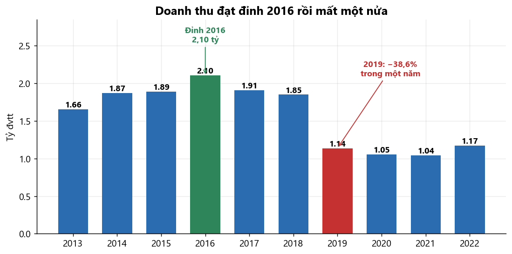

**Số liệu đọc được**

- Đỉnh cao nhất: **2016 với 2,10 tỷ**
- Đáy: **2021 với 1,04 tỷ** — mất **50,5%** so với đỉnh
- Năm gãy mạnh nhất: **2019, giảm 38,6% chỉ trong một năm**
- 2022 hồi phục nhẹ +12,15%, nhưng vẫn thấp hơn đỉnh 44%

**Kết luận**

> Doanh nghiệp đã mất gần một nửa quy mô. Có một **điểm gãy cấu trúc rõ rệt ở năm 2019** — không phải
> suy giảm từ từ mà là một cú rơi đột ngột. Điều này buộc mọi mô hình dự báo phải xử lý riêng: lấy trung
> bình xu hướng trên toàn bộ 2013–2022 sẽ cho kết quả sai lệch vì trung bình hóa qua điểm gãy.

---

## 2. Doanh thu giảm vì đâu: ít khách hay khách chi ít?

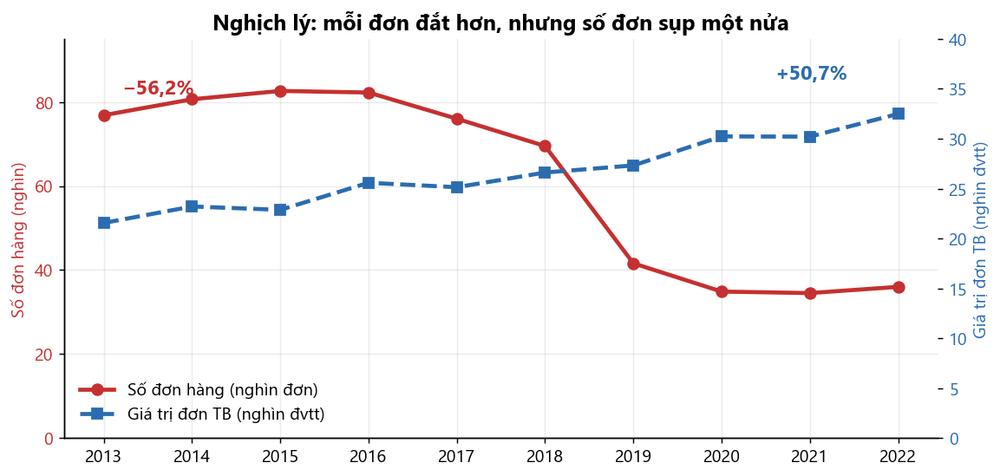

**Số liệu đọc được**

- Số đơn hàng: **82.247 (2016) → 36.004 (2022)**, giảm **56,2%**
- Giá trị đơn trung bình: **21.564 (2013) → 32.489 (2022)**, tăng **50,7%**
- Hai đường đi ngược chiều nhau suốt giai đoạn

**Kết luận**

> Đây **không phải khủng hoảng về sức mua**. Khách hàng còn lại chi nhiều tiền hơn bao giờ hết. Vấn đề
> nằm ở **số lượng người giao dịch**.
>
> Phát hiện này đảo ngược hướng điều tra. Nếu chỉ nhìn doanh thu tổng, người ta dễ kết luận "thị trường
> suy thoái" và đi giải bài toán sai. Nếu chỉ nhìn chỉ số giá trị đơn hàng trung bình, thậm chí còn
> tưởng doanh nghiệp đang tốt lên.

---

## 3. Biểu đồ quan trọng nhất: lưu lượng tăng, đơn hàng giảm

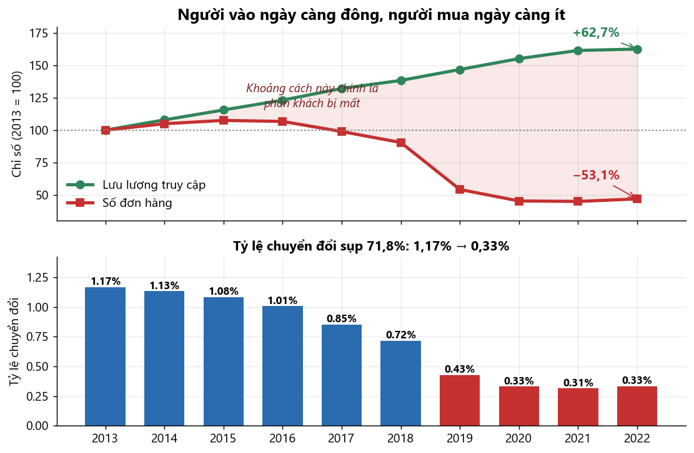

**Số liệu đọc được**

- Lưu lượng truy cập: **18.635 → 30.311 phiên/ngày**, tăng **62,7%**
- Số đơn hàng: **211 → 99 đơn/ngày**, giảm **53,1%**
- Tỷ lệ chuyển đổi: **1,17% → 0,33%**, sụp **71,8%**
- Cứ 1.000 người ghé thăm: năm 2013 có 12 người mua, năm 2022 chỉ còn 3

**Kết luận**

> **Marketing không phải vấn đề — chuyển đổi mới là vấn đề.** Bộ phận kéo khách vẫn làm tốt và ngày càng
> tốt hơn. Thất bại nằm ở giai đoạn sau khi khách đã vào website.
>
> Đây là kết luận có giá trị kinh doanh cao nhất của toàn bộ phân tích, vì nó **chỉ đúng chỗ cần sửa**.
> Đổ thêm ngân sách quảng cáo để kéo traffic sẽ lãng phí hoàn toàn — traffic vốn đã tăng 63% mà đơn hàng
> vẫn giảm một nửa.

---

## 4. Nguyên nhân: giá đã tăng 54%

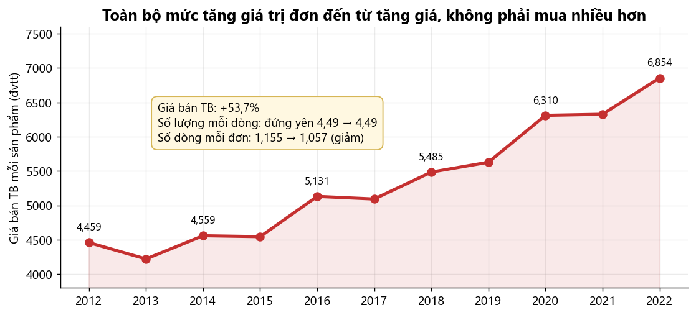

**Số liệu đọc được**

- Giá bán trung bình mỗi sản phẩm: **4.459 → 6.854**, tăng **53,7%**
- Số lượng mỗi dòng hàng: **4,49 → 4,49** — đứng yên tuyệt đối suốt 11 năm
- Số dòng hàng mỗi đơn: **1,155 → 1,057** — thậm chí giảm

**Kết luận**

> Toàn bộ mức tăng giá trị đơn hàng đến từ **tăng giá**, không phải khách mua nhiều hơn. Ngược lại, giỏ
> hàng còn nhỏ đi.
>
> Ghép ba biểu đồ trên lại thành chuỗi nhân quả hoàn chỉnh:
>
> ```
> Giá tăng 54%  →  Chuyển đổi sụp 72%  →  Số đơn giảm 56%  →  Doanh thu mất 44%
>                          ↑
>        (lưu lượng vẫn tăng 63% → không phải do thiếu khách quan tâm)
> ```
>
> Đây là kịch bản kinh điển: doanh nghiệp bù đắp doanh thu suy giảm bằng cách nâng giá, việc nâng giá
> lại đẩy thêm khách đi, tạo thành vòng xoáy tự khuếch đại.

---

## 5. Cú sụp 2019 xảy ra ở đâu?

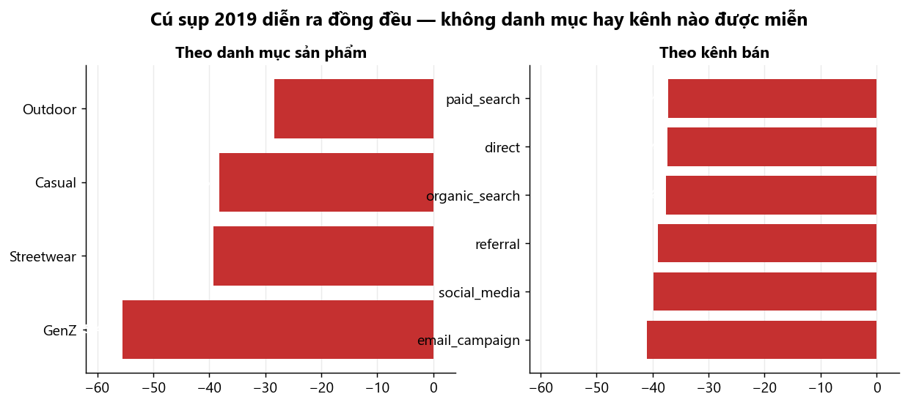

**Số liệu đọc được**

- Bốn danh mục giảm từ **−28,4%** (Outdoor) đến **−55,4%** (GenZ)
- Sáu kênh bán giảm trong khoảng cực hẹp: **−37,3% đến −41,0%**

**Kết luận**

> Mức giảm **đồng đều đến mức này loại trừ nguyên nhân cục bộ**. Không phải một kênh quảng cáo bị cắt,
> cũng không phải một dòng sản phẩm hết hàng — nếu vậy ta sẽ thấy mức giảm tập trung ở một chỗ.
>
> Đây là **cú sốc toàn hệ thống**: thay đổi chính sách giá, mất nguồn cung, hoặc đối thủ mới chiếm thị
> phần. Với dữ liệu hiện có không thể phân biệt ba khả năng này.

---

## 6. Tiền rò rỉ ở đâu

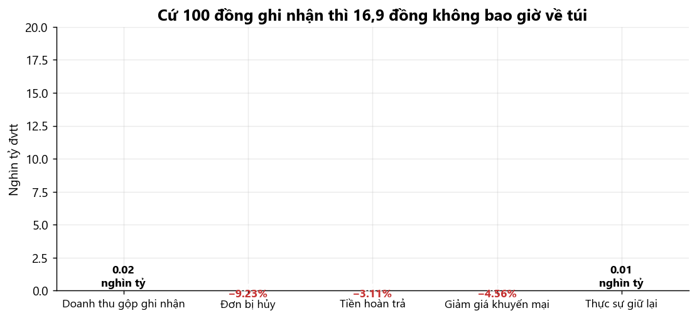

**Số liệu đọc được**

| Khoản thất thoát | Giá trị (tỷ đvtt) | % doanh thu gộp |
|---|---:|---:|
| Đơn bị hủy | 1,52 tỷ | **9,23%** |
| Tiền hoàn trả | 0,51 tỷ | 3,11% |
| Giảm giá khuyến mại | 0,75 tỷ | 4,56% |
| **Thực sự giữ lại** | **13,65 tỷ** | **83,10%** |

**Kết luận**

> **Hủy đơn là khoản thất thoát lớn nhất — 9,23%, gấp gần ba lần tiền hoàn trả.** Đây cũng là loại thất
> thoát *rẻ nhất để khắc phục*: đơn bị hủy chưa tốn chi phí giao vận, chỉ tốn chi phí thu hút khách.
>
> Giảm tỷ lệ hủy đơn từ 9,23% xuống 5% sẽ thu về khoảng **695 triệu** — nhiều hơn toàn bộ ngân sách giảm
> giá 11 năm cộng lại.
>
> Về mặt kế toán, cần nêu rõ: biến `Revenue` trong dữ liệu **tính gộp cả đơn đã hủy và đơn bị trả lại**.
> Con số doanh thu công bố cao hơn doanh thu thực nhận khoảng 17%. Khi diễn giải kết quả dự báo phải nói
> rõ đang dự báo *giá trị đặt hàng*, không phải *doanh thu ghi nhận theo chuẩn kế toán*.

---

## 7. Danh mục sản phẩm tập trung cực đoan

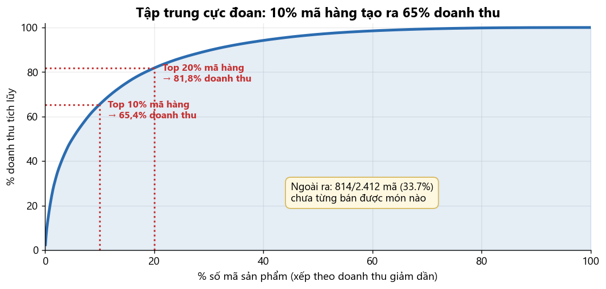

**Số liệu đọc được**

- **Top 10% mã hàng → 65,4% doanh thu**
- **Top 20% mã hàng → 81,8% doanh thu**
- 50% mã yếu nhất chỉ đóng góp **3,0%**
- **814/2.412 mã (33,7%) chưa từng bán được món nào**

**Kết luận**

> Phân bố còn cực đoan hơn quy luật Pareto 80/20 thông thường: chỉ **10%** số mã đã tạo ra **65%** doanh
> thu.
>
> Một phần ba danh mục là hàng chết. Chúng vẫn chiếm chỗ trong hệ thống, làm lệch mọi thống kê mô tả về
> giá và biên lợi nhuận nếu không lọc bỏ trước khi tính.

---

## 8. Nghịch lý danh mục

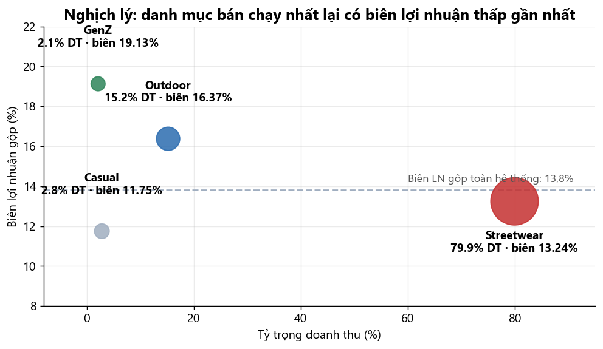

**Số liệu đọc được**

| Danh mục | Tỷ trọng doanh thu | Biên lợi nhuận gộp |
|---|---:|---:|
| Streetwear | **79,92%** | **13,24%** |
| Outdoor | 15,18% | 16,37% |
| Casual | 2,80% | 11,75% |
| GenZ | 2,09% | **19,13%** |

**Kết luận**

> **Danh mục bán chạy nhất lại có biên lợi nhuận thấp gần nhất.** Còn `GenZ` biên cao nhất 19,13% thì
> chỉ chiếm 2,09% doanh thu.
>
> Đây chính là lý do biên lợi nhuận gộp toàn hệ thống chỉ đạt **13,8%**, thấp hơn hẳn biên lý thuyết
> trung vị của danh mục sản phẩm (19,78%). Doanh nghiệp đang dồn lực bán thứ ít lời nhất.
>
> Dịch chuyển 10 điểm phần trăm doanh thu từ `Streetwear` sang `GenZ` sẽ nâng biên lợi nhuận gộp thêm
> khoảng 0,6 điểm phần trăm — tương đương **99 triệu lợi nhuận tăng thêm mà không cần bán thêm một đồng
> doanh thu nào**.

---

## 9. Mùa vụ

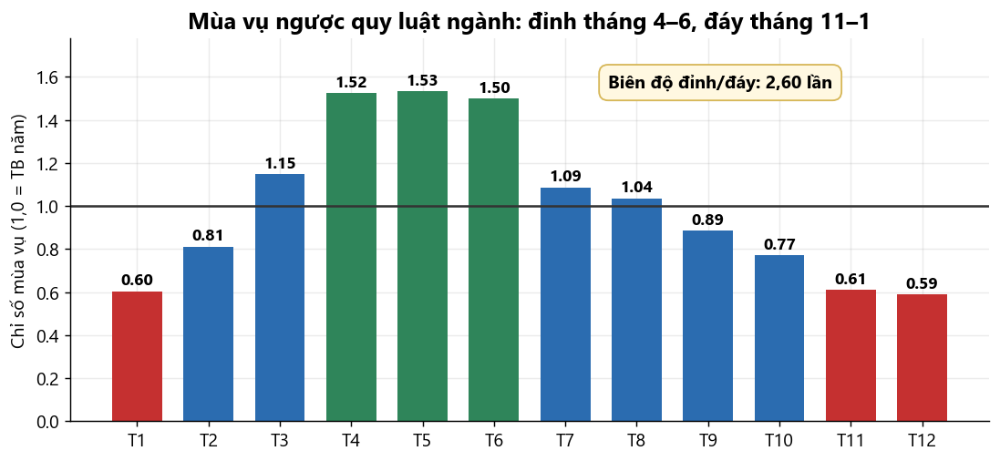

**Số liệu đọc được**

- Đỉnh: **tháng 4–6**, cao hơn trung bình năm khoảng **50%**
- Đáy: **tháng 11–1**, thấp hơn trung bình khoảng **40%**
- Biên độ đỉnh/đáy: **2,60 lần**

**Kết luận**

> Mùa vụ **ngược với quy luật bán lẻ thời trang thông thường**, vốn đạt đỉnh vào mùa mua sắm cuối năm.
> Đây là một trong những dấu hiệu cho thấy dữ liệu có thể là mô phỏng.
>
> Về mặt dự báo, đây là **thành phần mạnh nhất của chuỗi** — mùa vụ chiếm ưu thế hơn cả xu hướng. Mô
> hình bắt được mùa vụ tháng sẽ giải thích được phần lớn biến động.

---

## 10. Hai giả thuyết bị dữ liệu bác bỏ

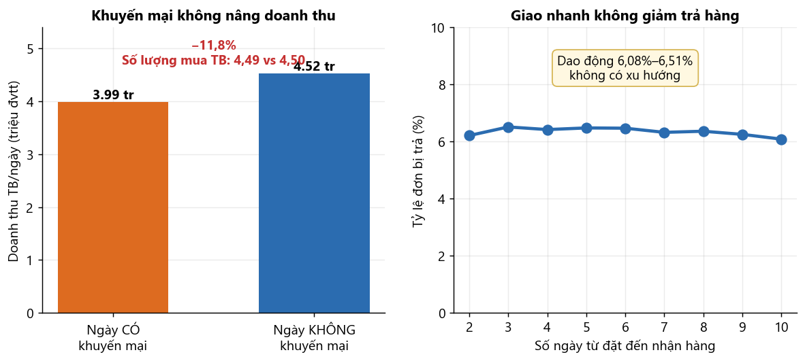

**Số liệu đọc được**

*Về khuyến mại:*
- Ngày có khuyến mại: doanh thu TB **3,99 triệu**; ngày không có: **4,52 triệu** → thấp hơn **11,8%**
- Số lượng mua trung bình mỗi dòng: **4,49** khi có khuyến mại so với **4,50** khi không
- Đã chi **750 triệu** tiền giảm giá, phủ 44,5% số ngày

*Về thời gian giao hàng:*
- Tỷ lệ trả hàng dao động **6,08%–6,51%** với mọi mức thời gian giao từ 2 đến 10 ngày
- Không có xu hướng tăng theo thời gian giao

**Kết luận**

> **Không tìm thấy bằng chứng khuyến mại làm tăng doanh thu.** Số lượng mua trung bình giống hệt nhau —
> khuyến mại không khiến khách mua nhiều hơn. Em dùng cụm *"không tìm thấy bằng chứng"* thay vì *"phản
> tác dụng"*, vì phân tích quan sát không kiểm soát được các yếu tố khác. Nhưng với 750 triệu đã chi, việc
> **không chứng minh được hiệu quả** đã đủ là cảnh báo để thiết kế thử nghiệm có đối chứng.
>
> **Giao hàng nhanh không làm giảm trả hàng.** Đơn giao trong 2 ngày bị trả gần bằng đơn giao trong 10
> ngày. Đầu tư rút ngắn thời gian giao sẽ không giải quyết được vấn đề trả hàng — lý do trả phổ biến
> nhất là `wrong_size`, nên cải thiện bảng hướng dẫn chọn size và mô tả sản phẩm sẽ hiệu quả hơn nhiều.

---

## 11. Điểm sáng: tệp khách hàng

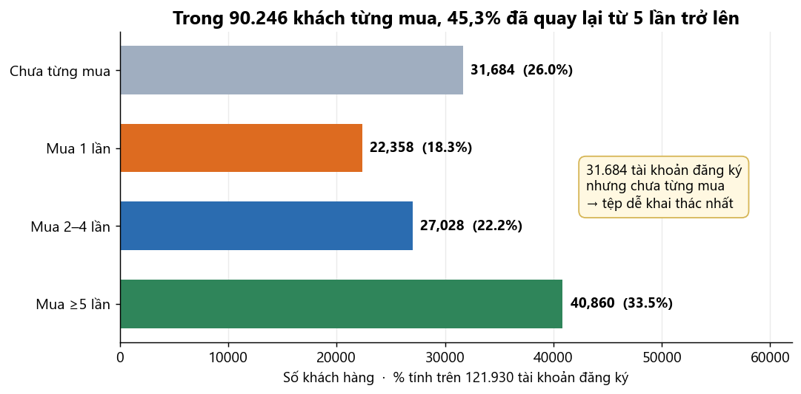

**Số liệu đọc được**

- **45,3% khách đã mua từ 5 lần trở lên** (40.860 người)
- 24,8% mua đúng một lần
- **26,0% đã đăng ký nhưng chưa từng mua** (31.684 người)
- Top 20% khách đóng góp **60,6%** doanh thu

**Kết luận**

> **Doanh nghiệp giữ chân tốt nhưng chuyển đổi kém** — khớp hoàn toàn với phát hiện ở biểu đồ 3. Ai đã
> vượt qua được lần mua đầu tiên thì ở lại lâu dài.
>
> Vấn đề nằm ở **rào cản lần mua đầu**. Nhóm 31.684 khách đã đăng ký mà chưa mua chính là tệp dễ khai
> thác nhất: họ đã quan tâm đủ để tạo tài khoản nhưng dừng lại ở bước cuối.

---

## Tổng hợp — Từ số liệu đến hành động

| # | Kết luận từ dữ liệu | Hành động đề xuất | Giá trị ước tính |
|---:|---|---|---|
| 1 | Chuyển đổi sụp 72% trong khi lưu lượng tăng 63% | Điều tra và khắc phục phễu chuyển đổi | Khôi phục CVR về 0,7% sẽ gấp đôi số đơn |
| 2 | Giá tăng 54%, giỏ hàng nhỏ đi, khách rời bỏ | Xem lại chính sách giá | Nguyên nhân gốc của chuỗi suy giảm |
| 3 | Hủy đơn chiếm 9,23% doanh thu | Giảm tỷ lệ hủy về 5% | ~695 triệu |
| 4 | Streetwear 80% doanh thu nhưng biên chỉ 13,24% | Tái cơ cấu sang nhóm biên cao | ~99 triệu nếu dịch 10 điểm % |
| 5 | Khuyến mại không chứng minh được hiệu quả | Dừng đại trà, chuyển sang thử nghiệm A/B | Tiết kiệm ngân sách giảm giá |

**Hai việc dữ liệu cho thấy KHÔNG nên làm:**

- **Đầu tư tăng lưu lượng truy cập** — lưu lượng đã tăng 63% mà đơn hàng vẫn giảm một nửa
- **Đầu tư rút ngắn thời gian giao hàng để giảm trả hàng** — tỷ lệ trả không phụ thuộc thời gian giao

**Ba hàm ý cho mô hình dự báo:**

1. **Không huấn luyện trên toàn bộ 2013–2022** — điểm gãy 2019 làm sai lệch ước lượng xu hướng. Mức nền
   2020–2022 phản ánh đúng trạng thái hiện tại hơn.
2. **Ưu tiên mô hình hóa mùa vụ tháng** — biên độ 2,60 lần khiến đây là thành phần giải thích mạnh nhất.
3. **Dự báo `Revenue` rồi suy ra `COGS` qua biên lợi nhuận** — hai chuỗi tương quan 0,976, cách này đảm
   bảo `COGS` không bao giờ vượt `Revenue`.

---

## Giới hạn cần nêu rõ

**Về bản chất dữ liệu.** Nhiều dấu hiệu cho thấy đây là dữ liệu **mô phỏng**: toàn vẹn tham chiếu tuyệt
đối trên 4,8 triệu bản ghi, số lượng mua phân bố đều gần như hoàn hảo trên 8 mức, các trần cứng về thời
gian giao vận, không có dòng hàng nào vừa được đánh giá vừa bị trả lại, và mùa vụ ngược quy luật ngành.
Các khuyến nghị kinh doanh mang **giá trị minh họa phương pháp phân tích**, không nên áp dụng trực tiếp
cho một doanh nghiệp thật.

**Về quan hệ nhân quả.** Phân tích chỉ ra tương quan giữa tăng giá và sụt giảm chuyển đổi, nhưng dữ liệu
quan sát không đủ để khẳng định nhân quả. Muốn kết luận chắc chắn phải có thử nghiệm có đối chứng.

**Về `signup_date`.** Do 73,8% đơn hàng có ngày đặt trước ngày đăng ký tài khoản, mọi phân tích theo đoàn
hệ đăng ký đều không thực hiện được. Phần phân tích khách hàng dựa trên số lần mua thực tế, không dựa
trên ngày đăng ký.
