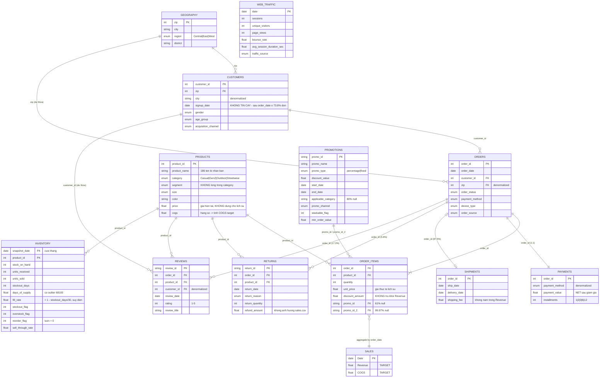
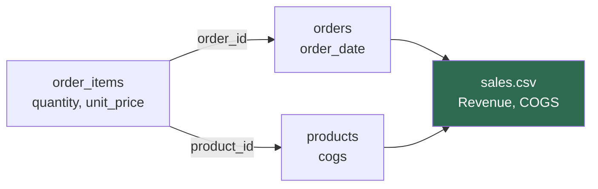
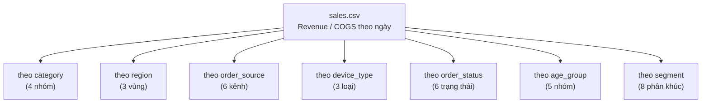

# ERD — Datathon 2026 Round 1

Mô hình dữ liệu dạng **star/snowflake schema** quanh trục `orders`. Xem chi tiết cột tại [data-dictionary.md](data-dictionary.md).

---

## 1. Sơ đồ quan hệ tổng thể



`WEB_TRAFFIC` **không có khóa ngoại** với bất kỳ bảng nào — chỉ join được với `SALES` qua trục ngày.

---

## 2. Bậc quan hệ (cardinality) — đã kiểm chứng

| Từ | Đến | Bậc | Bằng chứng |
|---|---|---|---|
| `orders` | `payments` | **1 : 1** | 646,945 = 646,945, `order_id` duy nhất cả hai bên |
| `orders` | `order_items` | **1 : N** | 646,945 → 714,669 dòng (TB 1.10 dòng/đơn, tối đa 5). ⚠️ 16 cặp `(order_id, product_id)` trùng → cặp này **không phải PK hợp lệ** |
| `orders` | `shipments` | **1 : 0..1** | 566,067 (87.5%) — chỉ đơn đã `shipped`/`delivered`/`returned` |
| `orders` | `returns` | **1 : 0..N** | 39,939 dòng trên 36,062 đơn distinct (5.6% đơn) |
| `orders` | `reviews` | **1 : 0..N** | 113,551 dòng trên 111,369 đơn distinct (17.2% đơn) |
| `customers` | `orders` | **1 : 0..N** | 121,930 khách → 646,945 đơn. Chỉ **90,246 khách (74.0%) có đơn** → TB 7.17 đơn/khách *có giao dịch* (không phải 5.31) |
| `geography` | `customers` | **1 : 0..N** | 39,948 zip → 121,930 khách; chỉ 31,491 zip (78.8%) có khách |
| `products` | `order_items` | **1 : 0..N** | 2,412 SKU → 714,669 dòng. Chỉ **1,598 SKU (66.3%) từng bán** |
| `products` | `inventory` | **1 : 0..N** | 126 tháng × ~478 SKU = 60,247. Chỉ 1,624 SKU (67.3%) được kiểm kê — không phải tích Descartes |
| `promotions` | `order_items` | **1 : N** | 50 KM → 276,316 dòng có KM (38.7%) |

**Toàn vẹn tham chiếu: 0 khóa mồ côi trên mọi quan hệ đã kiểm tra.**

---

## 3. Đường dẫn từ dữ liệu giao dịch → target

Đây là quan hệ quan trọng nhất trong toàn bộ mô hình:



```sql
SELECT  o.order_date                        AS "Date",
        SUM(oi.quantity * oi.unit_price)    AS "Revenue",   -- GROSS, không trừ discount
        SUM(oi.quantity * p.cogs)           AS "COGS"
FROM    order_items oi
JOIN    orders   o ON o.order_id   = oi.order_id            -- KHÔNG lọc order_status
JOIN    products p ON p.product_id = oi.product_id
GROUP BY o.order_date;
```

Kiểm chứng: khớp **0 sai lệch** trên cả 3,833 ngày (max diff = 0.0000 cho cả `Revenue` lẫn `COGS`).

Ba cạm bẫy làm sai target:
- ❌ trừ `discount_amount` → lệch ở 1,707/3,833 ngày
- ❌ lọc bỏ `order_status = 'cancelled'` → mất ~9% doanh thu
- ❌ trừ `returns.refund_amount` → sai, returns không tác động

---

## 4. Trục thời gian — các cột ngày và độ phủ

```
2012-01  2012-07  2013-01                      2022-12  2023-01        2024-07
   |        |        |                             |        |             |
customers.signup_date ──────────────────────────────┤        │             │
        ├── orders.order_date ───────────────────────┤        │             │
        ├── shipments.ship_date / delivery_date ─────┤        │             │
        ├── returns.return_date ─────────────────────┤        │             │
        ├── reviews.review_date ─────────────────────┤        │             │
        ├── inventory.snapshot_date (cuối tháng) ────┤        │             │
        ├── SALES.Date  ◄── TRAIN ───────────────────┤        │             │
                 ├── promotions.start/end_date ──2022-11      │             │
                 ├── web_traffic.date ───────────────┤        │             │
                                                              └── TEST ─────┘
                                                                (548 ngày)
```

| Khoảng trống | Ý nghĩa |
|---|---|
| `web_traffic` bắt đầu 2013-01 (muộn hơn `sales` 6 tháng) | Mất 181 ngày khi inner-join |
| `web_traffic` kết thúc 2022-12 | **Không có giá trị cho test set** → phải tự dự báo nếu muốn dùng |
| `promotions` kết thúc 2022-11-18 | Không biết lịch KM 2023–2024 → phải suy ra chu kỳ hàng năm |
| `inventory` chỉ có 126 điểm tháng | Cần forward-fill/interpolate nếu ghép vào chuỗi ngày |
| ⚠️ `customers.signup_date` bắt đầu 2012-01, **sớm hơn `orders` 6 tháng nhưng vẫn sau đơn hàng ở 73.8% trường hợp** | Trục thời gian của `signup_date` **không nhất quán** với `order_date` — không dùng để tính thâm niên hay cohort |

**Nguyên tắc:** mọi biến ngoại sinh dùng cho test set phải là loại **biết trước được** (ngày lễ, thứ trong tuần, mùa vụ, chu kỳ KM lặp lại). Các biến quan sát (`web_traffic`, `inventory`) chỉ dùng được cho phân tích hoặc như biến trung gian cần dự báo riêng.

---

## 5. Các phân rã target khai thác được

Vì target tái tạo được từ dữ liệu chi tiết, có thể dựng nhiều chuỗi con để làm **hierarchical forecasting** rồi cộng lại:



Ngoài ra, `Revenue` phân tách thành **số đơn × giá trị đơn TB**, hoặc **số khách × tần suất mua × giá trị TB** — mỗi thành phần có động lực khác nhau và có thể dự báo riêng.

⚠️ **Ba lưu ý khi dựng phân rã:**

1. **`category` và `segment` KHÔNG lồng nhau.** `Activewear` xuất hiện ở cả `Casual` lẫn `Outdoor`, nên không thể xếp `segment` làm cấp con của `category`. Muốn phân cấp thật phải dùng cặp `(category, segment)` — 9 tổ hợp thực tế, không phải 4 × 8.
2. **Phân rã theo `category` mất cân bằng nặng.** `Streetwear` chiếm 79.9% doanh thu, ba nhóm còn lại cộng lại chỉ 20.1% (`Casual` 2.8%, `GenZ` 2.1%). Các chuỗi con nhỏ sẽ rất nhiễu và đóng góp không đáng kể khi cộng ngược lên.
3. **Không phân rã theo bất kỳ chiều nào của `customers`.** `age_group`, `gender`, `acquisition_channel` chỉ nối được qua `customer_id`, nhưng `signup_date` không đáng tin (73.8% đơn đặt trước ngày đăng ký) nên mọi chiều khách hàng có yếu tố thời gian đều rủi ro. Chiều nhân khẩu học tĩnh (`age_group`, `gender`) vẫn dùng được vì không phụ thuộc `signup_date`.
