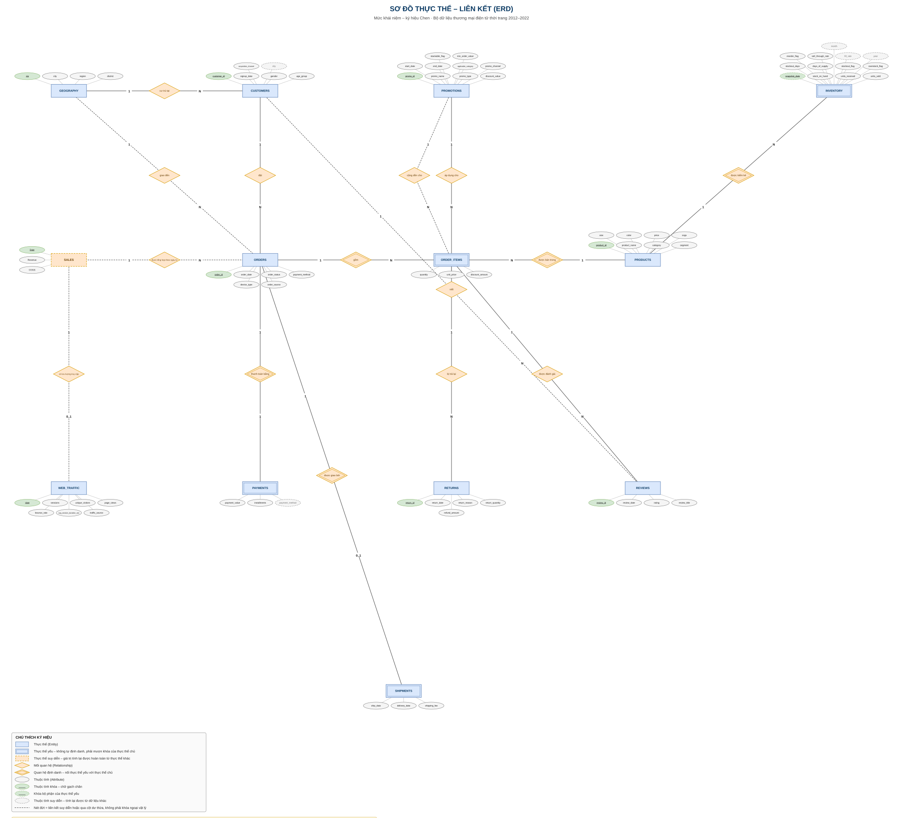

# Sơ đồ thực thể – liên kết (ERD) — mô tả chi tiết

Tài liệu này mô tả bằng chữ nội dung của sơ đồ [`erd.svg`](erd.svg). Mỗi thực thể, thuộc tính và quan hệ
nêu ở đây đều tương ứng một-một với ký hiệu trên hình.

**Mức mô hình:** khái niệm · **Ký hiệu:** Chen · **Tệp nguồn chỉnh sửa:** [`erd.drawio`](erd.drawio)



---

<!-- muc-luc -->
## Mục lục

- [1. Tổng quan](#1-tổng-quan)
- [2. Ý nghĩa ký hiệu trên sơ đồ](#2-ý-nghĩa-ký-hiệu-trên-sơ-đồ)
- [3. Mười ba thực thể](#3-mười-ba-thực-thể)
- [4. Mười lăm mối quan hệ](#4-mười-lăm-mối-quan-hệ)
- [5. Bốn quy tắc thiết kế](#5-bốn-quy-tắc-thiết-kế)
- [6. Đường dẫn từ dữ liệu giao dịch tới biến mục tiêu](#6-đường-dẫn-từ-dữ-liệu-giao-dịch-tới-biến-mục-tiêu)
- [7. Kết quả kiểm định](#7-kết-quả-kiểm-định)

---
<!-- muc-luc -->

## 1. Tổng quan

| Thành phần | Số lượng |
|---|---:|
| Thực thể | **13** |
| ├ trong đó thực thể yếu | 4 |
| └ trong đó thực thể suy diễn | 1 |
| Thuộc tính | **75** |
| ├ trong đó thuộc tính khóa | 8 |
| └ trong đó thuộc tính suy diễn | 11 |
| Mối quan hệ | **15** |
| └ trong đó quan hệ định danh | 5 |

Bộ dữ liệu có 14 tệp nhưng mô hình chỉ 13 thực thể: `sample_submission.csv` là khuôn dạng nộp kết quả dự
báo (548 ngày tương lai, giá trị chỉ minh họa), không phải thực thể nghiệp vụ nên không đưa vào mô hình
khái niệm. Nó vẫn được mô tả đầy đủ trong [`data-dictionary.md`](data-dictionary.md).

---

## 2. Ý nghĩa ký hiệu trên sơ đồ

| Ký hiệu | Ý nghĩa |
|---|---|
| Hình chữ nhật | Thực thể |
| Hình chữ nhật **viền đôi** | Thực thể yếu — không tự định danh, phải mượn khóa của thực thể chủ |
| Hình chữ nhật **viền nét đứt** | Thực thể suy diễn — toàn bộ giá trị tính lại được từ thực thể khác |
| Hình thoi | Mối quan hệ |
| Hình thoi **viền đôi** | Quan hệ định danh — cấp danh tính cho thực thể yếu |
| Hình elip | Thuộc tính |
| Elip **chữ gạch chân** | Thuộc tính khóa |
| Elip **nét đứt gạch chân** | Khóa bộ phận của thực thể yếu |
| Elip **nét đứt** | Thuộc tính suy diễn |
| Số `1` / `N` cạnh thực thể | Bản số — số bản thể của **chính thực thể đó** ứng với một bản thể bên kia |
| **Đường đôi** | Tham gia toàn bộ — mọi bản thể đều phải tham gia quan hệ |
| **Đường đơn** | Tham gia bộ phận — có thể không tham gia |
| **Đường nét đứt** | Liên kết không phải khóa ngoại vật lý |

Sơ đồ dùng **thuần ký hiệu Chen**: bản số chỉ ghi `1` hoặc `N`, còn tính bắt buộc hay tùy chọn thể hiện
bằng kiểu đường — không trộn với hệ ký hiệu `(min, max)`.

---

## 3. Mười ba thực thể

Ký hiệu cột "Loại": **K** = khóa · **KBP** = khóa bộ phận · **SD** = suy diễn · *(trống)* = thuộc tính thường.

### `GEOGRAPHY` — 4 thuộc tính

| Thuộc tính | Loại | Ghi chú |
|---|---|---|
| `zip` | **K** | 39.948 mã vùng |
| `city` | | 42 thành phố |
| `region` | | East, Central, West |
| `district` | | `District #01`–`#39`. **Không lồng trong `city`** — một mã quận thuộc tới 16 thành phố |

### `CUSTOMERS` — 6 thuộc tính

| Thuộc tính | Loại | Ghi chú |
|---|---|---|
| `customer_id` | **K** | 121.930 khách |
| `signup_date` | | ⚠️ **73,8% đơn hàng đặt trước ngày này** — không dùng được cho đặc trưng đoàn hệ |
| `gender` | | Female, Male, Non-binary |
| `age_group` | | 5 nhóm |
| `acquisition_channel` | | 6 kênh |
| `city` | **SD** | Suy từ `GEOGRAPHY` qua mã vùng |

*Cột `zip` đã chuyển thành quan hệ "cư trú tại".*

### `PRODUCTS` — 8 thuộc tính

| Thuộc tính | Loại | Ghi chú |
|---|---|---|
| `product_id` | **K** | Liên tục 1–2.412 |
| `product_name` | | 186 tên bị nhân bản |
| `category` | | Streetwear, Outdoor, Casual, GenZ |
| `segment` | | 8 phân khúc. **Không lồng hoàn toàn trong `category`** — `Activewear` ở cả `Casual` lẫn `Outdoor` |
| `size` | | S, M, L, XL |
| `color` | | 10 màu |
| `price` | | Giá niêm yết — chỉ tham chiếu, khác giá giao dịch |
| `cogs` | | **Giá vốn đơn vị — đầu vào trực tiếp của biến mục tiêu `COGS`** |

### `PROMOTIONS` — 10 thuộc tính

| Thuộc tính | Loại | Ghi chú |
|---|---|---|
| `promo_id` | **K** | 50 chương trình |
| `promo_name` | | |
| `promo_type` | | percentage, fixed |
| `discount_value` | | Nghĩa phụ thuộc `promo_type` |
| `start_date`, `end_date` | | Khoảng hiệu lực ~30 ngày |
| `applicable_category` | | ⚠️ Thiếu 80% — **giá trị thiếu nghĩa là "áp dụng mọi danh mục"**, không phải lỗi |
| `promo_channel` | | 5 kênh |
| `stackable_flag` | | Cho phép cộng dồn |
| `min_order_value` | | Giá trị đơn tối thiểu |

### `ORDERS` — 6 thuộc tính

| Thuộc tính | Loại | Ghi chú |
|---|---|---|
| `order_id` | **K** | 646.945 đơn. ID **không liên tục** — khuyết 187.452 giá trị |
| `order_date` | | **Mốc ghi nhận doanh thu** |
| `order_status` | | 6 giá trị theo vòng đời — quyết định hoàn toàn việc có bản ghi giao vận / trả hàng |
| `payment_method` | | 5 phương thức |
| `device_type` | | mobile, desktop, tablet |
| `order_source` | | 6 kênh |

*Hai cột `customer_id` và `zip` đã chuyển thành quan hệ.*

### `ORDER_ITEMS` — 3 thuộc tính · **thực thể yếu**

| Thuộc tính | Loại | Ghi chú |
|---|---|---|
| `quantity` | | 1–8 |
| `unit_price` | | **Giá giao dịch thực tế** — chỉ 3/714.669 dòng trùng giá niêm yết |
| `discount_amount` | | Bằng 0 ở 61,3% số dòng |

**Vì sao là thực thể yếu:** một "dòng hàng" chỉ có nghĩa khi biết thuộc đơn nào. Cặp
`(order_id, product_id)` tưởng là khóa nhưng có **16 cặp bị trùng** trên 714.669 dòng → không có khóa
tự nhiên hợp lệ.

**Vì sao là thực thể chứ không phải hình thoi:** quan hệ nhiều–nhiều có thuộc tính thường được vẽ thành
hình thoi. Nhưng `ORDER_ITEMS` còn tham gia **ba quan hệ khác** với `PROMOTIONS`, `RETURNS`, `REVIEWS`.
Trong ký hiệu Chen, một quan hệ không thể có quan hệ con → buộc phải là thực thể (**thực thể kết hợp**).

**Đây là thực thể quan trọng nhất của đề tài** — hai biến mục tiêu sinh trực tiếp từ nó.

### `PAYMENTS` — 3 thuộc tính · **thực thể yếu**

| Thuộc tính | Loại | Ghi chú |
|---|---|---|
| `installments` | | 1, 2, 3, 6, 12 — **thuộc tính thật duy nhất của bảng** |
| `payment_value` | **SD** | `= Σ(quantity × unit_price − discount_amount)` của đơn, khớp 100% |
| `payment_method` | **SD** | Trùng khớp 100% với `orders.payment_method` |

**Phân biệt quan trọng:** `payment_value` là số tiền **thực thu** (đã trừ giảm giá), còn `Revenue` trong
`SALES` là doanh thu **gộp**. Hai đại lượng khác nhau, chênh đúng bằng tổng giảm giá.

### `SHIPMENTS` — 3 thuộc tính · **thực thể yếu**

| Thuộc tính | Loại | Ghi chú |
|---|---|---|
| `ship_date` | | Cách ngày đặt 0–3 ngày |
| `delivery_date` | | Cách ngày xuất kho 2–7 ngày |
| `shipping_fee` | | **Không nằm trong `Revenue`** |

### `RETURNS` — 5 thuộc tính

| Thuộc tính | Loại | Ghi chú |
|---|---|---|
| `return_id` | **K** | 39.939 lượt trả |
| `return_date` | | Cách ngày đặt 5–31 ngày |
| `return_reason` | | 5 lý do, phổ biến nhất là `wrong_size` |
| `return_quantity` | | 1–8 |
| `refund_amount` | | **Không** suy diễn được (thử `return_quantity × unit_price` chỉ khớp 0,64%) |

### `REVIEWS` — 4 thuộc tính

| Thuộc tính | Loại | Ghi chú |
|---|---|---|
| `review_id` | **K** | 113.551 đánh giá |
| `review_date` | | Cách ngày đặt 3–40 ngày |
| `rating` | | Thang 1–5, trung bình 3,94 |
| `review_title` | | 18 tiêu đề định sẵn — **không phải văn bản tự do**. Tồn tại phụ thuộc hàm `review_title → rating` |

### `INVENTORY` — 13 thuộc tính · **thực thể yếu**

| Thuộc tính | Loại | Ghi chú |
|---|---|---|
| `snapshot_date` | **KBP** | Ngày cuối tháng, 126 kỳ |
| `stock_on_hand` | | Tồn kho cuối kỳ |
| `units_received` | | Nhập trong kỳ |
| `units_sold` | | Bán trong kỳ theo sổ kho |
| `stockout_days` | | 0–28 ngày |
| `overstock_flag` | | **Không** suy diễn được (ngưỡng tốt nhất chỉ khớp 83%) |
| `reorder_flag` | | ⚠️ **Hằng số 0** trên toàn bộ dữ liệu — không mang thông tin |
| `days_of_supply` | **SD** | `= round(stock_on_hand / (units_sold/30), 1)` |
| `fill_rate` | **SD** | `= 1 − stockout_days/30` |
| `stockout_flag` | **SD** | `= (stockout_days > 0)` |
| `sell_through_rate` | **SD** | `= units_sold / (stock_on_hand + units_sold)` |
| `year`, `month` | **SD** | Tách từ `snapshot_date` |

**6 trên 13 thuộc tính là suy diễn** — quá nửa bảng không mang thông tin độc lập. Cộng thêm
`reorder_flag` là hằng số, chỉ còn 6 cột thực sự có giá trị.

**Vì sao là thực thể yếu:** một dòng tồn kho được xác định bởi **cặp** (ngày chốt sổ, sản phẩm), không
chỉ bởi ngày. `snapshot_date` một mình không đủ định danh nên là **khóa bộ phận**.

### `SALES` — 3 thuộc tính · **thực thể suy diễn** · BIẾN MỤC TIÊU

| Thuộc tính | Loại | Ghi chú |
|---|---|---|
| `Date` | **K** | 3.833 ngày liên tục, không thiếu ngày nào |
| `Revenue` | **SD** | `= Σ(quantity × unit_price)` |
| `COGS` | **SD** | `= Σ(quantity × products.cogs)` |

**Vì sao vẽ viền nét đứt:** toàn bộ nội dung tính lại được từ `ORDER_ITEMS` với **sai số 0,00 trên cả
3.833 ngày**. Đây không phải dữ liệu gốc độc lập.

### `WEB_TRAFFIC` — 7 thuộc tính

| Thuộc tính | Loại | Ghi chú |
|---|---|---|
| `date` | **K** | 3.652 ngày, bắt đầu 2013-01-01 |
| `sessions` | | 7.973–50.947 phiên/ngày |
| `unique_visitors` | | Tỷ lệ ~0,76 so với `sessions` |
| `page_views` | | |
| `bounce_rate` | | Biên độ 0,0032–0,0058 — gần như hằng số, sức giải thích thấp |
| `avg_session_duration_sec` | | 100,1–319,9 giây |
| `traffic_source` | | ⚠️ **Không phải phân rã theo kênh** — mỗi ngày chỉ một dòng kèm một nhãn |

**Hạn chế:** thiếu 181 ngày đầu so với `SALES`, và **không có dữ liệu cho giai đoạn dự báo 2023–2024**.

---

## 4. Mười lăm mối quan hệ

Cách đọc: số cạnh thực thể cho biết **có bao nhiêu bản thể của chính thực thể đó** ứng với một bản thể
bên kia. Cột "Tham gia" ghi bên nào là toàn bộ (đường đôi).

| # | Quan hệ | Bản số | Tham gia toàn bộ | Ghi chú |
|---:|---|---|---|---|
| 1 | `CUSTOMERS` — *cư trú tại* — `GEOGRAPHY` | N : 1 | `CUSTOMERS` | Chỉ 78,8% mã vùng có khách |
| 2 | `ORDERS` — *giao đến* — `GEOGRAPHY` | N : 1 | `ORDERS` | *Nét đứt* — `orders.zip` trùng 100% `customers.zip` |
| 3 | `CUSTOMERS` — *đặt* — `ORDERS` | 1 : N | `ORDERS` | Chỉ 74,0% khách từng đặt hàng |
| 4 | `CUSTOMERS` — *viết* — `REVIEWS` | 1 : N | `REVIEWS` | *Nét đứt* — `reviews.customer_id` suy được qua `ORDERS` |
| 5 | `ORDERS` — *gồm* — `ORDER_ITEMS` | 1 : N | **cả hai** | **Định danh.** 1–5 dòng/đơn, TB 1,10 |
| 6 | `ORDERS` — *thanh toán bằng* — `PAYMENTS` | 1 : 1 | **cả hai** | **Định danh.** 646.945 = 646.945, 1:1 tuyệt đối |
| 7 | `ORDERS` — *được giao bởi* — `SHIPMENTS` | 1 : 1 | `SHIPMENTS` | **Định danh.** Chỉ 87,5% đơn có giao vận |
| 8 | `PRODUCTS` — *được bán trong* — `ORDER_ITEMS` | 1 : N | `ORDER_ITEMS` | **Định danh.** Chỉ 66,3% sản phẩm từng bán |
| 9 | `PRODUCTS` — *được kiểm kê* — `INVENTORY` | 1 : N | `INVENTORY` | **Định danh.** Chỉ 67,3% sản phẩm có trong sổ kho |
| 10 | `PROMOTIONS` — *áp dụng cho* — `ORDER_ITEMS` | 1 : N | `PROMOTIONS` | Chỉ 38,7% dòng hàng có khuyến mại |
| 11 | `PROMOTIONS` — *cộng dồn cho* — `ORDER_ITEMS` | 1 : N | — | *Nét đứt* — `promo_id_2` rỗng 99,97%, chỉ 206 dòng |
| 12 | `ORDER_ITEMS` — *bị trả lại* — `RETURNS` | 1 : N | `RETURNS` | 39.939 dòng / 39.937 cặp → có dòng bị trả nhiều lần |
| 13 | `ORDER_ITEMS` — *được đánh giá* — `REVIEWS` | 1 : 1 | `REVIEWS` | 113.551 dòng / **đúng** 113.551 cặp → tối đa 1 đánh giá |
| 14 | `SALES` — *được tổng hợp theo ngày từ* — `ORDERS` | 1 : N | **cả hai** | *Nét đứt* — nối theo trục thời gian |
| 15 | `SALES` — *có lưu lượng truy cập* — `WEB_TRAFFIC` | 1 : 1 | `WEB_TRAFFIC` | *Nét đứt* — 181 ngày đầu không có dữ liệu lưu lượng |

### Ba quan hệ cần giải thích thêm

**Quan hệ 12 và 13 — vì sao nối vào `ORDER_ITEMS` chứ không vào `ORDERS` và `PRODUCTS`**

Tệp `returns.csv` và `reviews.csv` mỗi tệp có hai cột `order_id` và `product_id`, nhìn qua tưởng là hai
quan hệ riêng. Nhưng hai cột đó **luôn đi thành cặp**: mọi cặp `(order_id, product_id)` của chúng đều
nằm trọn trong `order_items`, **0 dòng lệch**.

Nghĩa là mỗi lượt trả hàng gắn với **một dòng hàng cụ thể** — khách trả lại *"hai cái áo size M màu đỏ
trong đơn số 5"*, chứ không phải trả đơn số 5 và trả sản phẩm X như hai việc riêng biệt.

*Lưu ý:* khi ánh xạ mô hình khái niệm này sang mô hình quan hệ, một quan hệ tới thực thể yếu
`ORDER_ITEMS` sẽ tách thành **cặp khóa ngoại** `(order_id, product_id)` — đúng như cấu trúc thấy trong
tệp CSV. Hai cách thể hiện không mâu thuẫn, chỉ khác mức mô hình.

**Quan hệ 14 — vì sao `SALES` có quan hệ dù không có cột khóa ngoại nào**

Trong tệp CSV, `sales` không có cột nào trỏ sang `orders`. Nhưng tập ngày của `sales` **trùng khớp tuyệt
đối** với tập `orders.order_date` — cùng 3.833 ngày, không lệch ngày nào. Quan hệ tồn tại thật, chỉ là
nối qua **giá trị ngày** chứ không qua mã khóa, nên vẽ nét đứt để phân biệt với khóa ngoại vật lý.

**Vì sao `INVENTORY` không nối với `SALES`**

`inventory.snapshot_date` cũng nằm trong khoảng thời gian của `SALES`, nhưng ở **mức tháng** (126 kỳ),
khác độ chi tiết với `SALES` (theo ngày). Thời gian của nó là khóa bộ phận nội tại của thực thể yếu,
không phải tham chiếu tới `SALES`.

---

## 5. Bốn quy tắc thiết kế

| Quy tắc | Kết quả trên sơ đồ |
|---|---|
| **1.** Khóa ngoại không vẽ thành thuộc tính — liên kết đã do hình thoi biểu diễn | 15 cột FK → 15 hình thoi |
| **2.** Thực thể có khóa chính là khóa ngoại, hoặc không có khóa hợp lệ → thực thể yếu | 4 hình chữ nhật viền đôi |
| **3.** Thuộc tính tính lại được bằng công thức → đánh dấu suy diễn | 11 elip nét đứt |
| **4.** Loại bỏ cái không phải thực thể nghiệp vụ | Bỏ `sample_submission` và 3 cột sao chép |

### Phép đối soát — chứng minh không sót không bịa

```
93 cột (13 tệp)  −  15 cột khóa ngoại  −  3 cột sao chép  =  75 thuộc tính
```

Ba cột bị loại là `product_name`, `category`, `segment` trong `inventory.csv` — bản sao nguyên văn từ
`PRODUCTS`, thuộc về thực thể sản phẩm chứ không phải thuộc tính của tồn kho.

Đếm elip trên sơ đồ được đúng **75**. Mỗi cột của dữ liệu gốc đều có một trong ba số phận: thành thuộc
tính, thành quan hệ, hoặc bị loại có lý do ghi rõ.

---

## 6. Đường dẫn từ dữ liệu giao dịch tới biến mục tiêu

Quan hệ quan trọng nhất của cả mô hình, đã kiểm chứng sai số **0,00 trên 3.833/3.833 ngày**:

```sql
SELECT  o.order_date                      AS "Date",
        SUM(oi.quantity * oi.unit_price)  AS "Revenue",   -- GỘP, không trừ discount
        SUM(oi.quantity * p.cogs)         AS "COGS"
FROM    order_items oi
JOIN    orders   o ON o.order_id   = oi.order_id          -- KHÔNG lọc order_status
JOIN    products p ON p.product_id = oi.product_id
GROUP BY o.order_date;
```

Ba cạm bẫy làm sai biến mục tiêu:

- ❌ Trừ `discount_amount` → lệch ở 1.707/3.833 ngày (đúng các ngày có khuyến mại)
- ❌ Lọc bỏ `order_status = 'cancelled'` → mất ~9,2% doanh thu
- ❌ Trừ `returns.refund_amount` → sai, trả hàng không tác động tới `sales.csv`

---

## 7. Kết quả kiểm định

| Nội dung | Kết quả |
|---|---|
| Toàn vẹn tham chiếu | 15 quan hệ · 4.815.470 bản ghi · **0 bản ghi mồ côi** |
| Khóa chính | 8/9 bảng có khóa hợp lệ; `order_items` **không có** |
| Thuộc tính suy diễn | 5 công thức được xác nhận, 2 giả thuyết bị bác bỏ |
| Biến mục tiêu | Tái tạo sai số **0,00** trên 3.833/3.833 ngày |
| Đối soát thuộc tính | 93 − 15 − 3 = 75, **khớp** với sơ đồ |

Quy trình kiểm định đầy đủ kèm mã nguồn chạy lại được: [`quy-trinh-kiem-dinh.md`](quy-trinh-kiem-dinh.md)
