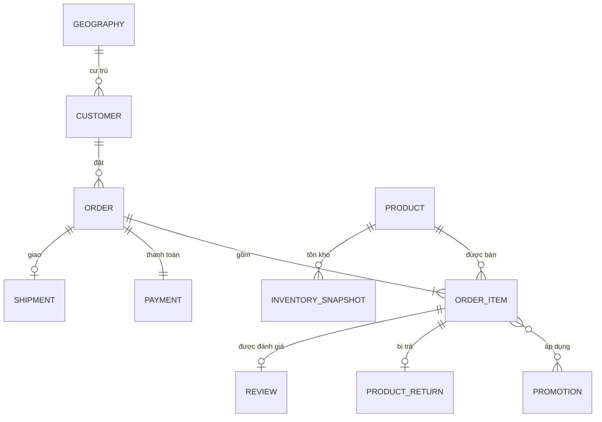
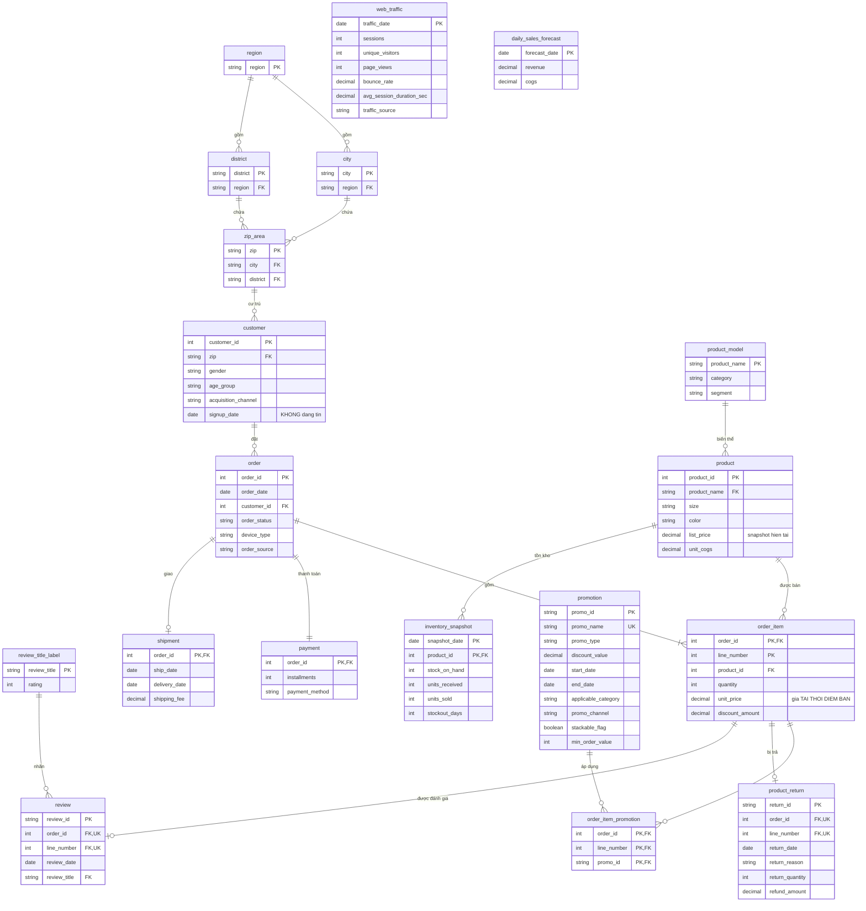

# Mô hình chuẩn hóa (1NF → 2NF → 3NF) — Datathon 2026 Round 1

Thiết kế mô hình quan hệ chuẩn hóa cho 14 file CSV nguồn, và trả lời câu hỏi
**khi nào dùng chuẩn nào**.

Mọi phụ thuộc hàm khẳng định ở đây đều được chứng minh trong `notebooks/02_design/normalization.ipynb`.
Tài liệu song song: `star_schema.md` — **cùng dữ liệu, mô hình ngược lại** (§9 giải thích tại sao).

---

## 1. Hiểu dataset

14 file CSV phẳng, không có khai báo khóa, không có ràng buộc. Toàn vẹn tham chiếu thực tế
**hoàn hảo** (0 orphan trên 14 quan hệ — `notebooks/02_design/data_model.ipynb` §3), nên đây là bài toán *khôi phục
cấu trúc từ dữ liệu*, không phải bài toán làm sạch.

| File | Dòng × Cột | Grain (1 dòng = ?) | Khóa tự nhiên | Phủ thời gian |
|---|---|---|---|---|
| `customers.csv` | 121.930 × 7 | 1 khách hàng | `customer_id` ✅ | — |
| `geography.csv` | 39.948 × 4 | 1 mã zip | `zip` ✅ | — |
| `products.csv` | 2.412 × 8 | 1 SKU | `product_id` ✅ | — |
| `promotions.csv` | 50 × 10 | 1 đợt khuyến mãi | `promo_id` ✅ | 2013 → 2022 |
| `orders.csv` | 646.945 × 8 | 1 đơn hàng | `order_id` ✅ | 2012-07-04 → 2022-12-31 |
| `order_items.csv` | 714.669 × 7 | 1 dòng hàng | ❌ **không có** | (theo đơn) |
| `payments.csv` | 646.945 × 4 | 1 đơn hàng | `order_id` ✅ | (theo đơn) |
| `shipments.csv` | 566.067 × 4 | 1 lô giao | `order_id` ✅ | 2012-07-04 → 2022-12-29 |
| `returns.csv` | 39.939 × 7 | 1 lần trả hàng | `return_id` ✅ | 2012-07-11 → 2022-12-31 |
| `reviews.csv` | 113.551 × 7 | 1 đánh giá | `review_id` ✅ | 2012-07-10 → 2022-12-31 |
| `inventory.csv` | 60.247 × 17 | 1 (cuối tháng × SP) | `(snapshot_date, product_id)` ✅ | 126 mốc, 2012-07 → 2022-12 |
| `web_traffic.csv` | 3.652 × 7 | 1 ngày | `date` ✅ | 2013-01-01 → 2022-12-31 |
| `sales.csv` | 3.833 × 3 | 1 ngày | `Date` ✅ | 2012-07-04 → 2022-12-31 |
| `sample_submission.csv` | 548 × 3 | 1 ngày | `Date` ✅ | 2023-01-01 → 2024-07-01 |

**Bốn cụm thực thể:**

- **Giao dịch bán** — `orders` → `order_items` → (`payments`, `shipments`, `returns`, `reviews`)
- **Danh mục** — `products`, `promotions`
- **Khách & địa lý** — `customers` → `geography`
- **Vận hành & tổng hợp** — `inventory`, `web_traffic`, `sales`, `sample_submission`

Hai điều định hình toàn bộ thiết kế:

1. **`order_items` là bảng duy nhất không có khóa tự nhiên** — mọi vấn đề 1NF bắt nguồn từ đây.
2. **Mọi bảng giao dịch dừng ở 2022-12-31**; chỉ `sample_submission` sống ở 2023–2024.
   Vùng dự báo tách biệt hoàn toàn khỏi vùng dữ liệu thật.

### 1.1 Mô hình khái niệm (conceptual model)

Trước khi chuẩn hóa, cần một bức tranh **nghiệp vụ** — thế giới thật có những thực thể nào và
liên hệ ra sao — độc lập với việc sau này sẽ có bao nhiêu bảng.

> **Ba mức mô hình:** *conceptual* (mục này) → *logical* (§6, §8) → *physical* (DDL cụ thể của một DBMS).
> Sơ đồ ở §6.2 **không phải** mô hình khái niệm: nó có bảng junction, có kiểu dữ liệu, có PK/FK —
> đều là mối quan tâm mức logical. Toàn bộ §2–§5 chính là phần **dẫn** từ mức này xuống mức đó.



**Thuộc tính của 11 thực thể.** Cú pháp mermaid bắt mọi thuộc tính phải kèm kiểu dữ liệu — mà kiểu
là mối quan tâm mức logical (xem điểm 2 của "Ba điều sơ đồ này cố ý làm khác §6" bên dưới) — nên
thuộc tính không nằm được trong sơ đồ trên. Bảng dưới đây là cách vòng qua đúng giới hạn đó:
liệt kê đủ thuộc tính ở **mức khái niệm**, **không ghi kiểu**.

| Thực thể | Định danh | Thuộc tính |
|---|---|---|
| `GEOGRAPHY` | `zip` | city, district, region |
| `CUSTOMER` | `customer_id` | zip, city, signup_date, gender, age_group, acquisition_channel |
| `PRODUCT` | `product_id` | product_name, category, segment, size, color, price, cogs |
| `PROMOTION` | `promo_id` | promo_name, promo_type, discount_value, start_date, end_date, applicable_category, promo_channel, stackable_flag, min_order_value |
| `ORDER` | `order_id` | order_date, customer_id, zip, order_status, payment_method, device_type, order_source |
| `ORDER_ITEM` | *(thực thể yếu — nguồn KHÔNG có định danh hợp lệ; §2.1 thêm `line_number`)* | product_id, quantity, unit_price, discount_amount, promo_id, promo_id_2 |
| `PAYMENT` | `order_id` | payment_method, payment_value, installments |
| `SHIPMENT` | `order_id` | ship_date, delivery_date, shipping_fee |
| `PRODUCT_RETURN` | `return_id` | order_id, product_id, return_date, return_reason, return_quantity, refund_amount |
| `REVIEW` | `review_id` | order_id, product_id, customer_id, review_date, rating, review_title |
| `INVENTORY_SNAPSHOT` | *(`snapshot_date`, `product_id`)* | stock_on_hand, units_received, units_sold, stockout_days, days_of_supply, fill_rate, sell_through_rate, stockout_flag, overstock_flag, reorder_flag, product_name, category, segment, year, month |

⚠️ Đây là thuộc tính **nguyên trạng như trong file nguồn — trước khi §2–§5 mổ xẻ**. Rất nhiều cột ở
đây sẽ bị loại hoặc chuyển chỗ: `customers.city` và `orders.zip` (§4.2), `inventory.year`/`month`
và ba cột thuộc tính sản phẩm (§3.1), `promo_id_2` (§2.2), `payment_value` và các cột dẫn xuất của
`inventory` (§5), `reviews.customer_id` (§4.4).

Nói cách khác, **bảng này là đầu vào của quá trình chuẩn hóa**, còn §7 là đầu ra. Độ chênh giữa hai
bảng chính là lượng dư thừa đã bị loại bỏ — đối chiếu qua bảng ánh xạ ngay dưới đây.

**Quy ước để hai sơ đồ đọc chồng lên nhau được:**

| | §1.1 — conceptual | §6 — logical |
|---|---|---|
| Tên thực thể / bảng | `CHỮ HOA` | `chữ thường` |
| Nhãn quan hệ | tiếng Việt | tiếng Việt, **dùng đúng từ như nhau** |
| Kiểu dữ liệu, PK/FK | không có | có đủ |

Tên chỉ khác nhau ở **kiểu chữ**, nên `ORDER_ITEM` ở đây và `order_item` ở §6 nhìn là biết ngay
cùng một thứ; nhãn quan hệ (`đặt`, `gồm`, `được bán`, `bị trả`…) dùng nguyên văn ở cả hai mức.
Chỗ nào một thực thể nở ra thành nhiều bảng thì tra bảng ánh xạ ngay dưới.

**Ba điều sơ đồ này cố ý làm khác §6:**

1. **Quan hệ M:N để nguyên** — `ORDER_ITEM }o--o{ PROMOTION` là **một đường**, không có bảng
   trung gian. `order_item_promotion` ở §6 không phải thực thể nghiệp vụ; nó sinh ra vì
   *mô hình quan hệ không biểu diễn được M:N trực tiếp* (§2.2). Nó thuộc mức logical.
2. **Không có kiểu dữ liệu, không PK/FK.** Ở mức khái niệm chưa quyết định gì về lưu trữ.
   (Cú pháp mermaid bắt mọi thuộc tính phải kèm kiểu — mà kiểu là mối quan tâm mức logical —
   nên trong *sơ đồ* bỏ hẳn khối thuộc tính. Thuộc tính vẫn được liệt kê đủ, ở **bảng riêng** phía trên.)
3. **Không có bảng nào do chuẩn hóa sinh ra** — `product_model`, `review_title_label`,
   `region`/`city`/`district` đều vắng mặt. Chúng là *kết quả* của §4, không phải *đầu vào*.

**Hai hạn chế của ký hiệu:** mermaid vẽ theo crow's foot, không vẽ được hình thoi kiểu Chen,
nên quan hệ ở đây hiện ra như đường nối chứ không như đối tượng hạng nhất. Và `ORDER_ITEM` là
**thực thể yếu** — nó không tồn tại độc lập với `ORDER` và phải mượn định danh của đơn
(chính là lý do §2.1 phải thêm `line_number`) — mermaid không có ký hiệu cho điều đó.

#### Từ khái niệm xuống logical: 11 thực thể → 17 bảng

| Thực thể (§1.1) | Bảng (§6, §8) | Chuyện gì xảy ra khi xuống logical |
|---|---|---|
| `CUSTOMER` | `customer` | bỏ `city` (§4.2) |
| `GEOGRAPHY` | `zip_area` + `city` + `district` + `region` | **1 → 4 bảng** (§4.5) |
| `PRODUCT` | `product` + `product_model` | **1 → 2 bảng** (§4.1) |
| `PROMOTION` | `promotion` | giữ nguyên |
| `ORDER` | `"order"` | bỏ `zip` (§4.2); đặt trong nháy vì là từ khóa SQL |
| `ORDER_ITEM` | `order_item` | **thêm `line_number`** (§2.1) |
| *(quan hệ M:N)* | `order_item_promotion` | **quan hệ hóa thành bảng** (§2.2) |
| `PAYMENT` | `payment` | còn `installments` + `payment_method`; bỏ `payment_value` (§4.4, §5) |
| `SHIPMENT` | `shipment` | giữ nguyên |
| `PRODUCT_RETURN` | `product_return` | FK trỏ **dòng hàng**, không phải đơn |
| `REVIEW` | `review` + `review_title_label` | **1 → 2 bảng** (§4.3) |
| `INVENTORY_SNAPSHOT` | `inventory_snapshot` | 17 → 6 cột (§3.1, §5) |

**11 thực thể → 17 bảng.** Cộng `web_traffic` và `daily_sales_forecast` (xem dưới) là **19 bảng**
ở §7. Bốn dòng in đậm là toàn bộ chỗ số lượng bảng thay đổi — mỗi chỗ đều dẫn về mục chứng minh
tương ứng, nên không có bảng nào ở §6 xuất hiện mà không truy được nguồn gốc.

`PAYMENT` là ví dụ gọn nhất cho việc *conceptual ≠ logical*: thanh toán rõ ràng là một khái
niệm nghiệp vụ có thật, nhưng xuống tới logical thì `payment_value` suy ra được 100% (§5) nên bị
bỏ; `payment_method` tuy trùng `orders` (§4.4) nhưng được **giữ lại** — chỉ ở một nơi duy nhất
(`payment`), bỏ khỏi `order`. Thực thể **không biến mất**, nó **gọn lại còn hai cột** — và điều
đó chỉ nhìn thấy được khi có mức khái niệm để đối chiếu.

#### Vì sao `web_traffic` và `daily_sales_forecast` không có ở đây

Đây cũng là lời giải thích cho hai bảng "đứng tự do" trong sơ đồ §6.2:

- **`web_traffic`** là **chuỗi quan sát tổng hợp theo ngày**, không phải thực thể của miền bán
  hàng. Nó đã bị gộp mất định danh trước khi tới tay — không có `session_id` nào để nối một
  phiên truy cập với một đơn hàng, nên quan hệ với cây giao dịch **không tồn tại trong dữ liệu**.
- **`daily_sales_forecast`** là **đầu ra của bài toán**, không phải dữ liệu quan sát. Nó phủ
  2023-01-01 → 2024-07-01 và giao với `order`/`sales`/`web_traffic` đúng **0 ngày**, nên không
  có dòng nào bên kia để trỏ tới.

Cả hai chỉ xuất hiện từ mức logical trở đi. Chúng nổi ở §6 không phải vì thiết kế thiếu sót,
mà vì **mô hình quan hệ không có thực thể "ngày"** để làm trung gian — ngày là *giá trị*, không
phải *thực thể*. (`star_schema.md` có `dim_date` nên ở đó chúng hết nổi; xem §9.5.)

#### Bằng chứng cho cardinality

Mọi ký hiệu cardinality trên đều đọc ra từ dữ liệu, đã kiểm trong notebook:

Cardinality ở §1.1 và §6 là **cùng một bộ số** — không có quan hệ nào hai sơ đồ nói khác nhau:

| Quan hệ | Cardinality | Số liệu | Nguồn |
|---|---|---|---|
| `ORDER` → `ORDER_ITEM` | 1 : 1..N | 0 đơn không có dòng hàng; tối đa 5 dòng/đơn | `notebooks/02_design/normalization.ipynb` §2.1, §6 |
| `ORDER` → `PAYMENT` | 1 : 1 | 0 đơn không có payment; 1:1 đầy đủ | `notebooks/02_design/normalization.ipynb` §6 |
| `ORDER` → `SHIPMENT` | 1 : 0..1 | **80.878** đơn không có shipment | `notebooks/02_design/normalization.ipynb` §6 |
| `ORDER_ITEM` → `REVIEW` | 1 : 0..1 | `UNIQUE(order_id, line_number)` 0 vi phạm / 113.551 | `notebooks/02_design/normalization.ipynb` §6 |
| `ORDER_ITEM` → `PRODUCT_RETURN` | 1 : 0..1 | `UNIQUE(order_id, line_number)` 0 vi phạm / 39.939 — xem ghi chú bên dưới | `notebooks/02_design/normalization.ipynb` §6 |
| `CUSTOMER` → `ORDER` | 1 : 0..N | **31.684** khách chưa mua lần nào | `notebooks/02_design/data_model.ipynb` §3 |
| `PRODUCT` → `ORDER_ITEM` | 1 : 0..N | **814** sản phẩm chưa bán lần nào | `notebooks/02_design/data_model.ipynb` §3 |
| `PRODUCT` → `INVENTORY_SNAPSHOT` | 1 : 0..N | chỉ 1.624/2.412 SP có snapshot | `notebooks/02_design/data_model.ipynb` §6 |

> **Ghi chú về `PRODUCT_RETURN`:** `returns` có **2 cặp** `(order_id, product_id)` trùng, thoạt nhìn
> giống một dòng hàng bị trả hai lần. Nhưng cả hai cặp đều nằm trong **16 khóa nhập nhằng** ở §2.1,
> và mỗi đơn đó có đúng **2 dòng hàng** cho cùng sản phẩm — nên hai lần trả ứng với hai dòng hàng
> khác nhau, không phải một dòng bị trả hai lần. Cardinality 1:0..1 là đúng.
>
> Đúng 2 cặp này cũng là nguồn của cảnh báo giả `RET-043492` ở §8 — cùng một nguyên nhân:
> `(order_id, product_id)` không phải khóa của `order_item`.

---

## 2. 1NF — nguyên tử, không nhóm lặp, định danh được từng dòng

### 2.1 `order_items` không có khóa tự nhiên hợp lệ

**32 dòng thuộc 16 đơn** có `(order_id, product_id)` trùng nhau — cùng đơn, cùng sản phẩm,
nhưng khác `quantity` và `unit_price`:

```text
 order_id  product_id  quantity  unit_price
    14280         976         1     4019.47
    14280         976         2     3937.99
   113379         786         6      694.34
   113379         786         1      699.37
```

Không có tổ hợp cột nào phân biệt được hai dòng này ⇒ **chưa phải một quan hệ**.
1NF đòi hỏi mỗi bộ (tuple) phải định danh được, không chỉ đòi "ô chứa giá trị nguyên tử".

**Sửa:** thêm `line_number` (tối đa 5 dòng/đơn) ⇒ PK `(order_id, line_number)`.

**Hệ quả bắt buộc cho ETL:** `returns` và `reviews` tham chiếu bằng `(order_id, product_id)`.
Với 16 cặp trùng, có **4 dòng `returns` và 2 dòng `reviews`** không xác định được trỏ vào dòng nào.
`line_number` **phải** được gán theo thứ tự xuất hiện ổn định trong file nguồn, gán **trước** khi join.

### 2.2 Nhóm lặp `promo_id` / `promo_id_2`

Một thuộc tính (khuyến mãi áp dụng) bị trải trên **hai cột đánh số** — đây là dạng vi phạm
1NF kinh điển nhất.

| | |
|---|---|
| `promo_id` có giá trị | 276.316 dòng (38,7%) |
| `promo_id_2` có giá trị | 206 dòng (0,03%) |
| dòng có `promo_id == promo_id_2` | **0** (⇒ PK bảng junction không đụng độ) |
| dòng có `promo_id_2` nhưng `promo_id` rỗng | **0** |

**Sửa:** `order_item_promotion(order_id, line_number, promo_id)` — **276.522 dòng**.

Chi phí thực tế khi *không* sửa:
- truy vấn "các dòng dùng promo X" phải `WHERE promo_id=X OR promo_id_2=X`;
- một đơn chồng 3 promo là phải **đổi schema**, không phải thêm dữ liệu.

Hai cặp promo đồng thời duy nhất trong dữ liệu đều là hai đợt khuyến mãi chồng cửa sổ thời gian
(`PROMO-0013`+`PROMO-0015`: 132 dòng; `PROMO-0023`+`PROMO-0025`: 74 dòng — xem `star_schema.md` §5.8).
Cột thứ hai không tùy tiện, nhưng cấu trúc "2 cột" vẫn sai.

### 2.3 Cột chết

`inventory.reorder_flag` chỉ có **1 giá trị duy nhất** (`0`) — không mang thông tin, loại bỏ.
(Không phải vi phạm chuẩn nào; chỉ là dọn dẹp.)

`inventory.year` / `month` khớp `snapshot_date` **100%** — đây là vi phạm **2NF**, xử lý ở §3.1.

---

## 3. 2NF — phụ thuộc bộ phận vào khóa tổ hợp

> **2NF chỉ có thể bị vi phạm khi khóa chính là tổ hợp.** Bảng có khóa đơn cột thì
> 2NF **luôn** thỏa mãn — không cần kiểm tra.

Trong 14 bảng, sau khi sửa 1NF chỉ còn **hai** bảng có khóa tổ hợp: `inventory` và `order_item`.

### 3.1 `inventory` vi phạm ở CẢ HAI vế của khóa `(snapshot_date, product_id)`

| Cột | Chỉ phụ thuộc | Bằng chứng | Xử lý |
|---|---|---|---|
| `product_name`, `category`, `segment` | `product_id` | 0 vi phạm / 1.624 SP | bỏ, thay bằng FK `product_id` |
| `year`, `month` | `snapshot_date` | 0 vi phạm / 126 mốc | bỏ, dẫn xuất từ ngày |

`category` của một sản phẩm bị lặp lại ở **mọi** mốc snapshot mà sản phẩm đó xuất hiện.
Đổi category một lần phải sửa tới 126 dòng — đúng định nghĩa *update anomaly*.

### 3.2 `order_item` KHÔNG vi phạm — kiểm cả ba cột không khóa

Cả ba cột không khóa đều đã kiểm và **không** phải phụ thuộc bộ phận:

**a) `unit_price`** — nếu phụ thuộc riêng `product_id` thì phải tách sang bảng `product`.
Thực tế: **1.509 vi phạm / 1.598 sản phẩm**, trung vị **88 giá khác nhau/sản phẩm** (tối đa 7.777).
Đây là giá **tại thời điểm bán**, cần cả khóa. Giữ trong `order_item`.

**b) `promo_id`** — nhìn qua có vẻ phụ thuộc `order_id`: **0/646.945 đơn** có nhiều hơn một
promo khác nhau. Nhưng:

- **269 đơn** có **cả** dòng mang promo lẫn dòng không mang ⇒ FD thất bại khi tính giá trị NULL;
- trong 269 đơn đó, **100%** promo có `applicable_category` khác NULL, và **100%** dòng mang promo
  có `product.category == applicable_category`.

⇒ Promo giới hạn theo category chỉ dính vào **dòng đủ điều kiện**. Khuyến mãi là thuộc tính
**cấp dòng hàng**, không phải cấp đơn. Bảng junction giữ nguyên grain dòng hàng.

*(Đây là kiểm tra duy nhất có thể lật ngược thiết kế — nếu FD `order_id → promo_id` đúng, bảng
junction sẽ phải nằm ở grain đơn.)*

**c) `discount_amount`** — `order_id → discount_amount`: **27.771 vi phạm**;
`product_id → discount_amount`: **1.455 vi phạm**. Chiết khấu phụ thuộc promo × giá trị dòng,
cần cả khóa.

*(`order_item_promotion` toàn khóa — all-key nên hiển nhiên đạt tới BCNF, không cần kiểm.
Vì vậy §3 chỉ nói tới **hai** bảng có khóa tổ hợp cần xét.)*

---

## 4. 3NF — phụ thuộc bắc cầu

3NF cấm **thuộc tính không khóa xác định thuộc tính không khóa** (`PK → A → B`).
Năm bảng vi phạm.

### 4.1 `products`: `product_id → product_name → category, segment`

| Kiểm tra | Kết quả |
|---|---|
| `product_name → category` | **0 vi phạm / 2.172 tên** |
| `product_name → segment` | **0 vi phạm / 2.172 tên** |
| 2.412 SKU ↔ 2.172 model | `(category, segment)` bị lặp thừa **240 lần** |

Toàn bộ snapshot hiện tại cũng cho `product_name → size, color` với 0 vi phạm / 2.172 tên. Tuy
nhiên, đây **không được khai báo là FD nghiệp vụ**: một model thời trang có thể phát sinh nhiều
biến thể size và color trong trạng thái dữ liệu tương lai. Dữ liệu hữu hạn chỉ cho biết FD đang đúng
trên instance hiện tại, không chứng minh nó là quy tắc của miền nghiệp vụ.

Vì vậy hai nhóm thuộc tính được xử lý khác nhau có chủ ý:

- `category`, `segment` mô tả model và được xem là ổn định theo `product_name` ⇒ chuyển sang
  `product_model`.
- `size`, `color` mô tả biến thể/SKU ⇒ giữ trong `product`, dù snapshot hiện tại chưa thể hiện đủ
  các tổ hợp biến thể.

**Phân rã:**
```
product_model(product_name PK, category, segment)              -- 2.172 dòng
product(product_id PK, product_name FK, size, color,
        list_price, unit_cogs)                                 -- 2.412 dòng
```

Phân rã này **lossless** vì giao của hai bảng là `product_name`, khóa của `product_model`, và bảo
toàn hai FD nghiệp vụ đã chấp nhận. `(product_name, size, color)` có **240 dòng trùng**, nên không
phải candidate key; `product_id` vẫn là định danh **cần thiết thật**, không phải surrogate trang trí:

```text
 product_id    product_name size color        price
        280 LotusWear UE-01    S   red 12596.850000
        380 LotusWear UE-01    S   red    34.036218
```

(Chênh lệch giá 370× này là vấn đề chất lượng dữ liệu đã ghi ở `docs/star_schema.md` §6 mục 1 —
**không** phải trục phân tích.)

### 4.2 `customers` và `orders`: địa lý lặp qua hai tầng

| FD bắc cầu | Bằng chứng | Xử lý |
|---|---|---|
| `customer_id → zip → city` | `customers.city == geography.city`: lệch **0 / 121.930** | bỏ `customers.city` |
| `order_id → customer_id → zip` | `orders.zip == customers.zip`: lệch **0 / 646.945** | bỏ `orders.zip` |

Điểm thứ hai đồng thời chứng minh: **không tồn tại địa chỉ giao hàng riêng** trong dữ liệu.
`orders.zip` là bản sao phi chuẩn hóa, không phải ship-to address.

### 4.3 `reviews`: FD đi theo chiều `review_title → rating`

> ⚠️ **Sửa lại `star_schema.md` §5.6**, vốn phát biểu nhầm chiều ("`review_title` phụ thuộc hàm
> vào `rating`"). Chiều đúng là ngược lại.

| Chiều | Kết quả |
|---|---|
| `rating → review_title` | **SAI** — 5 vi phạm / 5 rating (mỗi rating có 3–4 title) |
| `review_title → rating` | **ĐÚNG** — 0 vi phạm / 18 title |

Mỗi title thuộc về đúng một rating (`"Highly recommend"` → luôn là 5), nhưng một rating dùng
nhiều title. Vậy phụ thuộc bắc cầu là `review_id → review_title → rating`.

**Phân rã:** `review_title_label(review_title PK, rating)` — 18 dòng; `review` giữ `review_title`,
`rating` suy ra qua join.

*Ghi chú thực dụng:* trong hầu hết hệ thống thật, `rating` là dữ liệu người dùng nhập và `review_title`
mới là thứ suy ra — cấu trúc ở đây là dấu vết của **dữ liệu sinh tổng hợp**. Nhưng dựa trên dữ liệu
đang có, FD chỉ chạy theo một chiều, và 3NF ép phải tách.

### 4.4 Cột sao chép giữa hai bảng cùng khóa

| Cột | Bằng chứng | Xử lý |
|---|---|---|
| `orders.payment_method` | lệch **0 / 646.945** so với `payments` | bỏ — `order_id → payment → payment_method` |
| `reviews.customer_id` | lệch **0 / 113.551** so với `orders` | bỏ — suy ra từ `order_id` |

`payment_method` xuất hiện y hệt ở **cả hai** bảng nguồn (`orders.csv` và `payments.csv`, cùng
khóa `order_id`, quan hệ 1:1). FD `order_id → payment_method` đúng đối xứng ở cả hai phía, nên tự
bản thân FD **không** nói được bảng nào phải giữ bản gốc — 3NF chỉ cấm giữ ở **cả hai cùng lúc**,
không quyết định giữ ở đâu. Chọn giữ ở `payment` (bỏ khỏi `order`) là **quyết định ngữ nghĩa**:
`payment_method` mô tả *cách thanh toán được thực hiện*, cùng nhóm với `installments`; khác nhóm
với `order_status`/`device_type`/`order_source` (mô tả *cách đặt hàng*), vẫn ở lại `order`. Đây là
judgment call, giống `geography` ở §4.5 — không phải điều dữ liệu tự ép ra.

Sau khi bỏ `payment_value` (suy ra được 100%, §5) nhưng giữ `payment_method`, bảng `payment`
**còn hai cột `installments` và `payment_method`**.

*(`promotions.promo_name` unique 50/50 → chỉ là candidate key, **không** tạo FD bắc cầu. Giữ nguyên.)*

### 4.5 `geography` — nơi 3NF sách vở và thiết kế tốt tách nhau

Bốn FD, tất cả đều đúng tuyệt đối:

```
zip → city          (0 vi phạm / 39.948)
zip → district      (0 vi phạm / 39.948)
city → region       (0 vi phạm / 42)
district → region   (0 vi phạm / 39)
```

Nhưng `city` và `district` **cắt chéo nhau**: 1 city trải tối đa 19 district, 1 district trải tối đa
16 city. Không có cây phân cấp duy nhất.

**Phương án A — 3NF chặt (4 bảng):**
```
region(region PK)
city(city PK, region FK)              -- 42 dòng
district(district PK, region FK)      -- 39 dòng
zip_area(zip PK, city FK, district FK) -- 39.948 dòng
```

**Phương án B — phẳng ở grain zip (1 bảng):** giữ `geography(zip, city, district, region)` như nguồn.

**Đánh đổi thật, không phải đúng/sai:**

| | Phương án A | Phương án B |
|---|---|---|
| Chuẩn 3NF | ✅ đạt | ❌ `zip → city → region` là bắc cầu |
| Đổi region của một city | 1 dòng | tới ~1.000 dòng |
| Rủi ro | `region` tới được từ **cùng một zip theo hai đường** (`zip→city→region` và `zip→district→region`) mà schema **không** ép hai đường khớp nhau | dư thừa nhưng chỉ một nguồn |
| Số join để lấy region | 2–3 | 0 |

Phương án A đạt chuẩn nhưng *tạo ra* một lớp bất nhất mới mà chỉ ràng buộc ngoài schema mới chặn được.
Đây là ví dụ rõ nhất trong dataset cho thấy **3NF là công cụ, không phải mục tiêu**.

DDL §8 dùng phương án A (vì tài liệu này là bài toán chuẩn hóa); production nên cân nhắc B —
`star_schema.md` §5.4 đã lập luận cho hướng đó.

### 4.6 Candidate key và FD cho năm bảng còn lại

Bản rà trước chỉ ghi “không nằm trong 5 bảng vi phạm”, chưa đủ để kết luận đạt 3NF. Cell §4.6
trong `notebooks/02_design/normalization.ipynb` đã bổ sung hai lớp kiểm tra: xác nhận candidate key trên toàn bộ dữ liệu
và tìm phản ví dụ cho các FD không khóa hợp lý nhất.

| Quan hệ | Candidate key được khai báo | NULL trong key | Dòng trùng key |
|---|---|---:|---:|
| `shipment` | `order_id` | 0 | 0 / 566.067 |
| `product_return` | `return_id` | 0 | 0 / 39.939 |
| `product_return` | `(order_id, line_number)` — alternate key | 0 | 0 / 39.939 |
| `inventory_snapshot` | `(snapshot_date, product_id)` | 0 | 0 / 60.247 |
| `web_traffic` | `traffic_date` | 0 | 0 / 3.652 |
| `daily_sales_forecast` | `forecast_date` | 0 | 0 / 548 |

Các FD có nguy cơ tạo phụ thuộc bắc cầu đều bị dữ liệu bác bỏ:

| Quan hệ | FD thử | Số giá trị determinant vi phạm / tổng | Kết luận |
|---|---|---:|---|
| `shipment` | `ship_date → delivery_date` | 3.830 / 3.831 | sai |
| `shipment` | `ship_date → shipping_fee` | 3.831 / 3.831 | sai |
| `product_return` | `return_reason → return_quantity` | 5 / 5 | sai |
| `product_return` | `return_reason → refund_amount` | 5 / 5 | sai |
| `product_return` | `return_quantity → refund_amount` | 8 / 8 | sai |
| `inventory_snapshot` | `snapshot_date → stock_on_hand` | 126 / 126 | sai; cần cả hai vế khóa |
| `inventory_snapshot` | `product_id → stock_on_hand` | 1.135 / 1.624 | sai; cần cả hai vế khóa |
| `inventory_snapshot` | `stock_on_hand → units_received` | 1.456 / 1.895 | sai |
| `inventory_snapshot` | `stockout_days → stock_on_hand` | 29 / 29 | sai |
| `web_traffic` | `traffic_source → sessions` | 6 / 6 | sai |
| `web_traffic` | `sessions → unique_visitors` | 192 / 3.447 | sai |
| `web_traffic` | `unique_visitors → page_views` | 257 / 3.382 | sai |

`daily_sales_forecast` cần đọc cẩn thận hơn: `revenue → cogs` và `cogs → revenue` đều cho 0
vi phạm, nhưng `revenue` và `cogs` cũng đều **unique 548/548**. Đây là FD đúng một cách vô hiệu
trên file template — mỗi giá trị chỉ xuất hiện một lần — không phải quy tắc nghiệp vụ và không biến
measure thành candidate key. Khóa ổn định vẫn là `forecast_date`.

Quét toàn bộ FD một-cột còn tìm thấy các quan hệ vô tình đúng trên instance: `product_name → size`,
`product_name → color`, `unit_cogs → list_price` trong `product`; và
`discount_value → promo_type`, `discount_value → applicable_category`,
`applicable_category → promo_type` trong `promotion`. Chúng không được khai báo là FD nghiệp vụ:

- `product_name → size, color` có 0 vi phạm / 2.172 tên trong snapshot, nhưng model thời trang có
  thể có nhiều biến thể. Hai cột này vẫn thuộc grain SKU của `product`.
- `unit_cogs` có tới **2.381 giá trị / 2.412 dòng**; các lần trùng tình cờ có cùng `list_price`.
  Giá vốn không phải định danh của giá bán.
- Promotion chỉ có 6 mức `discount_value` và ba nhóm category hiện có
  (`Outdoor → percentage`, `Streetwear → fixed`, `NULL → percentage`). Loại, mức và category
  giảm giá là các lựa chọn nghiệp vụ độc lập.

Các ví dụ này nhắc lại giới hạn quan trọng: **một snapshot có thể bác bỏ FD, nhưng không thể tự
chứng minh FD ngữ nghĩa cho mọi trạng thái tương lai**.

Với tập FD nghiệp vụ đã khai báo, năm quan hệ trên đạt 3NF: mọi thuộc tính không khóa chỉ phụ thuộc
vào candidate key của chính quan hệ; không còn FD không khóa nào được chấp nhận. Kết luận này giờ có
cell tái chạy được, thay vì suy ra từ việc “chưa nhìn thấy vi phạm”.

---

## 5. Dư thừa dẫn xuất — nguyên tắc RIÊNG, không phải 3NF

> Đây là chỗ hay bị gộp nhầm nhất. 3NF nói về **phụ thuộc hàm giữa các thuộc tính**.
> Cột *tính được* từ cột khác là một dạng dư thừa **khác**. Bỏ chúng vì nguyên tắc
> "không lưu cái tính được", **không phải** vì chuẩn hóa.

Năm dòng `inventory` dưới đây đọc ở `np.isclose(atol=1e-9)` — dung sai chặt. Lý do **bắt buộc**
phải ghi dung sai kèm mọi con số "khớp 100%" nằm ở §5.1.

| Đối tượng | Kiểm chứng | Xử lý |
|---|---|---|
| `payments.payment_value` | == Σ(qty×price − discount) của đơn, khớp **100%** | bỏ |
| **toàn bộ `sales.csv`** | tái tạo từ `order_items`, sai số **2,2e-16** (Revenue) / **1,0e-08** (COGS) | **view**, không phải bảng cơ sở |
| `inventory.stockout_flag` | == `(stockout_days > 0)`, khớp **100%** | bỏ |
| `inventory.days_of_supply` | == `ROUND(stock_on_hand/(units_sold/30), 1)`, khớp **100%** | bỏ |
| `inventory.fill_rate` | == `ROUND(1 − stockout_days/30, 4)`, khớp **100%** | bỏ |
| `inventory.sell_through_rate` | == `ROUND(units_sold/(stock_on_hand + units_sold), 4)`, khớp **100%** | bỏ |
| `inventory.overstock_flag` | == `(days_of_supply > 90)`, khớp **100%** | bỏ |

Cả 5 cột của `inventory` đều là dẫn xuất, không sót cột nào ⇒ `inventory_snapshot` chỉ còn
**6 cột**: `snapshot_date`, `product_id`, `stock_on_hand`, `units_received`, `units_sold`,
`stockout_days`. `overstock_flag` suy qua `days_of_supply` **tính lại**, nên vẫn nằm trong 6 cột đó.

### 5.1 Ba trong năm dòng `inventory` từng bị kết luận ngược — và vì sao

Bản trước của mục này xếp `fill_rate`, `sell_through_rate`, `overstock_flag` vào nhóm
"measure độc lập, đừng đoán công thức". **Sai cả ba.** Phát hiện khi đối chiếu chéo với
`docs/data-dictionary.md` của thành viên còn lại — tài liệu đó ghi đúng công thức `fill_rate`.
Mỗi cột chỉ lệch **một chi tiết** so với công thức thật:

| Cột | Bản trước thử | Đọc ra | Lệch ở đâu |
|---|---|---:|---|
| `fill_rate` | mẫu số = số ngày **thật** của tháng (28–31) | 55,5% | phải là **30 cố định** |
| `sell_through_rate` | mẫu số = `stock_on_hand + units_received` | 65,9% | phải là tồn **đầu kỳ** `stock_on_hand + units_sold` |
| `overstock_flag` | biên `days_of_supply >= 90` | 93,6% | phải là `> 90` |
| `days_of_supply` | đúng công thức nhưng thiếu `ROUND(…, 1)` | 100% ở `atol=1`, **69,5%** ở `atol=1e-6` | kết luận đúng, nhưng đúng vì dung sai lỏng |

Ba lần cùng một kiểu lỗi ⇒ không phải tai nạn mà là thiếu một vế của kỷ luật. Vế đầy đủ có **hai** ý:

1. **"Trông giống dẫn xuất" không đủ để xóa cột** — chỉ xóa khi khớp 100%.
2. **Gần-khớp là lý do THỬ BIẾN THỂ, không phải bằng chứng cột độc lập.** Ba biến thể phải thử
   trước khi kết luận: mẫu số (cố định / động / tồn đầu kỳ), bước làm tròn, biên `>` vs `>=`.

Và ràng buộc bao trùm cả hai: **mọi khẳng định "khớp 100%" phải ghi rõ dung sai.** `days_of_supply`
cho thấy cả hai chiều hỏng — `atol` lỏng biến *gần đúng* thành *đúng*, `atol` chặt mà thiếu bước
làm tròn thì biến *đúng* thành *sai*. Cell §5 của `notebooks/02_design/normalization.ipynb` giữ nguyên bốn công thức
sai ở trên để con số 55,5 / 65,9 / 93,6 / 69,5 tái lập được, không chỉ được kể lại.

---

## 6. Relational diagram — mô hình quan hệ sau chuẩn hóa (3NF)

> Đây **không phải** một ERD thứ hai. §1.1 là ERD ở mức khái niệm; mục này là **sơ đồ quan hệ**:
> mọi thứ trong đó đã là *bảng*, quan hệ M:N đã bị quan hệ hóa, có kiểu dữ liệu và PK/FK, và khớp
> 1:1 với DDL §8. §6.1 nói rõ đi từ cái trước sang cái sau bằng quy tắc nào.

### 6.1 Năm quy tắc chuyển từ ERD sang quan hệ

Mỗi quy tắc kèm chỗ đã áp dụng, để mọi bảng ở §6.2 đều truy được nguồn gốc về một thực thể
hoặc một quan hệ trong ERD §1.1:

| # | Quy tắc | Áp dụng ở đây |
|---|---|---|
| 1 | **Thực thể mạnh** → một quan hệ; định danh → PK | `CUSTOMER`→`customer`, `PRODUCT`→`product`, `PROMOTION`→`promotion`, `GEOGRAPHY`→`zip_area` |
| 2 | **Thực thể yếu** → PK = PK của cha + cột phân biệt cục bộ | `ORDER_ITEM` → PK `(order_id, line_number)` — **§2.1** |
| 3 | **Quan hệ 1:N** → đặt FK ở phía **N** | `CUSTOMER`→`ORDER`: `order.customer_id`; `PRODUCT`→`ORDER_ITEM`: `order_item.product_id` |
| 4 | **Quan hệ 1:1 / 1:0..1** → FK ở phía phụ thuộc, kèm **UNIQUE** (hoặc để FK trùng luôn PK) | `PAYMENT`, `SHIPMENT`: `order_id` vừa là PK vừa là FK ⇒ tự khắc duy nhất. `REVIEW`, `PRODUCT_RETURN`: PK riêng nên **phải khai báo** `UNIQUE (order_id, line_number)` |
| 5 | **Quan hệ M:N** → bảng junction, PK = hợp hai PK | `ORDER_ITEM`↔`PROMOTION` → `order_item_promotion` — **§2.2** |

Quy tắc 4 là chỗ dễ hụt nhất, và tài liệu này từng hụt thật: `review` có `UNIQUE (order_id,
line_number)` còn `product_return` thì không, dù §1.1 vẽ cả hai là 1:0..1. Đã bổ sung ở §8.
Bài học chung: **cardinality vẽ trên sơ đồ chỉ có giá trị khi có ràng buộc đỡ nó** — nếu không,
nó chỉ đang mô tả dữ liệu hiện có chứ không ràng buộc dữ liệu tương lai.

**Hai giới hạn của ký hiệu, cần nói thẳng:**

1. mermaid nối **thực thể với thực thể**, không nối **cột với cột** như sơ đồ quan hệ chuẩn.
   Nhìn đường `order_item ||--o| product_return` không biết được cặp cột nào tạo ra liên kết —
   phải tra DDL §8 (`FOREIGN KEY (order_id, line_number)`). Vì vậy §6.2 và §8 phải đọc cùng nhau.
2. nhãn quan hệ tiếng Việt (`gồm`, `được bán`, `bị trả`…) được **giữ có chủ đích**, đúng quy ước ở
   §1.1, để hai sơ đồ đọc chồng lên nhau. Sơ đồ quan hệ thuần túy thì quan hệ **không có tên** —
   nó chính là ràng buộc FK, không phải một đối tượng riêng.

### 6.2 Sơ đồ



`web_traffic` và `daily_sales_forecast` là hai bảng độc lập (không FK) — chúng ở grain ngày,
không nối vào cây giao dịch. `sales.csv` **không** xuất hiện: nó là view (§5).

---

## 7. Quy mô sau chuẩn hóa

| Bảng | Số dòng | Thay đổi so với nguồn |
|---|---:|---|
| `region` | 3 | tách từ `geography` |
| `city` | 42 | tách từ `geography` |
| `district` | 39 | tách từ `geography` |
| `zip_area` | 39.948 | `geography` còn lại |
| `customer` | 121.930 | bỏ `city` |
| `product_model` | 2.172 | **MỚI** — tách 3NF |
| `product` | 2.412 | bỏ `category`, `segment`; giữ `size`, `color` ở grain SKU |
| `promotion` | 50 | 1:1 |
| `order` | 646.945 | bỏ `zip`, `payment_method` |
| `order_item` | 714.669 | **+ `line_number`**, bỏ 2 cột promo |
| `order_item_promotion` | 276.522 | **MỚI** — tách 1NF |
| `payment` | 646.945 | giữ `payment_method`; bỏ `payment_value` |
| `shipment` | 566.067 | 1:0..1 |
| `product_return` | 39.939 | FK trỏ dòng hàng |
| `review_title_label` | 18 | **MỚI** — tách 3NF |
| `review` | 113.551 | bỏ `customer_id`, `rating` |
| `inventory_snapshot` | 60.247 | 17 → 6 cột |
| `web_traffic` | 3.652 | 1:1 |
| `daily_sales_forecast` | 548 | `sample_submission` |
| **Tổng** | **3.235.699** | **19 bảng** (+ `sales` là view) |

Chuẩn hóa ở đây **thêm 5 bảng nhỏ** (`product_model` 2.172 + `review_title_label` 18 +
`region`/`city`/`district` 84 dòng) và 1 bảng junction, để xóa dư thừa lặp trên hàng trăm nghìn dòng.
Đổi lại: mỗi truy vấn phân tích tốn thêm 2–4 join.

### 7.1 Tổng kết: 19 bảng đứng ở đâu so với từng chuẩn

Bảng này **không thêm khẳng định mới** — nó gom lại các kết luận đã chứng minh ở §2–§5 và trỏ về
mục tương ứng. Cột 2NF dùng lập luận cấu trúc ở §9.3: **PK một cột thì 2NF luôn thỏa, không cần kiểm**.

| Bảng | PK | 1NF | 2NF | 3NF |
|---|---|---|---|---|
| `region` | `region` | ✅ | hiển nhiên (PK đơn cột) | ✅ tách ra ở §4.5 |
| `city` | `city` | ✅ | hiển nhiên | ✅ tách ra ở §4.5 |
| `district` | `district` | ✅ | hiển nhiên | ✅ tách ra ở §4.5 |
| `zip_area` | `zip` | ✅ | hiển nhiên | ✅ `city`/`district`/`region` đã tách — §4.5 |
| `customer` | `customer_id` | ✅ | hiển nhiên | ✅ đã bỏ `city` — §4.2 |
| `product_model` | `product_name` | ✅ | hiển nhiên | ✅ giữ `category`/`segment` phụ thuộc model — §4.1 |
| `product` | `product_id` | ✅ | hiển nhiên | ✅ `size`/`color` là thuộc tính SKU; FD snapshot không dùng để phân rã — §4.1, §4.6 |
| `promotion` | `promo_id` | ✅ | hiển nhiên | ✅ `promo_name` chỉ là candidate key — §4.4 |
| `"order"` | `order_id` | ✅ | hiển nhiên | ✅ đã bỏ `zip` (§4.2) và `payment_method` (§4.4) |
| `order_item` | `(order_id, line_number)` | ✅ **sau khi thêm `line_number`** — §2.1 | ✅ **đã kiểm cả 3 cột không khóa** — §3.2 | ✅ không có FD bắc cầu — §3.2 |
| `order_item_promotion` | `(order_id, line_number, promo_id)` | ✅ chính là bảng sinh ra để sửa §2.2 | toàn khóa (all-key) ⇒ hiển nhiên đạt tới BCNF — §3 | ✅ |
| `payment` | `order_id` | ✅ | hiển nhiên | ✅ giữ `payment_method` (judgment call, §4.4); đã bỏ `payment_value` (§5) |
| `shipment` | `order_id` | ✅ | hiển nhiên | ✅ các FD không khóa bị bác bỏ — §4.6 |
| `product_return` | `return_id` + `UNIQUE (order_id, line_number)` | ✅ | hiển nhiên | ✅ hai candidate key; FD không khóa bị bác bỏ — §4.6 |
| `review_title_label` | `review_title` | ✅ | hiển nhiên | ✅ chính là bảng sinh ra để sửa §4.3 |
| `review` | `review_id` + `UNIQUE (order_id, line_number)` | ✅ | hiển nhiên | ✅ đã bỏ `rating` (§4.3) và `customer_id` (§4.4) |
| `inventory_snapshot` | `(snapshot_date, product_id)` | ✅ đã bỏ `reorder_flag` — §2.3 | ✅ **vi phạm ở cả hai vế, đã sửa** — §3.1 | ✅ các FD bộ phận/bắc cầu bị bác bỏ — §4.6 |
| `web_traffic` | `traffic_date` | ✅ | hiển nhiên | ✅ các FD không khóa bị bác bỏ — §4.6 |
| `daily_sales_forecast` | `forecast_date` | ✅ | hiển nhiên | ✅ FD giữa hai measure chỉ là unique ngẫu nhiên — §4.6 |

⚠️ Dấu ✅ ở cột 3NF có nghĩa là đạt **với tập FD nghiệp vụ được khai báo**, có key và phản chứng
trên snapshot hiện tại. Nó không có nghĩa một file hữu hạn đã chứng minh được mọi trạng thái dữ liệu
tương lai; giới hạn này được minh họa bằng các FD vô tình đúng ở cuối §4.6.

> **Kết luận dùng khi bảo vệ:** `product_name → category, segment` được chấp nhận là FD nghiệp vụ
> nên hai cột này nằm trong `product_model`. Dữ liệu hiện tại cũng cho
> `product_name → size, color` với 0 vi phạm, nhưng đây chỉ là FD đúng trên snapshot: một model
> thời trang vẫn có thể có nhiều biến thể. Vì vậy `size`, `color` tiếp tục nằm trong `product`, và
> mô hình đạt 3NF theo tập FD nghiệp vụ đã được xác nhận.

**Dư thừa đã loại được, đếm cụ thể:**

| Nguồn dư thừa | Trước | Sau |
|---|---|---|
| `(category, segment)` lặp theo SKU | lặp thừa 240 lần trong `products` | 1 dòng / model trong `product_model` (§4.1) |
| Thuộc tính sản phẩm lặp theo mốc snapshot | 3 cột × tới 126 mốc / SP | FK `product_id` (§3.1) |
| `city` lưu hai nơi | `customers` **và** `geography` | chỉ `zip_area` (§4.2) |
| `zip` lưu hai nơi | `orders` **và** `customers` | chỉ `customer` (§4.2) |
| `payment_method` lưu hai nơi | `orders` **và** `payments` | chỉ `payment` (§4.4) |
| `rating` lặp theo từng đánh giá | 113.551 dòng | 18 dòng `review_title_label` (§4.3) |
| Cột tính được | `payment_value`, cả 5 cột dẫn xuất của `inventory`, cả `sales.csv` | bỏ / chuyển thành view (§5) |

---

## 8. DDL

**Mọi `CHECK` dưới đây đã được chạy thử trên dữ liệu nguồn** (`notebooks/02_design/normalization.ipynb` §6):
**13/13 đạt** — nhưng chỉ khi join đúng khóa. Ràng buộc liên bảng `return_quantity <= quantity`
cho kết quả trái ngược tùy cách nối `returns` với `order_item`:

| Cách join | Số dòng sau join | Vi phạm |
|---|---:|---:|
| `(order_id, product_id)` — **không phải khóa** (§2.1) | 39.943 | **1** (`RET-043492`) |
| `(order_id, line_number)` — sau khi gán theo thứ tự nguồn | 39.939 | **0** |

Chênh lệch 39.943 − 39.939 = 4 chính là dấu vết fan-out: 2 cặp khóa nhập nhằng nở ra 2×2 dòng.
`RET-043492` có `return_quantity=3` bị ghép nhầm vào dòng hàng `quantity=1`, trong khi đơn đó có
**2** dòng cùng sản phẩm với `quantity` là 4 và 1 — ghép đúng thứ tự nguồn thì 3 ≤ 4 và 1 ≤ 1.

⇒ **Đây là cảnh báo giả**, không phải lỗi dữ liệu. Và nó là bằng chứng thực nghiệm cho đúng rủi ro
§2.1 đã cảnh báo: join bằng khóa không hợp lệ **sinh ra kết luận sai**, chứ không chỉ gây bất tiện.
(Xem ghi chú `PRODUCT_RETURN` ở §1.1 — cùng 2 cặp khóa đó.)

Khai báo ràng buộc mà không kiểm trước là cách chắc chắn nhất để pipeline chết lúc load.
Kiểm bằng khóa sai còn tệ hơn: nó tạo ra lỗi không tồn tại.

```sql
-- ========== ĐỊA LÝ (3NF chặt — xem §4.5 về đánh đổi) ==========
CREATE TABLE region (
    region      VARCHAR(16) PRIMARY KEY
);                                                        -- 3 dòng

CREATE TABLE city (
    city        VARCHAR(64) PRIMARY KEY,
    region      VARCHAR(16) NOT NULL REFERENCES region
);                                                        -- 42 dòng

CREATE TABLE district (
    district    VARCHAR(32) PRIMARY KEY,
    region      VARCHAR(16) NOT NULL REFERENCES region
);                                                        -- 39 dòng

CREATE TABLE zip_area (
    zip         VARCHAR(5)  PRIMARY KEY,
    city        VARCHAR(64) NOT NULL REFERENCES city,
    district    VARCHAR(32) NOT NULL REFERENCES district
);                                                        -- 39.948 dòng
-- ⚠ region tới được theo 2 đường; cần ràng buộc ngoài schema để ép chúng khớp

-- ========== KHÁCH HÀNG ==========
CREATE TABLE customer (
    customer_id         INTEGER     PRIMARY KEY,
    zip                 VARCHAR(5)  NOT NULL REFERENCES zip_area,
    gender              VARCHAR(16) NOT NULL,
    age_group           VARCHAR(16) NOT NULL,
    acquisition_channel VARCHAR(32) NOT NULL,
    signup_date         DATE                            -- ⚠ 73,8% đơn TRƯỚC ngày này
);                                                        -- 121.930 dòng

-- ========== DANH MỤC ==========
CREATE TABLE product_model (
    product_name  VARCHAR(64) PRIMARY KEY,
    category      VARCHAR(32) NOT NULL,
    segment       VARCHAR(32) NOT NULL
);                                                        -- 2.172 dòng

CREATE TABLE product (
    product_id    INTEGER       PRIMARY KEY,
    product_name  VARCHAR(64)   NOT NULL REFERENCES product_model,
    size          VARCHAR(4)    NOT NULL,
    color         VARCHAR(16)   NOT NULL,
    list_price    DECIMAL(14,6) NOT NULL,   -- ⚠ 2 hệ đơn vị, star_schema.md §6 mục 1
    unit_cogs     DECIMAL(14,6) NOT NULL,
    CHECK (unit_cogs <= list_price)
);                                                        -- 2.412 dòng
-- (product_name, size, color) KHÔNG unique (240 dòng trùng)
-- ⇒ product_id vẫn là cần thiết; xem §4.1

CREATE TABLE promotion (
    promo_id            VARCHAR(16)   PRIMARY KEY,
    promo_name          VARCHAR(64)   NOT NULL UNIQUE,
    promo_type          VARCHAR(16)   NOT NULL,
    discount_value      DECIMAL(10,2) NOT NULL,
    start_date          DATE          NOT NULL,
    end_date            DATE          NOT NULL,
    applicable_category VARCHAR(32),  -- NULL = mọi category; khớp product_model.category
    promo_channel       VARCHAR(24)   NOT NULL,
    stackable_flag      BOOLEAN       NOT NULL,
    min_order_value     INTEGER       NOT NULL,
    CHECK (end_date >= start_date)
);                                                        -- 50 dòng

-- ========== GIAO DỊCH ==========
CREATE TABLE "order" (
    order_id       INTEGER     PRIMARY KEY,
    order_date     DATE        NOT NULL,
    customer_id    INTEGER     NOT NULL REFERENCES customer,
    order_status   VARCHAR(16) NOT NULL,
    device_type    VARCHAR(12) NOT NULL,
    order_source   VARCHAR(24) NOT NULL
);                                                        -- 646.945 dòng; ĐÃ BỎ zip (§4.2), payment_method (§4.4)

CREATE TABLE order_item (
    order_id        INTEGER       NOT NULL REFERENCES "order",
    line_number     SMALLINT      NOT NULL,               -- BẮT BUỘC, xem §2.1
    product_id      INTEGER       NOT NULL REFERENCES product,
    quantity        SMALLINT      NOT NULL CHECK (quantity > 0),
    unit_price      DECIMAL(14,4) NOT NULL,               -- giá TẠI THỜI ĐIỂM BÁN
    discount_amount DECIMAL(16,4) NOT NULL DEFAULT 0,
    PRIMARY KEY (order_id, line_number)
);                                                        -- 714.669 dòng

CREATE TABLE order_item_promotion (                        -- tách nhóm lặp, §2.2
    order_id    INTEGER     NOT NULL,
    line_number SMALLINT    NOT NULL,
    promo_id    VARCHAR(16) NOT NULL REFERENCES promotion,
    PRIMARY KEY (order_id, line_number, promo_id),
    FOREIGN KEY (order_id, line_number) REFERENCES order_item
);                                                        -- 276.522 dòng

CREATE TABLE payment (
    order_id       INTEGER     PRIMARY KEY REFERENCES "order",
    installments   SMALLINT    NOT NULL CHECK (installments > 0),
    payment_method VARCHAR(24) NOT NULL
);   -- 646.945 dòng — payment_value (§5) đã bỏ; payment_method giữ ở đây, KHÔNG ở order (§4.4)

CREATE TABLE shipment (
    order_id      INTEGER       PRIMARY KEY REFERENCES "order",
    ship_date     DATE          NOT NULL,
    delivery_date DATE,
    shipping_fee  DECIMAL(10,2) NOT NULL,
    CHECK (delivery_date IS NULL OR delivery_date >= ship_date)
);   -- 566.067 dòng — 80.878 đơn KHÔNG có shipment ⇒ quan hệ 1:0..1

CREATE TABLE product_return (
    return_id       VARCHAR(16)   PRIMARY KEY,
    order_id        INTEGER       NOT NULL,
    line_number     SMALLINT      NOT NULL,
    return_date     DATE          NOT NULL,
    return_reason   VARCHAR(32)   NOT NULL,
    return_quantity SMALLINT      NOT NULL CHECK (return_quantity > 0),
    refund_amount   DECIMAL(16,2) NOT NULL,
    FOREIGN KEY (order_id, line_number) REFERENCES order_item,
    UNIQUE (order_id, line_number)                         -- 1 lần trả / dòng hàng, §6.1 quy tắc 4
);   -- 39.939 dòng
-- ⚠ return_quantity <= quantity là ràng buộc LIÊN BẢNG ⇒ phải là trigger/assertion,
--   DDL thuần không diễn đạt được. Dữ liệu nguồn ĐẠT 0 vi phạm khi join bằng
--   (order_id, line_number). Cảnh báo "RET-043492" chỉ xuất hiện nếu join bằng
--   (order_id, product_id) — khóa không hợp lệ; xem phần đầu §8 và §2.1.

CREATE TABLE review_title_label (                          -- tách 3NF, §4.3
    review_title VARCHAR(64) PRIMARY KEY,
    rating       SMALLINT    NOT NULL CHECK (rating BETWEEN 1 AND 5)
);                                                        -- 18 dòng

CREATE TABLE review (
    review_id    VARCHAR(16) PRIMARY KEY,
    order_id     INTEGER     NOT NULL,
    line_number  SMALLINT    NOT NULL,
    review_date  DATE        NOT NULL,
    review_title VARCHAR(64) NOT NULL REFERENCES review_title_label,
    FOREIGN KEY (order_id, line_number) REFERENCES order_item,
    UNIQUE (order_id, line_number)                         -- 1 đánh giá / dòng hàng
);   -- 113.551 dòng — rating suy ra qua join, customer_id đã bỏ (§4.4)

-- ========== VẬN HÀNH ==========
CREATE TABLE inventory_snapshot (
    snapshot_date     DATE          NOT NULL,
    product_id        INTEGER       NOT NULL REFERENCES product,
    stock_on_hand     INTEGER       NOT NULL,
    units_received    INTEGER       NOT NULL,
    units_sold        INTEGER       NOT NULL,   -- ⚠ không khớp order_item (star_schema.md §6 mục 3)
    stockout_days     SMALLINT      NOT NULL,
    PRIMARY KEY (snapshot_date, product_id)
);   -- 60.247 dòng; 17 → 6 cột
-- ĐÃ BỎ: product_name/category/segment (2NF), year/month (2NF), reorder_flag (chết),
--         và cả 5 cột dẫn xuất — stockout_flag, days_of_supply, fill_rate,
--         sell_through_rate, overstock_flag (đều khớp 100%, công thức ở §5)

CREATE TABLE web_traffic (
    traffic_date             DATE         PRIMARY KEY,
    sessions                 INTEGER      NOT NULL,
    unique_visitors          INTEGER      NOT NULL,
    page_views               INTEGER      NOT NULL,
    bounce_rate              DECIMAL(8,5) NOT NULL,   -- ⚠ ≈0,005, phi thực tế
    avg_session_duration_sec DECIMAL(8,1) NOT NULL,
    traffic_source           VARCHAR(24)  NOT NULL,   -- ⚠ 1 nhãn/ngày, KHÔNG phải phân rã
    CHECK (unique_visitors <= sessions)
);                                                        -- 3.652 dòng

CREATE TABLE daily_sales_forecast (
    forecast_date DATE          PRIMARY KEY,
    revenue       DECIMAL(18,2) NOT NULL,
    cogs          DECIMAL(18,2) NOT NULL
);                                                        -- 548 dòng (2023-01-01 → 2024-07-01)

-- ========== sales.csv = VIEW, không phải bảng (§5) ==========
CREATE VIEW daily_sales AS
SELECT o.order_date                               AS sale_date,
       SUM(oi.quantity * oi.unit_price)           AS revenue,   -- gross, KHÔNG trừ discount
       SUM(oi.quantity * p.unit_cogs)             AS cogs
FROM   order_item oi
JOIN   "order"    o ON o.order_id   = oi.order_id
JOIN   product    p ON p.product_id = oi.product_id
GROUP  BY o.order_date;
```

Danh sách 10 vấn đề chất lượng dữ liệu và quy tắc kiểm tra khi load: xem `star_schema.md` §6.

---

## 9. Khi nào dùng chuẩn nào

### 9.1 Ba chuẩn, ba câu hỏi khác nhau

| Chuẩn | Câu hỏi nó trả lời | Vi phạm trong dataset này | Tính chất |
|---|---|---|---|
| **1NF** | Mỗi dòng có định danh được không? Có nhóm lặp không? | **2 vi phạm, cùng ở `order_items`** | **Không thương lượng** |
| **2NF** | Thuộc tính có phụ thuộc *một phần* khóa tổ hợp không? | **1 bảng** — `inventory` | Chỉ tồn tại khi có khóa tổ hợp |
| **3NF** | Thuộc tính không khóa có xác định thuộc tính không khóa không? | **5 bảng** — `products`, `customers`, `orders`, `reviews`, `payments`; **+ `geography`** là judgment call (§4.5) | Mặc định cho OLTP |

### 9.1b Schema thay đổi thế nào qua từng bậc

| Bậc | Số bảng | Thay đổi so với bậc trước |
|---|---:|---|
| Nguồn (14 file CSV) | 14 | `order_items` không có khóa; `inventory` 17 cột |
| **Sau 1NF** | 15 | **+1 bảng** `order_item_promotion`; `order_item` thêm `line_number` |
| **Sau 2NF** | 15 | **+0 bảng** — chỉ chuyển cột: `inventory` 17 → 12 cột (3 cột về `product`, 2 cột về `snapshot_date`) |
| **Sau 3NF** | 20 | **+5 bảng** `product_model`, `region`, `city`, `district`, `review_title_label`; `geography` → `zip_area`; bỏ 5 cột sao chép ở `customers`/`orders`/`payments`/`reviews` |
| Sau khi bỏ dẫn xuất (§5) | **19** | `sales` → **view**; `payment` còn 2 cột; `inventory_snapshot` 12 → 6 cột |

Ba quan sát đọc thẳng từ bảng này:

- **1NF thêm bảng vì cấu trúc sai**, không phải vì dư thừa — nhóm lặp buộc phải tách.
- **2NF không thêm bảng nào.** Nó chỉ chuyển cột về đúng chủ sở hữu. Đây là lý do 2NF "rẻ" nhất
  trong ba bậc — và cũng là lý do người ta hay quên nó.
- **3NF tạo nhiều bảng nhất (+5)** và tất cả đều là bảng nhỏ (3–2.172 dòng) tra cứu thuộc tính.
  Chi phí không nằm ở lưu trữ mà ở **số join mỗi truy vấn**.

### 9.2 Dùng 1NF: luôn luôn

Không phải lựa chọn thiết kế mà là điều kiện để dữ liệu **là** một quan hệ.
Chi phí cụ thể ở dataset này:

- `order_items` không định danh được dòng ⇒ **4 dòng `returns` + 2 dòng `reviews` không biết trỏ vào đâu**.
  Đây là mất mát *thông tin*, không phải bất tiện *truy vấn*.
- 2 cột promo ⇒ mỗi truy vấn promo phải `OR` hai cột; thêm promo thứ ba phải đổi schema.

### 9.3 Dùng 2NF: chỉ khi có khóa tổ hợp

Đây là câu trả lời cấu trúc, không phải kinh nghiệm: **2NF không thể bị vi phạm nếu PK là một cột**.
Trong 14 bảng ở đây chỉ có 1 bảng vi phạm.

Vì hệ thống hiện đại hay dùng surrogate key đơn cột (`id BIGSERIAL`), 2NF thường "có sẵn miễn phí" —
đó là lý do nó ít khi xuất hiện trong thực tế. Nhưng **bảng snapshot, bảng bridge, bảng junction
mang thêm thuộc tính** thì bắt buộc có khóa tổ hợp — và đó chính là chỗ phải kiểm 2NF.
`inventory` là ví dụ mẫu: mọi thuộc tính sản phẩm bị lặp qua 126 mốc thời gian.

### 9.4 Dùng 3NF: hệ OLTP, ghi nhiều, dữ liệu là nguồn sự thật

3NF ngăn **update anomaly** — sửa một sự thật ở một chỗ, các bản sao còn lại lệch đi.
Chọn 3NF khi:

- có nghiệp vụ **ghi/sửa** (đặt hàng, cập nhật danh mục, đổi địa chỉ);
- dữ liệu là **nguồn sự thật**, không phải bản sao;
- ràng buộc toàn vẹn phải do **database** đảm bảo, không phải do pipeline.

**Không** chọn 3NF khi: workload chỉ đọc, join là nút thắt cổ chai, và người dùng cuối viết SQL
trực tiếp (mô hình 19 bảng với 4 tầng địa lý là gánh nặng nhận thức thật).

### 9.5 Punchline: cùng dataset này đã có một mô hình CỐ TÌNH vi phạm 3NF

`star_schema.md` mô tả mô hình chiều cho **chính dữ liệu này** — và nó vi phạm 3NF **có chủ đích**:

| Quyết định trong star schema | Vi phạm 3NF nào |
|---|---|
| `dim_product` mang `category`, `segment` phẳng | chính là §4.1 |
| §5.4 đề xuất gộp `city/district/region` vào `dim_customer` | chính là §4.5 |
| `dim_order_junk` gộp 4 thuộc tính cardinality thấp | phi chuẩn hóa có chủ đích |
| `fact_daily_sales` lưu sẵn số tổng hợp | chính là §5 |

Không mô hình nào sai. Chúng tối ưu cho hai thứ khác nhau:

| Tiêu chí | 3NF (tài liệu này) | Star schema (`star_schema.md`) | One Big Table |
|---|---|---|---|
| Workload | ghi nhiều, OLTP | đọc nhiều, phân tích | đọc, ML/feature |
| Số bảng | 19 | 14 | 1 |
| Join để trả lời "doanh thu theo region" | 5 | 2 | 0 |
| Rủi ro update anomaly | thấp nhất | trung bình | cao nhất |
| Chi phí lưu trữ | thấp nhất | trung bình | cao nhất |
| Người dùng cuối viết SQL được | khó | dễ | rất dễ |

### 9.6 Điều trung thực phải nói về dataset này

Dữ liệu này **chỉ đọc**: 14 file CSV tĩnh, không có nghiệp vụ ghi. Update anomaly mà 3NF ngăn chặn
ở đây là **giả định**, không phải rủi ro đang xảy ra. Không ai sẽ đổi `category` của một sản phẩm
trong 60.247 dòng `inventory`, vì không ai đổi gì cả.

Nên phát biểu chính xác là:

- **3NF là đúng nếu đây là hệ OLTP nguồn** đã sinh ra các file này — và bài tập chuẩn hóa cho thấy
  hệ nguồn đó *đáng lẽ* trông như thế nào;
- **star schema là đúng cho công việc thực tế đang làm** (dự báo Revenue/COGS theo ngày);
- **giá trị thật của việc chuẩn hóa ở đây là chẩn đoán**: nó phát hiện `order_items` không có khóa
  (ảnh hưởng tới join returns/reviews), phát hiện chiều FD của `review_title` bị ghi ngược trong
  tài liệu cũ, và tách bạch được "cột dẫn xuất" khỏi "vi phạm chuẩn".

---

## 10. Việc chưa làm

Thiết kế dừng ở mức mô hình + DDL. Chưa viết pipeline ETL, chưa load. Ba việc phải làm khi triển khai:

1. **Gán `line_number`** theo thứ tự dòng ổn định trong file nguồn — làm **trước** mọi join
   `returns`/`reviews` (§2.1). Đây đồng thời là thứ khiến `return_quantity <= quantity`
   đạt **0 vi phạm**; join sai khóa thì cùng dữ liệu đó báo lỗi giả (§8).
2. **Ràng buộc liên bảng** (`return_quantity <= quantity`, tính nhất quán `region` hai đường ở §4.5)
   phải là trigger hoặc test khi load — DDL thuần không diễn đạt được.
   Lưu ý: dữ liệu nguồn hiện **đạt cả hai**; trigger ở đây để bảo vệ nghiệp vụ ghi về sau,
   **không** phải để sửa dòng nào đang sai.
3. **Chọn định nghĩa doanh thu**: `sales.csv` dùng **gross**, `payments` dùng **net**.
   Hai định nghĩa cùng tồn tại trong nguồn (`star_schema.md` §5.2).
