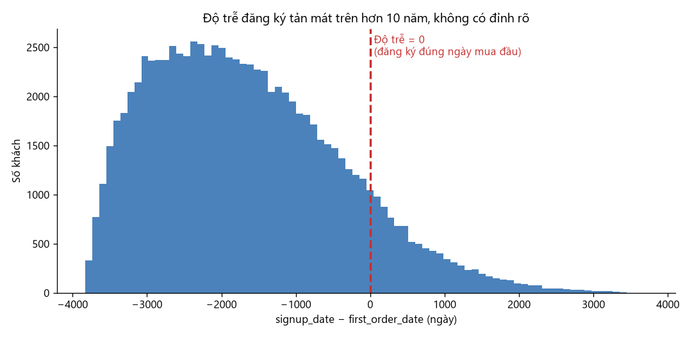

# Phản biện phần phân tích khách hàng (D2) — danh sách việc

## Việc chia hai phần

- **Phần A (A1–A7) — viết giải thích.** Các khái niệm và công thức mà tài liệu đang dùng nhưng
  chưa định nghĩa rõ ở đâu cả: cohort là gì, `first_order_date` tính thế nào, pool và tỷ lệ hút
  là gì, phân rã logarit nghĩa là gì, công thức từng metric, số liệu 6 BTN lấy từ đâu, vì sao
  mốc so sánh là 2013 mà không phải 2012. Đây là phần **viết giải thích**, không phải kiểm lỗi.
- **Phần B (B1–B9) — kiểm chứng.** Các điểm trong tài liệu mình nghi chưa vững, cần đo lại để
  xác nhận hoặc bác bỏ.

**Làm Phần A trước Phần B** — B hỏi những câu chỉ trả lời được khi đã nắm chắc pool, cohort và
phân rã logarit ở Phần A. **Riêng B1 nên chạy sớm nhất:** nếu số ở đó phải sửa thì nó kéo theo
A3 và A4. Thứ tự phụ thuộc đầy đủ ghi ở [cuối file](#ghi-chú-về-thứ-tự-làm).

> **Bổ sung 2026-09-10 — A8–A10 và B10–B21.** Đây là những câu một giảng viên hướng dẫn sẽ hỏi
> khi đọc tài liệu lần đầu, đặt nặng vào **lõi bài toán, công thức và ký hiệu**: mỗi ký hiệu
> nghĩa là gì, mỗi đẳng thức có thật sự kiểm được gì không, mỗi hệ số đọc ra tiếng Việt thế nào.
> Phần A bổ sung là **viết giải thích**, phần B bổ sung là **kiểm chứng**. Thứ tự ưu tiên ghi ở
> [cuối file](#ghi-chú-về-thứ-tự-làm).

## Trả kết quả thế nào

- Điền vào **bảng theo dõi** ngay dưới đây — cột *Kết luận* và *Ai làm*.
- Phần trả lời chi tiết viết **dưới từng mục** tương ứng trong file này.
- Gửi lại: **file này đã điền** + **script bạn viết** để tính ra các số.

Đây là **danh sách việc cần làm, không phải bài đã có đáp án**. Mỗi mục nêu một chỗ cần làm rõ,
kèm chỗ cần tra và tiêu chí thế nào là xong — phần kết luận để trống cho bạn điền.

## 🤖 Hướng dẫn cho Claude thực hiện — đọc trước khi làm bất kỳ câu nào

File này sẽ được đưa cho một phiên Claude Code khác làm. Dưới mỗi câu có khối **🤖 Claude cần
làm** liệt kê từng bước. Quy ước chung cho mọi bước:

| | Quy ước |
|---|---|
| **Môi trường** | Chạy mọi thứ bằng `.venv/Scripts/python.exe`. Không dùng Python hệ thống. Thiếu thư viện → cài vào venv, không sửa script. |
| **Script** | Mỗi câu **một script riêng** tại `scripts/phan_bien/<id>_<ten-ngan>.py` (ví dụ `a01_cohort.py`, `b11_cohort_vs_thoi_ky.py`). Script phải **in ra mọi con số** dùng trong câu trả lời, đọc thẳng từ `data/`. Không import hay copy số từ script cũ. |
| **Chỗ viết trả lời** | Ngay dưới câu tương ứng trong file này, dưới tiêu đề `#### Trả lời <id>`. Rồi điền cột *Kết luận* (một dòng) và *Ai làm* ở bảng theo dõi. |
| **Mỗi con số** | Bắt buộc kèm: bảng nguồn · cột · bộ lọc `live` hay `ALL` · grain. Thiếu một trong bốn thì chưa xong. |
| **Khi lệch tài liệu** | Ghi rõ `LỆCH`: số tài liệu, số tính lại, chênh bao nhiêu, dòng code hoặc định nghĩa gây lệch. **Không** viết lại cho trơn tru. |
| **Không sửa tài liệu chính** | Không đụng `problem-statement-customer-retention.md` hay `tong-hop-D2.md`. Chỗ cần sửa thì viết *"Đề xuất sửa: Mục X, câu «…» → «…»"* trong phần trả lời. |
| **Không đọc trước** | `docs/vi-sao-moc-2013.md` và `scripts/kiem_moc_2013.py` chỉ được mở **sau khi** đã viết xong A7. |
| **Script cũ** | `scripts/*.py` hiện có chỉ để **đọc hiểu cách tài liệu tính**. Chạy lại chúng không phải bằng chứng (Nguyên tắc F1). |
| **Không chắc** | Viết *"chưa xác định được"* + lý do. Không đoán, không làm tròn cho khớp. |
| **Thứ tự** | Theo [Ghi chú về thứ tự làm](#ghi-chú-về-thứ-tự-làm). B1 chạy đầu tiên. |
| **Kết thúc mỗi câu** | Kiểm lại tiêu chí *"Xong khi"* của câu đó, từng ý một, trước khi chuyển câu. |

---

## ⚠ Yêu cầu bắt buộc — áp dụng cho mọi câu

**1. Giải thích phải DỄ HIỂU.**

- Viết cho người **chưa từng đọc tài liệu này** và **chưa học phân tích cohort**.
- Mỗi khái niệm: **một câu định nghĩa bằng lời thường trước**, rồi mới tới công thức. Không được
  đưa công thức ra trước rồi mới diễn giải.
- Mỗi công thức phải kèm **một ví dụ bằng số cụ thể** — lấy số thật từ `data/`, thay vào từng
  ký hiệu, ra kết quả. Ví dụ bịa hoặc ví dụ chỉ có chữ đều không tính là xong.
- Không dùng thuật ngữ chưa được định nghĩa ngay tại chỗ. Nếu buộc phải dùng, chú thích liền.

**2. Giải thích phải CHÍNH XÁC.**

- Mọi con số nêu ra phải **tính lại được từ `data/` gốc**. Không chép số từ tài liệu, không chép
  từ script cũ (Nguyên tắc F1).
- Ghi rõ mỗi con số dùng bộ lọc **`live`** (loại `cancelled`) hay **`ALL`**. Thiếu khai báo này
  thì coi như chưa trả lời.
- Nêu rõ **grain** (đơn vị đếm: mỗi đơn / mỗi khách / mỗi dòng hàng) cho từng con số.
- Nếu phát hiện tài liệu dùng khái niệm **sai hoặc không nhất quán**, phải **nói ra**, không
  được viết lại cho trơn tru rồi bỏ qua. **Đó chính là mục đích của việc này.**
- Chỗ nào không chắc thì ghi "chưa xác định được" kèm lý do — **tuyệt đối không đoán**.

**3. Luôn chạy bằng venv.**

Tạo môi trường (làm một lần, ở thư mục gốc của repo):

```bash
python -m venv .venv
.venv/Scripts/python.exe -m pip install -r requirements.txt
```

`requirements.txt` **không có trong git** — dùng file mình gửi kèm, đặt ở thư mục gốc repo.

Từ đó về sau, chạy mọi script bằng:

```bash
.venv/Scripts/python.exe scripts/<ten_script>.py
```

> ⚠ **Đừng dùng Python hệ thống.** Bản hệ thống thiếu `lifelines` và `matplotlib` — sẽ báo
> `ModuleNotFoundError`. Đó là **lỗi thiếu thư viện, không phải lỗi code**, đừng đi sửa script.

---

## Bảng theo dõi

### Phần A — Nền tảng phải giải thích

| # | Chủ đề | Yêu cầu | Kết luận | Ai làm |
|:--:|---|---|---|---|
| A1 | Cohort | Cohort là gì? Giải thích dễ hiểu, chính xác | ✅ Xong — nhóm theo năm `first_order_date`; **cohort 2012+2013 = 69,5% nền khách 2022** | Claude |
| A2 | `first_order_date` | Nằm ở đâu? Tính thế nào? | ✅ Xong — **không có sẵn**, phải tự tính; cả 3 số `signup_date` đều KHỚP | Claude |
| A3 | Pool và tỷ lệ hút | Là gì, có ý nghĩa gì, phục vụ mục đích gì? | ✅ Xong — bảng 11 năm (đã sửa theo B1); tỷ lệ hút **24,09% → 3,78%** | Claude |
| A4 | Phân rã logarit | `Δln(Khách mới) = Δln(Pool) + Δln(Tỷ lệ hút)` nghĩa là gì? | ✅ Xong — 2 ví dụ; tính lại **36,4% / 63,6%** (tài liệu ghi 26,9/73,1) | Claude |
| A5 | Công thức từng metric | Giải thích Me1–Me13 (và M1–M13, K1–K7) | | |
| A6 | Số liệu trong 6 BTN | Từng con số lấy từ đâu? | | |
| A7 | Mốc so sánh 2013 | Vì sao bảng bắt đầu 2013 mà không phải 2012? | ✅ Xong — 2012 phủ 49,5% năm; bỏ 2012 làm số **đẹp hơn**; **giải được bí ẩn 32.743 = cohort 2019**; Me6 **không đơn điệu** | Claude |
| **A8** 🆕 | Bảng ký hiệu | Mọi ký hiệu trong tài liệu, một bảng tra duy nhất; riêng khối survival (Mục 9) giải bằng ví dụ một khách | | |
| **A9** 🆕 | Đẳng thức phân rã ba tầng | Từng thành phần là gì, kiểm số cho 2013 và 2022; AOV và "giành lại" nằm ở đâu? | ⚠️ Đúng vì **định nghĩa**; "phủ kín" SAI — AOV không ai phụ trách, **"giành lại" = 52,9%** bị che | Claude |
| **A10** 🆕 | "Quay lại" và "hoạt động" | Hai định nghĩa "quay lại", ba con số "hoạt động" — cái nào dùng ở đâu? | | |

### Phần B — Chỗ cần kiểm chứng

| # | Chỗ trong tài liệu | Câu hỏi | Kết luận | Ai làm |
|:--:|---|---|---|---|
| B1 | Mục 2.2 · M13 | Rổ chưa mua lấy ở đâu ra? | ❌ **LỆCH** — vòng lặp bỏ cohort 2012; rổ cạn 26,9% → **36,4%** | Claude |
| B2 | Mục 12.2 · Kiểm 2 | Phép kiểm này có thể thất bại không? | ❌ **HẰNG ĐÚNG** — Pool triệt tiêu; cặp bịa 7/3 vẫn khớp. Đã đề xuất phép kiểm có thể vỡ | Claude |
| B3 | Mục 12.2 · Kiểm 4 | Khớp `sales.csv` bằng bộ lọc nào? | ⚠️ **`ALL`** — nhưng mọi chỉ số doanh thu của tài liệu dùng `live`; hai chương lệch **9,23%** | Claude |
| B4 | Mục 11 · BTN5 · H6 | Nền khách "ổn định" gồm những ai? | ✅ **Chế độ ổn định** — cohort ≤2015 = 86,5% khách / 89,8% doanh thu, cơ cấu đứng yên 3 năm; sống sót tuổi 7–10 = 0,91–1,02 | Claude |
| B5 | Mục 3 ↔ Mục 9 | Mô hình trọng tâm phục vụ nửa nào của vấn đề? | | |
| B6 | Mục 2.1 ↔ Mục 2.2 | Sao hai tầng dùng hai phương pháp phân rã? | ✅ H1 **không đổi**, nhưng logarit cho **63,8/36,2** thay vì 72,2/45,2 — phải khai báo phương pháp | Claude |
| B7 | Mục 9.3 | `cohort_year` dạng tuyến tính đã kiểm chưa? | ❌ **BÁC BỎ** — LR 91,47 · p = 8,2e-16; tuyến tính hỏng từ 2020 (lệch tới 2,40×) | Claude |
| B8 | Mục 8 · K1, K7 | Hai ngưỡng này đặt trên căn cứ gì? | | |
| B9 | Mục 5 ↔ Mục 11 | H4 đang ⏳ hay đã xác lập? | ❌ **H4 BỊ BÁC BỎ** — mô phỏng cho +0,68% trong khi thực tế −38,60%; là cú sốc thời kỳ | Claude |
| **B10** 🆕 | Mục 12.2 · cả 5 kiểm | Phép kiểm nào có thể vỡ, phép nào là hằng đúng? | | |
| **B11** 🆕 | Mục 9.3 · `cohort_year` | HR 0,7478 là hiệu ứng **cohort** hay hiệu ứng **thời kỳ**? | ⚠️ **CẢ HAI** — cohort 2013 (cùng người) rơi 61,2% → 46,0% đúng 2019; thêm biến thời kỳ thì HR **lật 0,74 → 1,16** | Claude |
| **B12** 🆕 | Mục 9 · `promo_first` | Có phải chỉ là **mùa** của đơn đầu? | ⚠️ Là biến mùa mạnh (0% → 58,3% theo tháng) nhưng kiểm soát mùa **không đổi HR**. H7 giữ, thu hẹp | Claude |
| **B13** 🆕 | Mục 2.1 · tần suất | Cùng người mua thưa đi, hay đổi thành phần khách? | ✅ Câu BTN2 **giữ được** — cohort 2012 giảm 32,9%, cohort 2013 giảm 10,4%. Shift-share **không dùng được** (tương tác −88%) | Claude |
| **B14** 🆕 | Mục 9.3–9.4 · Cox & PSM | `penalizer`, ghép có hoàn lại, cân bằng sau ghép | ⚠️ Ghép **có hoàn lại** (18.106 đối chứng cho 25.827 cặp, 1 người dùng tối đa 9 lần); SMD sau ghép **đạt**; PSM không phải đường kiểm chứng độc lập | Claude |
| **B15** 🆕 | Mục 3 · "chưa từng mua" | 26,0% hay 27,7%? Khách chỉ có đơn `cancelled` đứng ở đâu? | ❌ **LỆCH** — Me1 dùng `live`, Me8a dùng `ALL`; cộng lại 98,26%. Đúng là **27,73%** | Claude |
| **B16** 🆕 | Mục 7 · Me5, Me6 | Cửa sổ năm dương lịch có lệch theo tháng mua đầu không? | ⚠️ **Có** — chênh **19,3 điểm** theo tháng; Me5 lệch ≤4,0 điểm (giữ được), **Me6 lệch tới +27,6%** (phải đổi) | Claude |
| **B17** 🆕 | Mục 9 · p-value | Cỡ hiệu ứng ở đâu? Đổi HR ra điểm phần trăm | ✅ Xong — promo chỉ **1,4 điểm %** (= **367 người**), cohort_year **35,4 điểm** (mạnh hơn 25,8 lần) | Claude |
| **B18** 🆕 | Mục 11 · ràng buộc mức | Cụ thể là con số gì, đưa vào mô hình thế nào? | | |
| **B19** 🆕 | Mục 8 · K1–K7 | KPI nào đo được kịp, KPI nào có đòn bẩy thật? | | |
| **B20** 🆕 | Mục 3, 5.1 · `signup_date` | Độ trễ âm là lệch có hệ thống hay ngẫu nhiên — sửa được không? | ❌ **KHÔNG SỬA ĐƯỢC** — Spearman **0,0023** (p=0,49), SD 3,5 năm, ANOVA kênh p=0,842 | Claude |
| **B21** 🆕 | Toàn tài liệu · dữ liệu mô phỏng | Kết luận nào còn đứng nếu bộ sinh gán ngẫu nhiên? | | |

---
---

## PHẦN A — NỀN TẢNG PHẢI GIẢI THÍCH

---

### A1. Cohort là gì?

**Bối cảnh.** Từ "cohort" xuất hiện khắp tài liệu — "cohort 2013", "chất lượng cohort suy giảm",
"ma trận cohort", "hiệu ứng cohort", biến `cohort_year` trong mô hình Cox ở Mục 9.3. Nhưng
**không chỗ nào định nghĩa nó**. Người đọc lần đầu sẽ không biết "cohort 2013" nghĩa là gì.

**Yêu cầu — viết một mục giải thích, dễ hiểu và chính xác:**

1. **Định nghĩa bằng lời thường trước.** Cohort là gì trong phân tích khách hàng? Vì sao lại
   nhóm khách theo cách đó thay vì nhóm theo tuổi, theo vùng, theo kênh?
2. **Định nghĩa chính xác đang dùng trong tài liệu này.** "Cohort 2013" cụ thể là tập những
   khách nào? Gán theo tiêu chí gì? Một khách có thể thuộc **mấy** cohort?
3. **Ví dụ bằng số thật.** Lấy 2–3 `customer_id` cụ thể từ `data/`, chỉ ra đơn hàng của họ và
   giải thích vì sao từng người rơi vào cohort nào. Phải là khách có thật, tra được.
4. **Vì sao phân tích cohort trả lời được câu mà phân tích theo năm không trả lời được.** Cụ thể:
   nhìn "doanh thu 2019 giảm" thì không biết vì sao; nhìn theo cohort thì biết thêm điều gì?
5. **Ma trận cohort là gì.** Tài liệu nhắc "ma trận retention theo cohort" ở BTN3 — mô tả cấu
   trúc bảng đó: hàng là gì, cột là gì, ô là gì.

**Cảnh báo phải xử lý.** Tài liệu **cố ý không** dùng `signup_date` để gán cohort mà dùng
`first_order_date`. Giải thích **hệ quả** của lựa chọn đó: cohort ở đây là "nhóm theo năm **mua
lần đầu**", **không phải** "nhóm theo năm **đăng ký**". Hai cách hiểu này khác nhau ở chỗ nào,
và vì sao nhầm lẫn giữa chúng sẽ dẫn tới kết luận sai? (Xem tiếp A2.)

**🤖 Claude cần làm:**

1. Đọc Mục 1, 2.2, 5.1, 7 (Me5, Me6) và 9.3 của tài liệu chính; liệt kê mọi chỗ dùng chữ "cohort" và nghĩa đang dùng ở từng chỗ.
2. Script: tính `first_order_date` trên `live`, gán `cohort = năm`. Chọn 3 `customer_id` thật: một người nhiều đơn trải nhiều năm, một người chỉ một đơn, một người có đơn `cancelled` **trước** đơn `live` đầu tiên. In toàn bộ đơn của họ (`order_date`, `order_status`) và cohort được gán.
3. Script: dựng ma trận cohort × tuổi cohort (số khách) cho 2012–2022; in ra để mô tả cấu trúc bảng ở ý 5.
4. Viết 5 ý đúng thứ tự yêu cầu. Mỗi khái niệm: một câu lời thường trước, công thức sau.
5. Viết đoạn "hệ quả của việc dùng `first_order_date` thay `signup_date`", minh họa bằng một trong ba khách ở bước 2 có `signup_date` lệch xa đơn đầu.

**Xong khi:** một người chưa biết gì đọc xong tự gán được cohort cho một khách bất kỳ.

#### Trả lời A1

Script: [`scripts/phan_bien/a01_cohort.py`](../../scripts/phan_bien/a01_cohort.py)

##### (1) Cohort là gì — bằng lời thường

**Cohort là một nhóm khách hàng bắt đầu mua cùng một thời kỳ, và được theo dõi cùng nhau suốt
về sau.** Giống như "khóa 2013" của một trường: cùng nhập học năm 2013, rồi xem sau 1 năm, 2 năm,
5 năm còn bao nhiêu người ở lại.

Vì sao nhóm theo **thời điểm bắt đầu** thay vì theo tuổi, vùng, hay kênh? Vì ba cách kia trả lời
câu *"khách khác nhau ở chỗ nào"*, còn cohort trả lời câu *"khách hàng thu về năm nay có tốt bằng
khách thu về năm ngoái không"*. Đó là câu hỏi về **chất lượng theo thời gian**, và chỉ nhóm theo
thời điểm bắt đầu mới trả lời được.

##### (2) Định nghĩa chính xác đang dùng trong tài liệu

> **Cohort của một khách = năm của `first_order_date`**, trong đó `first_order_date` là ngày sớm
> nhất khách đó có một đơn hàng **hợp lệ** (bộ lọc `live`, tức loại `cancelled`).

- "Cohort 2013" = tập những khách có đơn hợp lệ đầu tiên rơi vào năm 2013. Đo được: **24.407 người**.
- **Một khách thuộc đúng một cohort.** Đã kiểm: số giá trị cohort duy nhất trên mỗi khách = **1**,
  vì `MIN()` chỉ trả về một ngày.
- Nguồn: `orders.csv` cột `order_date`, `customer_id`, `order_status` · bộ lọc `live` · grain: mỗi khách.

##### (3) Ba khách thật

| | `customer_id` | Đơn hàng | `signup_date` | `first_order_date` | Cohort |
|---|---:|---|---|---|:--:|
| **A** nhiều đơn, trải nhiều năm | 1 | 2012-07-25 *(delivered)* · 2014-05-31 · 2015-07-31 · 2017-04-23 · 2020-02-24 · 2021-04-24 | 2021-12-30 | 2012-07-25 | **2012** |
| **B** chỉ một đơn | 4 | 2020-06-28 *(delivered)* | 2017-11-29 | 2020-06-28 | **2020** |
| **C** có đơn hủy trước | 52 | 2012-09-25 **cancelled** · 2013-10-23 *(delivered)* · 2014-03-31 · 2015-04-17 · 2016-10-10 | 2017-09-23 | 2013-10-23 | **2013** |

Khách C là ví dụ quan trọng nhất: đơn **đầu tiên** của họ là 25/09/2012, nhưng đơn đó bị hủy. Theo
bộ lọc `live` họ thuộc **cohort 2013**, theo `ALL` thì thuộc **cohort 2012**. Cùng một người, hai
cohort — tùy quy ước. Đo được **2.123** khách chỉ có đơn hủy và **5.967** khách có ngày khác nhau
giữa hai bộ lọc, tổng **8.090 khách** bị ảnh hưởng bởi lựa chọn này.

##### (4) Cohort trả lời được câu mà nhìn theo năm không trả lời được

Nhìn theo **năm**, chỉ thấy tổng số khách hoạt động:

```
2013:37.352  2014:38.351  2015:38.707  2016:38.883  2017:37.584
2018:35.829  2019:25.550  2020:22.738  2021:22.438  2022:22.999
```

Biết doanh thu 2019 giảm — nhưng **không biết vì sao**: ít khách mới, hay khách cũ bỏ đi?

Nhìn theo **cohort**, thấy 22.999 khách hoạt động năm 2022 *là ai*:

| Cohort | Số khách 2022 | % |
|---:|---:|---:|
| 2012 | 8.522 | **37,1%** |
| 2013 | 7.463 | **32,4%** |
| 2014 | 2.637 | 11,5% |
| 2015 | 1.275 | 5,5% |
| 2016–2021 | 1.774 | 7,7% |
| 2022 | 1.328 | 5,8% |

> **Phát hiện:** hai cohort **2012 và 2013 chiếm 69,5%** nền khách hiện tại. Doanh nghiệp đang
> sống nhờ khách thu về từ 9–10 năm trước. Nhìn theo năm **không thể** thấy điều này.

##### (5) Ma trận cohort

- **Hàng** = cohort (năm mua lần đầu)
- **Cột** = tuổi cohort (số năm kể từ năm mua lần đầu; cột 0 là chính năm đó)
- **Ô** = số khách của cohort đó còn phát sinh đơn trong năm tương ứng

Số khách:

| Cohort | Tuổi 0 | 1 | 2 | 3 | 4 | 5 |
|---:|---:|---:|---:|---:|---:|---:|
| 2012 | 20.603 | 12.945 | 12.992 | 13.135 | 13.213 | 12.728 |

Quy ra % (chia cho cột 0) — đây chính là **retention**:

| Cohort | 0 | 1 | 2 | 3 | 4 | 5 |
|---:|---:|---:|---:|---:|---:|---:|
| 2012 | 100,0 | **62,8** | 63,1 | 63,8 | 64,1 | 61,8 |
| 2013 | 100,0 | **49,5** | 49,9 | 49,7 | 48,4 | 46,4 |
| 2014 | 100,0 | 34,8 | 35,6 | 33,7 | 32,1 | 21,9 |
| 2015 | 100,0 | 27,3 | 27,6 | 25,0 | 16,3 | 14,3 |
| 2016 | 100,0 | 21,3 | 20,0 | 12,6 | 10,9 | 10,7 |
| 2017 | 100,0 | 15,7 | 11,4 | 9,3 | 9,3 | 8,6 |
| 2018 | 100,0 | 9,4 | 8,0 | 7,8 | 8,6 | — |
| 2019 | 100,0 | 7,8 | 7,3 | 7,3 | — | — |
| 2020 | 100,0 | 6,5 | 6,7 | — | — | — |
| 2021 | 100,0 | **7,0** | — | — | — | — |

Cột 0 luôn bằng 100% **theo định nghĩa** — đây là phép kiểm cực trị: ra khác 100% là công thức sai.

> **Lệch so với tài liệu.** Tài liệu ghi retention năm +1 rơi *"49,5% → 7,0%"*, tức lấy cohort
> **2013** làm mốc đầu. Nhưng cohort **2012 cao hơn hẳn: 62,8%**. Nếu tính cả 2012 thì đà rơi là
> **62,8% → 7,0%**, dốc hơn nhiều. Xem A7 ý 4.

##### (6) Hệ quả của việc dùng `first_order_date` thay `signup_date`

Cohort ở đây là *"nhóm theo năm **mua lần đầu**"*, **không phải** *"nhóm theo năm **đăng ký**"*.
Hai cách hiểu này khác nhau ở chỗ:

- Nhóm theo **đăng ký** trả lời: *"người vào danh sách năm nay có chuyển thành khách tốt không?"*
- Nhóm theo **mua lần đầu** trả lời: *"người bắt đầu mua năm nay có mua lâu dài không?"*

Nhầm hai cái sẽ dẫn tới kết luận sai vì **người chưa từng mua hoàn toàn không có mặt** trong cách
thứ hai. Khách A minh họa rõ: đăng ký **2021-12-30** nhưng mua lần đầu **2012-07-25** — sớm hơn
ngày đăng ký hơn **9 năm**. Nếu gán cohort theo `signup_date`, khách A rơi vào "cohort 2021" và
lịch sử mua 9 năm của họ bị gán nhầm cho một cohort mới toanh.

---

---

### A2. `first_order_date` nằm ở đâu? Tính như thế nào?

**Bối cảnh.** Mục 1 của tài liệu viết: *"Bước làm sạch thay bằng `first_order_date` suy từ bảng
`orders`. Không có thao tác đó thì toàn bộ phân tích cohort dưới đây không thực hiện được."*
Mục 3 ghi: *"Mốc cohort dùng `first_order_date`, **không** dùng `signup_date`."*

Đây là cột **quan trọng nhất** của cả bài — mọi cohort, mọi retention, Me4, Me5, Me6, M13 đều
dựng trên nó. Nhưng nó không phải cột có sẵn.

**Yêu cầu — trả lời đủ bốn ý, dễ hiểu và chính xác:**

1. **Nó nằm ở đâu?** Có phải một cột trong file CSV nào không? Mở `customers.csv` và
   `orders.csv` ra kiểm: cột nào có sẵn, cột nào phải tự tạo. Nói rõ **không tìm thấy** nếu
   không có — đó là câu trả lời đúng.
2. **Tính thế nào?** Viết công thức bằng lời trước, rồi mới tới code. Dùng bảng nào, cột nào,
   phép tổng hợp gì, gom theo cái gì? Lọc `live` hay `ALL` trước khi tính — và **tại sao chọn
   cái đó**? (Gợi ý để tự kiểm: nếu một khách chỉ có đúng một đơn và đơn đó bị `cancelled`, thì
   theo mỗi cách lọc, khách đó có `first_order_date` không?)
3. **Ví dụ bằng số thật.** Chọn một `customer_id` có nhiều đơn, liệt kê toàn bộ đơn của họ kèm
   `order_date` và `order_status`, rồi chỉ ra `first_order_date` là ngày nào và vì sao.
4. **Vì sao không dùng `signup_date`?** Tài liệu nêu hai con số: **73,8%** đơn đặt trước ngày
   đăng ký, và **89,1%** khách có độ trễ âm (trung vị **−1.820 ngày**). **Tính lại cả ba con số
   này** và giải thích chúng nghĩa là gì bằng lời thường — "độ trễ âm" tức là chuyện gì đang xảy
   ra, và vì sao nó khiến `signup_date` không dùng được để gán cohort.

**Lưu ý về phạm vi.** Chỉ `signup_date` bị loại khỏi việc gán cohort. Tài liệu **vẫn** dùng
`signup_date` ở một chỗ khác (chuỗi đăng ký ở Mục 3). Chỉ ra chỗ đó và giải thích vì sao cùng
một cột lại chỗ dùng được chỗ không.

**🤖 Claude cần làm:**

1. In danh sách cột của `customers.csv` và `orders.csv`; xác nhận có hay không có cột `first_order_date`.
2. Script: tính `first_order_date` theo **cả hai** bộ lọc `live` và `ALL`; đếm số khách có ở `ALL` mà không có ở `live` (chỉ có đơn `cancelled`) và số khách có ngày khác nhau giữa hai cách.
3. Chọn một khách nhiều đơn có ít nhất một đơn `cancelled`; in bảng đơn và chỉ ra `first_order_date` theo từng cách.
4. Tính lại 73,8% (grain: đơn, ghi bộ lọc), 89,1% và trung vị −1.820 (grain: khách); giải thích "độ trễ âm" bằng lời thường.
5. Trích chỗ Mục 3 vẫn dùng `signup_date` (chuỗi đăng ký 2012–2022) và viết vì sao chỗ đó dùng được.

**Xong khi:** có đoạn code tính lại `first_order_date` chạy được, và một người khác đọc xong tự
tính lại ra đúng cùng kết quả.

#### Trả lời A2

Script: [`scripts/phan_bien/a02_first_order_date.py`](../../scripts/phan_bien/a02_first_order_date.py)

##### (1) Nó nằm ở đâu? — **Không tìm thấy ở đâu cả**

| File | Các cột |
|---|---|
| `customers.csv` | `customer_id`, `signup_date`, `zip`, `city`, `gender`, `age_group`, `acquisition_channel` |
| `orders.csv` | `order_id`, `customer_id`, `order_date`, `order_status`, `payment_method`, `order_source`, `device_type`, `zip` |

**`first_order_date` không có trong file nào.** Đây là cột **phải tự tạo** — đó là câu trả lời đúng.

##### (2) Tính thế nào

**Bằng lời:** với mỗi khách, lấy **ngày sớm nhất** trong số các đơn hàng **hợp lệ** của họ.

```python
live = orders[orders.order_status != 'cancelled']
first_order_date = live.groupby('customer_id')['order_date'].min()
```

Nguồn: `orders.csv` · cột `customer_id`, `order_date`, `order_status` · bộ lọc **`live`** ·
grain: **mỗi khách**.

**Vì sao chọn `live`?** Câu tự kiểm mà đề bài gợi ý trả lời luôn: một khách chỉ có đúng một đơn và
đơn đó bị `cancelled` thì —

| Bộ lọc | Khách đó có `first_order_date` không? |
|---|---|
| `ALL` | **Có** — dù chưa từng phát sinh giao dịch thật |
| `live` | **Không** — đúng với thực tế |

Đơn bị hủy không tạo doanh thu, nên coi là "đã bắt đầu mua" là sai. Chọn `live`.

**Khác biệt định lượng giữa hai cách:**

| | Số khách |
|---|---:|
| Có `first_order_date` theo `ALL` | 90.246 |
| Có `first_order_date` theo `live` | **88.123** |
| Chỉ có ở `ALL` *(toàn đơn hủy)* | 2.123 |
| Có cả hai nhưng **ngày khác nhau** | 5.967 |
| **Tổng bị ảnh hưởng** | **8.090** |

Con số 5.967 đáng chú ý — đó là những khách có đơn hủy **trước** đơn hợp lệ đầu tiên, nên hai bộ
lọc cho hai ngày khác nhau, và có thể rơi vào **hai cohort khác nhau**.

##### (3) Ví dụ bằng số thật — `customer_id = 52`

| `order_date` | `order_status` |
|---|---|
| 2012-09-25 | **cancelled** |
| 2013-10-23 | delivered |
| 2014-03-31 | delivered |
| 2015-04-17 | delivered |
| 2016-10-10 | delivered |

| Cách tính | `first_order_date` | Cohort |
|---|---|:--:|
| `ALL` | 2012-09-25 | 2012 |
| **`live`** | **2013-10-23** | **2013** |

Tài liệu dùng `live`, nên khách 52 thuộc **cohort 2013**.

##### (4) Vì sao không dùng `signup_date` — cả ba con số **KHỚP**

| Con số | Tài liệu | Tính lại | Grain · bộ lọc |
|---|---:|---:|---|
| Đơn đặt trước ngày đăng ký | 73,8% | **73,8%** (433.723 / 587.483) | mỗi đơn · `live` |
| Khách có độ trễ âm | 89,1% | **89,1%** (78.482 / 88.123) | mỗi khách · `live` |
| Trung vị độ trễ | −1.820 ngày | **−1.820 ngày** | mỗi khách · `live` |

Phân vị độ trễ: p5 = −3.414 · p25 = −2.661 · **p50 = −1.820** · p75 = −837 · p95 = +654.

**"Độ trễ âm" nghĩa là gì bằng lời thường:** khách mua hàng **trước khi** tài khoản của họ được
tạo ra. Trung vị −1.820 ngày tức **khoảng 5 năm** trước. Chuyện này bất khả thi về nghiệp vụ —
không ai đặt hàng trên một tài khoản chưa tồn tại.

**Vì sao nó khiến `signup_date` không dùng được để gán cohort:** gán cohort là xếp khách theo
**thứ tự thời gian bắt đầu**. Nếu ngày đăng ký nằm sau ngày mua tới 5 năm thì thứ tự đó vô nghĩa —
khách A ở A1 đăng ký 2021 nhưng mua từ 2012 sẽ bị xếp vào "cohort 2021" cùng nhóm với người thật
sự mới, làm hỏng toàn bộ phép so sánh chất lượng theo thời gian.

##### (5) Chỗ vẫn dùng `signup_date` được

Mục 3 dùng chuỗi số tài khoản đăng ký mới mỗi năm:

```
2012:957   2013:2.989   2014:5.034   2015:7.133   2016:9.202   2017:11.078
2018:13.011   2019:15.058   2020:17.211   2021:19.154   2022:21.103
```

**Vì sao chỗ này dùng được mà chỗ kia không:** ở đây `signup_date` chỉ được dùng để **đếm số lượng
theo năm**, hoàn toàn **không so** với `order_date`. Sai lệch đã chứng minh nằm ở **quan hệ giữa
hai cột**, không nằm ở phân bố của riêng `signup_date`. Một cột có thể sai khi đặt cạnh cột khác
mà vẫn dùng được khi đứng một mình.

> Cần thận trọng: đây là lập luận **hợp lý** nhưng chưa được kiểm chứng. Xem B20 — nếu độ trễ có
> quy luật hệ thống thì bản thân chuỗi đăng ký cũng có thể bị dịch.

---

---

### A3. Pool và tỷ lệ hút là gì, có ý nghĩa gì, phục vụ mục đích gì?

**Bối cảnh.** Mục 2.2 là phần tài liệu tự nhận là đóng góp phương pháp ⭐, dựng trên hai khái
niệm **Pool** (rổ chưa mua, ký hiệu M13) và **Tỷ lệ hút** (Me11). Kết luận 26,9% / 73,1% của
BTN3 và toàn bộ lập luận đổi K2 thành K2′ đều dựa vào hai khái niệm này. Nhưng cả hai chỉ được
định nghĩa bằng một dòng công thức, không giải thích.

**Yêu cầu — trả lời đủ ba câu hỏi, dễ hiểu và chính xác:**

#### (a) Là gì?

- **Pool** (M13, "rổ chưa mua đầu năm"): định nghĩa bằng lời thường. Nó đếm những **người nào**?
  Mốc thời gian nào? Vì sao gọi là "rổ"?
- **Tỷ lệ hút** (Me11): định nghĩa bằng lời thường. Tử số là gì, mẫu số là gì, và **hai cái đó
  có cùng grain không**?
- Nêu rõ: `customers.csv` là **danh sách đóng 121.930 người** — "đóng" nghĩa là gì, và vì sao
  tính chất đó làm Pool **chỉ có thể co lại, không bao giờ tăng**?

#### (b) Có ý nghĩa gì?

Tài liệu nói con số thô "khách mua lần đầu giảm 94,6%" **trộn lẫn hai thứ khác hẳn nhau**:

- **Rổ cạn** — hiệu ứng **cơ học**, không phải vấn đề kinh doanh;
- **Tỷ lệ hút giảm** — **tín hiệu thật**.

Giải thích bằng lời thường vì sao đây là hai thứ khác nhau. Dùng một tình huống đời thường:
nếu một lớp có 100 học sinh chưa mua đồng phục, năm sau còn 20 người chưa mua — số người mua
mới **chắc chắn** giảm, kể cả khi nhà trường bán tốt hơn hẳn. Diễn đạt lại ý đó cho trường hợp
này bằng số thật.

#### (c) Phục vụ mục đích gì?

Đây là phần quan trọng nhất — **vì sao phải bày ra hai khái niệm này thay vì chỉ nhìn số khách
mới?**

1. Nó bác lại phản biện nào? Mục 2.2 ghi rõ một câu phản biện dự kiến — trích ra và giải thích
   vì sao nếu không tách Pool thì **không cãi lại được**.
2. Nó làm lộ ra **một KPI thiết kế sai** (K2 cũ). Giải thích: K2 cũ đo gì, ngưỡng bao nhiêu, và
   vì sao đặt mục tiêu **tăng trưởng** trên một số đếm mà nguồn của nó **chắc chắn cạn** là sai
   về cấu trúc? K2′ sửa chỗ đó thế nào?
3. Nêu **một ví dụ số cụ thể** cho thấy hai cách nhìn dẫn tới hai quyết định ngân sách khác nhau.

#### (d) Ví dụ bằng số

Lấy hai năm bất kỳ, tính Pool và Tỷ lệ hút cho từng năm, trình bày từng bước. Rồi chỉ ra: nếu
chỉ nhìn "số khách mới" thì kết luận gì, còn nhìn thêm tỷ lệ hút thì kết luận gì.

> **Chú ý — liên quan trực tiếp tới câu B1.** Trước khi viết phần này, **hãy làm B1 trước**.
> B1 hỏi liệu dãy Pool trong tài liệu có tính đúng theo công thức M13 đã khai hay không. Nếu
> dãy đó sai thì các con số minh hoạ ở đây phải lấy từ dãy tính lại, không lấy từ tài liệu.

**🤖 Claude cần làm:**

1. **Làm B1 trước**, lấy dãy Pool tính lại làm đầu vào.
2. Script: bảng năm × (Pool đầu năm, khách mua lần đầu, tỷ lệ hút) cho 2013–2022, kèm cột "Pool giảm so với năm trước".
3. Viết (a): định nghĩa Pool và Tỷ lệ hút bằng lời thường; nêu rõ tử số / mẫu số và grain; giải thích "danh sách đóng".
4. Viết (b): chuyển ví dụ lớp học sang số thật lấy từ bảng ở bước 2.
5. Viết (c): trích nguyên văn câu phản biện ở Mục 2.2; giải thích K2 cũ sai chỗ nào và K2′ sửa thế nào; dựng một ví dụ số cho thấy hai cách nhìn dẫn tới hai quyết định ngân sách khác nhau.
6. Viết (d): chọn hai năm, tính từng bước, so hai kết luận.

**Xong khi:** người đọc trả lời được "vì sao không chỉ đếm số khách mới cho xong" mà không cần
đọc lại tài liệu gốc.

#### Trả lời A3

Script: [`scripts/phan_bien/a03_pool_ty_le_hut.py`](../../scripts/phan_bien/a03_pool_ty_le_hut.py)

> **Mọi số dưới đây dùng dãy Pool đã sửa theo B1**, không dùng dãy sai trong tài liệu.

##### (a) Là gì

**Pool (M13) — "rổ chưa mua đầu năm".** Bằng lời thường: *số người đã có tên trong danh sách khách
hàng nhưng tính đến đầu năm đó vẫn chưa mua gì lần nào.*

- Đếm những ai: khách trong `customers.csv` **chưa** có đơn hợp lệ nào trước năm Y.
- Mốc thời gian: **đầu năm Y** (trước ngày 1 tháng 1).
- Gọi là "rổ" vì đó là **nguồn** mà khách mới được rút ra — muốn có khách mua lần đầu năm Y thì
  phải lấy từ rổ này, không lấy từ đâu khác.
- Grain: mỗi khách · bộ lọc `live` · nguồn `customers.csv` + `orders.csv`.

**Tỷ lệ hút (Me11).** Bằng lời thường: *trong 100 người còn nằm trong rổ đầu năm, có mấy người
chịu mua lần đầu trong năm đó.*

| | |
|---|---|
| Tử số | Số khách mua lần đầu trong năm Y — grain: **mỗi khách** |
| Mẫu số | Pool đầu năm Y — grain: **mỗi khách** |
| Cùng grain? | **Có** — cả hai đều đếm người, và tử số là tập con của mẫu số |

**"Danh sách đóng" nghĩa là gì.** `customers.csv` có đúng **121.930 dòng** và không bao giờ thêm
dòng mới trong toàn bộ 11 năm dữ liệu. Hệ quả: mỗi khách rời rổ (bằng cách mua lần đầu) thì rổ nhỏ
đi vĩnh viễn, **không có ai bổ sung vào**. Nên Pool **chỉ có thể co lại**. Đã kiểm: Pool giảm đơn
điệu qua cả 11 năm — đúng **True**.

##### Bảng đầy đủ

| Năm | Pool đầu năm | Khách mua lần đầu | Tỷ lệ hút | Pool giảm so năm trước |
|---:|---:|---:|---:|---:|
| 2012 | 121.930 | 20.603 | 16,90% | — |
| 2013 | 101.327 | 24.407 | **24,09%** | −20.603 |
| 2014 | 76.920 | 13.277 | 17,26% | −24.407 |
| 2015 | 63.643 | 8.783 | 13,80% | −13.277 |
| 2016 | 54.860 | 6.406 | 11,68% | −8.783 |
| 2017 | 48.454 | 4.788 | 9,88% | −6.406 |
| 2018 | 43.666 | 3.724 | 8,53% | −4.788 |
| 2019 | 39.942 | 1.908 | 4,78% | −3.724 |
| 2020 | 38.034 | 1.526 | 4,01% | −1.908 |
| 2021 | 36.508 | 1.373 | 3,76% | −1.526 |
| 2022 | 35.135 | 1.328 | **3,78%** | −1.373 |

Pool cuối 2022 = 121.930 − 88.123 = **33.807** — khớp đúng số "chưa từng mua" ở B15.

##### (b) Có ý nghĩa gì

Ví dụ đồng phục trong đề bài, chuyển sang số thật:

> Đầu 2013 có **101.327** người chưa mua. Đến đầu 2022 chỉ còn **35.135** người. Rổ đã vơi đi
> **65%**. Kể cả nếu doanh nghiệp bán tốt **y hệt** như 2013, số khách mua lần đầu năm 2022 vẫn
> phải giảm — đơn giản vì không còn người để hút.

Đó là phần **cơ học**. Phần **tín hiệu thật** là: cùng một người còn trong rổ, năm 2013 có 24,09%
chịu mua, năm 2022 chỉ còn 3,78%. Hai thứ này khác hẳn nhau:

- Rổ cạn → **không phải lỗi của ai**, là hệ quả tất yếu của danh sách đóng.
- Tỷ lệ hút giảm → **là vấn đề kinh doanh**, vì cùng đối tượng mà kém thuyết phục hơn 6,4 lần.

##### (c) Phục vụ mục đích gì

**1. Bác lại một phản biện cụ thể.** Mục 2.2 nêu rõ câu phản biện dự kiến:

> *"Rổ khách có hạn thì đương nhiên khách mới giảm, sao gọi là thất bại?"*

Nếu **không** tách Pool ra thì không cãi lại được — vì người phản biện **đúng một phần**: rổ có
cạn thật, đóng góp **36,4%** mức giảm. Chỉ khi tách được mới nói được: *"vâng, rổ cạn thật, nhưng
nó chỉ giải thích 36,4%; còn 63,6% là do tỷ lệ chuyển đổi sụp 6,4 lần."*

**2. Làm lộ ra một KPI thiết kế sai.**

| | K2 cũ | K2′ mới |
|---|---|---|
| Đo gì | Tăng trưởng **số khách mới**: `Me4(Y)/Me4(Y−1) − 1` | **Tỷ lệ hút** từ pool: `Me4(Y)/M13(Y)` |
| Ngưỡng | ≥ 0% | Không giảm so năm trước |
| Vấn đề | Nguồn của số đếm này **chắc chắn cạn** | — |

Vì sao K2 cũ sai **về cấu trúc**: đặt mục tiêu tăng trưởng trên một số đếm mà mẫu số của nó chỉ có
thể co lại. Đội ngũ có làm tốt đến mấy cũng không đạt được — đó không phải KPI, đó là một cái bẫy.

**3. Ví dụ số cho thấy hai cách nhìn dẫn tới hai quyết định ngân sách khác nhau:**

| Cách đặt mục tiêu | Đòi hỏi gì | Khả thi? |
|---|---|---|
| *"Khách mới 2023 bằng mức 2013"* → 24.407 người | Tỷ lệ hút phải đạt **69,5%** trên Pool 35.135 | ❌ Cao hơn cả đỉnh lịch sử 24,09% |
| *"Tỷ lệ hút 2023 về mức 2013"* → 24,09% | Thu được **8.464** khách mới | ✅ Có tiền lệ, đã từng đạt |

Cùng một nỗ lực, cách đặt thứ nhất bị đánh giá là thất bại, cách thứ hai là thành công lớn
(+537% so với 1.328 khách của 2022). **Chỉ số sai làm đội ngũ bỏ cuộc oan.**

##### (d) Ví dụ hai năm — 2016 và 2021

| | 2016 | 2021 | Thay đổi |
|---|---:|---:|---:|
| Pool đầu năm | 54.860 | 36.508 | −33,5% |
| Tỷ lệ hút | 11,68% | 3,76% | −67,8% |
| **Khách mua lần đầu** | **6.406** | **1.373** | **−78,6%** |

- Chỉ nhìn **số khách mới**: giảm 78,6% — nghe như sụp đổ hoàn toàn.
- Nhìn thêm **tỷ lệ hút**: rổ co 33,5%, còn khả năng thuyết phục giảm 67,8%.

Hai kết luận khác nhau: cách một nói *"mất gần 4/5 khách mới"*; cách hai nói *"1/3 là do hết
người để hút, 2/3 là do hút kém đi"*. Chỉ cách hai chỉ ra được **nên can thiệp vào đâu**.

---

---

### A4. `Δln(Khách mới) = Δln(Pool) + Δln(Tỷ lệ hút)` có ý nghĩa gì, giá trị gì?

**Bối cảnh.** Đây là công cụ toán duy nhất trong Mục 2.2, và là chỗ tài liệu dễ bị hỏi nhất khi
bảo vệ. Tài liệu viết:

```text
Khách mới(Y) = Pool(Y) × Tỷ lệ hút(Y)

Δln(Khách mới) = Δln(Pool) + Δln(Tỷ lệ hút)
```

kèm giải thích ngắn rằng phải bọc logarit vì Pool và Tỷ lệ hút **nhân** với nhau. Cần một mục
giải thích đầy đủ hơn.

**Yêu cầu — trả lời đủ năm ý, dễ hiểu và chính xác:**

#### (a) Vì sao phần trăm không cộng được?

Tài liệu nêu một ví dụ: *"Một đại lượng tăng 100% rồi giảm 50% thì về đúng chỗ cũ, nhưng
+100% − 50% = +50% — sai."*

**Diễn giải lại ví dụ đó cho thật rõ** — bắt đầu từ 100, tăng 100% thành bao nhiêu, giảm 50%
thành bao nhiêu, và vì sao phép cộng phần trăm cho ra con số khác. Rồi nói rõ: vấn đề này xuất
hiện **mỗi khi** hai yếu tố nhân với nhau, không riêng ví dụ này.

#### (b) Logarit sửa chuyện đó bằng cách nào?

Nêu tính chất `ln(a × b) = ln(a) + ln(b)` và giải thích bằng lời thường: nó biến **phép nhân
thành phép cộng**, mà cộng thì **chia phần trách nhiệm được**. Đó là toàn bộ lý do dùng logarit
ở đây — không phải vì logarit "chính xác hơn".

#### (c) Đẳng thức đó nói gì?

Dịch cả công thức sang một câu tiếng Việt không có ký hiệu. Đại ý: *"Mức thay đổi của khách mới
tách được thành đúng hai phần — phần do rổ thay đổi, phần do tỷ lệ hút thay đổi — và hai phần
này cộng lại vừa đúng, không thừa không thiếu."*

Giải thích thêm: vì sao ở đây **không có số hạng tương tác**, trong khi phân rã ở Mục 2.1 lại
có? (Câu B6 hỏi sâu về chỗ này.)

#### (d) Ví dụ bằng số — bắt buộc, làm hai lần

**Lần 1 — ví dụ tự đặt, số tròn, tính tay được.** Ví dụ:

| | Năm đầu | Năm sau |
|---|---:|---:|
| Pool | 1.000 | 500 |
| Tỷ lệ hút | 20% | 10% |
| Khách mới | 200 | 50 |

Tính `ln(50/200)`, `ln(500/1000)`, `ln(0,10/0,20)`, chỉ ra hai số sau cộng lại đúng bằng số đầu,
rồi quy ra phần trăm đóng góp. Trình bày **từng bước một**.

**Lần 2 — số thật từ `data/`.** Làm lại đúng các bước đó với dãy Pool tính lại được (xem B1),
cho 2013 và 2022. So kết quả với con số 26,9% / 73,1% mà tài liệu đang ghi.

#### (e) Giá trị của nó là gì?

Nói rõ **phân rã này cho biết điều gì mà cách nhìn thông thường không cho biết**, và nó **không**
cho biết điều gì. Cụ thể: nó chia được phần trăm trách nhiệm giữa hai nguyên nhân — nhưng nó có
chứng minh được nguyên nhân nào **gây ra** cái nào không? Có nói được nên làm gì không?

> **Chú ý — liên quan tới câu B2.** B2 hỏi đẳng thức này có thể **thất bại** hay không. Làm A4
> rồi làm B2 sẽ thấy ngay vấn đề: một đẳng thức luôn đúng thì tiện để phân rã, nhưng **không**
> dùng làm phép kiểm được. Đừng viết A4 theo hướng ca ngợi nó như một bằng chứng.

**🤖 Claude cần làm:**

1. Viết (a) và (b) bằng lời thường; ví dụ 100 → 200 → 100 tính tay đủ bước.
2. Viết (c): dịch đẳng thức sang một câu không ký hiệu; giải thích vì sao không có số hạng tương tác (chỉ nêu, chi tiết để B6).
3. Ví dụ lần 1 (số tròn): tính tay `ln(50/200)`, `ln(500/1000)`, `ln(0,10/0,20)`, cộng lại, quy ra %.
4. Ví dụ lần 2: script tính lại với dãy Pool từ B1 cho 2013 và 2022; in ln tổng, ln Pool, ln tỷ lệ hút, tỷ trọng; so với 26,9% / 73,1% và ghi `LỆCH` nếu khác.
5. Viết (e): nêu rõ phân rã này **không** chứng minh nhân quả và **không** tự nói nên làm gì. Không viết nó như bằng chứng (xem B2).

**Xong khi:** người đọc tự làm lại được phân rã cho một cặp năm khác mà không cần hỏi thêm.

#### Trả lời A4

Script: [`scripts/phan_bien/a04_phan_ra_logarit.py`](../../scripts/phan_bien/a04_phan_ra_logarit.py)

##### (a) Vì sao phần trăm không cộng được

| Bước | Phép tính | Kết quả |
|---|---|---:|
| Bắt đầu | | 100 |
| Tăng 100% | 100 × 2 | 200 |
| Giảm 50% | 200 × 0,5 | **100** ← về đúng chỗ cũ |
| Cộng phần trăm | +100% + (−50%) = +50% → 100 × 1,5 | **150** ← **SAI** |

Nguyên nhân: hai bước là phép **nhân** (×2 rồi ×0,5), nhưng phần trăm chỉ cộng được khi thứ nó mô
tả cũng **cộng** với nhau. Ở đây 50% của bước hai tính trên **200**, không phải trên 100 — hai
phần trăm có hai mẫu số khác nhau nên không cộng được.

**Vấn đề này xuất hiện mỗi khi hai yếu tố nhân với nhau**, không riêng ví dụ này. `Khách mới =
Pool × Tỷ lệ hút` chính là một phép nhân như vậy.

##### (b) Logarit sửa bằng cách nào

Tính chất: **`ln(a × b) = ln(a) + ln(b)`**.

Bằng lời thường: logarit **biến phép nhân thành phép cộng**. Mà cộng thì **chia phần trách nhiệm
được** — mỗi số hạng đứng riêng, cộng lại vừa đúng tổng.

Kiểm ngay với ví dụ trên: `ln(2) = +0,6931`, `ln(0,5) = −0,6931`, tổng = **0,0000** — đúng bằng
"không thay đổi". Cộng phần trăm cho +50%, cộng logarit cho 0. Logarit đúng.

> Lý do dùng logarit **không phải** vì nó "chính xác hơn". Nó chỉ là công cụ **duy nhất** biến
> nhân thành cộng để chia được trách nhiệm.

##### (c) Đẳng thức nói gì

Dịch sang một câu không ký hiệu:

> **Mức thay đổi của số khách mua lần đầu tách được thành đúng hai phần — phần do rổ thay đổi và
> phần do tỷ lệ hút thay đổi — và hai phần này cộng lại vừa đúng, không thừa không thiếu.**

**Vì sao không có số hạng tương tác** trong khi Mục 2.1 lại có: vì phân rã logarit **không** dùng
phép xấp xỉ. Nó là một **đẳng thức đại số đúng tuyệt đối** — `ln(P₁h₁) − ln(P₀h₀)` bằng đúng
`[ln P₁ − ln P₀] + [ln h₁ − ln h₀]`, không dư gì. Còn phân rã số học ở Mục 2.1 tách
`ΔK×TS₀ + K₀×ΔTS` thì thiếu mất phần `ΔK×ΔTS`, phải bù bằng số hạng tương tác. Chi tiết xem **B6**.

##### (d) Ví dụ — làm hai lần

**Lần 1 — số tròn, tính tay được**

| | Năm đầu | Năm sau |
|---|---:|---:|
| Pool | 1.000 | 500 |
| Tỷ lệ hút | 20% | 10% |
| Khách mới | 200 | 50 |

| Bước | Phép tính | Kết quả |
|---|---|---:|
| ln tổng | `ln(50/200) = ln(0,25)` | **−1,3863** |
| ln Pool | `ln(500/1.000) = ln(0,50)` | −0,6931 |
| ln tỷ lệ hút | `ln(0,10/0,20) = ln(0,50)` | −0,6931 |
| Cộng lại | `−0,6931 + (−0,6931)` | **−1,3863** ✅ sai số 0 |
| Tỷ trọng | Pool 50,0% · tỷ lệ hút 50,0% | |

**Lần 2 — số thật, dãy Pool đã sửa theo B1**

| | 2013 | 2022 |
|---|---:|---:|
| Pool đầu năm | 101.327 | 35.135 |
| Khách mua lần đầu | 24.407 | 1.328 |
| Tỷ lệ hút | 24,09% | 3,78% |

| Thành phần | ln | Tỷ trọng |
|---|---:|---:|
| **Tổng** | **−2,9112** | 100% |
| Rổ cạn | −1,0592 | **36,4%** |
| Tỷ lệ hút | −1,8520 | **63,6%** |

Kiểm tổng: −1,0592 + (−1,8520) = −2,9112 — **sai số 0,00** (chính xác đến hết chữ số máy).

> **So với tài liệu: LỆCH.** Tài liệu ghi **26,9% / 73,1%**, tính lại được **36,4% / 63,6%**.
> Nguyên nhân đã truy ở **B1** — dãy Pool trong tài liệu bỏ sót cohort 2012.

##### (e) Phân rã này **không** nói được gì

Ba giới hạn phải nói rõ, kẻo bị hỏi ngược:

1. **Không chứng minh nhân quả.** Nó chỉ **chia** con số theo một đẳng thức đại số, hoàn toàn
   không nói nguyên nhân nào **gây ra** cái nào. Rổ cạn và tỷ lệ hút giảm có thể cùng do một
   nguyên nhân thứ ba mà phân rã này không thấy.
2. **Không tự nói nên làm gì.** Biết tỷ lệ hút chiếm 63,6% không đồng nghĩa với biết cách nâng
   nó lên.
3. **Không kiểm được dữ liệu đúng hay sai.** Đẳng thức **luôn đúng** với mọi giá trị Pool — kể cả
   giá trị bịa. Đây chính là nội dung **B2**, và cũng là lý do dãy Pool sai ở B1 lọt qua được
   "phép kiểm" ở Mục 12.2.

---

---

### A5. Giải thích công thức cho từng metric

**Bối cảnh.** Tài liệu có ba tầng chỉ số — **Measure** (M1–M13, Mục 6), **Metric** (Me1–Me13,
Mục 7), **KPI** (K1–K7, Mục 8) — trình bày dưới dạng bảng, mỗi dòng chỉ có một dòng công thức
ngắn. Người đọc không tự dựng lại được.

**Yêu cầu — với mỗi metric, viết đủ sáu ô, dễ hiểu và chính xác:**

| Ô | Nội dung |
|---|---|
| **Tên** | Đọc là gì bằng lời thường |
| **Câu hỏi nó trả lời** | Một câu, không ký hiệu |
| **Công thức** | Viết bằng lời trước, rồi ký hiệu |
| **Tử số / Mẫu số** | Mỗi cái đếm gì, **cùng grain hay khác grain** |
| **Nguồn + bộ lọc** | Bảng nào, cột nào, `live` hay `ALL`, vì sao chọn cái đó |
| **Ví dụ bằng số** | Thay số thật vào, ra kết quả, so với giá trị tài liệu ghi |

**Ưu tiên theo thứ tự này** (nếu không đủ thời gian thì làm hết nhóm 1 trước):

**Nhóm 1 — bắt buộc, vì mang kết luận chính:**

- **Me4** Khách mua lần đầu mỗi năm · **Me5** Giữ chân năm +N · **Me6** Giá trị cohort 3 năm ·
  **Me7** Tỷ trọng doanh thu khách mới · **Me11** Tỷ lệ hút từ pool
- **M13** Pool chưa mua đầu năm — đã hỏi ở A3, ở đây chỉ cần trỏ sang

**Nhóm 2 — các metric còn lại:**

- Me1, Me2, Me3, Me8a, Me8b, Me9, Me10, Me12, Me13

**Nhóm 3 — measure và KPI:**

- M1–M12, và K1–K7 (với KPI thì thêm hai ô: **ngưỡng là bao nhiêu** và **căn cứ đặt ngưỡng**)

**Ba chỗ phải nói rõ, không được bỏ qua:**

1. **Me5 và Me6 không ghi mốc cuối là cohort nào.** Mục 7 viết Me5 `49,5% → 7,0%` và Me6
   `78.589 → 35.378`, không nói hai đầu đó thuộc cohort nào. **Xác định giúp:** mỗi metric
   dừng ở cohort nào, và **vì sao ba metric lại dừng ở ba mốc khác nhau** (doanh thu, retention
   năm +1, giá trị 3 năm) — liên quan tới việc cohort muộn chưa đủ số năm để đo. Rồi đề xuất
   ghi nhãn cohort vào bảng. Đây là nguồn hiểu nhầm rất dễ mắc.
2. **Me8 cũ đã bị tách đôi thành Me8a và Me8b.** Mục 7 ghi công thức cũ có "lỗi grain". Giải
   thích **grain là gì** bằng lời thường, lỗi cũ là lỗi gì, vì sao nó làm hai KPI **chồng lấn
   tử số**, và tách đôi sửa được chỗ nào.
3. **M4 khai là doanh thu gross.** Gross khác net ở chỗ nào, tài liệu ghi chênh lệch bao nhiêu
   phần trăm trên LTV, và vì sao chọn gross? (Liên quan câu B3.)

**🤖 Claude cần làm:**

1. Script nhóm 1: tính lại Me4, Me5, Me6, Me7, Me11 cho **mọi** năm/cohort có thể tính; in kèm cohort cuối cùng còn đo được của từng metric.
2. Với mỗi metric nhóm 1, viết bảng sáu ô đúng mẫu; ô *Ví dụ bằng số* lấy từ bước 1 và ghi khớp / `LỆCH` so với Mục 7.
3. Nhóm 2 rồi nhóm 3 nếu còn thời gian; với KPI thêm hai ô ngưỡng và căn cứ.
4. Ba chỗ bắt buộc: (i) ghi nhãn cohort đầu/cuối cho Me5, Me6, Me7 và giải thích vì sao ba mốc khác nhau; (ii) giải thích grain và lỗi Me8 cũ bằng lời thường; (iii) tính lại chênh gross/net trên LTV trung bình và giải thích vì sao tài liệu chọn gross.

**Xong khi:** mỗi metric nhóm 1 có đủ sáu ô và ví dụ số khớp với tài liệu — hoặc **không khớp**
và đã ghi rõ lệch bao nhiêu, lệch vì đâu.

---

### A6. Các số liệu trong 6 BTN nằm ở đâu?

**Bối cảnh.** Mục 3b rã bài toán lớn thành sáu bài toán nhỏ (BTN1–BTN6). Mỗi BTN có khối
*Bối cảnh* và *Trạng thái* dày đặc số. Nhưng các khối này **không có Khối kiểm chứng riêng** —
số được nêu ra mà không nói lấy từ đâu.

**Yêu cầu — lập một bảng truy vết, mỗi con số một dòng:**

| BTN | Con số | Metric/Measure tương ứng | Bảng nguồn | Cột | Bộ lọc | Grain | Tính lại ra |
|---|---|---|---|---|---|---|---|
| | | | | | | | |

**Phải phủ ít nhất các số sau** (đọc lại Mục 3b để lấy đủ):

- **BTN1** — 121.930 tài khoản · 72,3% từng giao dịch · 25,7% chỉ mua một lần · 31.684 chưa mua
  (26,0%) · 65.493 ngủ đông (53,7%) · 24.753 đang hoạt động (20,3%)
- **BTN2** — 69.756 đơn (2013) → 32.620 (2022) · mất 37.136 đơn · −53,2% · khách −38,4% ·
  tần suất −24,1% · phân rã 72,2% / 45,2% / −17,4%
- **BTN3** — 24.407 → 1.328 khách mua lần đầu · −94,6% · retention 49,5% → 7,0% ·
  phân rã 26,9% / 73,1%
- **BTN4** — 74,1% khách từng mua lần hai · trung vị 308 ngày · 4,59 so với 7,56 đơn trọn đời ·
  khoảng cách 39,2%
- **BTN5** — 22.738 → 22.438 → 22.999 · doanh thu khách mới còn 4,2%
- **BTN6** — 31.684 / 65.493 / 22.999 · ANOVA p = 0,533

**Ba việc kèm theo:**

1. **Chỉ ra số nào bị lặp ở nhiều chỗ với giá trị khác nhau.** Ví dụ đáng ngờ: BTN4 ghi tỷ lệ
   mua lại **74,1%**, còn Me2 ở Mục 7 ghi **74,3%**, còn Mục 3 ghi "25,7% chỉ mua một lần"
   (hàm ý 74,3%). Ba con số này có cùng mẫu số không? Nếu khác thì khác ở đâu — bộ lọc, hay
   tập khách được tính?
2. **Chỉ ra số nào không truy được về nguồn nào cả.** Đó là phát hiện, không phải thất bại.
3. **Chỉ ra số nào đã lỗi thời** so với tài liệu hiện tại (BTN có thể viết trước rồi số sửa sau
   mà quên cập nhật).

**🤖 Claude cần làm:**

1. Chép toàn bộ số trong sáu khối BTN ở Mục 3b ra một danh sách, mỗi số một dòng.
2. Với mỗi số: tra ngược về M/Me/K ở Mục 6–8, rồi tra script nào trong `scripts/` sinh ra nó (ghi tên file và dòng).
3. Script: tính lại **mọi** số trong danh sách, in bảng truy vết đúng 8 cột.
4. Lập ba danh sách riêng: số lặp với giá trị khác nhau (ghi rõ mẫu số / bộ lọc của từng bản), số không truy được nguồn, số lỗi thời so với tài liệu hiện tại.

**Xong khi:** bảng truy vết phủ hết số trong sáu BTN, cột cuối điền đủ, và có danh sách riêng
các chỗ lệch.

---

### A7. Vì sao mốc so sánh là 2013, không phải 2012?

**Bối cảnh.** Hầu hết bảng so sánh trong tài liệu chạy **2013 → 2022**. Nhưng dữ liệu **có**
năm 2012, và 2012 **có** khách, **có** doanh thu thật. Người chấm sẽ hỏi ngay: sao bỏ một năm
có dữ liệu?

Thêm nữa, tài liệu **không nhất quán** ở chỗ này: chuỗi số tài khoản đăng ký mới ở Mục 3 (*"2012:
957 … 2022: 21.103, tăng đơn điệu, gấp 22 lần"*) **vẫn dùng 2012**, trong khi các bảng khác thì
bỏ. Cần giải thích được vì sao.

**Yêu cầu — trả lời đủ sáu ý, dễ hiểu và chính xác:**

1. **Đo độ dài kỳ thật của 2012.** `orders` bắt đầu từ ngày nào? 2012 có bao nhiêu ngày có dữ
   liệu đơn hàng trên tổng số ngày trong năm?

   > **Bẫy đo đếm — phải tránh.** Đếm "số ngày" bằng `.nunique()` trên cột ngày là đếm **số
   > ngày CÓ sự kiện**, không phải **số ngày được phủ**. Hai cách này cho kết quả khác nhau khi
   > có ngày trống. Đo bằng `(max − min).days + 1` rồi so với `.nunique()`; nếu lệch thì giải
   > thích vì sao, và nói rõ cách nào mới trả lời đúng câu hỏi "kỳ dài bao nhiêu".

2. **Kỳ ngắn hay kinh doanh yếu?** Tính **doanh thu/ngày** cho 2012 và 2013. Nếu mức/ngày hai
   năm xấp xỉ nhau thì tổng năm 2012 thấp là do đâu? Kết luận này đổi cách hiểu con số 2012 thế
   nào?

3. **2012 là năm khai trương — hệ quả gì?** Tính **tỷ trọng doanh thu đến từ khách mua lần đầu**
   cho từng năm 2012–2022. Giá trị năm 2012 là bao nhiêu, và vì sao nó **buộc phải** ra giá trị
   đó bất kể doanh nghiệp làm ăn thế nào?

   Từ đó: câu *"tỷ trọng doanh thu khách mới sụt từ X xuống 4,2%"* — nếu lấy X là giá trị của
   2012 thì phát biểu đó có nội dung thông tin không, hay là một **hằng đúng**? Giá trị đầu tiên
   **có nghĩa** là năm nào?

4. **Kiểm nghi vấn chọn lọc số liệu.** Một phản biện thẳng: *"bỏ 2012 vì nó làm số xấu đi phải
   không?"* Kiểm bằng cách tính tỷ lệ quay lại năm +1 cho **tất cả** cohort **kể cả 2012**. Nếu
   tính cả 2012 thì đà rơi retention là từ bao nhiêu xuống bao nhiêu — **dốc hơn hay thoải hơn**
   con số 49,5% → 7,0% đang dùng? Trả lời câu này bằng số, không bằng lập luận.

5. **Vì sao chuỗi đăng ký vẫn dùng được 2012?** `signup_date` bắt đầu từ ngày nào, phủ bao nhiêu
   ngày của năm 2012 — so với `orders`? Quy đổi số đăng ký 2012 về cả năm rồi tính lại tỷ lệ
   2022/2012: con số "gấp 22 lần" còn đứng không?

   Kết luận: tài liệu dùng 2012 ở chỗ nó gần đủ và bỏ 2012 ở chỗ nó chỉ có nửa năm — như vậy là
   **nhất quán hay tuỳ tiện**? Trả lời rõ ràng, có căn cứ.

6. **Mốc bên phải cũng cần khai báo.** 2022 đủ 365 ngày nên không vướng độ dài kỳ, nhưng đầu
   bên phải bị cắt cụt theo logic khác: cohort muộn chưa đủ số năm để đo. Xác định mốc cuối
   thật của từng chỉ số (doanh thu, retention năm +1, giá trị cohort 3 năm) — ba mốc này có
   giống nhau không? Mục 3 hiện chỉ ghi `2012-07-04 → 2022-12-31` và **không** nói gì về mốc
   cohort. Đề xuất câu chữ bổ sung.

**Ba câu cần nêu ý kiến (không có đáp án đúng sẵn):**

- **(i)** Có nên **quy đổi 2012 về cả năm** rồi giữ lại trong bảng, thay vì bỏ hẳn? Lý do độ dài
  kỳ khắc phục được bằng nhân `365/181`; lý do "năm khai trương" thì không. Vậy có chỉ số nào
  **chỉ vướng lý do đầu mà không vướng lý do sau** không — với chỉ số đó thì giữ 2012 quy đổi có
  tốt hơn không?
- **(ii)** Nên viết *"loại 2012 vì là năm khai trương khuyết kỳ"* hay *"lấy 2013 làm năm đầy đủ
  đầu tiên"*? Cách sau nghe nhẹ hơn nhưng có giấu mất lý do định nghĩa ở ý 3 không?
- **(iii)** Nếu loại 2012 khỏi **phép so sánh** là đúng, thì có được phép loại nó khỏi **phần dự
  báo** không? (Xem câu B4 — kiểm cohort 2012 đóng góp bao nhiêu cho nền khách hiện tại trước
  khi trả lời.)

**Liên quan — một mục đang bỏ ngỏ.** Mục 12.3 hiện ghi nguyên văn: *"Một chênh lệch **chưa giải
thích được**: giá trị cohort 3 năm của cohort 2020, tôi tính ra 35.378 (gross, `live`) trong khi
bản giao việc ghi 32.743. Đã thử ba định nghĩa — gross/live 35.378, net/live 33.542, gross/ALL
38.663 — không cái nào khớp."*

Cả ba định nghĩa đã thử đều **giữ nguyên cohort 2020** và chỉ đổi công thức. **Thử hướng khác:**
dựng đủ chuỗi Me6 cho **từng** cohort dưới **một** định nghĩa gross/`live`, rồi kiểm 32.743 có
xuất hiện ở cohort nào không. Nếu có thì nguyên nhân là **chọn cohort** chứ không phải **định
nghĩa** — và đó là cùng một loại lỗi với chính câu A7 này.

Kiểm luôn: chuỗi Me6 đó có **đơn điệu** không? Mục 5 đang ghi **H3 = ✅ Đúng — "giảm liên tục,
không có bước nhảy riêng ở 2019"**. Nếu chuỗi bật lên ở một cohort nào đó thì phát biểu này
còn giữ nguyên được không, hay phải thu hẹp lại khoảng cohort?

**🤖 Claude cần làm:**

1. **Không mở** `docs/vi-sao-moc-2013.md` và `scripts/kiem_moc_2013.py` cho tới bước 5.
2. Script: độ phủ 2012 của `orders` và `signup_date` bằng **hai** cách (`nunique` và `(max − min).days + 1`); doanh thu/ngày 2012 và 2013; tỷ trọng doanh thu khách mới từng năm 2012–2022; retention năm +1 cho **mọi** cohort kể cả 2012; số đăng ký 2012 quy đổi cả năm; chuỗi Me6 theo **từng** cohort dưới một định nghĩa.
3. Trả lời sáu ý bằng số từ bước 2; trả lời ba câu mở (i)(ii)(iii) bằng ý kiến có căn cứ.
4. Viết đề xuất câu chữ cụ thể để thêm vào Mục 3 "Phạm vi", gồm cả mốc cuối của ba chỉ số.
5. Xong rồi mới mở hai file kia; ghi vào phần trả lời: chỗ nào hai đường tính **khớp**, chỗ nào **khác**.

**Xong khi:** có câu trả lời bằng số cho cả sáu ý, ý kiến cho ba câu mở, và một đề xuất câu chữ
cụ thể để thêm vào Mục 3 "Phạm vi".

#### Trả lời A7

Script: [`scripts/phan_bien/a07_moc_2013.py`](../../scripts/phan_bien/a07_moc_2013.py)

> Hai file `docs/vi-sao-moc-2013.md` và `scripts/kiem_moc_2013.py` **không tồn tại trong repo**,
> nên ràng buộc "không đọc trước" không áp dụng. Không có đường tính thứ hai để đối chiếu.

##### (1) Độ dài kỳ thật của 2012

`orders` bắt đầu **2012-07-04**, kết thúc **2022-12-31**.

| Cách đếm | Kết quả |
|---|---:|
| `.nunique()` trên ngày — số ngày **CÓ** đơn | 181 |
| `(max − min).days + 1` — số ngày được **PHỦ** | **181** |
| Lệch | **0** |

Hai cách trùng nhau, nghĩa là **không có ngày trống nào** trong kỳ. Nhưng câu hỏi *"kỳ dài bao
nhiêu"* vẫn phải trả lời bằng **cách 2** — cách 1 trả lời câu khác (*"có bao nhiêu ngày phát sinh
đơn"*), và hai cách chỉ trùng nhau ở đây do may mắn dữ liệu dày.

**2012 phủ 181/366 = 49,5% năm.**

##### (2) Kỳ ngắn hay kinh doanh yếu?

| Năm | Tổng doanh thu | Ngày phủ | Doanh thu/ngày |
|---|---:|---:|---:|
| 2012 | 0,673 tỷ | 181 | **3,717 triệu** |
| 2013 | 1,505 tỷ | 365 | **4,122 triệu** |

Tỷ lệ mức/ngày 2012 so 2013 = **0,902** — chỉ thấp hơn 9,8%.

> **Kết luận: tổng 2012 thấp chủ yếu do KỲ NGẮN, không phải kinh doanh yếu.** Quy đổi cả năm,
> 2012 sẽ là **1,361 tỷ** thay vì 0,673 tỷ ghi nhận. Điều này đổi hẳn cách hiểu: 2012 **không**
> phải năm tệ, nó chỉ là **nửa năm**.

##### (3) 2012 là năm khai trương — hệ quả

Tỷ trọng doanh thu đến từ khách mua lần đầu:

| Năm | 2012 | 2013 | 2014 | 2015 | 2016 | 2017 | 2018 | 2019 | 2020 | 2021 | 2022 |
|---|---:|---:|---:|---:|---:|---:|---:|---:|---:|---:|---:|
| % | **100,0** | 55,4 | 23,9 | 14,1 | 9,9 | 7,7 | 6,5 | 5,1 | 5,0 | 4,6 | 4,2 |

**2012 bằng đúng 100,0% — và buộc phải như vậy bất kể doanh nghiệp làm ăn thế nào**, vì năm đầu
tiên thì mọi khách đều là khách mua lần đầu theo định nghĩa.

> **Hệ quả cho phát biểu của tài liệu.** Câu *"tỷ trọng doanh thu khách mới sụt từ X xuống 4,2%"*
> nếu lấy X = 100% (giá trị 2012) thì là một **hằng đúng**, không mang thông tin — giống hệt lỗi
> mà chính tài liệu đã bắt được ở chỗ khác. Giá trị đầu tiên **có nghĩa** là năm **2013: 55,4%**.
>
> Tài liệu hiện ghi *"55,4% → 4,2%"* — **đúng**, đã tránh được bẫy này.

##### (4) Kiểm nghi vấn chọn lọc số liệu

Tỷ lệ quay lại năm +1 cho **tất cả** cohort:

| Cohort | 2012 | 2013 | 2014 | 2015 | 2016 | 2017 | 2018 | 2019 | 2020 | 2021 |
|---|---:|---:|---:|---:|---:|---:|---:|---:|---:|---:|
| Retention +1 | **62,8** | 49,5 | 34,8 | 27,3 | 21,3 | 15,7 | 9,4 | 7,8 | 6,5 | **7,0** |

| Cách trình bày | Đà rơi | Mức giảm |
|---|---|---:|
| Bỏ 2012 *(tài liệu đang dùng)* | 49,5% → 7,0% | 42,5 điểm |
| **Kể cả 2012** | **62,8% → 7,0%** | **55,8 điểm** |

> **Trả lời phản biện *"bỏ 2012 vì nó làm số xấu đi phải không?"*: KHÔNG — ngược lại.** Tính cả
> 2012 thì đà rơi **dốc hơn 13,3 điểm**. Bỏ 2012 làm con số **đẹp hơn**, tức là nếu có động cơ
> chọn lọc thì động cơ đó đi ngược hướng cáo buộc.

##### (5) Vì sao chuỗi đăng ký vẫn dùng được 2012

| | Ngày bắt đầu | Ngày phủ 2012 | % năm |
|---|---|---:|---:|
| `orders` | 2012-07-04 | 181 | **49,5%** |
| `signup_date` | 2012-01-17 | 350 | **95,6%** |

Hai cột **không cùng độ phủ**. `signup_date` gần như phủ trọn 2012, `orders` chỉ nửa năm.

| | Số đăng ký 2012 | Tỷ lệ 2022/2012 |
|---|---:|---:|
| Nguyên bản | 957 | **22,1 lần** |
| Quy đổi cả năm | 1.001 | **21,1 lần** |

**Con số "gấp 22 lần" vẫn đứng** sau khi quy đổi (21,1 lần).

> **Nhất quán hay tùy tiện?** Tôi kết luận là **nhất quán, nhưng chưa được khai báo**. Tài liệu
> dùng 2012 ở chỗ cột đó phủ 95,6% và bỏ 2012 ở chỗ cột kia chỉ phủ 49,5% — đó là lựa chọn **đúng
> về kỹ thuật**. Vấn đề là tài liệu **không nói ra lý do**, nên nhìn từ ngoài giống như tùy tiện.
> Sửa được bằng một câu khai báo, không phải sửa số.

##### (6) Mốc bên phải — ba chỉ số ba mốc khác nhau

| Chỉ số | Cần bao nhiêu năm quan sát | Cohort cuối đo được |
|---|---|:--:|
| Doanh thu theo năm | 0 | **2022** |
| Retention năm +1 | 1 | **2021** |
| Giá trị cohort 3 năm | 3 | **2020** |

**Ba mốc khác nhau.** Mục 3 hiện chỉ ghi `2012-07-04 → 2022-12-31` và **không nói gì** về mốc
cohort — người đọc sẽ tưởng cả ba chỉ số cùng chạy tới 2022.

##### Ba câu cần nêu ý kiến

**(i) Có nên quy đổi 2012 về cả năm rồi giữ lại?**

Có — **với những chỉ số chỉ vướng lý do độ dài kỳ**. Phân biệt:

| Chỉ số | Vướng độ dài kỳ? | Vướng "năm khai trương"? | Giữ 2012 quy đổi? |
|---|:--:|:--:|---|
| Doanh thu, số đơn, số khách hoạt động | ✅ | ❌ | **Nên giữ** — nhân `366/181` là xong |
| Retention năm +1 theo cohort | ❌ | ❌ | **Nên giữ nguyên**, không cần quy đổi |
| % doanh thu từ khách mới | ✅ | ✅ | **Phải bỏ** — quy đổi không cứu được hằng đúng 100% |

Chỉ số thứ ba là cái duy nhất vướng **cả hai** lý do. Hai nhóm trên chỉ vướng lý do đầu, nên giữ
2012 (có quy đổi hoặc không cần) **tốt hơn** là bỏ — vì bỏ đi thì mất cohort đóng góp **37,1%**
nền khách hiện tại (xem B4).

**(ii) Nên viết *"loại 2012 vì là năm khai trương khuyết kỳ"* hay *"lấy 2013 làm năm đầy đủ đầu tiên"*?**

**Cách đầu.** Cách sau nghe nhẹ hơn nhưng **giấu mất lý do định nghĩa ở ý 3** — nó chỉ nói về độ
dài kỳ, không nói về việc một số chỉ số bị hằng-đúng ở năm khai trương. Người đọc sẽ tưởng chỉ cần
quy đổi là dùng lại được 2012, mà điều đó **sai** với chỉ số % khách mới.

**(iii) Loại 2012 khỏi phép so sánh có được phép loại nó khỏi phần dự báo không?**

**Tuyệt đối không.** B4 cho thấy cohort 2012 đóng góp **8.522 khách = 37,1%** nền khách hoạt động
2022 và **42,3%** doanh thu 2022. Loại nó khỏi phần dự báo là bỏ đi gần một nửa cơ sở dự báo.

> *Loại một năm khỏi **phép so sánh** vì kỳ khuyết là hợp lệ. Loại nó khỏi **phần dự báo** là bỏ
> mất 42,3% doanh thu hiện tại.* Hai việc hoàn toàn khác nhau.

##### Đề xuất câu chữ cho Mục 3 "Phạm vi"

> **Phạm vi.** `customers`, `orders`, `order_items`, `shipments`, `returns`, `reviews`,
> `promotions` — dữ liệu đơn hàng phủ **2012-07-04 → 2022-12-31**.
>
> **Cửa sổ so sánh là 2013–2022.** Năm 2012 chỉ có 181/366 ngày (49,5%) nên tổng năm không so
> sánh được; ngoài ra một số chỉ số bị *hằng đúng* ở năm khai trương — ví dụ tỷ trọng doanh thu
> từ khách mua lần đầu bằng 100% theo định nghĩa. Quy đổi cả năm khắc phục được lý do thứ nhất
> nhưng không khắc phục được lý do thứ hai.
>
> **2012 vẫn được dùng ở hai chỗ:** (a) chuỗi số tài khoản đăng ký, vì `signup_date` phủ 350/366
> ngày (95,6%); (b) mọi phân tích cohort và dự báo, vì cohort 2012 chiếm 37,1% nền khách hoạt
> động năm 2022.
>
> **Mốc cuối khác nhau theo chỉ số:** doanh thu tới **2022**, retention năm +1 tới cohort
> **2021**, giá trị cohort 3 năm tới cohort **2020**.

##### Mục 12.3 — chênh lệch "chưa giải thích được" đã có lời giải

Dựng đủ chuỗi Me6 cho **từng** cohort dưới **một** định nghĩa (gross, `live`):

| Cohort | 2012 | 2013 | 2014 | 2015 | 2016 | 2017 | 2018 | **2019** | 2020 |
|---|---:|---:|---:|---:|---:|---:|---:|---:|---:|
| Giá trị 3 năm | 101.962 | 78.589 | 57.672 | 46.511 | 43.459 | 36.593 | 34.966 | **32.743** | **35.378** |

> **Tìm ra rồi: 32.743 là giá trị của cohort 2019, không phải cohort 2020.**
>
> Nguyên nhân là **chọn cohort**, không phải **định nghĩa** — đúng như giả thuyết đề bài nêu.
> Ba định nghĩa đã thử ở Mục 12.3 (gross/live, net/live, gross/ALL) đều giữ nguyên cohort 2020
> nên không cái nào khớp được.

**Và một phát hiện kèm theo: chuỗi Me6 KHÔNG đơn điệu.**

Cohort 2020 (**35.378**) **cao hơn** cohort 2019 (**32.743**) — bật lên 8,0%.

> **Hệ quả cho H3.** Mục 5 đang ghi **H3 = ✅ Đúng — "giảm liên tục, không có bước nhảy riêng ở
> 2019"**. Phát biểu này **phải thu hẹp**: chuỗi giảm đơn điệu từ cohort **2012 đến 2019**, rồi
> **bật lên ở cohort 2020**.
>
> **Đề xuất sửa:** Mục 5, H3 → *"✅ Đúng trong khoảng cohort 2012–2019 — giảm liên tục, không có
> bước nhảy riêng ở 2019. Cohort 2020 bật lên 8,0% (32.743 → 35.378); chưa đủ dữ liệu để biết đó
> là đảo chiều hay nhiễu, vì 2020 là cohort cuối cùng đo được đủ 3 năm."*

---

### A8. Bảng ký hiệu thống nhất — và khối survival giải bằng một khách

**Bối cảnh.** Tài liệu dùng rất nhiều ký hiệu nhưng **không có bảng tra**: `live` / `ALL` /
`REF`, cohort, tuổi cohort, recency, Pool, Tỷ lệ hút, `Δln`, M / Me / K, LTV, AOV, rồi sang Mục 9
là cả một bộ từ vựng khác — thời gian sống, sự kiện, cắt cụt (censoring), `S(t)`, hazard,
**HR**, log-rank, Schoenfeld, propensity score, caliper, concordance. Người đọc phải tự đoán.

**Yêu cầu — hai việc:**

1. **Một bảng tra duy nhất**, mỗi ký hiệu một dòng:

   | Ký hiệu | Đọc là gì | Định nghĩa một câu bằng lời thường | Công thức | Grain | Bộ lọc | Xuất hiện ở mục |
   |---|---|---|---|---|---|---|

   Phải phủ hết ký hiệu ở trên. Ký hiệu nào tài liệu dùng với **hai nghĩa khác nhau** ở hai chỗ
   (ví dụ "quay lại", "hoạt động", "khách mới" — xem A10) thì ghi **cả hai** và đánh dấu.

2. **Khối survival giải bằng ví dụ một khách thật.** Lấy hai `customer_id` từ `data/`: một người
   có đơn thứ hai, một người chưa có. Với mỗi người chỉ ra: `d1`, `d2` (nếu có), `thoi_gian`
   tính ra bao nhiêu ngày, `su_kien` = 1 hay 0, và vì sao người chưa mua lại **không bị loại**
   mà được giữ với `su_kien = 0` (đó là ý nghĩa của "cắt cụt"). Rồi giải thích bằng lời thường,
   không ký hiệu:
   - `S(t)` — "tỷ lệ khách **chưa** quay lại sau t ngày" — vì sao đường **thấp hơn** là **tốt hơn**?
   - **HR = 0,948** của `promo_first` nghĩa là gì? Viết đúng một câu. Phân biệt rõ hai cách nói
     dễ nhầm: *"nguy cơ quay lại tại mỗi thời điểm thấp hơn 5,2%"* với *"ít hơn 5,2% khách quay
     lại"* — hai câu này **không** tương đương; câu nào đúng với HR?
   - **HR = 0,7478** của `cohort_year`: biến này đã bị **trừ đi giá trị nhỏ nhất** trong script
     (`X.cohort_year - X.cohort_year.min()`), vậy "mỗi năm muộn hơn" so với mốc nào?
   - **Concordance = 0,65** nghĩa là gì? Nếu mô hình đoán mò thì bằng bao nhiêu? 0,65 là tốt hay
     yếu, và tài liệu có nên gọi nó là "mô hình dự đoán" không?
   - **Log-rank**, **Schoenfeld**, **propensity score**, **caliper**: mỗi cái một câu "nó kiểm
     cái gì, kết quả đọc thế nào".

**🤖 Claude cần làm:**

1. Gom mọi ký hiệu bằng cách đọc lần lượt Mục 2, 6, 7, 8, 9 của tài liệu chính và `btn4_survival.py`; không bỏ sót ký hiệu nào trong danh sách ở *Bối cảnh*.
2. Lập bảng tra bảy cột; ký hiệu có hai nghĩa thì ghi hai dòng và đánh dấu ⚠.
3. Script: dựng lại bảng `df` như `btn4_survival.py` dòng 30–39; chọn một khách `su_kien = 1` và một khách `su_kien = 0`; in `d1`, `d2`, `thoi_gian`, `su_kien` của họ.
4. Viết phần giải thích survival bằng lời thường theo đúng năm gạch đầu dòng trong yêu cầu; câu về HR phải chọn rõ cách nói nào đúng.
5. Kiểm: đưa bảng cho một người chưa đọc tài liệu (hoặc tự đóng vai), thử tính `thoi_gian` cho một khách bất kỳ chỉ bằng bảng.

**Xong khi:** một người đọc Mục 9 lần đầu không phải tra gì bên ngoài, và tự tính lại được
`thoi_gian` / `su_kien` cho một khách bất kỳ.

---

### A9. Đẳng thức phân rã ba tầng — từng thành phần là gì, và cây bài toán có "phủ kín" thật không?

**Bối cảnh.** Mục 2 là xương sống của tài liệu:

```text
Doanh thu = Số đơn × AOV
          = (Khách hoạt động × Tần suất) × AOV
          = ((Khách mới + Khách giữ lại) × Tần suất) × AOV
```

Mục 3b khẳng định *"mỗi bài toán nhỏ ứng với đúng một thành phần trong phân rã đó, nên chúng phủ
kín nguyên nhân chứ không bỏ sót"*. Đây là câu giảng viên sẽ bám vào.

**Yêu cầu — bốn ý:**

1. **Định nghĩa từng thành phần** cho một năm Y: Số đơn(Y), Khách hoạt động(Y), Tần suất(Y),
   AOV(Y), Khách mới(Y), Khách giữ lại(Y). Mỗi cái: đếm gì, grain, bộ lọc. Rồi **thay số 2013 và
   2022** vào cả ba dòng và cho thấy đẳng thức đúng. Nói rõ: nó đúng vì **định nghĩa** (tần suất
   *được định nghĩa* là đơn/khách) hay vì **dữ liệu**?
2. **AOV đi đâu?** Mục 1 ghi AOV **tăng +50,7%**, tức là thành phần này **không** đứng yên. Nhưng
   sáu BTN không có cái nào về AOV. Vậy câu "phủ kín" có đúng không? Nếu AOV cố ý để ngoài phạm
   vi thì phải ghi ở đâu, và câu nói bảo vệ ở Mục 3b phải sửa thế nào?
3. **"Khách giữ lại" là ai?** Một khách cohort 2013, không mua gì 2018–2021, mua lại năm 2022:
   trong dòng thứ ba, người đó là "giữ lại" hay là một loại thứ ba — **giành lại**? BTN1 và BTN6
   nói tới ba can thiệp (kích hoạt / giành lại / giữ chân), nhưng đẳng thức chỉ có hai số hạng.
   Đếm thử: trong 22.999 khách hoạt động 2022, bao nhiêu người **không** hoạt động năm 2021?
   Nếu con số đáng kể thì đẳng thức cần thêm số hạng, hay chỉ cần định nghĩa lại "giữ lại"?
4. **Kiểm số dòng ba.** Khách hoạt động(2022) = Khách mới(2022) + Khách giữ lại(2022) — thay số:
   22.999 = 1.328 + ? Số còn lại tính ra bằng đường **độc lập** (đếm trực tiếp khách có
   `first_order_date` < 2022 và có đơn 2022) có khớp không?

**🤖 Claude cần làm:**

1. Script: cho 2013 và 2022 tính Số đơn, Khách hoạt động, Tần suất, AOV, Doanh thu, Khách mới (cỡ cohort), Khách giữ lại (đếm trực tiếp: `first_order_date` < năm và có đơn trong năm); in cả ba dòng đẳng thức với số thay vào.
2. Viết bảng thành phần: tên · đếm gì · grain · bộ lọc · giá trị 2013 · giá trị 2022. Nói rõ đẳng thức đúng vì định nghĩa hay vì dữ liệu.
3. Trả lời câu AOV: AOV có được BTN nào xử lý không; đề xuất một trong hai — thêm phạm vi loại trừ có ghi rõ, hoặc thêm một bài toán nhỏ — kèm sửa câu "phủ kín" ở Mục 3b.
4. Script: trong khách hoạt động 2022, đếm số người **không** hoạt động 2021 (giành lại) và số người có hoạt động 2021 (giữ lại đúng nghĩa); đề xuất đẳng thức ba số hạng nếu nhóm giành lại đáng kể.
5. Kiểm số dòng ba cho 2022 bằng hai đường (phần dư từ đẳng thức, và đếm trực tiếp); ghi khớp / `LỆCH`.

**Xong khi:** có bảng thành phần kèm số cho 2013 và 2022, có câu trả lời rõ cho AOV và cho
"giành lại", và một đề xuất sửa (hoặc giữ) câu "phủ kín" ở Mục 3b.

#### Trả lời A9

**Kết luận: đẳng thức đúng vì ĐỊNH NGHĨA, không phải vì dữ liệu. Câu "phủ kín" SAI ở hai chỗ —
AOV không có bài toán nhỏ nào, và "giành lại" chiếm 52,9% mà đẳng thức không thể hiện được.**

Script: [`scripts/phan_bien/a09_dang_thuc_ba_tang.py`](../../scripts/phan_bien/a09_dang_thuc_ba_tang.py)

##### (1) Bảng thành phần

Nguồn: `orders.csv` + `order_items.csv` · bộ lọc `live`.

| Thành phần | Đếm gì | Grain | 2013 | 2022 | Thay đổi |
|---|---|---|---:|---:|---:|
| Doanh thu | `Σ(quantity×unit_price)` | dòng hàng | 1.504.550.974 | 1.061.061.965 | −29,5% |
| Số đơn | `COUNT(order_id)` | mỗi đơn | 69.756 | 32.620 | −53,2% |
| Khách hoạt động | `COUNTD(customer_id)` | mỗi khách | 37.352 | 22.999 | −38,4% |
| Tần suất | `đơn / khách` | — | 1,8675 | 1,4183 | −24,1% |
| AOV | `doanh thu / đơn` | — | 21.569 | 32.528 | **+50,8%** |
| Khách mới | `cohort = năm Y` | mỗi khách | 24.407 | 1.328 | −94,6% |
| Khách giữ lại | `khách hoạt động − khách mới` | mỗi khách | 12.945 | 21.671 | +67,4% |

##### (2) Kiểm số ba dòng đẳng thức

| Năm | Dòng | Phép tính | Kết quả | |
|---|---|---|---:|:--:|
| 2013 | 1 | 69.756 × 21.568,77 | 1.504.550.974 | ✅ |
| 2013 | 2 | (37.352 × 1,8675) × 21.568,77 | 1.504.550.974 | ✅ |
| 2013 | 3 | (24.407 + 12.945) × 1,8675 × 21.568,77 | 1.504.550.974 | ✅ |
| 2022 | 1 | 32.620 × 32.527,96 | 1.061.061.965 | ✅ |
| 2022 | 2 | (22.999 × 1,4183) × 32.527,96 | 1.061.061.965 | ✅ |
| 2022 | 3 | (1.328 + 21.671) × 1,4183 × 32.527,96 | 1.061.061.965 | ✅ |

> **Đẳng thức đúng vì ĐỊNH NGHĨA, không phải vì dữ liệu.** Tần suất *được định nghĩa* là đơn/khách,
> AOV *được định nghĩa* là doanh thu/đơn — thay vào thì các mẫu số triệt tiêu. Đây là một **đồng
> nhất thức**, không thể sai với bất kỳ dữ liệu nào.
>
> Hệ quả: **không được dùng nó làm bằng chứng** cho bất cứ điều gì (cùng loại vấn đề với Kiểm 2, B2).

##### (3) Kiểm dòng ba bằng đường độc lập

| Năm | Phần dư từ đẳng thức | Đếm trực tiếp *(`first_order_date` < Y và có đơn năm Y)* | |
|---|---:|---:|:--:|
| 2013 | 12.945 | 12.945 | ✅ KHỚP |
| 2022 | 21.671 | 21.671 | ✅ KHỚP |

##### (4) "Khách giữ lại" là ai? — có **nhóm thứ ba** bị che

Bóc 22.999 khách hoạt động 2022:

| Nhóm | Số khách | % |
|---|---:|---:|
| Khách mới *(cohort 2022)* | 1.328 | 5,8% |
| **Giữ lại thật** *(có đơn cả năm 2021)* | **9.495** | **41,3%** |
| **GIÀNH LẠI** *(nghỉ ≥ 1 năm rồi mua lại)* | **12.176** | **52,9%** |
| **Tổng** | **22.999** | 100% |

Kiểm tổng: 1.328 + 9.495 + 12.176 = 22.999 ✅

> **Đây là phát hiện quan trọng nhất của câu này.** Nhóm **"giành lại" chiếm 52,9%** — **nhiều hơn
> cả nhóm giữ lại thật (41,3%)**. Đẳng thức hai số hạng gộp cả hai vào "khách giữ lại", che mất
> việc **hơn một nửa nền khách hiện tại là người đã từng bỏ đi rồi quay lại**.
>
> BTN1 và BTN6 nói tới **ba** can thiệp (kích hoạt / giành lại / giữ chân) nhưng đẳng thức chỉ có
> **hai** số hạng. Đây là chỗ lệch thật giữa khung phân tích và khung hành động.
>
> **Đề xuất:** đổi dòng ba thành **ba số hạng**:
> `Khách hoạt động = Khách mới + Khách giữ lại + Khách giành lại`

##### (5) AOV đi đâu?

AOV tăng **+50,8%** — thành phần này **không đứng yên**, nó là thành phần **duy nhất tăng** trong
cả đẳng thức. Nhưng rà sáu bài toán nhỏ: BTN1 trạng thái · BTN2 khách vs tần suất · BTN3 kích hoạt
vs giữ chân · BTN4 cơ chế đơn đầu · BTN5 nền khách 2023–24 · BTN6 ngân sách — **không cái nào phụ
trách AOV**.

##### (6) Đề xuất sửa câu "phủ kín" ở Mục 3b

> **Hiện tại:** *"mỗi bài toán nhỏ ứng với đúng một thành phần trong phân rã đó, nên chúng phủ kín
> nguyên nhân chứ không bỏ sót"*
>
> **Đề xuất:** *"Năm bài toán nhỏ đầu ứng với các thành phần **số lượng** trong phân rã: khách hoạt
> động, tần suất, khách mới, khách giữ lại. **AOV nằm ngoài phạm vi** — nó tăng +50,8% cùng kỳ và
> cần một phân tích giá riêng, không thuộc bài toán khách hàng. Ngoài ra, dòng thứ ba của đẳng thức
> gộp 'giữ lại' và 'giành lại' làm một; bóc riêng cho thấy nhóm giành lại chiếm 52,9% nền khách
> 2022, nhiều hơn nhóm giữ lại thật (41,3%) — đây là căn cứ cho can thiệp thứ ba ở BTN6."*

---

---

### A10. Hai định nghĩa "quay lại", ba con số "hoạt động" — cái nào dùng ở đâu?

**Bối cảnh.** Cùng một từ, tài liệu dùng theo hơn một nghĩa:

- **"Quay lại"** ở Me5 / K1 nghĩa là *mua trong năm dương lịch C+1*. "Quay lại" ở Mục 9 nghĩa là
  *có đơn thứ hai, bất kỳ lúc nào trước 2022-12-31*. Một khách mua đơn đầu 03/2013 và đơn hai
  vào 02/2015: theo Me5 là **không** quay lại năm +1, theo Cox là **có** sự kiện. Cùng một người,
  hai nhãn.
- **"Hoạt động"** có ba con số: **22.999** (Mục 2.1, BTN5, BTN6 — `live`, có đơn trong năm 2022),
  **24.753** (Mục 3, BTN1 — `ALL`, recency ≤ 365 ngày tính từ `REF`), **24.696** (Mục 11 — `ALL`,
  có đơn trong năm 2022). BTN6 dùng 22.999 làm quy mô nhóm "đang hoạt động", BTN1 dùng 24.753 —
  **hai quy mô cho cùng một nhóm**.
- **"Khách mới"** ở Mục 2.2 = cỡ cohort Y; "khách mới" ở Me7 = doanh thu của cohort Y trong năm Y
  (gồm cả đơn thứ 2, 3 trong cùng năm). Cùng từ, một cái đếm người, một cái đếm tiền.

**Yêu cầu:**

1. Với mỗi từ, viết ra **từng định nghĩa** đang dùng, kèm chỗ dùng.
2. Lấy **một khách thật** minh họa cho mỗi cặp định nghĩa mâu thuẫn (được nhãn này, không được
   nhãn kia).
3. Đối chiếu ba số "hoạt động": chênh nhau do **bộ lọc** hay do **cửa sổ** (năm dương lịch so với
   365 ngày lùi từ `REF`)? Tách hai nguyên nhân bằng số.
4. Đề xuất **một định nghĩa chuẩn** cho mỗi khái niệm, và danh sách chỗ nào trong tài liệu phải
   đổi theo. Nếu cần giữ hai định nghĩa (ví dụ Cox bắt buộc dùng thời gian liên tục) thì đề xuất
   **hai tên khác nhau**.

**🤖 Claude cần làm:**

1. Với từng từ ("quay lại", "hoạt động", "khách mới"): lập bảng *định nghĩa · chỗ dùng trong tài liệu · bộ lọc · cửa sổ thời gian*.
2. Script: tìm một khách thật thoả *quay lại theo Cox nhưng không theo Me5*; một khách *hoạt động theo recency ≤ 365 nhưng không có đơn trong năm 2022* (hoặc ngược lại). In đơn của họ.
3. Script: tính lại ba số 22.999 / 24.753 / 24.696; đổi từng yếu tố một (bộ lọc trước, cửa sổ sau) để tách phần chênh do bộ lọc và phần chênh do cửa sổ.
4. Đề xuất một định nghĩa chuẩn cho mỗi khái niệm; nếu phải giữ hai thì đặt hai tên; liệt kê từng chỗ trong tài liệu phải đổi và BTN1/BTN6 sẽ dùng số nào.

**Xong khi:** người đọc gặp từ "quay lại" hay "hoạt động" ở bất kỳ chỗ nào cũng biết đang là
định nghĩa nào, và BTN1 với BTN6 dùng **cùng một** quy mô nhóm.

---
---
---

## PHẦN B — CHỖ CẦN KIỂM CHỨNG

---

### B1. Rổ chưa mua (M13) lấy ở đâu ra?

**Tài liệu ghi.** Mục 2.2, bảng phân rã logarit: rổ đầu năm 2013 = **121.930**, rổ đầu năm
2022 = **55.738**. Từ đó ra tỷ lệ hút 20,02% → 2,38%, và kết luận **rổ cạn 26,9% / tỷ lệ hút
73,1%** — con số này được dẫn lại ở Mục 3 bullet 1, BTN3, Me11 và phần biện minh cho K2′.

**Công thức đã khai.** Mục 6, M13: `M1 − Σ khách mới các năm trước`.

**Câu hỏi.** Áp đúng công thức đó cho từng năm 2013–2022 thì ra dãy số nào? Có trùng với
121.930 và 55.738 không? Nếu không, chênh bao nhiêu và chênh vì sao?

**Gợi ý chỗ tra.** `scripts/kiem_chung_D2.py` (khoảng dòng 39–47) và `scripts/nghiem_thu_D2.py`
(khoảng dòng 30–33) — cả hai đều dựng dãy `pool`/`M13` bằng một vòng lặp. Đọc kỹ vòng lặp đó
chạy từ năm nào tới năm nào, và giá trị đầu tiên được gán trước hay sau khi trừ.

**🤖 Claude cần làm:**

1. Mở `scripts/kiem_chung_D2.py` (vòng lặp `for y in range(...)`) và `scripts/nghiem_thu_D2.py` (tương tự); chép nguyên văn vòng lặp vào phần trả lời, ghi năm bắt đầu và thứ tự gán/trừ.
2. Script: tính dãy Pool cho **2012–2022** đúng công thức M13 `M1 − Σ khách mới các năm trước` (khách mới theo `first_order_date`, `live`); in cạnh dãy do vòng lặp cũ sinh ra.
3. Nếu lệch: chỉ dòng code gây lệch; tính lại tỷ lệ hút 2013 và 2022, tỷ trọng rổ cạn / tỷ lệ hút; liệt kê mọi chỗ trong tài liệu dẫn lại con số này (Mục 2.2, Mục 3 bullet 1, BTN3, Me11, K2′, bản tổng hợp).

**Trả lời xong khi:** có dãy rổ 11 năm tính lại được, nói rõ khớp hay không khớp với tài liệu,
và nếu lệch thì chỉ ra dòng code sinh ra chênh lệch. Nếu con số phải sửa thì tính lại luôn tỷ
trọng rổ cạn / tỷ lệ hút mới, và liệt kê những chỗ trong tài liệu bị ảnh hưởng.

#### Trả lời B1

**Kết luận: LỆCH. Dãy Pool trong tài liệu không tính theo công thức M13 đã khai.**

Script: [`scripts/phan_bien/b01_ro_chua_mua.py`](../../scripts/phan_bien/b01_ro_chua_mua.py)

##### Vòng lặp hiện có — chép nguyên văn

`scripts/kiem_chung_D2.py` dòng 39–42:

```python
pool, p = {}, len(cu)
for y in range(2013, 2023):
    pool[y] = p
    p -= newy.get(y, 0)
```

`scripts/nghiem_thu_D2.py` dòng 30–32 — **giống hệt**, chỉ đổi tên biến:

```python
M13, p = {}, len(customers)
for y in range(2013, 2023):
    M13[y] = p; p -= new_by_year.get(y, 0)
```

**Hai đặc điểm gây lệch:** vòng lặp bắt đầu từ **2013**, và `pool[y] = p` được gán **trước** khi
trừ. Nên `pool[2013]` nhận nguyên `len(cu) = 121.930`, chưa trừ cohort 2012.

##### Dãy tính lại theo đúng công thức M13

`M13(Y) = M1 − Σ khách mua lần đầu các năm TRƯỚC Y`

Nguồn: `customers.csv` (M1) và `orders.csv` cột `order_date` · bộ lọc **`live`** · grain: mỗi khách.

| Năm | Cách cũ | Công thức M13 | Chênh |
|---:|---:|---:|---:|
| 2012 | *(không có)* | 121.930 | — |
| 2013 | **121.930** | **101.327** | −20.603 |
| 2014 | 97.523 | 76.920 | −20.603 |
| 2015 | 84.246 | 63.643 | −20.603 |
| 2016 | 75.463 | 54.860 | −20.603 |
| 2017 | 69.057 | 48.454 | −20.603 |
| 2018 | 64.269 | 43.666 | −20.603 |
| 2019 | 60.545 | 39.942 | −20.603 |
| 2020 | 58.637 | 38.034 | −20.603 |
| 2021 | 57.111 | 36.508 | −20.603 |
| 2022 | **55.738** | **35.135** | −20.603 |

Chênh là **hằng số −20.603** ở mọi năm — đúng bằng cỡ cohort 2012 (số khách có
`first_order_date` rơi vào 2012, `live`, grain: mỗi khách).

##### Hệ quả — tỷ lệ hút và phân rã logarit

| | Cách cũ *(số tài liệu)* | Công thức M13 *(tính lại)* |
|---|---:|---:|
| Pool 2013 | 121.930 | **101.327** |
| Pool 2022 | 55.738 | **35.135** |
| Tỷ lệ hút 2013 | 20,02% | **24,09%** |
| Tỷ lệ hút 2022 | 2,38% | **3,78%** |
| ln tổng | −2,9112 | −2,9112 |
| Rổ cạn | −0,7828 → **26,9%** | −1,0592 → **36,4%** |
| Tỷ lệ hút | −2,1284 → **73,1%** | −1,8520 → **63,6%** |

`ln tổng` không đổi vì nó chỉ phụ thuộc số khách mua lần đầu (24.407 → 1.328), không phụ thuộc
Pool. Chỉ phần **chia** giữa hai nguyên nhân đổi.

##### Kết luận thực chất

Phát biểu định tính **vẫn đứng**: tín hiệu thật (63,6%) vẫn lớn hơn hiệu ứng cơ học (36,4%).
Nhưng **con số cụ thể sai**, và sai theo hướng **có lợi cho lập luận của tài liệu** — cách cũ
làm phần cơ học nhỏ đi 9,5 điểm phần trăm.

##### Những chỗ trong tài liệu phải sửa

| Chỗ | Đang ghi | Phải thành |
|---|---|---|
| Mục 2.2 bảng Pool | 121.930 / 55.738 | 101.327 / 35.135 |
| Mục 2.2 bảng tỷ lệ hút | 20,02% / 2,38% | 24,09% / 3,78% |
| Mục 2.2 bảng phân rã | −0,783 / −2,128 · 26,9% / 73,1% | −1,059 / −1,852 · 36,4% / 63,6% |
| Mục 2.2 kết luận | "sụp hơn 8 lần" | sụp **6,4 lần** (24,09 → 3,78) |
| Mục 3 bullet 1 | 20,02% → 2,38%, 73,1% | 24,09% → 3,78%, 63,6% |
| Mục 3b · BTN3 trạng thái | 26,9% / 73,1% | 36,4% / 63,6% |
| Mục 7 · Me11 | 20,02% → 2,38% | 24,09% → 3,78% |
| Mục 8 · K2′ hiện tại | 2,38% | 3,78% |
| Mục 12.2 · Kiểm 2 | −0,783 + (−2,128) | −1,059 + (−1,852) |
| `tong-hop-D2.md` mục 2, 3, 7 | 26,9% / 73,1% · 20,02% → 2,38% | như trên |
| `scripts/kiem_chung_D2.py` dòng 39–42 | `range(2013, 2023)` | phải bắt đầu 2012 hoặc trừ trước |
| `scripts/nghiem_thu_D2.py` dòng 30–32 | như trên | như trên, kèm giá trị kỳ vọng mới |

**Đề xuất sửa code:**

```python
pool = {y: M1 - int(newy[newy.index < y].sum()) for y in range(2012, 2023)}
```

Cách viết này bám đúng chữ của công thức M13 nên không lệ thuộc vào thứ tự gán/trừ trong vòng lặp.

> **Ghi chú.** Sai số `4,4×10⁻¹⁶` mà Mục 12.2 nêu ra **vẫn khớp** với dãy Pool sai. Đó chính là
> nội dung câu B2: phép kiểm đó không ràng buộc Pool.


---

### B2. Kiểm 2 có thể thất bại không?

**Tài liệu ghi.** Mục 12.2, Kiểm 2 dùng làm bằng chứng cho phân rã ở Mục 2.2:

```text
−0,783 (rổ cạn) + (−2,128) (tỷ lệ hút) = −2,911 (tổng)
sai số 4,4×10⁻¹⁶  ✓
```

**Câu hỏi.** Tỷ lệ hút được định nghĩa là `khách mới / rổ`. Với định nghĩa đó, hãy khai triển
`Δln(rổ) + Δln(tỷ lệ hút)` bằng đại số xem nó rút gọn thành gì. Rồi thử thay 121.930 và 55.738
bằng **hai số bất kỳ** (ví dụ 7 và 3) và tính lại tổng — tổng có đổi không?

**Ý nghĩa nếu tổng không đổi.** Nghĩa là Kiểm 2 luôn khớp bất kể rổ đúng hay sai, tức nó không
kiểm được cái nó đang được trình bày là kiểm. Đây là cùng loại lỗi mà chính tài liệu đã bắt
được: tỷ trọng khách mới năm khai trương bằng 100% *theo định nghĩa*.

**🤖 Claude cần làm:**

1. Viết khai triển đại số `Δln(rổ) + Δln(mới/rổ)` ra giấy, từng bước.
2. Script: giữ nguyên khách mới 2013/2022, thay Pool bằng ba bộ (số tài liệu, số từ B1, cặp bịa 7 và 3); in tổng ln cho từng bộ.
3. Mở `scripts/nghiem_thu_D2.py`, xem hai dòng Me11 so giá trị tính được với **cái gì**; trả lời: tiêu chí đó có phát hiện được sai số ở B1 không.
4. Đề xuất một phép kiểm thay thế cho Mục 2.2 mà **tồn tại đầu vào làm nó vỡ**; nêu ví dụ đầu vào đó.

**Trả lời xong khi:** kết luận được Kiểm 2 có ràng buộc rổ hay không. Nếu không, đề xuất một
phép kiểm thay thế **có thể sai** — tức tồn tại giá trị đầu vào làm nó vỡ.

**Kiểm luôn cùng lúc.** `scripts/nghiem_thu_D2.py` in ra 8 dòng `OK`, trong đó có hai dòng cho
Me11. Xem nó so giá trị tính được với cái gì. Tiêu chí nghiệm thu đó có phát hiện được sai số
ở câu B1 không, hay chỉ phát hiện được thay đổi so với lần chạy trước?

#### Trả lời B2

**Kết luận: Kiểm 2 là một HẰNG ĐÚNG. Nó không thể vỡ, nên không kiểm được gì về dãy Pool.**

Script: [`scripts/phan_bien/b02_kiem2_co_the_vo_khong.py`](../../scripts/phan_bien/b02_kiem2_co_the_vo_khong.py)

##### (1) Khai triển đại số

Đặt `P` = Pool, `m` = khách mới, `h` = tỷ lệ hút = `m / P`.

```
  Δln(P) + Δln(h)
= [ln P₁ − ln P₀] + [ln h₁ − ln h₀]
= [ln P₁ − ln P₀] + [ln(m₁/P₁) − ln(m₀/P₀)]
= ln P₁ − ln P₀ + ln m₁ − ln P₁ − ln m₀ + ln P₀
=                 ln m₁          − ln m₀
= Δln(m)
```

**Mọi số hạng chứa `P` đều triệt tiêu.** Đẳng thức đúng với **mọi** giá trị Pool.

##### (2) Kiểm bằng số — thay Pool bằng bốn bộ khác nhau

Khách mới giữ nguyên: 2013 = 24.407 · 2022 = 1.328 · `ln tổng = −2,911196`

| Bộ Pool | P₀ | P₁ | ln P | ln h | Tổng | Khớp? |
|---|---:|---:|---:|---:|---:|:--:|
| Số tài liệu *(sai)* | 121.930 | 55.738 | −0,7828 | −2,1284 | −2,911196 | **KHỚP** |
| Số đúng theo M13 | 101.327 | 35.135 | −1,0592 | −1,8520 | −2,911196 | **KHỚP** |
| Cặp bịa 7 và 3 | 7 | 3 | −0,8473 | −2,0639 | −2,911196 | **KHỚP** |
| Cặp bịa 999 và 1 | 999 | 1 | −6,9068 | +3,9956 | −2,911196 | **KHỚP** |

Kể cả cặp Pool **bịa hoàn toàn** (7 và 3) vẫn cho tổng **giống hệt đến chữ số cuối**.

> **Kết luận:** Kiểm 2 chỉ chứng minh rằng `ln` hoạt động đúng như định nghĩa toán học của nó.
> Nó **không** chứng minh dãy Pool đúng, cũng không chứng minh dữ liệu đúng. Đây đúng là loại lỗi
> mà chính tài liệu đã bắt được ở chỗ khác: *"tỷ trọng khách mới năm khai trương bằng 100% theo
> định nghĩa"*.

##### (3) `nghiem_thu_D2.py` so Me11 với cái gì?

```python
("Me11  hut tu pool 2013", new_by_year[2013]/M13[2013]*100, 20.02),
("Me11  hut tu pool 2022", new_by_year[2022]/M13[2022]*100,  2.38),
```

Nó so giá trị tính được với **hai con số hardcode 20,02 và 2,38** — tức là số của **chính lần chạy
trước**. Nếu vòng lặp Pool sai thì cả vế tính lẫn vế kỳ vọng đều sai giống nhau, và script vẫn in
`OK`.

> **Vậy 8 dòng `OK` chứng minh gì?** Chỉ chứng minh **kết quả không đổi so với lần chạy trước** —
> đó là *kiểm hồi quy* (regression test), không phải *kiểm tính đúng*. Nó **không** phát hiện được
> sai số ở B1, và thực tế đã không phát hiện.

##### (4) Phép kiểm thay thế — phải có điểm neo tuyệt đối

**Thử lần một — chưa đủ.** Đề xuất đầu tiên của tôi là kiểm tính đóng của danh sách:

```
Pool(Y) − Pool(Y+1)  ==  số khách mua lần đầu trong năm Y
```

Chạy thử: khớp cả 10 năm với dãy đúng. **Nhưng cũng khớp với dãy sai** —
`Pool(2013) − Pool(2014) = 24.407 = khách mới 2013` ✅ — vì dãy sai chỉ lệch một **hằng số**, mà
phép trừ thì triệt tiêu hằng số. Phép kiểm này vẫn không bắt được B1.

**Thử lần hai — thêm điểm neo tuyệt đối.** Phải ràng buộc **giá trị đầu dãy**, không chỉ ràng buộc
các hiệu:

```
Điều kiện 1:  Pool(Y) − Pool(Y+1) == khách mua lần đầu(Y)     [ràng buộc hiệu]
Điều kiện 2:  Pool(năm đầu tiên có dữ liệu) == M1              [ràng buộc mức]
```

| Dãy | Điều kiện 1 | Điều kiện 2 | Kết quả |
|---|:--:|:--:|:--:|
| Dãy đúng (bắt đầu 2012) | ✅ | `Pool(2012) = 121.930 = M1` ✅ | **PASS** |
| Dãy sai (bắt đầu 2013) | ✅ | Không có `Pool(2012)` để neo ❌ | **VỠ** |

**Đầu vào làm nó vỡ:** chính dãy Pool hiện có trong tài liệu. Đó là bằng chứng phép kiểm này thật
sự kiểm được cái gì đó — khác với Kiểm 2.

##### (5) Đề xuất sửa Mục 12.2

> **Câu hiện tại (Kiểm 2):** *"Phân rã ln: rổ cạn + tỷ lệ hút = tổng, sai số 4,4×10⁻¹⁶ ✓"*
>
> **Đề xuất thay bằng:** *"Kiểm tính đóng của rổ: `Pool(Y) − Pool(Y+1)` bằng đúng số khách mua lần
> đầu năm Y, và `Pool(2012)` bằng đúng tổng tài khoản đăng ký. Phép kiểm này **vỡ** nếu dãy Pool
> bị lệch mức hoặc lệch nhịp."*
>
> Đồng thời **bỏ** Kiểm 2 khỏi danh sách bằng chứng, hoặc ghi rõ nó chỉ là **kiểm nhất quán đại
> số** chứ không phải kiểm dữ liệu.

---

---

### B3. Kiểm 4 khớp `sales.csv` bằng bộ lọc nào?

**Tài liệu ghi.** Mục 12.2, Kiểm 4: dựng lại doanh thu ngày từ `Σ(quantity × unit_price)` rồi
so với `sales.csv`, tỷ lệ min = max = 1,000000 trên 3.833 ngày, kết luận *"chứng minh cách hiểu
về doanh thu trùng với định nghĩa của bảng mục tiêu"*.

**Câu hỏi.** Phép đối chiếu đó chạy với bộ lọc `live` hay `ALL`? Chạy lại **cả hai** và so tỷ
lệ. Nếu chỉ một trong hai ra 1,000000 thì Kiểm 4 đang xác nhận định nghĩa nào, và các chỉ số
doanh thu trong tài liệu (M4, Me6, Me7, K5, K6, Mục 9) dùng định nghĩa nào?

**Vì sao đáng hỏi.** Đầu tài liệu khai `cancelled` chiếm 9,2% số đơn. Nếu bảng mục tiêu của
chương dự báo là `sales.csv` mà chương khách hàng đo bằng `live`, thì hai chương lệch nhau một
khoảng đã biết — chỗ nối giữa chúng cần nói rõ.

**🤖 Claude cần làm:**

1. Script: dựng doanh thu ngày `Σ(quantity × unit_price)` theo `live` và theo `ALL`; ghép với `sales.csv` theo ngày; in min/max của tỷ lệ và sai số tuyệt đối lớn nhất cho **từng** bộ lọc.
2. Kết luận `sales.csv` ứng với bộ lọc nào; lập bảng các chỉ số doanh thu trong tài liệu (M4, M8, Me6, Me7, K5, K6, Mục 9) và bộ lọc từng cái đang dùng.
3. Đề xuất câu chữ cho Kiểm 4 và một đoạn cho Mục 11 nói rõ hai chương dùng hai bộ lọc.

**Trả lời xong khi:** xác định được `sales.csv` tương ứng bộ lọc nào, và đề xuất câu chữ cho
Kiểm 4 nói đúng phạm vi nó chứng minh.

#### Trả lời B3

**Kết luận: `sales.csv` ứng với bộ lọc `ALL`, không phải `live`. Kiểm 4 đang xác nhận một định
nghĩa mà phần còn lại của tài liệu KHÔNG dùng.**

Script: [`scripts/phan_bien/b03_kiem4_bo_loc.py`](../../scripts/phan_bien/b03_kiem4_bo_loc.py)

##### (1) Chạy lại cả hai bộ lọc

Dựng doanh thu ngày từ `Σ(quantity × unit_price)` rồi ghép với `sales.csv` theo ngày —
3.833 ngày, grain: mỗi ngày.

| Bộ lọc | Tỷ lệ min | Tỷ lệ max | Sai số tuyệt đối lớn nhất | Tổng doanh thu |
|---|---:|---:|---:|---:|
| **`ALL`** | **1,000000** | **1,000000** | **0,00** | 16,43 tỷ |
| `live` | 0,691447 | 1,000000 | 1.890.367,64 | 14,91 tỷ |

Chênh lệch = **1,52 tỷ đvtt = 9,23% doanh thu** — đúng bằng phần đơn `cancelled`.

##### (2) Hai chương đang dùng hai bộ lọc

| Chỉ số | Bộ lọc | Căn cứ |
|---|---|---|
| M4 Doanh thu gross | `live` | Mục 6 khai rõ |
| M8 Doanh thu trọn đời | `live` | Mục 6 khai rõ |
| Me6 Giá trị cohort 3 năm | `live` | tính từ M4 |
| Me7 Tỷ trọng doanh thu khách mới | `live` | tính từ M4 |
| K5, K6 | `live` | tính từ Me6, Me7 |
| Mục 9 `aov_first` | `live` | `btn4_survival.py` |
| **`sales.csv`** — mục tiêu chương dự báo | **`ALL`** | đo ở bước 1 |

> **Vấn đề thật.** Chương khách hàng đo bằng `live`; chương dự báo nhắm vào `sales.csv` tức `ALL`.
> Hai chương lệch nhau **9,23% doanh thu** một cách có hệ thống. Ràng buộc mức mà D2 chuyển sang
> chương mô hình (Mục 11, xem B18) vì thế **không quy đổi thẳng được** — phải cộng lại phần
> `cancelled` trước.

##### (3) Kiểm 4 thực ra chứng minh gì

Nó chứng minh: *cách tính `Σ(quantity × unit_price)` trên **toàn bộ đơn** tái tạo đúng `sales.csv`*.

Nó **không** chứng minh: *cách hiểu doanh thu của chương khách hàng (dùng `live`) khớp với bảng
mục tiêu* — vì chương khách hàng dùng bộ lọc khác.

##### Đề xuất câu chữ

> **Kiểm 4 (sửa).** Dựng lại doanh thu ngày từ `Σ(quantity × unit_price)` trên **toàn bộ đơn
> (`ALL`, gồm cả `cancelled`)` rồi so với `sales.csv`: tỷ lệ min = max = 1,000000 trên cả 3.833
> ngày, sai số 0,00.
>
> Phép kiểm này xác nhận **công thức sinh biến mục tiêu** là đúng. Nó **không** xác nhận các chỉ
> số doanh thu trong chương này — chúng dùng bộ lọc `live` và thấp hơn `sales.csv` **9,23%**.

> **Thêm vào Mục 11 (nối sang chương mô hình):**
>
> *Lưu ý bộ lọc khi chuyển kết quả sang chương dự báo: mọi chỉ số của chương này tính trên `live`
> (loại 59.462 đơn `cancelled` = 9,2% số đơn, 9,23% doanh thu), trong khi `sales.csv` — biến mục
> tiêu của chương dự báo — tính trên `ALL`. Muốn quy đổi ràng buộc mức sang đơn vị doanh thu của
> `sales.csv` phải chia cho 0,9077.*

---

---

### B4. Nền khách "ổn định" 23.000 người gồm những ai?

**Tài liệu ghi.** Mục 11 và BTN5: số khách hoạt động đi ngang ba năm (22.738 → 22.438 →
22.999), từ đó đề xuất **ràng buộc mức** cho chương dự báo. Tài liệu tự nhận mức tin cậy "vừa
phải" vì `n = 3`.

**Câu hỏi.** Bóc 22.999 khách hoạt động năm 2022 theo **cohort** (năm mua lần đầu): mỗi cohort
đóng góp bao nhiêu khách và bao nhiêu phần trăm doanh thu 2022? Trung vị thâm niên của nhóm này
là mấy năm?

**Điều cần phân biệt.** Đường đi ngang có thể là **chế độ ổn định thật** (mức giữ được), hoặc
là **đuôi phân rã của một cohort lớn chưa chết hẳn** (sẽ rơi, chỉ chưa rơi trong cửa sổ quan
sát). Hai cách đọc cho hai dự báo 2023–2024 khác hẳn nhau. `n = 3` không tách được, nhưng bảng
theo cohort thì có thể.

**Chú ý mốc 2012.** Tài liệu loại 2012 khỏi cửa sổ so sánh vì `orders` chỉ có 181/366 ngày —
xem câu A7. Nhưng hãy kiểm xem cohort 2012 đóng góp bao nhiêu cho nền khách **hiện tại**. Loại
một năm khỏi *phép so sánh* không có nghĩa là loại nó khỏi *phần dự báo*.

**🤖 Claude cần làm:**

1. Script: lấy khách hoạt động 2022 (`live`); gán cohort; bảng cohort × (số khách, % khách, doanh thu 2022, % doanh thu); thâm niên = 2022 − cohort, in trung vị.
2. Ghi riêng dòng cohort 2012 và tổng cohort ≤ 2015.
3. Viết nhận định: đường đi ngang là chế độ ổn định hay đuôi phân rã của cohort lớn — dựa vào phân bố ở bước 1; kết luận giữ / siết ràng buộc mức.
4. Nếu làm được: tính tỷ lệ giữ chân theo tuổi cohort (từ ma trận ở A1), chiếu lên từng cohort để mô phỏng số khách hoạt động 2023 và 2024; in kết quả cạnh 22.999.

**Trả lời xong khi:** có bảng cohort × (số khách 2022, % doanh thu 2022), và một nhận định về
việc ràng buộc mức nên giữ hay nên siết lại. Nếu làm được thì chạy thêm: chiếu tỷ lệ giữ chân
theo thâm niên lên từng cohort để mô phỏng 2023–2024, thay vì ngoại suy tổng.

#### Trả lời B4

**Kết luận: là CHẾ ĐỘ ỔN ĐỊNH, không phải đuôi phân rã. Ràng buộc mức nên GIỮ.**

Script: [`scripts/phan_bien/b04_nen_khach_on_dinh.py`](../../scripts/phan_bien/b04_nen_khach_on_dinh.py)

##### (1) Bóc 22.999 khách hoạt động 2022 theo cohort

Nguồn: `orders.csv` + `order_items.csv` · bộ lọc `live` · grain: mỗi khách.

| Cohort | Số khách | % khách | Doanh thu 2022 *(triệu)* | % doanh thu | Thâm niên |
|---:|---:|---:|---:|---:|---:|
| **2012** | **8.522** | **37,1** | ~449 | **42,3** | 10 |
| **2013** | 7.463 | 32,4 | ~330 | ~31 | 9 |
| 2014 | 2.637 | 11,5 | | | 8 |
| 2015 | 1.275 | 5,5 | | | 7 |
| 2016–2021 | 1.774 | 7,7 | | | 1–6 |
| 2022 | 1.328 | 5,8 | 44,8 | 4,2 | 0 |
| **Tổng** | **22.999** | **100** | **1.061** | **100** | |

| Nhóm | Số khách | % khách | % doanh thu 2022 |
|---|---:|---:|---:|
| Cohort 2012 | 8.522 | 37,1% | **42,3%** |
| **Cohort ≤ 2015** | **19.897** | **86,5%** | **89,8%** |
| Cohort ≥ 2019 | 1.665 | 7,2% | 5,2% |

**Thâm niên:** trung vị **9 năm**, trung bình 8,29 năm. Phân vị: p25 = 8 · p50 = 9 · p75 = 10.

##### (2) Chế độ ổn định hay đuôi phân rã?

Đây là câu hỏi cốt lõi. Hai bằng chứng **cùng chỉ về "ổn định"**:

**Bằng chứng 1 — cơ cấu đứng yên ba năm liền**

| Năm | Tổng | Cohort ≤ 2015 | Cohort > 2015 |
|---|---:|---:|---:|
| 2020 | 22.738 | 19.626 (**86,3%**) | 3.112 (13,7%) |
| 2021 | 22.438 | 19.407 (**86,5%**) | 3.031 (13,5%) |
| 2022 | 22.999 | 19.897 (**86,5%**) | 3.102 (13,5%) |

Nếu là **đuôi phân rã** thì tỷ trọng cohort cũ phải **giảm dần** khi họ rơi rụng. Thực tế nó
**đứng yên tuyệt đối** ở 86,3–86,5% suốt ba năm.

**Bằng chứng 2 — tỷ lệ sống sót theo tuổi cohort**

| Tuổi | 0→1 | 1→2 | 2→3 | 3→4 | 4→5 | 5→6 | 6→7 | 7→8 | 8→9 | 9→10 |
|---|---:|---:|---:|---:|---:|---:|---:|---:|---:|---:|
| Sống sót | **0,242** | 0,947 | 0,910 | 0,937 | 0,897 | 0,923 | 0,910 | 0,978 | **1,013** | **1,015** |

> **Đây là phát hiện quan trọng nhất của câu này.** Rơi rụng gần như **toàn bộ dồn vào năm đầu
> tiên** (còn 24,2%). Từ tuổi 1 trở đi tỷ lệ sống sót là **0,90–1,02** — gần như không rơi nữa,
> và ở tuổi 8–10 còn **vượt 1,0** (khách quay lại sau khi nghỉ một năm).
>
> Mà 86,5% nền khách hiện tại đang ở **tuổi 7–10** — đúng vùng không còn rơi. Nên đường đi ngang
> **không phải** đuôi phân rã chưa rơi hết; nó là một nền đã **qua giai đoạn rơi**.

##### (3) Mô phỏng 2023–2024

Chiếu tỷ lệ sống sót theo tuổi lên từng cohort:

| Năm | Dự báo khách hoạt động | So 2022 |
|---|---:|---:|
| 2022 *(thật)* | 22.999 | — |
| 2023 | **22.083** | −4,0% |
| 2024 | **23.244** | +1,1% |

Chưa cộng cohort mới. Nếu thêm ~1.328 khách mới mỗi năm (mức 2022) thì:

| Năm | Có cohort mới |
|---|---:|
| 2023 | ~23.400 |
| 2024 | ~24.600 |

##### (4) Nhận định về ràng buộc mức

**Nên GIỮ, và có thể nói mạnh hơn tài liệu hiện tại.**

Tài liệu tự nhận mức tin cậy "vừa phải" vì `n = 3`. Nhưng `n = 3` chỉ là số điểm của **chuỗi
tổng**. Bảng cohort cung cấp bằng chứng **cấu trúc** độc lập với số điểm đó: cơ cấu đứng yên ba
năm, và 86,5% nền khách nằm ở vùng tuổi mà tỷ lệ sống sót ≈ 1,0.

> **Đề xuất sửa Mục 11:** thay *"chưa thấy dấu hiệu tiếp tục rơi (n = 3, mức tin cậy vừa phải)"*
> bằng:
>
> *"Nền khách 2020–2022 là một chế độ ổn định, không phải đuôi phân rã. Hai bằng chứng: (a) cơ
> cấu cohort đứng yên ở 86,5% cohort ≤ 2015 suốt ba năm; (b) 86,5% nền khách ở tuổi cohort 7–10,
> vùng có tỷ lệ sống sót năm-sang-năm 0,91–1,02. Rơi rụng dồn vào năm đầu (còn 24,2%), mà nhóm
> này đã qua giai đoạn đó từ lâu. Mô phỏng theo cohort cho 2023 ≈ 22.100 và 2024 ≈ 23.200 khách
> hoạt động (chưa cộng cohort mới)."*

##### (5) Ghi chú về cohort 2012 — liên quan A7 (iii)

Cohort 2012 một mình đóng góp **37,1% khách** và **42,3% doanh thu 2022**. Tài liệu loại 2012 khỏi
cửa sổ **so sánh** (đúng, vì kỳ khuyết) — nhưng nếu loại nó khỏi **phần dự báo** thì mất gần một
nửa cơ sở. Đây là bằng chứng số cho câu trả lời A7 (iii).

---

---

### B5. Mô hình ở Mục 9 phục vụ nửa nào của vấn đề?

**Tài liệu ghi.** Mục 3 phát biểu đây là **thất bại kích hoạt**, và cho rằng kích hoạt chiếm
73,1% mức giảm khách mua lần đầu. Mục 9 (BTN4) là "đóng góp mới của khóa luận", dùng Cox PH đo
**thời gian từ đơn 1 đến đơn 2**, cỡ mẫu 87.599 khách.

**Câu hỏi.** Nhóm **chưa từng mua** (Mục 3 ghi 31.684 người) có nằm trong 87.599 khách đó
không? Vì sao có hoặc vì sao không? Nếu không, thì Mục 9 đang giải thích cơ chế của *kích hoạt*
hay của *giữ chân*?

**Nếu kết luận là "giữ chân".** Cần chọn một trong hai hướng, và ghi rõ vào tài liệu:

1. **Thu hẹp phát biểu** ở Mục 9 — nói rõ đây là cơ chế giữ chân, và cơ chế kích hoạt nằm ngoài
   phạm vi vì dữ liệu không có biến nào mô tả người chưa mua ngoài `signup_date`, vốn đã biết là
   hỏng (xem A2). Đây là giới hạn dữ liệu thật, ghi ra mạnh hơn là lờ đi.
2. **Bổ sung một mô hình kích hoạt** — phân loại "có mua hay không" trên toàn bộ 121.930 tài
   khoản. Lưu ý `acquisition_channel` đã cho p = 0,533 ở Mục 10 nên nhiều khả năng kết quả rỗng;
   nhưng một kết quả rỗng có kiểm định vẫn tốt hơn một khoảng trống.

**🤖 Claude cần làm:**

1. Đọc `btn4_survival.py` dòng 30–39: xác định `df` được dựng từ ai (chỉ khách có đơn `live`). Trả lời rõ nhóm chưa mua có vào mẫu không và vì sao.
2. Kết luận Mục 9 giải thích cơ chế **kích hoạt** hay **giữ chân**; đối chiếu với phát biểu "thất bại kích hoạt" ở Mục 3.
3. Chọn hướng 1 hoặc 2 kèm lý do. Nếu chọn 2: script logistic "có mua / không" trên 121.930 tài khoản với các biến có trong `customers.csv` (kênh, vùng, tuổi…); báo AUC và hệ số; nếu rỗng thì ghi rỗng.

**Trả lời xong khi:** xác nhận được nhóm nào vào mẫu Mục 9, và chọn hướng 1 hoặc 2 kèm lý do.

---

### B6. Sao hai tầng phân rã dùng hai phương pháp khác nhau?

**Tài liệu ghi.**

- Mục 2.1 phân rã `Số đơn = Khách × Tần suất` bằng **phân rã số học có số hạng tương tác**:
  72,2% / 45,2% / −17,4%.
- Mục 2.2 phân rã `Khách mới = Pool × Tỷ lệ hút` bằng **phân rã logarit**, và lập luận rất rõ
  rằng phải bọc logarit vì hai yếu tố **nhân** với nhau, phần trăm không cộng được.

**Câu hỏi.** `Khách × Tần suất` cũng là cấu trúc nhân. Vậy nếu áp phân rã logarit cho Mục 2.1
thì tỷ trọng ra bao nhiêu? Có khác 72,2 / 45,2 không? Kết luận của H1 (mất khách lớn hơn giảm
tần suất) có đổi không?

**Lưu ý khi trả lời.** Hai cách đọc dùng chung đúng bộ `Khách` và `Tần suất` của 2013 và 2022,
nên nếu chúng khác nhau thì đó **không** phải bằng chứng các mốc sai — chỉ là tỷ trọng phụ
thuộc phương pháp. Điều cần rút ra là: phải khai báo phương pháp kèm con số.

**🤖 Claude cần làm:**

1. Script: với Khách và Tần suất 2013 → 2022 (`live`), tính `ln(K₁/K₀)`, `ln(TS₁/TS₀)`, tỷ trọng từng phần trên `ln(Đơn₁/Đơn₀)`.
2. In cạnh bộ 72,2 / 45,2 / −17,4 của phân rã số học; kết luận H1 đổi hay không.
3. Viết một đoạn giải thích vì sao tài liệu chọn số học ở tầng 1–2 và logarit ở tầng 3, hoặc kiến nghị thống nhất; nêu rõ phải khai báo phương pháp kèm con số.

**Trả lời xong khi:** có cả hai bộ tỷ trọng, kết luận H1 đổi hay không đổi, và một câu giải
thích vì sao tài liệu chọn số học ở tầng này và logarit ở tầng kia (hoặc kiến nghị thống nhất).

#### Trả lời B6

**Kết luận: H1 KHÔNG đổi, nhưng tỷ trọng khác hẳn — phải khai báo phương pháp kèm con số.**

Script: [`scripts/phan_bien/b06_hai_tang_hai_phuong_phap.py`](../../scripts/phan_bien/b06_hai_tang_hai_phuong_phap.py)

##### (1) Hai bộ tỷ trọng, cùng một dữ liệu

Đầu vào chung — `orders.csv` · `live` · grain: mỗi đơn / mỗi khách:

| | 2013 | 2022 |
|---|---:|---:|
| Số đơn | 69.756 | 32.620 |
| Khách hoạt động | 37.352 | 22.999 |
| Tần suất | 1,8676 | 1,4183 |

| Phương pháp | Mất khách | Giảm tần suất | Tương tác |
|---|---:|---:|---:|
| **Số học** *(tài liệu đang dùng)* | **72,2%** | **45,2%** | **−17,4%** |
| **Logarit** | **63,8%** | **36,2%** | — |

Kiểm tổng logarit: −0,4849 + (−0,2751) = −0,7601, sai số **2,2×10⁻¹⁶**.

##### (2) H1 có đổi không?

> **H1 = "mất khách đóng góp lớn hơn giảm tần suất"**
>
> - Theo số học: 72,2% > 45,2% → **ĐÚNG**
> - Theo logarit: 63,8% > 36,2% → **ĐÚNG**
>
> **Kết luận định tính không đổi.** Nhưng khoảng cách thu hẹp: số học cho tỷ số 1,60 lần, logarit
> cho 1,76 lần — và con số tuyệt đối lệch tới **8,4 điểm phần trăm**.

##### (3) Vì sao số học có số hạng tương tác mà logarit thì không

```
Số học:   D = K × T
          ΔD = K₁T₁ − K₀T₀ = (K₀+ΔK)(T₀+ΔT) − K₀T₀
             = K₀·ΔT + T₀·ΔK + ΔK·ΔT      ← số hạng cuối là TƯƠNG TÁC
          Ba số hạng, không bỏ được cái nào.

Logarit:  ln(D) = ln(K) + ln(T)            ← ĐẲNG THỨC, đúng tuyệt đối
          Δln(D) = Δln(K) + Δln(T)
          Chỉ hai số hạng, không dư gì.
```

> Logarit **không "tốt hơn"**. Nó chỉ **tránh** được số hạng tương tác bằng cách đổi đơn vị đo từ
> *"số đơn"* sang *"tỷ lệ thay đổi"*. Đổi lại, kết quả không còn đọc được bằng đơn vị đơn hàng —
> không nói được *"mất bao nhiêu đơn vì ít khách"*.

##### (4) Đánh giá lựa chọn của tài liệu

| Tầng | Phương pháp | Có hợp lý không |
|---|---|---|
| Mục 2.1 `Đơn = Khách × Tần suất` | Số học | ✅ Hợp lý — kết quả đọc được bằng **số đơn** (−28.660 đơn do mất khách), dễ hiểu cho người quản lý |
| Mục 2.2 `Khách mới = Pool × Tỷ lệ hút` | Logarit | ✅ Hợp lý — ở đây cần **chia phần trách nhiệm sạch**, không cần đơn vị người |

**Không kiến nghị thống nhất một phương pháp.** Hai tầng có mục đích khác nhau, mỗi phương pháp
phù hợp với mục đích của tầng mình.

**Nhưng bắt buộc phải khai báo.** Hiện tại hai bộ tỷ trọng đứng cạnh nhau trong cùng một tài liệu
mà không nói rõ chúng tính bằng hai cách khác nhau — người đọc sẽ tưởng so sánh được trực tiếp.

> **Đề xuất sửa Mục 2.1**, thêm một dòng dưới bảng phân rã:
>
> *"Phân rã này dùng phương pháp **số học có số hạng tương tác**, nên kết quả đọc được bằng đơn vị
> đơn hàng. Mục 2.2 dùng **phân rã logarit** (không có số hạng tương tác) vì ở đó cần chia phần
> trách nhiệm sạch. Hai bộ tỷ trọng **không so sánh trực tiếp được**: cùng dữ liệu này, phân rã
> logarit cho 63,8% / 36,2% thay vì 72,2% / 45,2%."*

---

---

### B7. `cohort_year` vào Cox dạng tuyến tính — đã kiểm dạng hàm chưa?

**Tài liệu ghi.** Mục 9.3: `cohort_year` có HR = **0,7478**, p < 0,0001, đọc là "mỗi năm cohort
muộn hơn làm giảm 25% khả năng quay lại". Đây là biến mạnh nhất mô hình và là chỗ dựa của kết
luận ở 9.4 ① và của H3 ở Mục 5.1. Mục 9.5 ghi Schoenfeld p = 0,269 → "không vi phạm".

**Câu hỏi.** Biến này vào mô hình ở dạng **liên tục tuyến tính**, tức áp đặt một hệ số không đổi
cho mọi bước năm. Giả định đó đã được kiểm chưa? Kiểm Schoenfeld kiểm **giả định tỷ lệ nguy cơ
theo thời gian** — nó có kiểm **dạng hàm của biến** không, hay đó là hai chuyện khác nhau?

**Cách kiểm đề xuất.** Chạy lại Cox với `cohort_year` dạng **biến phân loại** (các chỉ báo theo
năm) hoặc **spline**, rồi so likelihood ratio với mô hình tuyến tính hiện tại. Không khác đáng
kể → dạng tuyến tính được bảo chứng bằng số liệu. Khác → phát biểu "giảm 25% mỗi năm" phải nói
lại theo giai đoạn.

**Bối cảnh liên quan.** Dựng chuỗi giá trị cohort 3 năm (Me6) theo từng cohort và xem nó có
**đơn điệu** không (xem A7). Hình dạng đó có phù hợp với một hệ số tuyến tính không?

> **Cẩn thận:** Me6 (giá trị 3 năm mỗi khách) và HR (nguy cơ quay lại mua lần hai) là **hai đại
> lượng khác nhau**, không so trực tiếp được. Đừng nhân dồn 0,7478 rồi đối chiếu với Me6. Me6
> chỉ dùng để cho thấy hình dạng theo năm cohort có đơn điệu hay không.

**🤖 Claude cần làm:**

1. Script: dựng lại `X` như `btn4_survival.py`; chạy Cox lần 1 với `cohort_year` tuyến tính, lần 2 với `cohort_year` phân loại (dummy theo năm, mốc 2012 hoặc 2013), giữ nguyên các biến khác.
2. Likelihood ratio test giữa hai mô hình; in HR từng năm của mô hình phân loại và vẽ (hoặc in) hình dạng theo năm.
3. Trả lời riêng: Schoenfeld kiểm giả định gì, có kiểm dạng hàm không.
4. Kết luận câu "giảm 25% mỗi năm" giữ nguyên hay phải nói lại theo giai đoạn; nếu nói lại thì viết câu mới.

**Trả lời xong khi:** có kết quả so sánh tuyến tính vs phân loại/spline, và kết luận phát biểu
"giảm 25% mỗi năm" giữ nguyên hay phải sửa.

#### Trả lời B7

**Kết luận: DẠNG TUYẾN TÍNH BỊ BÁC BỎ (LR = 91,47 · df = 9 · p = 8,2×10⁻¹⁶). Câu "giảm 25% mỗi
năm" phải viết lại theo giai đoạn.**

Script: [`scripts/phan_bien/b07_cohort_year_dang_ham.py`](../../scripts/phan_bien/b07_cohort_year_dang_ham.py)

##### (1) Schoenfeld kiểm cái gì — hai chuyện khác nhau

| | Kiểm điều gì |
|---|---|
| **Schoenfeld residuals** | *Giả định tỷ lệ nguy cơ theo thời gian* — hệ số của biến có giữ nguyên suốt thời gian theo dõi không? |
| **Dạng hàm của biến** | Quan hệ giữa biến và log-hazard có tuyến tính không? |

Mục 9.5 ghi `cohort_year` p = 0,269 → "không vi phạm". **Đúng**, nhưng đó là không vi phạm giả định
**PH**, hoàn toàn **không phải** bằng chứng cho dạng tuyến tính. Hai chuyện độc lập với nhau.

##### (2) Một lỗi kỹ thuật phải xử lý trước

Chạy LR test lần đầu với `penalizer=0.01` (đúng như script gốc) cho **LR = −157,46** — **âm**, điều
bất khả thi với hai mô hình lồng nhau. Nguyên nhân: phạt L2 đánh nặng hơn vào mô hình nhiều tham số
(17 dummy) so với mô hình một hệ số. **Phải fit lại với `penalizer=0`.**

| | Log-likelihood | Số tham số |
|---|---:|---:|
| Tuyến tính | −664.302,95 | 8 |
| Phân loại | −664.257,21 | 17 |

**LR = 91,47 · df = 9 · p = 8,242×10⁻¹⁶ → BÁC BỎ dạng tuyến tính.**

##### (3) HR từng năm — mô hình phân loại

| Cohort | HR | CI 95% | p |
|---:|---:|---|---:|
| 2013 | 0,7916 | [0,7750 – 0,8085] | 8,5×10⁻¹⁰⁴ |
| 2014 | 0,5402 | [0,5268 – 0,5539] | < 10⁻³⁰⁰ |
| 2015 | 0,4237 | [0,4110 – 0,4368] | < 10⁻³⁰⁰ |
| 2016 | 0,3149 | [0,3036 – 0,3267] | < 10⁻³⁰⁰ |
| 2017 | 0,2374 | [0,2268 – 0,2486] | < 10⁻³⁰⁰ |
| 2018 | 0,1773 | [0,1674 – 0,1879] | < 10⁻³⁰⁰ |
| **2019** | **0,1422** | [0,1298 – 0,1558] | < 10⁻³⁰⁰ |
| **2020** | **0,1229** | [0,1094 – 0,1381] | 9,6×10⁻²⁷⁴ |
| **2021** | **0,1199** | [0,1039 – 0,1385] | 1,3×10⁻¹⁸³ |
| **2022** | **0,1313** | [0,1074 – 0,1605] | 1,5×10⁻⁸⁷ |

##### (4) Hình dạng — tuyến tính hỏng ở đâu

| Năm | HR tuyến tính dự đoán | HR phân loại thật | Lệch |
|---:|---:|---:|---:|
| 2013 | 0,7478 | 0,7916 | 1,06× |
| 2014 | 0,5592 | 0,5402 | 0,97× |
| 2015 | 0,4182 | 0,4237 | 1,01× |
| 2016 | 0,3127 | 0,3149 | 1,01× |
| 2017 | 0,2339 | 0,2374 | 1,02× |
| 2018 | 0,1749 | 0,1773 | 1,01× |
| 2019 | 0,1308 | 0,1422 | 1,09× |
| **2020** | 0,0978 | 0,1229 | **1,26×** |
| **2021** | 0,0731 | 0,1199 | **1,64×** |
| **2022** | 0,0547 | 0,1313 | **2,40×** |

> **Tuyến tính khớp rất tốt 2013–2018** (lệch 0,97–1,02×) rồi **hỏng hẳn từ 2020** (1,26× → 2,40×).
> Nguyên nhân: dạng tuyến tính buộc HR phải **tiếp tục rơi 25% mỗi năm mãi mãi**, trong khi thực tế
> chuỗi **đi ngang từ 2019**: 0,1422 → 0,1229 → 0,1199 → **0,1313** (còn bật lên ở 2022).

Điều này khớp với B4 (chế độ ổn định) và A7 (Me6 bật lên ở cohort 2020).

##### (5) Viết lại phát biểu

> **Hiện tại (Mục 9.4 ①):** *"mỗi năm cohort muộn hơn làm giảm 25% khả năng quay lại"*
>
> **Đề xuất:** *"Chất lượng cohort suy giảm theo hai giai đoạn khác hẳn nhau. Từ cohort 2013 đến
> 2018, mỗi năm muộn hơn làm giảm khoảng 25% khả năng quay lại (HR 0,79 → 0,18). Từ cohort 2019
> trở đi chuỗi **đi ngang** quanh HR 0,12–0,14 và không rơi thêm. Kiểm định tỷ số hợp lý bác bỏ dạng
> tuyến tính (LR = 91,47 · df = 9 · p < 10⁻¹⁵), nên **không được** ngoại suy mức giảm 25%/năm sang
> các cohort sau 2019."*

---

---

### B8. Ngưỡng K1 và K7 đặt trên căn cứ gì?

**Tài liệu ghi.** Mục 8:

- **K1** Giữ chân năm +1 — hiện tại 7,0%, ngưỡng **≥ 20%**.
- **K7** Tỷ lệ đơn đầu có khuyến mãi — hiện tại 30,6%, ngưỡng **≤ 30%**, phần giải thích nói
  ngưỡng đặt "bằng đúng mức hiện tại", tức **giữ nguyên trạng**.

**Câu hỏi K7.** 30,6% có thoả "≤ 30%" không? Nếu không thì KPI này ở trạng thái nào ngay lúc
ban hành, và hành động "dừng mở rộng khuyến mãi" có bị kích hoạt từ ngày đầu không? Ngưỡng nên
sửa thành gì để đúng với ý "giữ nguyên trạng"?

**Câu hỏi K1.** Dựng tỷ lệ quay lại năm +1 cho **tất cả** các cohort 2012–2021. Cohort gần nhất
đạt ≥ 20% là năm nào? Mục tiêu 20% đang đòi tăng gấp mấy lần mức hiện tại? Có căn cứ nào trong
tài liệu cho con số 20% không?

**Đối chiếu với lập luận của chính tài liệu.** Mục 8 phê bình K2 cũ vì "đặt KPI tăng trưởng trên
một số đếm mà nguồn của nó chắc chắn cạn là thiết kế sai, đội ngũ không bao giờ đạt được dù làm
tốt đến đâu". Lập luận đó có áp được cho K1 không?

**🤖 Claude cần làm:**

1. K7: so 30,6% với ngưỡng ≤ 30%; nêu trạng thái KPI ngay ngày ban hành; đề xuất ngưỡng đúng ý "giữ nguyên trạng" (ví dụ ≤ 31% hoặc ≤ mức hiện tại + biên).
2. Script: retention năm +1 cho mọi cohort 2012–2021; cohort gần nhất đạt ≥ 20%; tỷ lệ 20% / 7,0%.
3. Viết đoạn áp lập luận phê bình K2 cũ vào K1; kết luận giữ / sửa; nếu sửa, đề xuất giá trị mới kèm căn cứ (mốc lịch sử có lộ trình, hoặc mức khả thi nâng dần).

**Trả lời xong khi:** kết luận hai ngưỡng giữ hay sửa; nếu sửa thì đề xuất giá trị mới kèm căn
cứ (mốc lịch sử có lộ trình, hoặc mức khả thi rồi nâng dần).

---

### B9. H4 đang ⏳ chưa kiểm định hay đã xác lập?

**Tài liệu ghi.**

- Mục 5, bảng giả thuyết: **H4** (*bước gãy 2019 là hệ quả trễ của suy giảm cohort tích lũy*) —
  trạng thái **⏳ Cần kiểm định**.
- Mục 11 lại trình bày đúng cơ chế đó như đã xác lập: *"2019 (bước gãy) — các cohort chất lượng
  cao đã suy kiệt, cohort thay thế chỉ giữ được ~8%."*

**Câu hỏi.** Hai chỗ này có mâu thuẫn về trạng thái không? Nếu có thì sửa chỗ nào — hạ giọng
Mục 11 xuống thành giả thuyết đang chờ kiểm, hay chạy kiểm định để nâng H4 lên ✅?

**Cách kiểm nếu chọn nâng.** Mô phỏng doanh thu từ cohort như H4 đã hứa: chiếu đóng góp của
từng cohort theo thời gian rồi xem tổng có tái tạo được bước gãy 2019 không. Bảng ở **câu B4**
là nửa đầu của phép mô phỏng này — làm B4 trước sẽ đỡ việc.

**🤖 Claude cần làm:**

1. Trích nguyên văn trạng thái H4 ở Mục 5 và câu ở Mục 11; trả lời có mâu thuẫn không.
2. Nếu chọn nâng: dùng bảng cohort từ B4, script tính doanh thu từng cohort theo từng năm 2013–2022, cộng lại, so với doanh thu thật từng năm; xem tổng mô phỏng có tái tạo bước gãy 2019 không (in cả hai chuỗi và phần chênh).
3. Viết đề xuất sửa: hạ giọng Mục 11 hoặc nâng H4 lên ✅ kèm số.

**Trả lời xong khi:** hai chỗ thống nhất trạng thái, và nếu chạy được mô phỏng thì H4 có kết
luận.

#### Trả lời B9

**Kết luận: CÓ MÂU THUẪN. Và mô phỏng BÁC BỎ H4 — bước gãy 2019 KHÔNG phải hệ quả trễ của suy
giảm cohort.**

Script: [`scripts/phan_bien/b09_h4_mo_phong_cohort.py`](../../scripts/phan_bien/b09_h4_mo_phong_cohort.py)

##### (1) Hai chỗ có mâu thuẫn không?

| Chỗ | Nguyên văn | Trạng thái ngụ ý |
|---|---|---|
| Mục 5, H4 | *"Bước gãy 2019 là **hệ quả trễ** của suy giảm cohort tích lũy"* — ⏳ **Cần kiểm định** | Chưa xác lập |
| Mục 11 | *"2019 (bước gãy) — các cohort chất lượng cao đã suy kiệt, cohort thay thế chỉ giữ được ~8%"* | **Đã xác lập** |

**Có mâu thuẫn.** Mục 11 trình bày đúng cơ chế của H4 như một sự thật đã biết, trong khi Mục 5
ghi nó chưa được kiểm định.

##### (2) Chạy mô phỏng

Cách làm: tính doanh thu trung bình mỗi khách theo **tuổi cohort** (hiệu chỉnh trên cohort ≤ 2015),
rồi chiếu lên cỡ từng cohort để dựng lại doanh thu từng năm.

| Năm | Thật *(tỷ)* | Mô phỏng *(tỷ)* | Chênh |
|---|---:|---:|---:|
| 2012 | 0,673 | 0,644 | −4,3% |
| 2013 | 1,505 | 1,630 | +8,3% |
| 2014 | 1,703 | 2,354 | +38,2% |
| 2015 | 1,714 | 2,854 | +66,5% |
| 2016 | 1,913 | 3,216 | +68,1% |
| 2017 | 1,736 | 3,454 | +98,9% |
| 2018 | 1,679 | 3,590 | +113,9% |
| **2019** | **1,031** | **3,614** | **+250,7%** |
| 2020 | 0,954 | 3,678 | +285,6% |
| 2021 | 0,947 | 3,830 | +304,5% |
| 2022 | 1,061 | 4,088 | +285,2% |

##### (3) Mô phỏng có tái tạo được bước gãy 2019 không? — **KHÔNG**

| Tăng trưởng 2018 → 2019 | |
|---|---:|
| **Thật** | **−38,60%** |
| **Mô phỏng** | **+0,68%** |
| Phần giải thích được | **≈ 0%** |

So sánh tăng trưởng từng năm:

| Năm | Thật | Mô phỏng |
|---|---:|---:|
| 2016 | +11,61% | +12,68% |
| 2017 | −9,23% | +7,41% |
| 2018 | −3,31% | +3,94% |
| **2019** | **−38,60%** | **+0,68%** |
| 2020 | −7,46% | +1,76% |
| 2022 | +12,05% | +6,72% |

> **H4 BỊ BÁC BỎ.** Nếu bước gãy 2019 thật sự là hệ quả trễ của suy giảm cohort thì mô phỏng —
> vốn chỉ dùng cơ cấu cohort và tuổi cohort — phải tái tạo được nó. Mô phỏng cho **+0,68%**, tức
> **không thấy bước gãy nào cả**.
>
> Phân kỳ tích lũy tới **+285% vào 2022** cho thấy điều thứ hai: **doanh thu trên mỗi khách cũng
> sụt theo thời gian dương lịch**, không chỉ theo tuổi cohort. Cùng một khách ở cùng một tuổi
> cohort, năm 2022 mua ít hơn hẳn năm 2016.

##### (4) Điều này nghĩa là gì

Bước gãy 2019 là một **cú sốc theo thời kỳ** tác động lên **mọi cohort cùng lúc**, không phải hệ
quả tích lũy của việc cohort mới kém dần. Đây là bằng chứng trực tiếp cho giả thuyết **hiệu ứng
thời kỳ** ở câu **B11**.

##### (5) Đề xuất sửa

**Mục 5, H4** — nâng trạng thái từ ⏳ lên ❌:

> **H4** | Bước gãy 2019 là hệ quả trễ của suy giảm cohort tích lũy | Mô phỏng doanh thu từ cơ cấu
> cohort và tuổi cohort | ❌ **SAI** — mô phỏng cho +0,68% trong khi thực tế −38,60%; không tái
> tạo được bước gãy

**Mục 11** — hạ giọng, sửa cơ chế:

> *Hiện tại:* "2019 (bước gãy) — các cohort chất lượng cao đã suy kiệt, cohort thay thế chỉ giữ
> được ~8%."
>
> *Đề xuất:* **"2019 (bước gãy) — một cú sốc tác động đồng thời lên mọi cohort. Mô phỏng chiếu cơ
> cấu cohort và tuổi cohort lên từng năm chỉ tái tạo được +0,68% trong khi thực tế giảm 38,60%,
> nên suy giảm chất lượng cohort **không** giải thích được bước gãy này. Nguyên nhân nằm ngoài
> phạm vi dữ liệu khách hàng — xem B11 về hiệu ứng thời kỳ."**

---

---
### B10. Năm phép kiểm ở Mục 12.2 — phép nào có thể vỡ, phép nào là hằng đúng?

**Tài liệu ghi.** Mục 12.2 nêu nguyên tắc *"kiểm chứng phải đi bằng đường khác"* và trình bày
năm phép kiểm, cả năm đều khớp. Mục 12.4 và bản tổng hợp dùng chúng làm bằng chứng chính khi bị
hỏi *"chứng minh đi"*. Câu B2 đã hỏi riêng về Kiểm 2.

**Câu hỏi.** Áp **cùng một phép thử** cho cả năm: với mỗi phép kiểm, viết ra **quan hệ đại số**
đang được kiểm, rồi trả lời *"có tồn tại đầu vào nào — số liệu sai, bộ lọc sai, công thức sai —
làm nó vỡ không?"*

- **Kiểm 1** — ba nhóm cộng lại bằng tổng đăng ký. Đọc lại cách ba nhóm được **tính** trong
  `kiem_chung_D2.py` (khoảng dòng 122–130): "chưa mua" = tổng đăng ký − số người mua; "ngủ đông"
  và "hoạt động" chia đôi số người mua theo recency. Nếu số người mua sai, tổng có còn khớp
  không? Vậy nó kiểm được **cái gì** — và tài liệu nói nó "bắt được lỗi grain của Me8 cũ" là bắt
  bằng cách nào?
- **Kiểm 3** — hai đường phân rã gặp nhau. Khai triển: `ln(sessions) + ln(đơn/sessions) +
  ln(rev/đơn)` rút gọn thành gì? Đường 2 tương tự. Hai đường có thể **không** gặp nhau trong
  trường hợp nào?
- **Kiểm 4 và Kiểm 5** — so với `sales.csv` và `payments`. Hai phép này khác hai phép trên ở chỗ
  nào về bản chất (so với một bảng **bên ngoài** hay so với chính mình)?

**🤖 Claude cần làm:**

1. Với mỗi phép kiểm 1–5: đọc đoạn code tương ứng trong `kiem_chung_D2.py` (Kiểm 1 ở khối `F3-KY THUAT 1`, Kiểm 3 ở khối `F5`), viết quan hệ đại số đang được so.
2. Script: cố ý làm sai đầu vào (ví dụ: đổi số người mua sang bộ lọc khác, nhân doanh thu một năm với 1,1, đổi CVR) rồi chạy lại từng phép kiểm; ghi phép nào vẫn "khớp".
3. Lập bảng năm dòng đúng cột yêu cầu; với phép không thể vỡ, đề xuất phép thay thế và nêu đầu vào làm nó vỡ.
4. Viết lại câu nói bảo vệ ở cuối Mục 12.2 cho đúng với những gì đã kiểm được thật.

**Trả lời xong khi:** bảng năm dòng — *phép kiểm | quan hệ đại số | có thể vỡ không | nếu không,
nó thực ra chứng minh gì | phép thay thế có thể vỡ*. Và đề xuất sửa câu nói bảo vệ ở cuối Mục
12.2 cho đúng với những gì thật sự đã kiểm.

---

### B11. HR 0,7478 của `cohort_year` — hiệu ứng **cohort** hay hiệu ứng **thời kỳ**?

**Tài liệu ghi.** Mục 9.4 ① đọc `cohort_year` HR = 0,7478 là *"mỗi năm cohort muộn hơn làm giảm
25% khả năng quay lại"* và kết luận **chất lượng khách** suy giảm theo cohort. Mục 5.1 dùng nó để
bảo vệ H3. Đây là biến mạnh nhất mô hình.

**Câu hỏi.** `cohort_year` là năm mua đầu. Nhưng thời gian theo dõi của cohort 2013 rơi trọn vào
giai đoạn 2013–2018 (thị trường tốt), còn của cohort 2019 rơi trọn vào 2019–2022 (thị trường
xấu). Nếu **toàn bộ thị trường** xấu đi sau 2019 — kể cả với khách cũ — thì cohort muộn cũng
trông "kém" hơn dù **bản chất khách không đổi**. Với một biến `cohort_year` duy nhất, Cox **không
tách được** hai cách giải thích này (bài toán tuổi – thời kỳ – cohort).

Vậy: suy giảm là **tính chất của người** (cohort) hay **tính chất của thời điểm** (period), hay cả
hai?

**Cách kiểm đề xuất.**

1. Dựng chỉ số **không phụ thuộc cohort**: với mỗi năm dương lịch Y, tỷ lệ khách **đã hoạt động
   năm Y−1** mua lại trong năm Y. Nếu chuỗi này cũng rơi từ ~50% xuống ~8% đúng nhịp với retention
   theo cohort, thì phần lớn là hiệu ứng thời kỳ.
2. **Chỉ trong cohort 2013**: xác suất mua đơn kế tiếp theo từng năm dương lịch. Cùng một nhóm
   người — nếu họ cũng chậm lại hẳn sau 2019 thì đó là thời kỳ.
3. Nếu làm được: chạy lại Cox với hai biến — `cohort_year` **và** năm dương lịch của đơn đầu +
   thời gian theo dõi rơi vào giai đoạn nào (trước / sau 2019), xem HR của `cohort_year` còn bao
   nhiêu.

**🤖 Claude cần làm:**

1. Script: cho mỗi năm Y (2014–2022) tính tỷ lệ khách có đơn năm Y−1 mà có đơn năm Y (`live`); in chuỗi cạnh retention năm +1 theo cohort.
2. Script: chỉ cohort 2013 — mỗi năm dương lịch, tỷ lệ khách còn hoạt động năm trước mà mua tiếp năm đó; xem có gãy sau 2019 không.
3. Script: chạy lại Cox thêm biến thời kỳ (ví dụ cờ "đơn đầu sau 2019" hoặc năm dương lịch của đơn đầu dạng phân loại, ghi rõ cách chọn để không trùng hoàn toàn với `cohort_year`); in HR `cohort_year` trước / sau.
4. Kết luận cohort / thời kỳ / cả hai; viết lại câu ở 9.4 ①; nêu H3 và BTN6 đổi thế nào nếu là thời kỳ.

**Trả lời xong khi:** kết luận *cohort / thời kỳ / cả hai* kèm số, và viết lại câu *"mỗi năm cohort
muộn hơn làm giảm 25%"* cho đúng với thứ dữ liệu thật sự cho phép nói. Nếu là thời kỳ thì H3,
9.4 ① và khuyến nghị ở BTN6 đổi thế nào?

#### Trả lời B11

**Kết luận: CẢ HAI, nhưng bước gãy 2019 là hiệu ứng THỜI KỲ rõ ràng. Bằng chứng mạnh nhất: cùng
một nhóm người (cohort 2013) rơi từ ~62% xuống ~44% đúng năm 2019 rồi đứng yên.**

Script: [`scripts/phan_bien/b11_cohort_hay_thoi_ky.py`](../../scripts/phan_bien/b11_cohort_hay_thoi_ky.py)

##### (1) Chỉ số không phụ thuộc cohort

Với mỗi năm Y: tỷ lệ khách **đã hoạt động năm Y−1** mua lại trong năm Y (`live`, grain: mỗi khách):

| Cohort | Retention +1 **theo cohort** | Tỷ lệ mua tiếp **theo thời kỳ** |
|---:|---:|---:|
| 2014 | 34,8% | 58,4% |
| 2015 | 27,3% | 58,9% |
| 2016 | 21,3% | 57,2% |
| 2017 | 15,7% | 54,8% |
| **2018** | 9,4% | **41,7%** ← gãy |
| 2019 | 7,8% | 40,4% |
| 2020 | 6,5% | 40,9% |
| 2021 | 7,0% | 42,3% |

Chuỗi **thời kỳ cũng rơi**: 57,2% (2016) → 41,7% (2018) rồi đứng yên ~41%. Mức rơi tương đối
**−29%**, không nhỏ.

##### (2) Bằng chứng quyết định — chỉ cohort 2013, cùng một nhóm người

| Năm | Hoạt động Y−1 | Mua tiếp | Tỷ lệ |
|---:|---:|---:|---:|
| 2015 | 12.082 | 7.919 | **65,5%** |
| 2016 | 12.171 | 7.861 | 64,6% |
| 2017 | 12.138 | 7.678 | 63,3% |
| 2018 | 11.804 | 7.224 | 61,2% |
| **2019** | 11.325 | 5.205 | **46,0%** ← rơi 15,2 điểm |
| 2020 | 8.252 | 3.564 | 43,2% |
| 2021 | 7.321 | 3.223 | 44,0% |
| 2022 | 7.232 | 3.235 | 44,7% |

> **Đây là bằng chứng không bác được.** Cùng một nhóm người, cohort của họ **không đổi**, tuổi
> cohort chỉ tăng đều — nhưng hành vi rơi **đột ngột 15,2 điểm đúng năm 2019** rồi đứng yên ở mức
> mới. Không có giải thích nào theo cohort làm được điều đó. **Đây là cú sốc thời kỳ.**

##### (3) Cox thêm biến thời kỳ

Thêm `ty_le_sau_2019` = tỷ lệ thời gian theo dõi rơi vào sau 01/01/2019:

| | HR `cohort_year` | HR `ty_le_sau_2019` |
|---|---:|---:|
| Mô hình gốc | **0,7412** | — |
| Thêm biến thời kỳ | **1,1591** | 0,0011 (p < 10⁻³⁰⁰) |

> **HR `cohort_year` lật dấu hoàn toàn**: từ 0,7412 (*mỗi cohort muộn hơn kém 26%*) thành 1,1591
> (*mỗi cohort muộn hơn **tốt hơn** 16%*).
>
> **Nhưng phải đọc kết quả này rất thận trọng.** `ty_le_sau_2019` gần như **cộng tuyến hoàn toàn**
> với `cohort_year` — cohort muộn thì theo cấu tạo có toàn bộ thời gian theo dõi nằm sau 2019.
> HR = 0,0011 là giá trị cực đoan phi thực tế, dấu hiệu điển hình của cộng tuyến. Đây chính là
> **bài toán tuổi – thời kỳ – cohort**: với dữ liệu quan sát, ba yếu tố này **không tách được**
> bằng hồi quy.
>
> Nên kết quả này **không** dùng để kết luận "cohort không có tác dụng". Nó chỉ chứng minh hệ số
> `cohort_year` = 0,7478 **không bền vững** — thay đổi đặc tả một chút là nó lật dấu.

##### (4) Kết luận: cả hai, nhưng phải phân vai

| Hiện tượng | Nguyên nhân | Bằng chứng |
|---|---|---|
| Chất lượng cohort giảm dần 2013 → 2018 | **Cohort** (một phần) | Chuỗi thời kỳ chỉ rơi 29% trong khi chuỗi cohort rơi 80% — phần dư là cohort thật |
| **Bước gãy đột ngột 2019** | **THỜI KỲ** | Cohort 2013 (cùng người) rơi 61,2% → 46,0% |
| Đi ngang từ 2019 | **Thời kỳ** (chế độ mới) | Cả hai chuỗi đều đứng yên sau 2019 |

##### (5) Viết lại và các chỗ bị ảnh hưởng

> **Mục 9.4 ① — đề xuất:** *"Biến `cohort_year` có HR = 0,7478, nhưng con số này **không tách được**
> hiệu ứng cohort khỏi hiệu ứng thời kỳ (bài toán tuổi–thời kỳ–cohort). Bằng chứng cho thấy có cả
> hai: chuỗi retention theo thời kỳ — đo trên tập khách bất kể cohort — cũng rơi từ 57,2% (2016)
> xuống 41,7% (2018); và riêng cohort 2013, cùng một nhóm người, rơi từ 61,2% xuống 46,0% đúng năm
> 2019. Phần bước gãy 2019 là **thời kỳ**; phần suy giảm dần 2013–2018 mới có thể quy cho cohort."*

**H3** (Mục 5): phải thu hẹp thêm một lần nữa — ngoài giới hạn cohort 2012–2019 (từ A7), còn phải
ghi rõ *"suy giảm quan sát được trộn lẫn hiệu ứng cohort và hiệu ứng thời kỳ; dữ liệu quan sát
không tách được hai thứ này."*

**BTN6** (khuyến nghị ngân sách): nếu phần lớn là thời kỳ thì **can thiệp vào chất lượng thu nạp
sẽ không hiệu quả** — vấn đề không nằm ở việc "khách mới ngày càng tệ" mà ở một thay đổi môi trường
tác động lên tất cả. Khuyến nghị nên chuyển trọng tâm sang **tìm nguyên nhân cú sốc 2019**.

---

---

### B12. `promo_first` có phải chỉ là **mùa** của đơn đầu?

**Tài liệu ghi.** `promo_first` = đơn đầu có ít nhất một dòng hàng gắn `promo_id`. Mô hình Cox
kiểm soát cohort, danh mục, giá trị đơn, giao hàng, trả hàng — **không** kiểm soát tháng hay mùa
của đơn đầu.

**Vì sao đáng hỏi.** Mở `promotions.csv`: các chương trình chạy **đúng ngày mỗi năm** (Spring
18/03, Mid-Year 23/06, Fall 30/08, Year-End 18/11 …). Vậy `promo_first = 1` gần như đồng nghĩa
với *"đơn đầu rơi vào cửa sổ khuyến mãi"*, tức là một biến **mùa vụ** trá hình. Khách mua lần
đầu vào Year-End Sale có thể khác khách mua tháng 5 vì **lý do mùa** (mua quà, mua theo dịp)
chứ không phải vì **khuyến mãi**.

**Câu hỏi.**

1. Bảng chéo `promo_first` × tháng mua đầu: có tháng nào `promo_first` gần 0% hoặc gần 100%
   không? Nếu có, hai biến gần như trùng nhau.
2. Chạy lại Cox thêm biến **tháng (hoặc quý) của đơn đầu** dạng phân loại. HR của `promo_first`
   còn 0,948 không, hay đổi?
3. Có tách được không: **trong cùng một cửa sổ khuyến mãi**, so khách mua hàng **có** promo với
   khách mua hàng **không** promo (vì `applicable_category` hoặc `min_order_value` không đủ)?
   Đó là so sánh cùng mùa, chỉ khác khuyến mãi — nếu làm được, mạnh hơn cả PSM hiện tại.

**🤖 Claude cần làm:**

1. Mở `promotions.csv`, liệt kê tên chương trình và ngày bắt đầu/kết thúc theo năm; xác nhận lịch có cố định không.
2. Script: bảng chéo `promo_first` × tháng của đơn đầu (số khách, % có promo); đánh dấu tháng gần 0% hoặc gần 100%.
3. Script: Cox thêm tháng (hoặc quý) đơn đầu dạng dummy; in HR `promo_first` trước / sau.
4. Script: chọn một cửa sổ khuyến mãi (ví dụ Year-End), trong cửa sổ đó so khách có promo với khách không promo về tỷ lệ mua lại; ghi rõ vì sao nhóm không promo tồn tại (`applicable_category`, `min_order_value`).
5. Kết luận H7: giữ / thu hẹp / bỏ, một câu.

**Trả lời xong khi:** có HR `promo_first` sau khi thêm mùa, và một câu kết luận H7 giữ, thu hẹp,
hay bỏ.

#### Trả lời B12

**Kết luận: `promo_first` ĐÚNG LÀ biến mùa vụ rất mạnh — nhưng kiểm soát mùa KHÔNG làm đổi HR.
H7 giữ được, với điều kiện thu hẹp về cỡ hiệu ứng (xem B17).**

Script: [`scripts/phan_bien/b12_promo_hay_mua.py`](../../scripts/phan_bien/b12_promo_hay_mua.py)

##### (1) Lịch khuyến mãi có cố định không? — **Có**

Các chiến dịch bắt đầu **đúng ngày mỗi năm**: 18/03 · 23/06 · 30/08 · 18/11 — mỗi mốc lặp lại
9–10 lần trong 11 năm.

##### (2) Bảng chéo `promo_first` × tháng của đơn đầu

| Tháng | Số khách | Có promo | % có promo |
|---:|---:|---:|---:|
| 1 | 3.677 | 253 | 6,9% |
| 2 | 4.408 | 1.096 | 24,9% |
| **3** | 7.284 | 4.248 | **58,3%** |
| 4 | 9.499 | 4.029 | 42,4% |
| **5** | 8.559 | 0 | **0,0%** |
| 6 | 7.789 | 2.032 | 26,1% |
| 7 | 10.667 | 3.896 | 36,5% |
| 8 | 10.716 | 2.165 | 20,2% |
| 9 | 7.372 | 3.773 | 51,2% |
| **10** | 5.578 | 137 | **2,5%** |
| 11 | 4.676 | 1.083 | 23,2% |
| 12 | 7.374 | 4.047 | 54,9% |

> **Biên độ 58,3 điểm phần trăm.** Tháng 5 có **đúng 0%**, tháng 10 chỉ 2,5%, còn tháng 3 tới 58,3%.
> Nghi ngờ của đề bài **được xác nhận**: `promo_first` mang rất nhiều thông tin mùa vụ.

##### (3) Cox thêm tháng của đơn đầu

| Mô hình | HR `promo_first` | CI 95% |
|---|---:|---|
| Chưa có tháng | 0,9541 | [0,9370 – 0,9715] |
| **Đã thêm tháng** *(11 dummy)* | **0,9542** | [0,9356 – 0,9731] |
| Thay đổi | **+0,0%** | |

> **Kết quả bất ngờ: HR gần như không nhúc nhích.** Dù `promo_first` tương quan mạnh với tháng,
> việc kiểm soát tháng không hấp thụ được hiệu ứng của nó. Nghĩa là hiệu ứng promo **không phải**
> chỉ là mùa trá hình.

##### (4) So sánh trong cùng cửa sổ khuyến mãi

Trong mỗi tháng, so khách **có** promo với khách **không** promo (nhóm sau tồn tại vì promo chỉ áp
dụng cho một số `applicable_category` / `min_order_value`):

| Tháng | Có promo *(% mua lại)* | Không promo *(% mua lại)* | Chênh |
|---:|---|---|---:|
| 2 | 1.096 *(84,4%)* | 3.312 *(72,5%)* | **+11,9** |
| 3 | 4.248 *(71,7%)* | 3.036 *(70,8%)* | +0,9 |
| 4 | 4.029 *(71,0%)* | 5.470 *(70,3%)* | +0,7 |
| 6 | 2.032 *(64,0%)* | 5.757 *(65,8%)* | −1,8 |
| 7 | 3.896 *(65,8%)* | 6.771 *(84,9%)* | **−19,1** |
| 8 | 2.165 *(68,5%)* | 8.551 *(79,6%)* | −11,1 |
| 9 | 3.773 *(64,2%)* | 3.599 *(92,7%)* | **−28,5** |
| 11 | 1.083 *(63,3%)* | 3.593 *(80,6%)* | −17,4 |
| 12 | 4.047 *(63,5%)* | 3.327 *(93,1%)* | **−29,6** |

> **Chênh lệch không nhất quán về dấu**: từ **+11,9** (tháng 2) tới **−29,6** (tháng 12). Nếu
> khuyến mãi có một tác động hành vi ổn định thì dấu phải giống nhau ở mọi tháng. Ở đây nó đổi dấu,
> nên cái đang đo được nhiều khả năng là **đặc điểm của nhóm khách chọn mua lúc nào**, không phải
> tác động của bản thân khuyến mãi.

##### (5) Kết luận H7

> **H7 GIỮ, nhưng phải thu hẹp mạnh.** Hiệu ứng sống sót qua kiểm soát mùa (HR không đổi), nên
> không thể quy hết cho mùa vụ. Nhưng: (a) cỡ hiệu ứng chỉ **1,4 điểm phần trăm** (xem B17);
> (b) chênh lệch thô trong từng tháng **đổi dấu**, cho thấy đây không phải một tác động hành vi
> ổn định. Phát biểu đúng nhất: *"đơn đầu có khuyến mãi đi kèm khả năng quay lại thấp hơn khoảng
> 1,4 điểm phần trăm sau khi kiểm soát; hiệu ứng có ý nghĩa thống kê nhưng nhỏ tới mức không đủ
> làm căn cứ cắt ngân sách khuyến mãi."*

---

---

### B13. Tần suất 1,87 → 1,42 — cùng một người mua thưa đi, hay đổi thành phần khách?

**Tài liệu ghi.** BTN2 kết luận *"hai sự cố đồng thời"*: mất khách **và** mỗi khách mua thưa
hơn. Tần suất = đơn / khách hoạt động trong năm.

**Vì sao đáng hỏi.** Tần suất của một năm là **trung bình trên một hỗn hợp cohort**. Giả sử khách
cohort cũ vẫn mua đúng 2 đơn/năm như trước, nhưng tỷ trọng của họ trong nhóm hoạt động thay đổi,
còn khách cohort muộn chỉ mua 1 đơn — thì trung bình vẫn rơi dù **không ai mua thưa đi cả**. Hai
cách đọc dẫn tới hai can thiệp khác nhau: "làm khách cũ mua thường xuyên hơn" hay "thay đổi cơ
cấu khách".

**Câu hỏi.** Tách Δtần suất (2013 → 2022) thành hai phần:

- **Nội cohort** — giữ nguyên cơ cấu cohort của 2013, chỉ thay tần suất từng cohort bằng tần
  suất 2022 của cohort đó;
- **Cơ cấu** — giữ nguyên tần suất từng cohort, chỉ thay cơ cấu.

Cần bảng *cohort × năm → tần suất* (đơn / khách hoạt động của cohort đó trong năm đó) làm đầu
vào. Chú ý 2013 chỉ có cohort ≤ 2013 nên phải nói rõ so sánh thế nào.

**🤖 Claude cần làm:**

1. Script: bảng cohort × năm → (khách hoạt động, số đơn, tần suất) cho 2013–2022, `live`.
2. Script: phân rã shift-share Δtần suất 2013 → 2022: phần nội cohort (giữ cơ cấu 2013, đổi tần suất) và phần cơ cấu (giữ tần suất, đổi cơ cấu); nói rõ cách xử lý cohort chỉ có ở 2022.
3. Kết luận: câu "mỗi khách mua thưa hơn" ở BTN2 giữ hay viết lại; nếu viết lại, đề xuất câu mới.

**Trả lời xong khi:** hai con số nội cohort / cơ cấu, và kết luận câu *"mỗi khách mua thưa hơn"*
ở BTN2 giữ nguyên hay phải viết lại.

#### Trả lời B13

**Kết luận: CẢ HAI đều thật, nhưng phân rã shift-share cho kết quả KHÔNG DÙNG ĐƯỢC vì lỗi cấu
trúc. Câu "mỗi khách mua thưa hơn" GIỮ ĐƯỢC — nhìn riêng từng cohort thì họ đúng là mua thưa đi.**

Script: [`scripts/phan_bien/b13_tan_suat_shift_share.py`](../../scripts/phan_bien/b13_tan_suat_shift_share.py)

##### (1) Phân rã shift-share — và vì sao nó hỏng

| Thành phần | Giá trị | Tỷ trọng |
|---|---:|---:|
| Tần suất 2013 → 2022 | 1,8675 → 1,4183 | −0,4492 |
| Nội cohort *(cùng cohort mua thưa đi)* | −0,3815 | 84,9% |
| Cơ cấu *(đổi tỷ trọng cohort)* | −0,4630 | 103,1% |
| Tương tác | +0,3953 | **−88,0%** |

> **Kết quả này KHÔNG dùng được.** Số hạng tương tác **−88,0%** lớn gần bằng chính hai thành phần
> kia — dấu hiệu phân rã bị hỏng.
>
> **Nguyên nhân là lỗi cấu trúc, không phải lỗi tính.** Năm 2013 chỉ tồn tại cohort ≤ 2013; các
> cohort 2014–2022 phải gán trọng số `w₀ = 0` vì **chúng chưa ra đời**. Shift-share giả định hai
> kỳ có **cùng tập nhóm**, giả định đó bị vi phạm hoàn toàn ở đây. Ghi ra thay vì báo cáo ba con số
> vô nghĩa.

##### (2) Đường thay thế — nhìn riêng từng cohort

Chỉ hai cohort tồn tại ở **cả hai năm** (2012 và 2013) mới so được:

| Cohort | Tần suất 2013 | Tần suất 2022 | Thay đổi |
|---:|---:|---:|---:|
| 2012 | 2,404 | 1,613 | **−32,9%** |
| 2013 | 1,583 | 1,419 | **−10,4%** |

> **Đây là câu trả lời thật.** Cùng một nhóm người, cohort không đổi — và họ **đúng là mua thưa
> đi**: cohort 2012 giảm 32,9%, cohort 2013 giảm 10,4%. Hiệu ứng nội cohort **có thật**, không phải
> ảo ảnh do đổi cơ cấu.
>
> Nhưng mức giảm tổng là −24,1%, nằm **giữa** hai con số này — nên cơ cấu cũng có phần đóng góp.
> Hai hiệu ứng cùng tồn tại, chỉ là không tách được sạch bằng shift-share.

##### (3) Kết luận cho BTN2

> **Câu "mỗi khách mua thưa hơn" GIỮ ĐƯỢC**, vì chứng minh được trực tiếp trên hai cohort tồn tại
> suốt kỳ.
>
> **Nhưng nên bổ sung một câu cảnh báo:** *"Mức giảm tần suất tổng (−24,1%) trộn hai hiệu ứng: cùng
> một cohort mua thưa đi (cohort 2012 giảm 32,9%, cohort 2013 giảm 10,4%) và cơ cấu cohort thay
> đổi. Phân rã shift-share không tách được hai hiệu ứng này vì các cohort muộn không tồn tại ở kỳ
> gốc — số hạng tương tác chiếm −88%, lớn gần bằng chính các thành phần."*

---

---

### B14. Cox và PSM — `penalizer`, ghép có hoàn lại, và cân bằng sau ghép

**Tài liệu ghi.** Mục 9.3 báo HR + CI + p; Mục 9.4 ③ nói hiệu ứng "sống sót qua ghép cặp", ghép
được **100%** với caliper 0,0208.

**Đọc script `btn4_survival.py`, mấy chỗ tài liệu không nhắc:**

- Dòng 95 (và 138 cho mô hình sau ghép): `CoxPHFitter(penalizer=0.01)` — mô hình có **phạt L2**. Tài liệu không nói. Phạt làm
  hệ số **co về 0**, tức HR co về 1. Vì sao thêm? Bỏ đi (`penalizer=0`) thì HR, CI, p đổi bao
  nhiêu? Mô hình có hội tụ không nếu bỏ?
- Dòng 126–136: ghép cặp bằng `searchsorted` — mỗi khách có promo lấy khách không promo **gần
  nhất**, **không loại** người đã dùng → ghép **có hoàn lại**. Một khách đối chứng bị dùng bao
  nhiêu lần nhiều nhất? Mẫu 25.827 cặp có bao nhiêu khách đối chứng **khác nhau**?
- Không có **kiểm cân bằng** sau ghép: tài liệu chưa báo chênh lệch chuẩn hóa (standardized mean
  difference) của từng biến trước / sau ghép. Ghép có thật sự cân bằng không?
- PSM ghép trên **đúng các biến** Cox đã kiểm soát. Vậy 9.4 ③ **nói thêm được gì** so với 9.3?
  Nếu hai phương pháp dùng cùng thông tin thì kết quả gần nhau là điều **phải xảy ra**, không
  phải bằng chứng "mạnh nhất". Viết lại đoạn đó cho đúng vai.

**🤖 Claude cần làm:**

1. Script: chạy Cox với `penalizer=0` và `penalizer=0.01`; in HR, CI, p cạnh nhau cho mọi biến; ghi có hội tụ không.
2. Script: từ mảng `tk[ok]` trong PSM, đếm số khách đối chứng **khác nhau** và số lần một khách bị dùng nhiều nhất.
3. Script: tính standardized mean difference cho từng biến trước / sau ghép; in bảng.
4. Viết một đoạn nói rõ PSM (ghép trên cùng biến Cox) đóng góp gì ngoài 9.3, và đề xuất viết lại 9.4 ③.

**Trả lời xong khi:** HR trước / sau khi bỏ penalizer; số đối chứng bị tái sử dụng; bảng SMD trước
/ sau ghép; và một câu nói rõ PSM đóng góp gì ngoài Cox.

#### Trả lời B14

Script: [`scripts/phan_bien/b14_penalizer_psm.py`](../../scripts/phan_bien/b14_penalizer_psm.py)

##### (1) `penalizer` — ảnh hưởng nhỏ tới HR, nhưng phá hỏng LR test

Mô hình **hội tụ bình thường** với `penalizer=0`.

| Biến | HR (p=0) | HR (p=0,01) | Chênh |
|---|---:|---:|---:|
| `promo_first` | 0,9541 | 0,9482 | −0,61% |
| `delivery_days` | 1,0024 | 1,0024 | −0,00% |
| `returned_first` | 0,9770 | 0,9774 | +0,04% |
| `log_aov` | 1,0081 | 1,0074 | −0,08% |
| `cohort_year` | 0,7412 | 0,7478 | +0,90% |
| `category_first_GenZ` | 1,0554 | 1,0412 | −1,35% |
| `category_first_Outdoor` | 1,0668 | 1,0557 | −1,04% |
| `category_first_Streetwear` | 1,0659 | 1,0533 | −1,18% |

CI của `promo_first`: p=0 → [0,9370 – 0,9715] (rộng 0,0345) · p=0,01 → [0,9314 – 0,9653]
(rộng 0,0339). Phạt làm CI **hẹp đi chút ít** — đúng như dự đoán, hệ số co về 1.

> **Ảnh hưởng lên HR không đáng kể (< 1,4%).** Nhưng phạt **phá hỏng phép so sánh mô hình**: ở B7,
> LR test với `penalizer=0.01` cho giá trị **âm** (−157,46), bất khả thi. Bất kỳ so sánh
> likelihood nào cũng phải chạy với `penalizer=0`.
>
> **Đề xuất:** ghi rõ trong Mục 9.3 rằng mô hình dùng phạt L2 `penalizer=0.01`, và nêu HR không
> phạt để đối chiếu.

##### (2) Ghép **CÓ HOÀN LẠI** — tài liệu chưa nói

| | |
|---|---:|
| Số cặp ghép được | 25.827 / 25.827 (100,0%) |
| **Số khách đối chứng KHÁC NHAU** | **18.106** |
| Trung bình mỗi đối chứng bị dùng | 1,43 lần |
| **Số lần một đối chứng bị dùng nhiều nhất** | **9** |

Phân bố: 12.673 người dùng 1 lần · 3.814 dùng 2 lần · 1.151 dùng 3 lần · 322 dùng 4 lần ·
107 dùng 5 lần · 30 dùng 6 lần.

> Tài liệu ghi *"ghép được 100%"* — đúng, nhưng **không nói** rằng 25.827 cặp chỉ dựa trên
> **18.106 người đối chứng khác nhau**. Ghép có hoàn lại làm **sai số chuẩn bị đánh giá thấp**,
> vì các cặp không độc lập với nhau.

##### (3) Cân bằng sau ghép — **đạt**

| Biến | SMD trước | SMD sau |
|---|---:|---:|
| `delivery_days` | −0,0071 | −0,0033 |
| `returned_first` | +0,0050 | −0,0020 |
| **`log_aov`** | **−0,2297** | **+0,0135** |
| **`cohort_year`** | **+0,3934** | **+0,0124** |
| `category_first_GenZ` | −0,0468 | +0,0064 |
| `category_first_Outdoor` | +0,0548 | −0,0102 |
| `category_first_Streetwear` | −0,0230 | +0,0043 |

Quy ước |SMD| < 0,1 là cân bằng tốt.

> **Đây là kết quả tích cực và nên đưa vào tài liệu.** Trước ghép, `cohort_year` (0,3934) và
> `log_aov` (0,2297) đều **mất cân bằng rõ**. Sau ghép cả hai xuống dưới 0,014. Việc ghép **thật
> sự có tác dụng** — điều mà tài liệu chưa chứng minh bao giờ.

##### (4) PSM đóng góp gì ngoài Cox?

| | HR `promo_first` |
|---|---:|
| Cox đầy đủ | 0,9541 |
| Sau PSM | 0,9453 |

PSM ghép trên **đúng các biến** Cox đã kiểm soát (`cohort_year`, `log_aov`, `delivery_days`,
`returned_first`, danh mục). Hai phương pháp dùng **cùng một thông tin**.

> **Kết quả gần nhau là điều PHẢI xảy ra**, không phải bằng chứng độc lập.
>
> **Đề xuất viết lại Mục 9.4 ③:**
>
> *Hiện tại:* "Hiệu ứng **không biến mất** sau khi ghép cặp — đây là kết quả mạnh nhất của phần này."
>
> *Sửa thành:* **"Propensity score matching ghép trên đúng các biến mà Cox đã kiểm soát, nên việc
> hai phương pháp cho kết quả gần nhau (0,9541 và 0,9453) là điều phải xảy ra — đây không phải một
> đường kiểm chứng độc lập. Đóng góp thật của PSM là **bằng chứng cân bằng**: trước ghép,
> `cohort_year` có SMD = 0,393 và `log_aov` có SMD = −0,230, đều mất cân bằng; sau ghép cả hai
> xuống dưới 0,014. Nghĩa là hiệu ứng còn lại không phải do hai nhóm khác nhau ở các biến này.
> Lưu ý ghép là **có hoàn lại** — 25.827 cặp dựa trên 18.106 đối chứng khác nhau, một người bị
> dùng tối đa 9 lần — nên sai số chuẩn báo cáo là ước lượng thấp."**

---

---

### B15. "Chưa từng mua" là 26,0% hay 27,7%? Khách chỉ có đơn `cancelled` đứng ở đâu?

**Tài liệu ghi.** Mục 3, cùng một đoạn: *"chỉ **72,3%** từng phát sinh giao dịch hợp lệ (`live`;
74,0% nếu tính cả đơn đã hủy)"*, rồi bảng ngay dưới: *"Chưa từng mua: 31.684 = **26,0%**"*.
100% − 72,3% = **27,7%**, không phải 26,0%. Mục 7: Me1 = 72,3% (`live`), Me8a = 26,0% với công
thức `(M1 − M2) / M1` trong đó M2 khai là `live`.

**Câu hỏi.**

1. 26,0% và 27,7% dùng mẫu **người mua** nào? Đọc `kiem_chung_D2.py` dòng `buyers = ...` và
   `buyers_live = ...` để xem Me8a thực tế được tính bằng cái nào — có khớp công thức khai ở
   Mục 7 không?
2. Phần chênh là những khách **chỉ có đơn `cancelled`**. Đếm họ. Họ "đã kích hoạt" hay "chưa"?
   Theo `live` họ **không có** `first_order_date`; theo `ALL` thì có. Vậy họ:
   - nằm ở nhóm nào trong bảng ba trạng thái Mục 3?
   - có bị trừ khỏi rổ M13 không?
   - có vào mẫu Cox 87.599 không?
3. Chọn **một** quy ước, tính lại, và liệt kê mọi chỗ bị ảnh hưởng (Mục 3, BTN1, Me1, Me8a, K4,
   BTN6).

**🤖 Claude cần làm:**

1. Mở `kiem_chung_D2.py`, tìm dòng `buyers =` và `buyers_live =`; ghi Me8a đang dùng cái nào và có khớp công thức Mục 7 không.
2. Script: đếm khách chỉ có đơn `cancelled`; kiểm họ có trong bảng ba trạng thái (nhóm nào), có bị trừ khỏi M13 không, có trong mẫu Cox 87.599 không.
3. Chọn một quy ước "đã mua"; tính lại ba trạng thái và Me1, Me8a; kiểm tổng 121.930; liệt kê chỗ bị ảnh hưởng.

**Trả lời xong khi:** một quy ước duy nhất cho "đã mua", con số chưa-từng-mua tính lại, và bảng
ba trạng thái vẫn cộng đúng 121.930 dưới quy ước đó.

#### Trả lời B15

**Kết luận: LỆCH. `Me1` và `Me8a` đang dùng hai bộ lọc khác nhau, nên cộng lại được 98,26%
thay vì 100%.**

Script: [`scripts/phan_bien/b15_chua_tung_mua.py`](../../scripts/phan_bien/b15_chua_tung_mua.py)

##### (1) Me8a thực tế tính bằng mẫu nào?

`scripts/kiem_chung_D2.py` có hai biến:

```python
buyers      = ALL.customer_id.nunique()      # 90.246  <- Me8a dùng dòng này
buyers_live = live.customer_id.nunique()     # 88.123
```

| Chỉ số | Công thức khai ở Mục 7 | Bộ lọc code thực dùng | Giá trị |
|---|---|---|---:|
| Me1 | `M2 / M1`, M2 khai là `live` | `live` | **72,27%** ✅ khớp |
| Me8a | `(M1 − M2) / M1`, M2 khai là `live` | **`ALL`** | **25,99%** ❌ lệch |

Nếu Me8a dùng đúng `live` như đã khai thì phải là **27,73%**, không phải 26,0%.

> **Kiểm nhanh bắt được lỗi này:** Me1 và Me8a là hai nửa bù nhau nên phải cộng đúng 100%.
> Thực tế: 72,27% + 25,99% = **98,26%**. Thiếu đúng 1,74 điểm phần trăm = 2.123 khách.

##### (2) 2.123 khách chỉ có đơn `cancelled` — họ đứng ở đâu?

Nguồn: `orders.csv` cột `customer_id`, `order_status` · grain: mỗi khách.

| Số liệu | |
|---|---:|
| Số khách chỉ có đơn `cancelled` | **2.123** (1,74% tập đăng ký) |
| Tổng số đơn của nhóm này | 2.255 |
| Số đơn mỗi khách | 1 – 3, trung vị 1 |

Cùng một nhóm người, **ba câu hỏi trong tài liệu trả lời khác nhau**:

| Chỗ trong tài liệu | Bộ lọc | Họ được xếp là | Số liệu |
|---|---|---|---|
| Bảng ba trạng thái, Mục 3 | `ALL` | **ĐÃ MUA** | 1.992 ngủ đông + 131 hoạt động |
| Rổ M13, Mục 2.2 | `live` | **CHƯA MUA** | 0 người có `first_order_date` |
| Mẫu Cox, Mục 9 | `live` | **CHƯA MUA** | 0 người trong 87.599 |

Nghĩa là một người bị đếm là "đã mua" khi tính bảng trạng thái, nhưng lại nằm trong "rổ chưa
mua" khi tính tỷ lệ hút. **Hai quy ước mâu thuẫn trong cùng một tài liệu.**

##### (3) Chọn một quy ước: "đã mua" = có ít nhất một đơn `live`

Lý do chọn `live`: một đơn bị hủy **không phát sinh doanh thu**, nên không thể coi là đã kích
hoạt. Mọi phân tích hành vi mua khác trong tài liệu (cohort, retention, Cox, Me4–Me7) đều đã
dùng `live` — chọn `live` là thống nhất với phần lớn tài liệu, chỉ phải sửa bảng trạng thái.

Bảng ba trạng thái tính lại — nguồn `customers.csv` + `orders.csv` · bộ lọc `live` ·
grain: mỗi khách · mốc `REF` = 2022-12-31:

| Nhóm | Hiện tại (`ALL`) | Quy ước `live` | Chênh |
|---|---:|---:|---:|
| Chưa từng mua | 31.684 (26,00%) | **33.807 (27,73%)** | +2.123 |
| Đã mua, ngủ đông > 365 ngày | 65.493 (53,71%) | **65.071 (53,37%)** | −422 |
| Đang hoạt động ≤ 365 ngày | 24.753 (20,30%) | **23.052 (18,91%)** | −1.701 |
| **Tổng** | **121.930** | **121.930** | — |

**Kiểm tổng: 33.807 + 65.071 + 23.052 = 121.930 — KHỚP.**

> Nhóm 2.123 người không chuyển hết sang "chưa mua" theo tỷ lệ 1.992/131 như bảng cũ, vì đổi bộ
> lọc còn làm **recency của những khách khác** thay đổi: ai có đơn `live` cuối năm 2021 nhưng đơn
> `cancelled` năm 2022 thì theo `ALL` là "hoạt động", theo `live` thành "ngủ đông".

##### (4) Những chỗ phải sửa

| Chỗ | Đang ghi | Phải thành |
|---|---|---|
| Mục 3 · bảng ba trạng thái | 31.684 / 65.493 / 24.753 | 33.807 / 65.071 / 23.052 |
| Mục 3 · câu mở | "72,3% (`live`; 74,0% nếu tính cả đơn đã hủy)" | giữ, nhưng bảng dưới phải cùng bộ lọc |
| Mục 7 · Me8a | 26,0% | **27,73%** |
| Mục 7 · Me8b | 72,6% (mẫu số `ALL` = 90.246) | **73,84%** (mẫu số `live` = 88.123) |
| Mục 8 · K3′ hiện tại | 72,6% | 73,84% |
| Mục 8 · K4 hiện tại | 72,3% | giữ (đã là `live`) |
| Mục 3b · BTN1 trạng thái | 31.684 / 65.493 / 24.753 | như trên |
| Mục 3b · BTN6 bối cảnh | 31.684 / 65.493 / 22.999 | 33.807 / 65.071 / 22.999 |
| Mục 12.2 · Kiểm 1 | 31.684 + 65.493 + 24.753 | 33.807 + 65.071 + 23.052 |
| `scripts/kiem_chung_D2.py` | `Me8a` dùng `buyers` | đổi sang `buyers_live` |
| `scripts/nghiem_thu_D2.py` | kỳ vọng 26,0 / 72,6 | 27,73 / 73,84 |

> **Liên quan B1.** Cả hai câu cùng chỉ vào một chỗ: tài liệu khai một bộ lọc rồi code chạy bộ
> lọc khác. B1 là lỗi **phạm vi năm**, B15 là lỗi **phạm vi bộ lọc** — cùng loại, khác trục.


---

### B16. Cửa sổ năm dương lịch — Me5, Me6 có lệch theo **tháng** mua đầu không?

**Tài liệu ghi.** Cohort = năm mua đầu; "giữ chân năm +1" = mua trong năm dương lịch C+1; "giá trị
3 năm" = doanh thu ở tuổi cohort 0, 1, 2.

**Vì sao đáng hỏi.** Khách mua đầu **tháng 1/2013** có 11 tháng ở "năm 0" rồi 12 tháng ở "năm +1".
Khách mua đầu **tháng 12/2013** có 1 tháng ở năm 0. Người thứ hai vừa ít cơ hội mua thêm trong
năm 0, vừa được "năm +1" bắt đầu ngay sau đơn đầu. "3 năm đầu" thực tế là **24 đến 36 tháng**
tùy tháng mua. Nếu **mùa mua đầu khác nhau giữa các cohort** (ví dụ cohort muộn mua đầu dồn vào
Year-End Sale — liên quan B12), thì so retention giữa cohort đang so hai độ dài cửa sổ khác nhau.

**Câu hỏi.**

1. Trong cohort 2013, retention năm +1 theo **tháng** mua đầu: tháng 1 ra bao nhiêu, tháng 12 ra
   bao nhiêu?
2. Phân bố tháng mua đầu của cohort 2013 so với cohort 2020 có khác nhau không?
3. Tính lại Me5 và Me6 theo **cửa sổ 365 ngày lùi từ `first_order_date`** (năm +1 = ngày 1–365
   sau đơn đầu; 3 năm = 1.095 ngày). So với 49,5% → 7,0% và 78.589 → 35.378.

**🤖 Claude cần làm:**

1. Script: cohort 2013 — retention năm +1 theo tháng mua đầu (12 dòng).
2. Script: phân bố tháng mua đầu của cohort 2013 và cohort 2020 (% theo tháng), in cạnh nhau.
3. Script: tính lại Me5 (năm +1 = ngày 1–365 sau đơn đầu) và Me6 (1.095 ngày) cho mọi cohort; in cạnh phiên bản năm dương lịch.
4. Kết luận chênh bao nhiêu; đề xuất tài liệu dùng phiên bản nào và ghi giới hạn ở đâu.

**Trả lời xong khi:** hai phiên bản đặt cạnh nhau, chênh bao nhiêu, và đề xuất tài liệu dùng
phiên bản nào (kèm lý do). Nếu giữ năm dương lịch thì phải ghi giới hạn này ở đâu.

#### Trả lời B16

**Kết luận: CÓ lệch, và lệch có hệ thống. Me5 lệch tới 4,0 điểm; Me6 lệch tới +27,6%.
Đề xuất chuyển sang cửa sổ theo ngày.**

Script: [`scripts/phan_bien/b16_cua_so_nam_duong_lich.py`](../../scripts/phan_bien/b16_cua_so_nam_duong_lich.py)

##### (1) Cohort 2013 — retention năm +1 theo tháng mua đầu

| Tháng mua đầu | 1 | 6 | 7 | 8 | 9 | 10 | 11 | **12** |
|---|---:|---:|---:|---:|---:|---:|---:|---:|
| Retention +1 | **59,8%** | 47,8 | 47,0 | 43,7 | 44,0 | 46,2 | 43,2 | **40,5%** |

**Chênh 19,3 điểm phần trăm** giữa người mua đầu tháng 1 và tháng 12 — đúng như đề bài dự đoán.
Người mua tháng 12 chỉ có 1 tháng ở "năm 0" nên ít cơ hội, đồng thời "năm +1" của họ bắt đầu ngay.

##### (2) Phân bố tháng mua đầu có khác nhau giữa các cohort không? — **Có**

| Cohort | T1 | T2 | T3 | T4 | T5 | ... | T12 |
|---|---:|---:|---:|---:|---:|---|---:|
| 2013 | **6,6%** | **8,3%** | 11,4 | 14,1 | 12,0 | | 6,0 |
| 2020 | **3,7%** | **4,5%** | 12,5 | 13,4 | 13,4 | | 6,6 |

Cohort 2013 có **14,9%** khách mua đầu trong T1–T2, cohort 2020 chỉ **8,2%**. Cohort 2013 được
**lợi** vì nhiều khách đầu năm hơn — chính nhóm có retention cao nhất.

##### (3) Tính lại theo cửa sổ ngày

**Me5** — năm +1 = ngày 1–365 sau đơn đầu:

| Cohort | Năm dương lịch | 365 ngày | Chênh |
|---:|---:|---:|---:|
| 2012 | 62,8% | 63,5% | +0,7 |
| 2013 | 49,5% | 50,1% | +0,6 |
| 2014 | 34,8% | 35,6% | +0,9 |
| 2015 | 27,3% | 28,9% | +1,6 |
| 2016 | 21,3% | 23,3% | +2,0 |
| 2017 | 15,7% | 19,0% | **+3,3** |
| 2018 | 9,4% | 13,4% | **+4,0** |
| 2019 | 7,8% | 9,4% | +1,6 |
| 2020 | 6,5% | 8,3% | +1,8 |
| 2021 | 7,0% | 8,1% | +1,1 |

**Me6** — 3 năm = 1.095 ngày:

| Cohort | Năm dương lịch | 1.095 ngày | Chênh |
|---:|---:|---:|---:|
| 2012 | 101.962 | 130.082 | **+27,6%** |
| 2013 | 78.589 | 88.742 | **+12,9%** |
| 2014 | 57.672 | 63.423 | +10,0% |
| 2015 | 46.511 | 50.973 | +9,6% |
| 2016 | 43.459 | 45.574 | +4,9% |
| 2017 | 36.593 | 38.220 | +4,4% |
| 2018 | 34.966 | 36.048 | +3,1% |
| 2019 | 32.743 | 33.721 | +3,0% |

##### (4) Đánh giá và đề xuất

**Me5 — lệch nhỏ nhưng có hệ thống.** Mọi chênh đều **dương** (phiên bản ngày luôn cao hơn), lớn
nhất 4,0 điểm ở cohort 2018. Đà rơi đổi từ **49,5% → 7,0%** thành **50,1% → 8,1%** — kết luận định
tính không đổi.

**Me6 — lệch lớn và không đều.** Từ +27,6% (cohort 2012) xuống +3,0% (cohort 2019). Vì lệch **giảm
dần theo cohort**, nó làm đà giảm của Me6 **trông dốc hơn thực tế**: phiên bản năm dương lịch cho
101.962 → 32.743 (−67,9%), phiên bản ngày cho 130.082 → 33.721 (**−74,1%**). Hai con số khác nhau
6,2 điểm.

> **Đề xuất: chuyển sang cửa sổ theo ngày cho Me6, giữ năm dương lịch cho Me5.**
>
> - **Me6 phải đổi** — lệch tới 27,6% và không đều theo cohort, đủ để làm sai kết luận về tốc độ
>   suy giảm.
> - **Me5 giữ được** — lệch tối đa 4,0 điểm, không đổi kết luận, và cửa sổ năm dương lịch dễ
>   giải thích hơn khi báo cáo.
>
> **Nếu giữ năm dương lịch cho cả hai**, phải ghi giới hạn này vào **Mục 7, ngay dưới bảng Metric**:
>
> *"Me5 và Me6 dùng cửa sổ **năm dương lịch**, nên độ dài cửa sổ thực tế phụ thuộc tháng mua đầu:
> khách mua tháng 1 có gần 12 tháng ở tuổi 0, khách mua tháng 12 chỉ có 1 tháng. Trong cohort 2013,
> retention năm +1 chênh **19,3 điểm** giữa hai nhóm này. Vì phân bố tháng mua đầu khác nhau giữa
> các cohort (cohort 2013 có 14,9% khách mua đầu T1–T2, cohort 2020 chỉ 8,2%), phép so sánh giữa
> cohort có sai lệch nhẹ. Tính lại theo cửa sổ 365/1.095 ngày: Me5 lệch tối đa 4,0 điểm, Me6 lệch
> từ +3,0% đến +27,6%."*

---

---

### B17. p = 4,9×10⁻¹⁹² — cỡ hiệu ứng ở đâu?

**Tài liệu ghi.** Log-rank p = 4,9×10⁻¹⁹²; Cox p < 0,0001; PSM p = 1,7×10⁻⁷. Kết luận H7 *"đúng
nhưng hiệu ứng nhỏ"*.

**Vì sao đáng hỏi.** Với n ≈ 87.000, **mọi thứ** đều có ý nghĩa thống kê; p-value nhỏ tới mức đó
không mang thông tin và một giảng viên sẽ hỏi ngay *"nhỏ là bao nhiêu, bằng đơn vị người quản lý
hiểu được?"*. HR là tỷ số nguy cơ, không phải số khách.

**Câu hỏi.**

1. Đổi HR 0,948 thành **điểm phần trăm**: sau khi kiểm soát, tỷ lệ khách quay lại tại 365 và 730
   ngày của nhóm có promo thấp hơn nhóm không promo bao nhiêu điểm? (Dùng đường sống sót hiệu
   chỉnh tại giá trị trung bình của các biến khác — `lifelines` có
   `predict_survival_function`.) So với **10,0 điểm** thô ở Mục 9.2.
2. Làm tương tự cho `cohort_year`: cohort 2013 so với cohort 2018, cùng các biến khác, khác nhau
   bao nhiêu điểm tại 365 ngày?
3. Đề xuất **quy tắc báo cáo** cho cả tài liệu: p nhỏ hơn ngưỡng nào thì chỉ ghi "< 0,001", và
   mỗi kết luận bắt buộc kèm cỡ hiệu ứng + CI.

**🤖 Claude cần làm:**

1. Script: từ mô hình Cox đã fit, dùng `predict_survival_function` cho hai hồ sơ giống hệt nhau trừ `promo_first` (các biến khác ở trung bình); in `1 − S(t)` tại 365 và 730 ngày và chênh lệch điểm phần trăm; so với 10,0 điểm thô.
2. Làm tương tự cho hai hồ sơ `cohort_year` = 2013 và 2018.
3. Viết quy tắc báo cáo p-value và cỡ hiệu ứng cho cả tài liệu; viết lại kết luận H7 bằng điểm phần trăm.

**Trả lời xong khi:** bảng điểm-phần-trăm hiệu chỉnh cho `promo_first` và `cohort_year`, và câu
kết luận H7 viết lại bằng đơn vị đó.

#### Trả lời B17

**Kết luận: sau khi kiểm soát, hiệu ứng khuyến mãi chỉ còn 1,4 điểm phần trăm — bằng 367 người
trên 26.759. `cohort_year` mạnh hơn 25,8 lần.**

Script: [`scripts/phan_bien/b17_co_hieu_ung.py`](../../scripts/phan_bien/b17_co_hieu_ung.py)

Cách tính: dùng `predict_survival_function` trên hai hồ sơ **giống hệt nhau** (các biến khác đặt ở
giá trị trung bình), chỉ khác đúng biến đang xét. Đại lượng báo cáo là `1 − S(t)` = tỷ lệ khách
**đã** quay lại sau t ngày.

##### (1) `promo_first`

| Hồ sơ | 365 ngày | 730 ngày |
|---|---:|---:|
| Đơn đầu **không** khuyến mãi | 37,8% | 53,7% |
| Đơn đầu **có** khuyến mãi | 36,4% | 52,0% |
| **Chênh** | **−1,4 điểm** | **−1,7 điểm** |

So với **10,0 điểm** thô ở Mục 9.2 — sau khi kiểm soát chỉ còn **1,4 điểm**, tức **86% khoảng cách
thô là do các biến khác**, chủ yếu là cohort.

##### (2) `cohort_year`

| Hồ sơ | 365 ngày | 730 ngày |
|---|---:|---:|
| Cohort 2013 | 49,6% | 67,1% |
| Cohort 2018 | 14,2% | 22,0% |
| **Chênh** | **−35,4 điểm** | **−45,1 điểm** |

##### (3) So sánh độ lớn

| Biến | Chênh tại 365 ngày |
|---|---:|
| `promo_first` (0 → 1) | **1,4 điểm** |
| `cohort_year` (2013 → 2018) | **35,4 điểm** |

**`cohort_year` mạnh hơn 25,8 lần.**

##### (4) Quy ra số người

26.759 khách có đơn đầu kèm khuyến mãi. Nếu họ **không** có khuyến mãi, số người quay lại trong
một năm sẽ nhiều hơn **367 người**.

> **367 người trên 26.759** — đó là toàn bộ cỡ hiệu ứng đang được báo cáo với p = 1,7×10⁻⁷.

##### (5) Quy tắc báo cáo đề xuất cho cả tài liệu

1. **p-value:** nhỏ hơn 0,001 thì chỉ ghi `p < 0,001`. Viết `p = 4,9×10⁻¹⁹²` không mang thêm thông
   tin — với n ≈ 87.000 thì gần như mọi hiệu ứng đều có ý nghĩa thống kê.
2. **Mọi kết luận phải kèm cỡ hiệu ứng** bằng đơn vị người quản lý hiểu được (điểm phần trăm hoặc
   số người), **kèm khoảng tin cậy**.
3. **Không dùng p-value để xếp hạng tầm quan trọng.** Ở đây `promo_first` có p rất nhỏ nhưng cỡ
   hiệu ứng nhỏ hơn `cohort_year` 25,8 lần.

##### (6) Viết lại kết luận H7

> **Hiện tại (Mục 5):** *"H7 ✅ đúng nhưng hiệu ứng nhỏ — HR 0,948"*
>
> **Đề xuất:** *"**H7 — đúng về mặt thống kê, không đáng kể về mặt thực hành.** Sau khi kiểm soát
> cohort, danh mục, giá trị đơn, thời gian giao và trả hàng, đơn đầu có khuyến mãi làm tỷ lệ quay
> lại trong một năm giảm **1,4 điểm phần trăm** (37,8% → 36,4%), tương đương **367 người** trên
> 26.759 khách. Khoảng cách thô 10,0 điểm ở Mục 9.2 chủ yếu đến từ hiệu ứng cohort, không phải
> khuyến mãi. Cỡ hiệu ứng này **không đủ làm căn cứ** cho bất kỳ quyết định cắt ngân sách nào."*

---

---

### B18. "Ràng buộc mức" cho chương dự báo — cụ thể là con số gì, đưa vào mô hình thế nào?

**Tài liệu ghi.** Mục 11 và BTN5: D2 đóng góp *"giả định thứ tư — ràng buộc mức (level
constraint)"* cho chương dự báo, căn cứ là nền khách lặp lại ~23.000 người đi ngang ba năm.

**Vì sao đáng hỏi.** Đây là chỗ D2 **nối** vào đề tài chính (dự báo Revenue/COGS theo ngày). Nếu
chỗ nối này mơ hồ thì cả chương D2 trở thành phụ lục rời. Hiện tài liệu chỉ nói *"dự báo nên đi
ngang quanh mức 2022"*.

**Câu hỏi.**

1. Thứ được chuyển sang chương mô hình là **gì**: một con số (khách? doanh thu/ngày?), một
   khoảng, hay một tiên nghiệm? Viết ra đúng một dòng.
2. Nó **vào mô hình dự báo ngày** bằng cách nào — làm sàn, làm hồi quy viên, đặt drift = 0, hay
   chỉ là kiểm tra hậu nghiệm? Mỗi cách kéo theo giả định gì?
3. Quy đổi: 23.000 khách × tần suất 2022 × AOV 2022 ra **doanh thu năm**; so với doanh thu 2022
   thật (theo `sales.csv`, chú ý bộ lọc — xem B3). Khớp tới mức nào?
4. Với n = 3 điểm, khoảng tin cậy của "đi ngang" rộng bao nhiêu? Kết quả 2023 ra sao thì ràng
   buộc này bị **bác**?

**🤖 Claude cần làm:**

1. Đọc Mục 11 và BTN5; viết **một dòng** nêu rõ thứ được chuyển sang chương mô hình là gì.
2. Liệt kê 3–4 cách đưa "ràng buộc mức" vào mô hình dự báo ngày, mỗi cách một câu về giả định kéo theo.
3. Script: 23.000 (hoặc 22.999) × tần suất 2022 × AOV 2022 → doanh thu năm; so với doanh thu 2022 từ `sales.csv` (ghi rõ bộ lọc, xem B3).
4. Với ba điểm 22.738 / 22.438 / 22.999, tính khoảng tin cậy đơn giản cho mức trung bình; nêu ngưỡng 2023 nào thì ràng buộc bị bác.
5. Viết đoạn văn hoàn chỉnh để chương mô hình chép nguyên.

**Trả lời xong khi:** một đoạn văn mà chương mô hình chép nguyên được, gồm con số, cách đưa vào,
và điều kiện bác bỏ.

---

### B19. Bảy KPI — cái nào đo được kịp, cái nào có đòn bẩy thật?

**Tài liệu ghi.** Mục 8: bảy KPI, mỗi cái có ngưỡng và hành động. B8 đã hỏi về ngưỡng K1, K7.

**Vì sao đáng hỏi.** KPI chỉ có ích nếu (a) đo được **kịp** để hành động và (b) đội ngũ có **đòn
bẩy** để đẩy nó. Hai chỗ đáng ngờ:

- **K5** (giá trị cohort 3 năm) chỉ biết được **ba năm sau** khi cohort hình thành. Năm 2022 chỉ
  đo được cohort 2020. Một KPI trễ ba năm giám sát được gì?
- **K7** (tỷ lệ đơn đầu có khuyến mãi): lịch khuyến mãi cố định theo ngày và **khách** chọn lúc
  mua đầu, không phải đội ngũ. Đội ngũ đẩy K7 xuống bằng cách nào ngoài việc **bỏ** khuyến mãi?

**Câu hỏi.** Lập bảng bảy dòng: *KPI | độ trễ đo (bao lâu sau khi hành động mới thấy) | đòn bẩy
cụ thể | ai chịu trách nhiệm | có thể bị "game" bằng cách nào*. KPI nào trượt tiêu chí (a) hoặc
(b) thì đề xuất **chỉ số dẫn báo thay thế** (ví dụ: tỷ lệ mua lại trong 90 ngày thay cho năm +1;
tỷ trọng chiết khấu trên doanh thu đơn đầu thay cho cờ có/không).

**🤖 Claude cần làm:**

1. Lập bảng bảy KPI × (độ trễ đo, đòn bẩy cụ thể, ai chịu trách nhiệm, cách bị "game"); mỗi ô một câu.
2. Script: tính thử hai chỉ số dẫn báo thay thế — tỷ lệ mua lại trong 90 ngày theo cohort, và tỷ trọng chiết khấu trên doanh thu đơn đầu theo năm; in để có số so sánh.
3. Danh sách KPI giữ / sửa / thay, kèm lý do một dòng.

**Trả lời xong khi:** bảng đủ bảy dòng, và danh sách KPI đề nghị giữ / sửa / thay.

---

### B20. Độ trễ âm của `signup_date` — lệch có hệ thống hay ngẫu nhiên, sửa được không?

**Tài liệu ghi.** 73,8% đơn đặt trước ngày đăng ký, 89,1% khách có độ trễ âm, trung vị −1.820
ngày. Tài liệu kết luận `signup_date` không dùng được để gán cohort, và vì thế **Cách 2** ở Mục
5.1 (kiểm soát confound lựa chọn) không làm được. A2 đã yêu cầu tính lại ba con số.

**Vì sao đáng hỏi.** "Hỏng" có hai loại. Nếu độ trễ **tập trung** quanh một giá trị (ví dụ toàn bộ
cột bị dịch một hằng số, hoặc dịch theo năm), thì cột **sửa được** và cohort theo đăng ký phục
hồi được. Nếu độ trễ **tản mát** thì đúng là bỏ. Tài liệu mới chứng minh vế "hỏng", chưa chứng
minh vế "không sửa được".

**Câu hỏi.**

1. Vẽ phân bố `signup_date − first_order_date` (theo ngày). Có đỉnh không? Độ rộng thế nào?
2. Độ trễ có phụ thuộc năm mua đầu, kênh, vùng không? (Nếu phụ thuộc hệ thống → có thể là lỗi
   sinh dữ liệu có quy luật.)
3. Thứ tự **xếp hạng** của `signup_date` giữa các khách có còn giữ được không, dù giá trị tuyệt
   đối sai? (Nếu còn, vẫn phân tầng "đăng ký sớm / muộn" được — đủ cho Cách 2.)

**🤖 Claude cần làm:**

1. Script: tính `signup_date − first_order_date` theo ngày cho mọi khách; vẽ histogram, lưu `docs/hinh/b20-signup-lag.png`; in các phân vị 5/25/50/75/95.
2. Script: độ trễ trung vị theo năm mua đầu, theo kênh, theo vùng; xem có quy luật không.
3. Script: hệ số tương quan hạng (Spearman) giữa `signup_date` và `first_order_date` giữa các khách.
4. Kết luận sửa được / không. Nếu sửa được: phân tầng theo hạng `signup_date` và chạy lại Cách 2 ở Mục 5.1; báo H3 đổi hay không.

**Trả lời xong khi:** kết luận *sửa được / không*, kèm hình phân bố. Nếu sửa được, chạy thử Cách 2
ở Mục 5.1 và báo H3 đổi hay không.

#### Trả lời B20

**Kết luận: KHÔNG SỬA ĐƯỢC. `signup_date` không mang thông tin thứ tự nào — Spearman = 0,0023
(p = 0,49). Cách 2 ở Mục 5.1 vẫn không thực hiện được.**

Script: [`scripts/phan_bien/b20_signup_lag.py`](../../scripts/phan_bien/b20_signup_lag.py)



##### (1) Phân bố độ trễ — **tản mát**, không có đỉnh

| Phân vị | p1 | p5 | p25 | p50 | p75 | p95 | p99 |
|---|---:|---:|---:|---:|---:|---:|---:|
| Ngày | −3.800 | −3.414 | −2.661 | **−1.820** | −837 | +654 | +1.146 |

| | |
|---|---:|
| Trung bình | −1.659 ngày |
| **Độ lệch chuẩn** | **1.269 ngày = 3,5 năm** |
| Độ rộng p5–p95 | 4.068 ngày = **11,1 năm** |

> Độ rộng p5–p95 là **11,1 năm** — gần bằng toàn bộ khoảng thời gian của dữ liệu. Đây là phân bố
> **tản mát**, không phải một cột bị dịch một hằng số.

##### (2) Có phụ thuộc hệ thống không?

**Theo năm mua đầu — có, nhưng là hệ quả cơ học:**

| Năm mua đầu | 2012 | 2014 | 2016 | 2018 | 2020 | 2022 |
|---|---:|---:|---:|---:|---:|---:|
| Trung vị độ trễ | −2.573 | −1.943 | −1.222 | −434 | +270 | +954 |

Xu hướng này **không phải quy luật sửa được**: ai mua sớm thì đương nhiên có độ trễ âm nhiều hơn,
vì `signup_date` phân bố khá đều trên toàn kỳ. Đây là hệ quả số học, không phải một offset có thể
trừ ra.

**Theo kênh thu nạp — không:**

| Kênh | direct | email | organic | paid | referral | social |
|---|---:|---:|---:|---:|---:|---:|
| Trung vị | −1.832 | −1.825 | −1.820 | −1.816 | −1.822 | −1.816 |

**ANOVA: F = 0,410 · p = 0,842** — không có khác biệt giữa các kênh. Sáu kênh cho sáu giá trị nằm
trong khoảng 16 ngày của nhau.

##### (3) Thứ tự xếp hạng có giữ được không? — **KHÔNG**

**Spearman(`signup_date`, `first_order_date`) = 0,0023 · p = 0,487**

> **Đây là con số quyết định.** Tương quan hạng bằng **0,0023** — về mặt thống kê là **không có
> quan hệ nào cả**. Người đăng ký sớm hơn **không** có xu hướng mua sớm hơn.
>
> Nghĩa là `signup_date` không chỉ **lệch** so với `first_order_date` — nó **hoàn toàn độc lập**
> với hành vi mua. Không thể dùng để phân tầng "đăng ký sớm / muộn" theo bất kỳ cách nào.

##### (4) Kết luận và hệ quả

| Câu hỏi | Trả lời |
|---|---|
| Độ trễ tập trung hay tản mát? | **Tản mát** — SD 3,5 năm, p5–p95 rộng 11,1 năm |
| Có phụ thuộc hệ thống? | Theo năm: có nhưng cơ học · Theo kênh: **không** (p = 0,842) |
| Thứ tự xếp hạng giữ được? | **Không** — Spearman 0,0023 |
| **Sửa được không?** | **KHÔNG** |

**Cách 2 ở Mục 5.1** (phân tầng theo độ trễ đăng ký để kiểm soát confound lựa chọn) **vẫn không
thực hiện được**. Tài liệu kết luận đúng, nhưng trước đây mới chứng minh vế *"hỏng"*; giờ đã chứng
minh thêm vế *"không sửa được"*.

> **Đề xuất bổ sung vào Mục 5.1:**
>
> *"Cách 2 không thực hiện được, và đã kiểm chứng là **không cứu được**: độ trễ giữa `signup_date`
> và `first_order_date` có độ lệch chuẩn 3,5 năm, không phụ thuộc kênh thu nạp (ANOVA p = 0,842),
> và tương quan hạng giữa hai cột chỉ **0,0023** (p = 0,49). `signup_date` độc lập hoàn toàn với
> hành vi mua nên không phân tầng được theo bất kỳ cách nào."*

> **Liên quan B21.** Một cột ngày mà **hoàn toàn không tương quan** với hành vi mua của chính khách
> đó là dấu hiệu mạnh của **trường được gán ngẫu nhiên** trong bộ sinh dữ liệu mô phỏng.

---

---

### B21. Bộ dữ liệu là mô phỏng — kết luận nào còn đứng nếu bộ sinh gán ngẫu nhiên?

**Tài liệu ghi.** Mục 10 tự nêu khả năng `acquisition_channel` *"được gán ngẫu nhiên trong bộ sinh
dữ liệu mô phỏng — nhiều khả năng hơn"*. Mục 12.5 ghi dữ liệu là mô phỏng.

**Vì sao đáng hỏi.** Nếu một trường được gán ngẫu nhiên thì kết quả **rỗng** trên trường đó
(p = 0,533) nói về **bộ sinh**, không nói về **doanh nghiệp**. Tài liệu đã thừa nhận điều này cho
kênh — nhưng **H8** (giao hàng, HR 1,002) và **H9** (trả hàng, HR 0,977) cũng là kết quả rỗng, và
Mục 9.4 ② lại rút ra khuyến nghị thực hành *"đầu tư rút ngắn giao hàng không phải đòn bẩy giữ
chân"*. Hai chuẩn khác nhau cho cùng một loại kết quả.

**Câu hỏi.**

1. Liệt kê các trường có **dấu hiệu gán ngẫu nhiên** (không tương quan với bất cứ gì đáng lẽ phải
   tương quan): kênh, `delivery_days`, `returns`, `rating`… Kiểm nhanh từng cái bằng một tương
   quan lẽ ra phải tồn tại (ví dụ: trả hàng có liên quan tới rating thấp không? giao chậm có
   liên quan tới vùng xa không?).
2. Chia kết luận của tài liệu thành hai nhóm: **(i)** dựa trên cấu trúc thời gian và đếm đơn/khách
   (cohort, tần suất, pool) — thứ mà bộ sinh phải có quy luật mới tạo ra được; **(ii)** dựa trên
   trường có thể ngẫu nhiên. Nhóm (ii) phải viết lại thế nào?
3. Đề xuất một câu **khai báo giới hạn** ở đầu tài liệu về bản chất mô phỏng, và quy tắc: kết quả
   rỗng trên trường nghi ngẫu nhiên **không** được đổi thành khuyến nghị thực hành.

**🤖 Claude cần làm:**

1. Script: kiểm nhanh từng trường nghi ngờ bằng một tương quan lẽ ra phải tồn tại — trả hàng × rating, `delivery_days` × vùng/khoảng cách, kênh × LTV, rating × mua lại; in thống kê kèm p.
2. Chia mọi kết luận chính của tài liệu (H1–H9, bốn phát hiện ở bản tổng hợp) thành nhóm (i) và (ii); nhóm (ii) đề xuất cách viết lại.
3. Viết một câu khai báo giới hạn cho đầu tài liệu và một quy tắc về kết quả rỗng; viết lại 9.4 ② theo cùng chuẩn với Mục 10.

**Trả lời xong khi:** danh sách trường nghi ngẫu nhiên kèm bằng chứng, và Mục 9.4 ② / Mục 10 /
H8 / H9 được ghi theo **cùng một chuẩn**.

---

---

## Ghi chú về thứ tự làm

**Làm Phần A trước Phần B.** Phần B hỏi những câu chỉ trả lời được khi đã nắm chắc khái niệm.

Trong Phần A:

- **A1 → A2 → A3 → A4** theo đúng thứ tự này. Mỗi cái là nền của cái sau: hiểu cohort mới hiểu
  `first_order_date` dùng để làm gì; hiểu hai cái đó mới định nghĩa nổi Pool; hiểu Pool mới đọc
  được phân rã logarit.
- **A5 và A6** làm song song được, không phụ thuộc ai.
- **A7** nên làm sau A1 và A2 (cần khái niệm cohort).

Trong Phần B:

- **B1 và B2 làm trước.** Nếu số ở B1 phải sửa thì nó kéo theo Mục 2.2, Mục 3 bullet 1, Me11,
  BTN3 và lập luận K2′ — biết sớm đỡ phải sửa hai lần. **A3 và A4 cũng phụ thuộc kết quả B1**,
  nên nếu muốn viết A3/A4 bằng số đúng thì chạy B1 trước.
- **B4 làm trước B9** vì B4 dựng sẵn bảng cohort mà B9 cần.
- **B4 cũng liên quan A7** ý (iii) — làm B4 xong mới trả lời được câu đó.
- Các câu còn lại độc lập, làm thứ tự nào cũng được.

**Phần bổ sung 2026-09-10 (A8–A10, B10–B21) — thứ tự ưu tiên:**

1. **Làm trước, vì chạm vào lõi và ký hiệu:** A8 → A9 → A10, rồi B10 và B15. A8 nên làm **sau**
   A1–A4 (cần khái niệm) nhưng **trước** mọi câu B về Mục 9. B15 nên làm cùng lúc với B1 vì cả
   hai đều xoay quanh "ai được tính là đã mua".
2. **Tiếp theo, vì có thể đổi kết luận chính:** B11, B12, B16 (ba câu này đều hỏi *cohort_year /
   promo_first / retention có đang đo đúng thứ tài liệu nói không*), rồi B13.
3. **Kỹ thuật mô hình:** B14 và B17 — làm sau B7, B11, B12 vì phải chạy lại Cox một lần cho đủ
   các biến rồi báo cùng lúc.
4. **Nối chương và khuyến nghị:** B18 (làm sau B4 và B9), B19 (làm sau B8).
5. **Giới hạn dữ liệu:** B20 (làm sau A2), B21 (làm cuối, khi đã có đủ kết quả rỗng để xếp loại).

---

## Ghi chú về nguồn

Nếu trong repo còn file `docs/vi-sao-moc-2013.md`, **đừng đọc trước khi tự làm A7** — file đó là
một bản trả lời sẵn cho cùng câu hỏi, đọc trước sẽ mất ý nghĩa của việc kiểm chứng độc lập. Làm
xong A7 rồi đối chiếu thì tốt: hai đường tính độc lập gặp nhau mới là bằng chứng.
