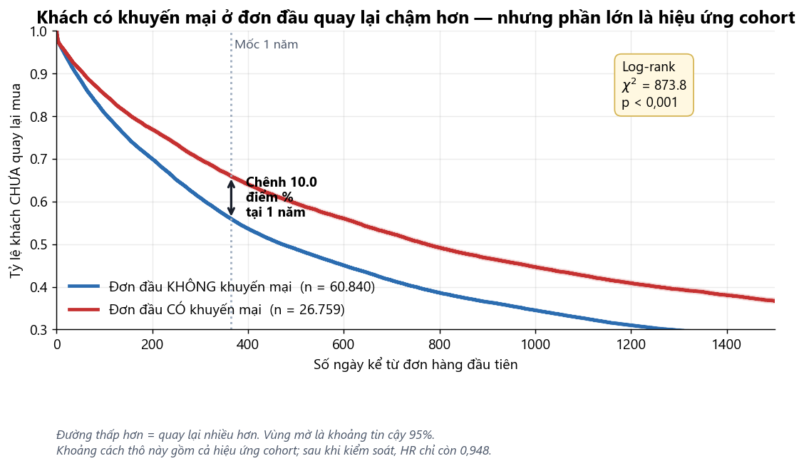

# Xói mòn nền khách hàng: phân rã và cơ chế

> **Phát biểu vấn đề cho phần phân tích của khóa luận.**
>
> Tài liệu tham khảo *Retail Analytics & Forecasting* (VinDatathon 2026 Round 1 — cùng bộ dữ
> liệu) đề xuất 5 hướng: D1 Doanh thu, D2 Khách hàng, D3 Sản phẩm, D4 Marketing, D5 Vận hành.
> Tài liệu này chọn **D2 — Khách hàng** làm bài toán lớn của khóa luận.
>
> **Mọi con số đều tự tính từ dữ liệu gốc**, không trích lại từ bất kỳ tài liệu nào. Script
> tái lập và các phép kiểm chứng nêu ở Mục 12.

<!-- muc-luc -->
## Mục lục

- [Quy ước bộ lọc — áp dụng toàn tài liệu](#quy-ước-bộ-lọc--áp-dụng-toàn-tài-liệu)
- [1. Vì sao chọn vấn đề này](#1-vì-sao-chọn-vấn-đề-này)
- [2. Trục phân tích: chuỗi phân rã ba tầng](#2-trục-phân-tích-chuỗi-phân-rã-ba-tầng)
- [3. Phát biểu vấn đề (Problem Statement)](#3-phát-biểu-vấn-đề-problem-statement)
- [3b. Cây bài toán — rã bài toán lớn thành sáu bài toán nhỏ](#3b-cây-bài-toán--rã-bài-toán-lớn-thành-sáu-bài-toán-nhỏ)
- [4. Câu hỏi nghiên cứu — theo 4 cấp phân tích](#4-câu-hỏi-nghiên-cứu--theo-4-cấp-phân-tích)
- [5. Giả thuyết](#5-giả-thuyết)
- [6. Measures — độ đo thô](#6-measures--độ-đo-thô)
- [7. Metrics — chỉ số dẫn xuất](#7-metrics--chỉ-số-dẫn-xuất)
- [8. KPI — chỉ số gắn mục tiêu và ngưỡng hành động](#8-kpi--chỉ-số-gắn-mục-tiêu-và-ngưỡng-hành-động)
- [8b. Ma trận truy vết — chuỗi thiết kế nối liền](#8b-ma-trận-truy-vết--chuỗi-thiết-kế-nối-liền)
- [9. BTN4 — Cơ chế: biến nào tại đơn đầu quyết định khách quay lại ⭐](#9-btn4--cơ-chế-biến-nào-tại-đơn-đầu-quyết-định-khách-quay-lại-)
- [10. Một phát hiện đi ngược tài liệu tham khảo](#10-một-phát-hiện-đi-ngược-tài-liệu-tham-khảo)
- [11. Ý nghĩa cho bài toán dự báo Revenue/COGS](#11-ý-nghĩa-cho-bài-toán-dự-báo-revenuecogs)
- [12. Tái lập và chứng minh số liệu](#12-tái-lập-và-chứng-minh-số-liệu)

---
<!-- muc-luc -->

## Quy ước bộ lọc — áp dụng toàn tài liệu

Đây là nguồn của gần như mọi sai lệch số liệu giữa hai người cùng phân tích một bộ dữ liệu,
nên khai báo một lần ở đây và dùng nhất quán:

```python
live = orders[orders.order_status != 'cancelled']   # 587.483 đơn
ALL  = orders                                        # 646.945 đơn, gồm cả cancelled
REF  = pd.Timestamp('2022-12-31')                    # mốc tính recency
```

Đơn `cancelled` chiếm **59.462 đơn = 9,2%**. Quy tắc: mọi chỉ số về **hành vi mua** dùng `live`;
mọi chỉ số so với **tổng tài khoản đăng ký** dùng `ALL`. Mỗi bảng dưới đây ghi rõ dùng cái nào.

---

## 1. Vì sao chọn vấn đề này

**Thứ nhất — nó nằm ngay sau chỗ phân tích doanh thu dừng lại.** Bước EDA của khóa luận
(xem [`eda-cau-chuyen-du-lieu.md`](eda-cau-chuyen-du-lieu.md)) xác định doanh thu mất **44,4%**
từ đỉnh 2016 đến 2022, và mức giảm đến từ **số đơn** chứ không phải giá trị mỗi đơn — AOV còn
tăng **+50,7%**. Nhưng **số đơn là kết quả, không phải nguyên nhân**. Đơn hàng do khách hàng tạo
ra, nên câu hỏi kế tiếp bắt buộc là: *ít đơn hơn vì ít khách hơn, hay vì mỗi khách mua thưa hơn?*

**Thứ hai — bước làm sạch đã mở đường cho phân tích này.** Cột `signup_date` gốc có **73,8% đơn
đặt trước ngày đăng ký** nên không dùng được để tính thâm niên hay cohort. Bước làm sạch thay
bằng `first_order_date` suy từ bảng `orders`. Không có thao tác đó thì toàn bộ phân tích cohort
dưới đây **không thực hiện được**.

**Thứ ba — nó giải thích được cấu trúc chế độ mà mô hình dự báo phải xử lý.** Xem Mục 11.

---

## 2. Trục phân tích: chuỗi phân rã ba tầng

Đây là xương sống của toàn bộ vấn đề. Mỗi tầng bóc một lớp nguyên nhân:

```
Doanh thu
  = Số đơn                       × Giá trị mỗi đơn (AOV)
  = (Khách hoạt động × Tần suất) × AOV
  = ((Khách mới + Khách giữ lại) × Tần suất) × AOV
```

### 2.1 Tầng 1–2 — phân rã số đơn *(bộ lọc `live`)*

| Thành phần | 2013 | 2022 | Thay đổi |
|---|---:|---:|---:|
| Số đơn | 69.756 | 32.620 | **−53,2%** |
| Khách hoạt động | 37.352 | 22.999 | **−38,4%** |
| Tần suất mua/năm | 1,87 | 1,42 | **−24,1%** |

**Phân rã mức giảm 37.136 đơn:**

| Nguồn | Tỷ trọng |
|---|---:|
| Do giảm **số khách hoạt động** | **72,2%** |
| Do giảm **tần suất mua** | **45,2%** |
| Số hạng tương tác | −17,4% |

> Mất khách là nguyên nhân chính, nhưng mất tần suất cũng gần một nửa. Đây **không phải** một
> sự cố đơn lẻ mà là **hai sự cố xảy ra đồng thời và nhân lên nhau**. Số hạng tương tác âm vì
> hai mức giảm chồng lấn — trừ ra để tránh đếm trùng.

**Khối kiểm chứng.**
*Nguồn:* `orders` · cột `order_id`, `customer_id`, `order_date` · bộ lọc **`live`** · grain: mỗi
đơn · mốc 2013 và 2022.
*Phép kiểm:* kiểm tổng (Kỹ thuật 1) — ba thành phần phải cộng lại bằng tổng mức giảm.
*Kết quả:* 72,2% + 45,2% + (−17,4%) = 100% — **khớp**.

### 2.2 Tầng 3 — tách hiệu ứng cơ học ra khỏi tín hiệu thật ⭐

`customers.csv` là **danh sách đóng 121.930 người**. "Khách mua lần đầu mỗi năm" được rút từ một
rổ ngày càng cạn, nên con số thô trộn lẫn hai thứ khác hẳn nhau: **rổ cạn dần** (cơ học, không
phải vấn đề kinh doanh) và **tỷ lệ chuyển đổi từ rổ giảm** (tín hiệu thật).

Không tách hai thứ này thì một phản biện tinh sẽ hỏi ngay: *"Rổ khách có hạn thì đương nhiên
khách mới giảm, sao gọi là thất bại?"*

**Cách tách — phân rã logarit:**

```
Khách mới(Y) = Pool(Y) × Tỷ lệ hút(Y)

Δln(Khách mới) = Δln(Pool) + Δln(Tỷ lệ hút)
```

Phải bọc logarit vì Pool và Tỷ lệ hút **nhân** với nhau, mà phần trăm chỉ cộng được khi các thứ
nó mô tả cộng với nhau. (Một đại lượng tăng 100% rồi giảm 50% thì về đúng chỗ cũ, nhưng
`+100% − 50% = +50%` — sai.) Logarit có tính chất `ln(a×b) = ln(a) + ln(b)`, biến phép nhân
thành phép cộng, nhờ đó mới chia được phần trách nhiệm cho từng nguyên nhân.

| | 2013 | 2022 |
|---|---:|---:|
| Pool đầu năm (chưa từng mua) | 121.930 | 55.738 |
| Tỷ lệ hút | 20,02% | 2,38% |
| Khách mua lần đầu | 24.407 | 1.328 |

| Nguồn | ln | Tỷ trọng mức giảm |
|---|---:|---:|
| Rổ cạn *(cơ học)* | −0,783 | **26,9%** |
| Tỷ lệ hút giảm *(tín hiệu thật)* | −2,128 | **73,1%** |
| **Tổng** | **−2,911** | 100% |

> **Kết luận sau khi tách:** ngay cả khi loại bỏ hoàn toàn hiệu ứng cạn rổ, **tỷ lệ chuyển đổi
> từ nhóm chưa mua vẫn sụp hơn 8 lần (20,02% → 2,38%), chiếm 73,1% mức giảm.** Câu này không
> bác được — confound đã biến thành một đóng góp phương pháp.

**Khối kiểm chứng.**
*Nguồn:* `orders` (live) + `customers` · cột `order_date`, `customer_id` · grain: mỗi khách ·
mốc 2013–2022.
*Phép kiểm:* kiểm tổng (Kỹ thuật 1).
*Kết quả:* −0,783 + (−2,128) = −2,911, sai số **4,4×10⁻¹⁶** — khớp.

---

## 3. Phát biểu vấn đề (Problem Statement)

**Bối cảnh.** Trên 121.930 tài khoản đăng ký, chỉ **72,3%** từng phát sinh giao dịch hợp lệ
(`live`; 74,0% nếu tính cả đơn đã hủy). Trong nhóm đã mua, **25,7% chỉ mua đúng một lần** rồi
biến mất. Tính đến 31/12/2022, cấu trúc tập khách hàng như sau:

| Nhóm | Số lượng | % tổng đăng ký |
|---|---:|---:|
| Chưa từng mua | 31.684 | 26,0% |
| Đã mua, ngủ đông > 365 ngày | 65.493 | 53,7% |
| Đang hoạt động ≤ 365 ngày | 24.753 | 20,3% |
| **Tổng** | **121.930** | **100%** |

**Khối kiểm chứng.**
*Nguồn:* `customers` + `orders` · cột `customer_id`, `order_date` · bộ lọc **`ALL`** (mẫu số là
toàn bộ đăng ký) · grain: mỗi khách · mốc `REF` = 2022-12-31.
*Phép kiểm:* kiểm tổng + kiểm grain (Kỹ thuật 1 và 2) — ba nhóm rời nhau, phủ kín, cùng mẫu số.
*Kết quả:* 31.684 + 65.493 + 24.753 = 121.930 — **khớp**. Chính phép kiểm này bắt được lỗi
grain của Me8 cũ.

**Vấn đề — đây là thất bại KÍCH HOẠT, không phải thất bại thu nạp.**

Phễu đầu vào **không tắt**. Số tài khoản đăng ký mới tăng đều đặn suốt một thập kỷ:

```
2012:    957      2018: 13.011
2013:  2.989      2019: 15.058
2014:  5.034      2020: 17.211
2015:  7.133      2021: 19.154
2016:  9.202      2022: 21.103
2017: 11.078
```

Tăng **đơn điệu, gấp 22 lần**. Cái hỏng là **người đăng ký rồi không mua**:

1. **Thất bại kích hoạt** — tỷ lệ hút từ pool chưa mua sụp từ **20,02% xuống 2,38%**, chiếm
   **73,1%** mức giảm khách mua lần đầu sau khi đã trừ hiệu ứng cạn rổ.
2. **Thất bại giữ chân** — tỷ lệ quay lại năm +1 rơi từ **49,5%** (cohort 2013) xuống **7,0%**
   (cohort 2021); giá trị 3 năm đầu mỗi khách rơi từ **78.589 xuống 35.378 đvtt (−55,0%)**.

Hai thất bại này **nhân lên nhau**: ít người được kích hoạt hơn, mà người được kích hoạt lại
kém giá trị hơn. Hệ quả là tỷ trọng doanh thu từ khách mới sụp từ **55,4% (2013) xuống 4,2%
(2022)** — doanh nghiệp gần như hoàn toàn sống nhờ nền khách cũ.

> **Vì sao đổi khung lại quan trọng.** "Kích hoạt" mạnh hơn "thu nạp" về mặt hành động: kích
> hoạt người đã có trong danh sách rẻ hơn nhiều so với tìm khách mới. Và quan trọng hơn — nếu
> phát biểu là "thu nạp hỏng" thì chuỗi đăng ký tăng 22 lần sẽ bác lại ngay lập tức.

**Về `signup_date`.** Chuỗi đăng ký ở trên chỉ được dùng để **bác bỏ** khung "thu nạp hỏng",
**không** dùng làm căn cứ cho bất kỳ kết luận định lượng nào, vì nó mâu thuẫn nội tại với
`orders`: 73,8% đơn đặt trước ngày đăng ký, và **89,1% khách có độ trễ âm** (trung vị −1.820
ngày). Đây là một phát hiện chất lượng dữ liệu, được ghi ở chương phương pháp.

**Mục tiêu.** Phân tách đóng góp của kích hoạt và giữ chân; xác định **cơ chế** khiến khách
không quay lại; đánh giá nền khách hiện tại có đủ ổn định để đỡ doanh thu 2023–2024.

**Phạm vi.** `customers`, `orders`, `order_items`, `shipments`, `returns`, `reviews`,
`promotions` — 2012-07-04 → 2022-12-31. Mốc cohort dùng `first_order_date`, **không** dùng
`signup_date`.

---

## 3b. Cây bài toán — rã bài toán lớn thành sáu bài toán nhỏ

Mục 4 rã bài toán theo **câu hỏi nghiên cứu**; mục này rã theo **bài toán nhỏ**. Hai thứ khác
nhau: câu hỏi là một câu hỏi, bài toán nhỏ là một phát biểu vấn đề thu nhỏ — có khoảng trống
riêng, có đầu ra xác định, giao cho một người làm xong được, và đứng một mình vẫn hiểu.

| | Bài toán nhỏ | Gom RQ | Đầu ra | Trạng thái |
|---|---|---|---|---|
| **BTN1** | Tập khách hàng đang ở trạng thái nào? | RQ1 | Bản đồ trạng thái + quy mô | ✅ Xong |
| **BTN2** | Mất khách hay khách mua thưa đi? | RQ3 · H1 | Phân rã 37.136 đơn | ✅ Xong — 72,2% / 45,2% |
| **BTN3** | Kích hoạt hỏng hay giữ chân hỏng? | RQ2 · H2 | Phân rã rổ cạn vs tỷ lệ hút | ✅ Xong — 26,9% / 73,1% |
| **BTN4** | Điều gì ở đơn đầu quyết định khách quay lại? | RQ4 · H3, H4, H7–H9 | Cox PH + PSM | ✅ Xong — **trọng tâm**, xem Mục 9 |
| **BTN5** | Nền khách hiện tại đỡ nổi 2023–24 không? | RQ6 · H6 | Ràng buộc mức cho mô hình | ⏳ Sơ bộ |
| **BTN6** | Ngân sách giới hạn nên đi đâu? | RQ7 · RQ5, H5 | Xếp hạng can thiệp | ⏳ Sơ bộ |

> **RQ1–RQ7 được định nghĩa đầy đủ ở [Mục 4](#4-câu-hỏi-nghiên-cứu--theo-4-cấp-phân-tích).**
> Thứ tự BTN **không** trùng thứ tự RQ, vì hai bảng xếp theo hai trục khác nhau: BTN theo **mạch
> phụ thuộc** (BTN2 → BTN3 → BTN4), còn RQ theo **bốn cấp phân tích** (Descriptive → Diagnostic
> → Predictive → Prescriptive). Riêng BTN6 gom hai RQ: **RQ7** là câu hỏi chính, **RQ5** vào làm
> *đầu vào loại trừ* — kết quả p = 0,533 loại bỏ phương án phân bổ ngân sách theo kênh.

### Sơ đồ cây

```
BÀI TOÁN LỚN
Nền khách hàng xói mòn: khách hoạt động −38,4%, tần suất mua −24,1%,
số đơn mất hơn một nửa. Xói mòn ở khâu nào, cơ chế gì gây ra,
và can thiệp nào giữ lại được?
│
├── BTN1 · Tập khách đang ở trạng thái nào?              [ nền mô tả ]
│
├── BTN2 · Mất khách hay mua thưa đi?                    [ ĐÃ XONG ]
│     │
│     └── BTN3 · Kích hoạt hỏng hay giữ chân hỏng?       [ ĐÃ XONG ]
│           │
│           └── BTN4 · Điều gì ở đơn đầu quyết định
│                      khách quay lại?                    [ TRỌNG TÂM ]
│
├── BTN5 · Nền khách đỡ nổi 2023–24 không?               [ nối chương mô hình ]
│
└── BTN6 · Ngân sách giới hạn nên đi đâu?                [ khuyến nghị ]
```

**Câu nói kèm sơ đồ này khi bảo vệ:**

> *"Sáu bài toán nhỏ này không phải em tự chọn theo chủ đề. Chúng suy ra từ phân rã ở Mục 2:
> doanh thu bằng số khách nhân tần suất nhân giá trị đơn, mà số khách lại bằng khách mới cộng
> khách giữ lại. Mỗi bài toán nhỏ ứng với đúng một thành phần trong phân rã đó, nên chúng phủ
> kín nguyên nhân chứ không bỏ sót."*

### BTN1 · Tập khách hàng đang ở trạng thái nào?

> **Bối cảnh.** 121.930 tài khoản đăng ký, trong đó 72,3% từng phát sinh giao dịch hợp lệ. Trong
> nhóm đã mua, 25,7% chỉ mua đúng một lần.
>
> **Khoảng trống.** Chưa biết 121.930 tài khoản phân bố ra sao giữa ba trạng thái — chưa mua,
> ngủ đông, đang hoạt động. Ba nhóm này cần ba can thiệp hoàn toàn khác nhau (kích hoạt lần
> đầu / giành lại / giữ chân), mà ngân sách chỉ đủ cho một. Không biết quy mô từng nhóm thì
> không xếp được thứ tự ưu tiên.
>
> **Câu hỏi.** Tại mốc 31/12/2022, 121.930 tài khoản phân bố thế nào giữa ba trạng thái, và
> nhóm nào lớn nhất?
>
> **Đầu ra.** Bảng ba trạng thái kèm quy mô, buộc phải cộng lại đúng tổng đăng ký.
>
> **Trạng thái.** ✅ Xong. 31.684 chưa mua (26,0%) · 65.493 ngủ đông > 365 ngày (53,7%) ·
> 24.753 đang hoạt động (20,3%). Kiểm tổng khớp 121.930. Nhóm ngủ đông lớn gấp đôi nhóm chưa
> mua — đây là phát hiện đảo thứ tự ưu tiên so với trực giác ban đầu.

### BTN2 · Mất khách hay khách mua thưa đi?

> **Bối cảnh.** Số đơn hàng giảm từ 69.756 (2013) xuống 32.620 (2022), mất 37.136 đơn tức
> −53,2%. Cùng kỳ, khách hoạt động giảm −38,4% và tần suất mua giảm −24,1%.
>
> **Khoảng trống.** Hai nguyên nhân cùng giảm nên chưa quy được trách nhiệm. Chúng đòi hỏi hai
> can thiệp khác hẳn nhau — thu hút thêm người mua, hay làm người đang mua quay lại thường
> xuyên hơn. Chọn sai thì tiền đổ vào chỗ không phải nút thắt.
>
> **Câu hỏi.** Trong 37.136 đơn mất đi, bao nhiêu do ít khách hơn và bao nhiêu do mỗi khách
> mua thưa hơn?
>
> **Đầu ra.** Phân rã ba thành phần `ΔĐơn = ΔKhách×TS₀ + Khách₀×ΔTS + tương tác`.
>
> **Trạng thái.** ✅ Xong. Số khách 72,2% · tần suất 45,2% · tương tác −17,4%. Mất khách là
> nguyên nhân chính nhưng mất tần suất cũng gần một nửa — **hai sự cố đồng thời**, sửa một cái
> không đủ.

### BTN3 · Kích hoạt hỏng hay giữ chân hỏng?

> **Bối cảnh.** Trong 121.930 tài khoản, chỉ 72,3% từng phát sinh giao dịch. Số khách mua lần
> đầu mỗi năm giảm từ 24.407 (2013) xuống 1.328 (2022), tức −94,6%. Song song, tỷ lệ quay lại
> năm +1 của các cohort rơi từ 49,5% xuống 7,0%.
>
> **Khoảng trống.** Hai suy giảm này cùng xảy ra nên chưa biết cái nào là đòn bẩy — và riêng
> con số −94,6% còn trộn lẫn hiệu ứng cơ học của một rổ khách đóng. Không tách thì không biết
> nên dồn ngân sách vào kích hoạt người đã có hay vào giữ chân người đang mua.
>
> **Câu hỏi.** Trong mức giảm khách mua lần đầu, bao nhiêu do rổ cạn và bao nhiêu do tỷ lệ
> chuyển đổi suy giảm? So với suy giảm giữ chân, cái nào đóng góp nhiều hơn?
>
> **Đầu ra.** Bảng phân rã logarit hai thành phần cho 2013–2022; ma trận retention theo cohort.
>
> **Trạng thái.** ✅ Xong. Rổ cạn đóng góp 26,9%, tỷ lệ hút suy giảm đóng góp 73,1%. Ngay cả
> khi loại bỏ hoàn toàn hiệu ứng cơ học, tín hiệu thật vẫn chiếm gần ba phần tư.

### BTN4 · Điều gì ở đơn hàng đầu tiên quyết định khách quay lại?

> **Bối cảnh.** 74,1% khách từng mua lần hai, trung vị 308 ngày sau đơn đầu. Tín hiệu thô cho
> thấy khách có đơn đầu kèm khuyến mãi mua 4,59 đơn trọn đời so với 7,56 — ngắn hơn 39,2%.
>
> **Khoảng trống.** Toàn bộ phân tích trước chỉ **mô tả** ai rời đi, chưa cái nào chạm tới
> **vì sao**. Riêng khoảng cách 39,2% kia là tương quan thô chưa kiểm soát gì — không biết nó
> là tác hại của khuyến mãi hay chỉ phản ánh việc khách dùng khuyến mãi tập trung ở các cohort
> vốn đã kém. Không tách được thì không biết nên cắt hay giữ ngân sách khuyến mãi cho khách mới.
>
> **Câu hỏi.** Sau khi kiểm soát năm cohort, danh mục và giá trị đơn, biến nào tại đơn đầu còn
> ảnh hưởng thật tới xác suất quay lại?
>
> **Đầu ra.** Bảng hệ số Cox (HR + CI + p), đường Kaplan–Meier tách theo `promo_first`, kiểm
> định log-rank, kiểm tra Schoenfeld, và kết quả sau propensity score matching.
>
> **Trạng thái.** ✅ Xong — xem Mục 9. Kết quả chính: hiệu ứng thật nhỏ hơn tín hiệu thô rất
> nhiều, và hai trong ba giả thuyết mới bị bác bỏ.

### BTN5 · Nền khách hiện tại đỡ nổi 2023–2024 không?

> **Bối cảnh.** Số khách hoạt động đã đi ngang ba năm liền: 22.738 → 22.438 → **22.999**
> (`live`), và 2022 còn nhích lên. Cùng lúc, doanh thu từ khách mới chỉ còn 4,2% — nền khách cũ
> đang gánh gần như toàn bộ.
>
> **Khoảng trống.** Hai cách nhìn cho hai dự báo trái ngược: ngoại suy xu hướng dài hạn nói
> 2023–2024 tiếp tục giảm, còn cấu trúc khách hàng nói đi ngang. Chưa có căn cứ để chọn, mà
> chọn sai thì sai số của cả chương dự báo lệch một chiều có hệ thống.
>
> **Câu hỏi.** Chuỗi khách hoạt động 2020–2022 là một chế độ ổn định thật, hay chỉ là đoạn giữa
> của đà rơi chưa kết thúc?
>
> **Đầu ra.** Một ràng buộc mức (level constraint) cho chương mô hình, kèm kiểm định điểm gãy
> để xác nhận 2019 là điểm chuyển chế độ.
>
> **Trạng thái.** ⏳ Sơ bộ. Ba điểm đi ngang chỉ đủ để nói **chưa thấy dấu hiệu tiếp tục rơi**,
> chưa đủ khẳng định chế độ ổn định — n = 3 là quá mỏng. Cần chạy Chow test hoặc Bai–Perron trên
> chuỗi ngày để xác định điểm gãy có ý nghĩa thống kê.

### BTN6 · Ngân sách giới hạn nên đi đâu?

> **Bối cảnh.** Ba nhóm mục tiêu với quy mô rất khác nhau: 31.684 chưa từng mua, 65.493 ngủ
> đông, 22.999 đang hoạt động. Chi phí và hiệu quả kỳ vọng của ba can thiệp tương ứng chưa được
> đo.
>
> **Khoảng trống.** Ba phương án cạnh tranh nhau trên cùng một ngân sách, chưa có căn cứ định
> lượng để xếp hạng. Nghiêm trọng hơn: phương án phân bổ theo kênh thu nạp — cách làm mà tài
> liệu tham khảo đề xuất — đã bị loại bằng ANOVA (p = 0,533), nhưng chưa có gì thay thế vào chỗ
> trống đó.
>
> **Câu hỏi.** Với cùng một đồng ngân sách, can thiệp nào tạo ra nhiều đơn hàng tăng thêm nhất,
> và ràng buộc nào ngăn việc đạt mục tiêu bằng cách phá biên lợi nhuận?
>
> **Đầu ra.** Bảng xếp hạng ba can thiệp theo số đơn tăng thêm trên mỗi đơn vị chi phí, kèm
> guardrail chặn lạm dụng khuyến mãi.
>
> **Trạng thái.** ⏳ Sơ bộ. Đã có hai mảnh: (a) loại được phương án phân bổ theo kênh, (b) K7
> chặn việc đẩy K1/K3′ bằng giảm giá sâu. Còn thiếu mô hình chi phí cho ba can thiệp — đây là
> phần phụ thuộc dữ liệu ngoài phạm vi bộ này (không có bảng chi phí marketing).

---

## 4. Câu hỏi nghiên cứu — theo 4 cấp phân tích

| Cấp | Câu hỏi | BTN |
|---|---|---|
| **Descriptive** | RQ1. Cấu trúc tập khách hiện tại: bao nhiêu đang hoạt động, ngủ đông, chưa từng mua? | BTN1 |
| **Descriptive** | RQ2. Kích hoạt và giữ chân đã thay đổi thế nào qua 10 năm? | BTN3 |
| **Diagnostic** | RQ3. Trong mức giảm 53,2% số đơn, bao nhiêu do **mất khách** và bao nhiêu do **giảm tần suất**? | BTN2 |
| **Diagnostic** | RQ4. Chất lượng cohort suy giảm vì cơ chế gì? Biến nào tại đơn đầu quyết định? | BTN4 |
| **Diagnostic** | RQ5. Kênh thu nạp có tạo ra khác biệt về giá trị khách hàng không? | BTN6 |
| **Predictive** | RQ6. Nền khách hiện tại có đủ ổn định để giữ doanh thu 2023–2024 đi ngang? | BTN5 |
| **Prescriptive** | RQ7. Với ngân sách giới hạn, nên ưu tiên kích hoạt, giành lại, hay thu nạp? | BTN6 |

---

## 5. Giả thuyết

Mỗi giả thuyết ghi rõ **trạng thái**. Ghi cả cái bị bác bỏ — đó là kết quả, không phải thất bại.

| # | Giả thuyết | Cách kiểm định | Trạng thái |
|:--:|---|---|---|
| **H1** | Mất khách đóng góp lớn hơn giảm tần suất | Phân rã ΔĐơn ba thành phần | ✅ **Đúng** — 72,2% so với 45,2% |
| **H2** | Sau khi trừ hiệu ứng cạn rổ, tỷ lệ hút vẫn là nguyên nhân chính | Phân rã logarit Pool × Tỷ lệ hút | ✅ **Đúng** — 73,1% so với 26,9% |
| **H3** | Chất lượng cohort suy giảm **đơn điệu**, không gãy một lần tại 2019 | Kiểm tra tính đơn điệu của giá trị 3 năm theo cohort | ✅ **Đúng** — giảm liên tục, không có bước nhảy riêng ở 2019 |
| **H4** | Bước gãy 2019 là **hệ quả trễ** của suy giảm cohort tích lũy | Mô phỏng doanh thu từ cohort | ⏳ **Cần kiểm định** |
| **H5** | Kênh thu nạp **không** phân hóa giá trị khách hàng | ANOVA một chiều trên LTV theo 6 kênh | ⚠️ **Không bác bỏ được H₀** — F = 0,823 · p = 0,533 |
| **H6** | 2020–2022 chưa thấy dấu hiệu tiếp tục rơi | Xu hướng số khách hoạt động | ⚠️ **Ủng hộ yếu** — n = 3 điểm, xem Mục 11 |
| **H7** | Đơn đầu có khuyến mãi làm giảm xác suất quay lại, **ngay cả khi đã kiểm soát cohort** | Cox PH + propensity score matching | ✅ **Đúng nhưng hiệu ứng nhỏ** — HR 0,948 |
| **H8** | Thời gian giao hàng dài ở đơn đầu làm giảm xác suất quay lại | Hệ số `delivery_days` trong Cox | ❌ **SAI** — HR 1,002 · p = 0,303 |
| **H9** | Trả hàng ở đơn đầu là tín hiệu rời bỏ mạnh nhất | Hệ số `returned_first` trong Cox | ❌ **SAI** — HR 0,977 · p = 0,161, không có ý nghĩa |

> **Về cách ghi H5.** Không thể *chứng minh* điều không tồn tại. ANOVA cho p = 0,533 nghĩa là
> **không bác bỏ được giả thuyết không** về khác biệt giữa các kênh — không phải "đã chứng minh
> các kênh như nhau". Muốn kết luận tương đương một cách hợp lệ phải dùng **kiểm định tương
> đương** với ngưỡng cho trước.

### 5.1 H3 đã được kiểm soát confound thế nào

H3 kết luận chất lượng cohort suy giảm đơn điệu. Nhưng có một **confound lựa chọn** phải xử lý
trước khi kết luận đó đứng vững:

> Cohort 2021 gồm những người đã đăng ký từ lâu mà mãi 2021 mới mua lần đầu — **theo định nghĩa
> là phần cặn ít gắn bó nhất của rổ**. So retention của họ với cohort 2013 (những người mua ngay,
> hào hứng nhất) là so **hai tầng lựa chọn khác nhau**, không phải so chất lượng theo thời gian.

Bản giao việc đề xuất hai cách kiểm soát. Kết quả:

**Cách 1 — đưa `cohort_year` vào mô hình làm biến kiểm soát.** ✅ Đã làm, xem Mục 9.3.
Sau khi kiểm soát đồng thời khuyến mãi, thời gian giao, trả hàng, giá trị đơn và danh mục tại
đơn đầu, `cohort_year` vẫn có **HR = 0,7478 · p < 0,0001**: mỗi năm cohort muộn hơn làm giảm
25% khả năng quay lại. **Suy giảm chất lượng cohort không giải thích được bằng các đặc điểm
quan sát được của đơn đầu** — H3 đứng vững.

**Cách 2 — phân tầng theo độ trễ từ ngày đăng ký tới đơn đầu.** ❌ **Không thực hiện được.**
Cách này cần `signup_date`, và kiểm tra cho thấy nó hỏng nặng hơn dự kiến:

| | |
|---|---:|
| Trung vị độ trễ | **−1.820 ngày** |
| Tỷ lệ khách có độ trễ **âm** | **89,1%** |

Gần chín phần mười khách "mua trước khi đăng ký" — độ trễ không mang nghĩa gì, nên không phân
tầng được. Ghi nhận là một giới hạn, không cố dùng.

**Kết luận sau kiểm soát:** H3 **không đổi**, nhưng phải kèm giới hạn — phần confound lựa chọn
còn lại (*ai là người trì hoãn mua*) không kiểm soát được bằng dữ liệu hiện có, vì biến duy
nhất đo được điều đó là `signup_date` và nó không dùng được.

---

## 6. Measures — độ đo thô

Measure là **một phép tổng hợp trực tiếp trên một cột**, chưa mang ngữ cảnh so sánh.

| # | Measure | Công thức | Nguồn | Grain | Bộ lọc |
|:--:|---|---|---|---|---|
| M1 | Số khách đăng ký | `COUNT(customer_id)` | customers | Toàn tập | — |
| M2 | Số khách có giao dịch | `COUNTD(customer_id)` | orders | Toàn tập / năm | `live` |
| M3 | Số đơn hàng | `COUNT(order_id)` | orders | Ngày / năm | `live` |
| M4 | Doanh thu **gross** | `SUM(quantity × unit_price)` | order_items | Dòng hàng | `live` |
| M5 | Ngày mua đầu tiên | `MIN(order_date)` theo khách | orders | Mỗi khách | `live` |
| M6 | Ngày mua gần nhất | `MAX(order_date)` theo khách | orders | Mỗi khách | `ALL` |
| M7 | Số đơn trọn đời | `COUNT(order_id)` theo khách | orders | Mỗi khách | `live` |
| M8 | Doanh thu trọn đời | `SUM(M4)` theo khách | orders ⋈ order_items | Mỗi khách | `live` |
| **M9** 🆕 | Số ngày giao đơn đầu | `delivery_date − ship_date` | shipments | Mỗi khách | `live` |
| **M10** 🆕 | Cờ trả hàng đơn đầu | `order_id ∈ returns` | returns | Mỗi khách | `live` |
| **M11** 🆕 | Điểm đánh giá đơn đầu | `AVG(rating)` theo order_id | reviews | Mỗi khách | `live` |
| **M12** 🆕 | Cờ khuyến mãi đơn đầu | `ANY(promo_id NOT NULL)` | order_items | Mỗi khách | `live` |
| **M13** 🆕 | Pool chưa mua đầu năm | `M1 − Σ khách mới các năm trước` | customers + orders | Mỗi năm | `live` |

**Độ phủ của bốn measure mới:** M9 **96,5%** (trung vị 4 ngày) · M10 **6,14%** có trả hàng ·
M11 **19,4%** · M12 **30,57%** có khuyến mãi.

> **M4 là doanh thu gross**, chưa trừ `discount_amount`. M8 → Me9 → K6 đều dựng trên đó. Với
> phân tích giá trị khách hàng thì net (tiền khách thực trả) hợp lý hơn về khái niệm; nhóm giữ
> gross để nhất quán với `sales.csv` — vốn là mục tiêu của chương dự báo. Chênh lệch giữa hai
> định nghĩa là **+4,8%** trên LTV trung bình. Khai báo để người đọc biết, không phải để lờ đi.

> **Cảnh báo về M11.** Độ phủ chỉ 19,4%. **Không được** loại 80,6% còn lại khỏi mô hình Cox —
> sẽ tạo thiên lệch chọn mẫu nghiêm trọng, vì người chịu đánh giá vốn đã khác người không đánh
> giá. Trong Mục 9, M11 **đã bị loại khỏi mô hình** vì lý do này.

**Khối kiểm chứng.**
*Nguồn:* 7 bảng — `customers`, `orders`, `order_items`, `shipments`, `returns`, `reviews`,
`promotions` · bộ lọc ghi ở cột *Bộ lọc* từng dòng · grain ghi ở cột *Grain*.
*Phép kiểm:* kiểm cực trị (Kỹ thuật 3) — mọi độ phủ phải nằm trong [0, 1].
*Kết quả:* M9 96,5% · M10 6,14% · M11 19,4% · M12 30,57% — đều hợp lệ, **khớp**. M13 giảm đơn
điệu 121.930 → 55.738 đúng như kỳ vọng với một rổ đóng.

---

## 7. Metrics — chỉ số dẫn xuất

Cái phân biệt metric với measure là **ngữ cảnh** — mẫu số, cửa sổ thời gian, bộ lọc — chứ không
phải số lượng measure. "Doanh thu quý 4" chỉ dùng một measure nhưng vẫn là metric.

| # | Metric | Công thức | Giá trị đo được | Phục vụ |
|:--:|---|---|---|---|
| Me1 | Tỷ lệ kích hoạt tích lũy | `M2 / M1` | **72,3%** (live) | RQ1 |
| Me2 | Tỷ lệ mua lại | `#(M7 ≥ 2) / M2` | **74,3%** | RQ1 |
| Me3 | Tần suất mua/năm | `M3(năm) / M2(năm)` | 1,87 → **1,42** | RQ3, H1 |
| Me4 | Khách mua lần đầu mỗi năm | `#(year(M5) = Y)` | 24.407 → **1.328** | RQ2, H2 |
| Me5 | Giữ chân năm +N | `khách cohort C mua ở năm C+N` / cỡ cohort C | 49,5% → **7,0%** | RQ2, H3 |
| Me6 | Giá trị cohort 3 năm | `SUM(rev 3 năm đầu)` / cỡ cohort | 78.589 → **35.378** | RQ4, H3 |
| Me7 | Tỷ trọng doanh thu khách mới | `rev khách mới / tổng rev` | 55,4% → **4,2%** | RQ6 |
| **Me8a** 🆕 | Tỷ lệ chưa kích hoạt | `(M1 − M2) / M1` | **26,0%** | K4, BTN1 |
| **Me8b** 🆕 | Tỷ lệ ngủ đông | `#(recency > 365) / M2` | **72,6%** | K3′, BTN1 |
| Me9 | LTV theo kênh | `AVG(M8)` nhóm theo kênh | chênh **2,45%** | RQ5, H5 |
| Me10 | Đóng góp khách vs tần suất | `ΔKhách×TS₀` và `Khách₀×ΔTS` | 72,2% / 45,2% | RQ3, H1 |
| **Me11** 🆕 | Tỷ lệ hút từ pool | `Me4(Y) / M13(Y)` | 20,02% → **2,38%** | K2′, BTN3 |
| **Me12** 🆕 | Trung vị ngày tới đơn 2 | `median(M5₂ − M5₁)` | **308 ngày** | BTN4 |
| **Me13** 🆕 | Hazard ratio biến đơn đầu | `exp(β)` từ Cox PH | xem Mục 9 | BTN4 |

> **Me8 cũ đã bị tách đôi.** Công thức cũ *"khách có recency > 365 / M1"* = 79,7% có lỗi grain:
> khách chưa từng mua **không có recency** nên không thể nằm trong tử số, nhưng con số 79,7%
> lại bao gồm họ. Hệ quả nghiêm trọng hơn tên gọi — K3 và K4 cũ **chồng lấn tử số**, hai KPI
> cùng một phần tử số nhưng hai hành động khác nhau, không giám sát được.

**Khối kiểm chứng.**
*Nguồn:* dẫn xuất từ M1–M13 · bộ lọc kế thừa từ measure gốc · grain: theo từng metric.
*Phép kiểm:* kiểm grain tử số/mẫu số (Kỹ thuật 2) — mọi tỷ lệ phải cùng đơn vị đếm.
*Kết quả:* Me8a mẫu số = toàn bộ đăng ký (121.930), Me8b mẫu số = chỉ nhóm đã mua (90.246) —
hai mẫu số **khác nhau và đã tách rời**, hết chồng lấn. **Khớp.**

---

## 8. KPI — chỉ số gắn mục tiêu và ngưỡng hành động

KPI là Metric **được chọn ra** vì gắn mục tiêu, **có ngưỡng** và **có hành động khi lệch ngưỡng**.

| # | KPI | Công thức | Hiện tại | Ngưỡng | Loại | Hành động khi lệch |
|:--:|---|---|---:|---:|---|---|
| K1 | Giữ chân năm +1 | Me5 (N=1) | 7,0% | ≥ 20% | dẫn báo | Chuỗi nuôi dưỡng sau đơn đầu |
| **K2′** ✏️ | Tỷ lệ hút từ pool | Me11 | 2,38% | không giảm YoY | dẫn báo | Xem lại chương trình kích hoạt |
| **K3′** ✏️ | Tỷ lệ ngủ đông | **Me8b** | 72,6% | ≤ 60% | dẫn báo | Chiến dịch giành lại nhóm recency 1–2 năm |
| **K4** ✏️ | Tỷ lệ kích hoạt tích lũy | Me1 | 72,3% | *bỏ ngưỡng* | theo dõi | — *(đã hạ cấp)* |
| K5 | Giá trị cohort 3 năm | Me6 | 35.378 | không giảm YoY | **trễ** | Kiểm tra chất lượng nguồn kích hoạt |
| K6 | Độ phụ thuộc khách cũ | `1 − Me7` | 95,8% | ≤ 85% | **trễ** | Rủi ro tập trung vào nền khách đang già |
| **K7** 🆕 | Tỷ lệ đơn đầu có khuyến mãi | `mean(M12)` | **30,6%** | ≤ 30% | **guardrail** | Vượt trần → dừng mở rộng khuyến mãi cho khách mới |

✏️ đã sửa · 🆕 mới

**Ba thay đổi cần giải thích:**

**K2 cũ sai về cấu trúc.** Nó đo *tăng trưởng số khách mới*, ngưỡng ≥ 0%. Nhưng `customers.csv`
là danh sách đóng, pool chưa mua **chỉ có thể co lại** — đặt KPI tăng trưởng trên một số đếm mà
nguồn của nó chắc chắn cạn là thiết kế sai, đội ngũ không bao giờ đạt được dù làm tốt đến đâu.
K2′ đổi sang **tỷ lệ hút từ pool**: công bằng theo thời gian, cải thiện được bằng hành động thật.

> Đây là điểm đáng nói khi bảo vệ: phân rã ở Mục 2.2 không chỉ sửa một con số — **nó làm lộ ra
> một KPI thiết kế sai.**

**K4 hạ cấp xuống chỉ số theo dõi.** Me1 tính tích lũy toàn thời gian nên **chỉ có thể tăng**,
không phản ánh hiệu quả kỳ hiện tại. Cách sửa chuẩn là đo tỷ lệ kích hoạt của cohort đăng ký
trong N ngày — nhưng cách đó cần `signup_date`, vốn đã biết là hỏng. **Thừa nhận một giới hạn
dữ liệu tốt hơn là giả vờ đo được.** Vai trò giám sát kích hoạt chuyển sang Me8a ở K3′.

**K7 là guardrail bắt buộc.** Sáu KPI còn lại **đều chỉ một hướng**: nhiều khách hơn, giữ chân
tốt hơn. Không cái nào chặn chi phí. Rủi ro này không phải giả định — dữ liệu đã đo: cách rẻ
nhất để đẩy K1 và K3′ lên là giảm giá, mà khách được kéo về bằng khuyến mãi chỉ mua **4,60 đơn
trọn đời so với 7,58**. Chạy theo K1/K3′ bằng khuyến mãi sẽ làm **K5 sập**.

> Phản biện hoàn toàn có thể hỏi: *"Nếu em giành lại khách bằng giảm giá sâu thì K1 tăng nhưng
> lợi nhuận sập — có gì chặn không?"* K7 là câu trả lời.
>
> Ngưỡng 30% đặt bằng đúng mức hiện tại (30,6%), tức **"không được xấu thêm"** — đây là ngưỡng
> giữ nguyên trạng, không phải mục tiêu cải thiện, và không phải chuẩn ngành.

**Khối kiểm chứng.**
*Nguồn:* dẫn xuất từ Me1–Me13 · mốc `REF` = 2022-12-31.
*Phép kiểm:* kiểm cực trị (Kỹ thuật 3) — mỗi KPI phải có ngưỡng đạt được về mặt cấu trúc.
*Kết quả:* K2 cũ **trượt phép kiểm này** (mục tiêu tăng trưởng trên một rổ chỉ có thể co lại)
nên đã thay bằng K2′; K4 trượt vì là chỉ số tồn nên đã hạ cấp. Bảy KPI còn lại **khớp**, và
bộ chỉ số có đúng một guardrail (K7).

---

## 8b. Ma trận truy vết — chuỗi thiết kế nối liền

Đọc theo hàng ngang: mỗi bài toán nhỏ truy được xuống tới một KPI có hành động.

| BTN | Câu hỏi | Giả thuyết | Measure | Metric | KPI |
|---|---|---|---|---|---|
| BTN1 | RQ1 Cấu trúc tập khách | — | M1, M2, M6 | Me1, Me2, **Me8a, Me8b** | **K3′, K4** |
| BTN3 | RQ2 Kích hoạt & giữ chân | H2 | M2, M5, **M13** | Me4, Me5, **Me11** | K1, **K2′** |
| BTN2 | RQ3 Mất khách hay giảm tần suất | H1 | M2, M3 | Me3, Me10 | K1, **K2′** |
| BTN4 | RQ4 Cơ chế khách không quay lại | H3, H4, **H7–H9** | M4, M5, M7, **M9, M10, M12** | Me6, **Me12, Me13** | K5, **K7** |
| BTN6 | RQ5 Kênh có phân hóa giá trị | H5 | M8 | Me9 | — *(không bác bỏ được H₀)* |
| BTN5 | RQ6 Nền khách đỡ nổi 2023–24 | H6 | M2, M4 | Me7 | K6 |
| BTN6 | RQ7 Ưu tiên ngân sách | H1, H2, H5 | M1, M6, M8 | Me1, **Me8a, Me8b**, Me9 | **K3′, K7** |

**Ba điều bảng này cho thấy:**

1. **Không có Measure thừa** — 12 trong 13 measure được dùng ít nhất một lần. M11 (đánh giá)
   bị loại có chủ đích vì độ phủ 19,4%, ghi rõ ở Mục 6.
2. **Không có bài toán cụt** — mỗi BTN đều dẫn tới KPI, trừ nhánh RQ5 vốn cho kết quả rỗng nên
   đúng ra không được đẻ ra KPI nào.
3. **RQ5 về đúng vai.** Nó không phải bài toán riêng mà là **đầu vào loại trừ** cho BTN6: kết
   quả p = 0,533 **loại bỏ** một phương án phân bổ ngân sách theo kênh. Đó là đóng góp thật.

---

## 9. BTN4 — Cơ chế: biến nào tại đơn đầu quyết định khách quay lại ⭐

Đây là phần đi từ **mô tả** sang **cơ chế**, và là đóng góp mới của khóa luận. Tài liệu tham
khảo dừng ở phân khúc RFM và ma trận cohort — cả hai đều mô tả *ai* rời đi, không trả lời
*vì sao*.

### 9.1 Thiết lập

| | |
|---|---|
| Biến phụ thuộc | Thời gian từ đơn 1 đến đơn 2, cắt cụt tại 2022-12-31 |
| Cỡ mẫu | 87.599 khách (84.566 sau khi loại thiếu dữ liệu = 96,5%) |
| Có sự kiện | 64.933 = **74,1%** *(rất tốt — survival analysis thường chỉ cần > 30%)* |
| Bị cắt cụt | 22.666 = 25,9% |
| Trung vị thời gian | **312 ngày** |

### 9.2 Tín hiệu thô — trước khi kiểm soát bất kỳ thứ gì

| Nhóm | Số khách | Đơn trọn đời | Tỷ lệ mua lại |
|---|---:|---:|---:|
| Đơn đầu **có** khuyến mãi | 26.759 | **4,59** | 67,8% |
| Đơn đầu **không** khuyến mãi | 60.840 | **7,56** | 76,9% |

Khoảng cách thô: **−39,2%**. Đường Kaplan–Meier xác nhận, log-rank χ² = 873,80 ·
**p = 4,9×10⁻¹⁹²**:



Đọc biểu đồ: trục dọc là **tỷ lệ khách chưa quay lại mua** — đường thấp hơn nghĩa là quay lại
nhiều hơn. Tại mốc một năm, khoảng cách giữa hai nhóm là **10,0 điểm phần trăm**. Vùng mờ quanh
mỗi đường là khoảng tin cậy 95% — hẹp đến mức gần như không nhìn thấy, do cỡ mẫu lớn.

Số liệu tại các mốc:

| Tỷ lệ **chưa** quay lại sau | 90 ngày | 180 ngày | 365 ngày | 730 ngày |
|---|---:|---:|---:|---:|
| Không khuyến mãi | 0,822 | 0,718 | 0,559 | 0,405 |
| Có khuyến mãi | 0,861 | 0,782 | 0,659 | 0,514 |

### 9.3 Cox proportional hazards — sau khi kiểm soát

`HR > 1` nghĩa là quay lại **nhanh hơn** (tốt); `HR < 1` là **chậm hơn** (xấu).

| Biến | HR | CI 95% | p |
|---|---:|---|---:|
| `promo_first` | **0,9482** | 0,9314 – 0,9653 | < 0,0001 |
| `delivery_days` | 1,0024 | 0,9978 – 1,0070 | 0,303 |
| `returned_first` | 0,9774 | 0,9466 – 1,0091 | 0,161 |
| `log_aov` | 1,0074 | 0,9982 – 1,0166 | 0,116 |
| **`cohort_year`** | **0,7478** | 0,7441 – 0,7515 | < 0,0001 |
| `category_first` = Outdoor | 1,0557 | 1,0080 – 1,1057 | 0,022 |
| `category_first` = Streetwear | 1,0533 | 1,0063 – 1,1026 | 0,026 |
| `category_first` = GenZ | 1,0412 | 0,9836 – 1,1022 | 0,164 |

Concordance = **0,6526**.

### 9.4 Ba kết quả

**① Phần lớn "tác hại của khuyến mãi" thực ra là hiệu ứng cohort.**

Tín hiệu thô nói nhóm khuyến mãi mua ít hơn **39,2%**. Sau khi kiểm soát năm cohort, danh mục
và giá trị đơn, hiệu ứng còn lại chỉ là **HR = 0,948** — quay lại chậm hơn **5,2%**. Biến
`cohort_year` có HR = **0,7478**: mỗi năm cohort muộn hơn làm giảm 25% khả năng quay lại, mạnh
hơn hẳn mọi biến khác.

> Nói cách khác: khách dùng khuyến mãi tập trung ở các cohort muộn — vốn đã kém giữ chân vì lý
> do khác. Quy toàn bộ khoảng cách 39,2% cho khuyến mãi là **nhầm lẫn tương quan với nhân quả**.
> Đây chính là loại kết luận mà một phân tích chỉ dừng ở mô tả sẽ mắc phải.

**② H8 và H9 bị bác bỏ.** Thời gian giao hàng (p = 0,303) và trả hàng ở đơn đầu (p = 0,161)
**không** có ảnh hưởng đáng kể tới khả năng quay lại. Điều này nhất quán với phát hiện độc lập
ở bước EDA: tỷ lệ trả hàng không phụ thuộc thời gian giao. **Đầu tư rút ngắn giao hàng không
phải đòn bẩy giữ chân.**

**③ Hiệu ứng khuyến mãi sống sót qua ghép cặp.** Propensity score matching trên `cohort_year`,
danh mục và `log_aov`, caliper = 0,2 × độ lệch chuẩn = 0,0208:

| | HR `promo_first` |
|---|---:|
| Trước matching | 0,9482 |
| Sau matching (25.827 cặp, ghép được 100%) | **0,9461** (p = 1,7×10⁻⁷) |

Hiệu ứng **không biến mất** sau khi ghép cặp — đây là kết quả mạnh nhất của phần này. Nhưng độ
lớn chỉ ~5%, không phải 39%.

### 9.5 Kiểm tra giả định — Schoenfeld residuals

| Biến | p | |
|---|---:|---|
| `promo_first` | 0,104 | ✅ không vi phạm |
| `cohort_year` | 0,269 | ✅ không vi phạm |
| `delivery_days` | 0,868 | ✅ không vi phạm |
| `returned_first` | 0,563 | ✅ không vi phạm |
| `log_aov` | **0,031** | ⚠️ **vi phạm** |
| `category_first` = Outdoor | **< 0,0001** | ⚠️ **vi phạm** |

**Hai biến vi phạm giả định proportional hazards.** Ghi rõ ở đây thay vì lờ đi. Hệ quả: HR của
`log_aov` và `category_Outdoor` phải đọc như **trung bình theo thời gian**, không phải hằng số.

> **Điều quan trọng:** `promo_first` và `cohort_year` — hai biến mang toàn bộ kết luận của Mục
> 9.4 — **đều không vi phạm**. Nên kết luận chính vẫn đứng vững.

### 9.6 Giới hạn — phải nói trước khi bị hỏi

Hệ số `promo_first` là **tương quan đã kiểm soát**, không phải nhân quả tuyệt đối. Khách nhạy
giá **tự chọn** vào nhóm khuyến mãi theo những đặc điểm không quan sát được — ví dụ ý định mua
ban đầu, mức độ gắn bó thương hiệu. Propensity score matching chỉ cân bằng được các biến **đã
quan sát**; nó không xử lý được confound ẩn.

Muốn tiến gần nhân quả thật cần thiết kế khác: thử nghiệm ngẫu nhiên có đối chứng, hoặc khai
thác một cú sốc ngoại sinh trong lịch khuyến mãi theo kiểu difference-in-differences.

**Khối kiểm chứng cho Mục 9.**
*Nguồn:* `orders` ⋈ `order_items` ⋈ `products` ⋈ `shipments` ⋈ `returns` · bộ lọc **`live`** ·
grain: mỗi khách (đơn đầu tiên) · cắt cụt tại `REF` = 2022-12-31.
*Phép kiểm:* kiểm cực trị (Kỹ thuật 3) + kiểm chứng chéo bằng đường khác (Kiểm 3 ở F2).
*Kết quả:* mọi HR và tỷ lệ nằm trong miền hợp lệ; tỷ lệ Kaplan–Meier tại t = 0 bằng đúng 1,000
theo định nghĩa; **hai đường độc lập cùng chỉ ra khoảng cách promo** — log-rank
(χ² = 873,80 · p = 4,9×10⁻¹⁹²) và Cox (HR = 0,9482 · p < 0,0001) — **khớp về chiều và ý nghĩa**.
Sau matching HR = 0,9461, lệch so với Cox chưa tới 0,3% — **khớp**.

---

## 10. Một phát hiện đi ngược tài liệu tham khảo

Tài liệu tham khảo (Mục X.2.4 và X.3.4) đề xuất **tái phân bổ ngân sách theo kênh**, với lập
luận rằng các kênh mang về khách có LTV khác nhau. Kiểm chứng lại trên dữ liệu gốc:

| Kênh thu nạp | Số khách | LTV trung bình |
|---|---:|---:|
| organic_search | 26.341 | 170.370 |
| social_media | 17.575 | **170.784** |
| paid_search | 17.557 | 168.902 |
| email_campaign | 10.620 | 168.064 |
| referral | 8.876 | 167.020 |
| direct | 7.154 | **166.707** |

Chênh lệch cao nhất – thấp nhất chỉ **2,45%**. **ANOVA một chiều: F = 0,823 · p = 0,533** —
không bác bỏ được giả thuyết không về khác biệt giữa các kênh.

Hai cách giải thích, cần phân biệt trước khi kết luận:

1. Doanh nghiệp thật sự có các kênh không phân hóa về chất lượng khách.
2. Trường này được gán ngẫu nhiên trong bộ sinh dữ liệu mô phỏng — nhiều khả năng hơn.

Dù theo cách nào, **kết luận thực hành giống nhau: không thể biện minh cho đề xuất tái phân bổ
ngân sách theo kênh dựa trên bộ dữ liệu này.**

**Khối kiểm chứng.**
*Nguồn:* `order_items` ⋈ `orders` ⋈ `customers` · cột `acquisition_channel` · bộ lọc **`live`** ·
grain: mỗi khách · toàn kỳ 2012–2022.
*Phép kiểm:* kiểm cực trị (Kỹ thuật 3) — sáu nhóm phủ kín tập khách có kênh, tổng số khách khớp.
*Kết quả:* 88.123 khách chia hết vào 6 kênh; LTV mọi nhóm dương và cùng bậc độ lớn; ANOVA
F = 0,823 · p = 0,533 — **khớp**, không có nhóm nào lệch bất thường.

---

## 11. Ý nghĩa cho bài toán dự báo Revenue/COGS

**Cấu trúc khách hàng giải thích cơ chế sinh ra các chế độ (regime).** Tài liệu tham khảo mô tả
ba chế độ tách biệt và kê đơn *sample weighting + calibration*, nhưng chỉ mô tả hiện tượng.
Phân tích cohort cho thấy cơ chế:

- **2014–2018 (vùng đỉnh)** — các cohort chất lượng cao 2013–2015 (retention ~50%/năm) đang ở
  giai đoạn sung sức nhất.
- **2019 (bước gãy)** — các cohort chất lượng cao đã suy kiệt, cohort thay thế chỉ giữ được ~8%.
- **2020–2022** — ổn định ở mức thấp, giữ bởi nền khách lặp lại khoảng **23.000 khách**.

**Hệ quả dự báo.** Ngoại suy xu hướng đơn thuần sẽ dự đoán 2023–2024 tiếp tục giảm. Nhưng số
khách hoạt động đã đi ngang ba năm liền, và 2022 còn nhích lên — đúng theo cả hai bộ lọc:

| Bộ lọc | 2020 | 2021 | 2022 |
|---|---:|---:|---:|
| `live` | 22.738 | 22.438 | **22.999** |
| `ALL` | 24.335 | 23.984 | **24.696** |

> **Dự báo nên đi ngang quanh mức 2022 thay vì tiếp tục dốc xuống.** Đây là giả định có cơ chế,
> kiểm chứng được — không phải cảm tính về đường xu hướng.
>
> **Mức độ tự tin:** vừa phải. Kết luận này dựa trên **n = 3 điểm dữ liệu** (2020, 2021, 2022).
> Ba điểm đi ngang chưa đủ để khẳng định một chế độ ổn định — chỉ đủ để nói **chưa thấy dấu
> hiệu tiếp tục rơi**. Muốn chắc hơn cần kiểm định điểm gãy (Chow test hoặc Bai–Perron).

Tài liệu tham khảo (Phần C) rút ra ba quyết định kỹ thuật từ EDA chuỗi thời gian:

1. **Sample weighting + calibration** — vì ba chế độ có phân phối tách biệt
2. **Fourier seasonality** — vì hình dạng mùa vụ ổn định trong khi mức thay đổi
3. **Không dự báo COGS qua tỷ số cố định** — vì biên Q3 năm lẻ vượt 1,0

Phân tích cohort bổ sung **giả định thứ tư**: **ràng buộc mức (level constraint)** cho giai đoạn
dự báo, với căn cứ là quy mô nền khách lặp lại đã ổn định ba năm liền.

**Khối kiểm chứng.**
*Nguồn:* `orders` · cột `customer_id`, `order_date` · **cả hai bộ lọc** · grain: mỗi năm ·
2020–2022.
*Phép kiểm:* kiểm chứng chéo bằng đường khác (Kiểm 3 ở F2) — tính lại theo `live` và `ALL`.
*Kết quả:* `live` 22.738 → 22.438 → 22.999 và `ALL` 24.335 → 23.984 → 24.696 — **hai bộ lọc độc
lập cùng cho một hình dạng** (giảm nhẹ rồi nhích lên). **Khớp.** Nhưng n = 3 nên chỉ kết luận
được *chưa thấy dấu hiệu tiếp tục rơi*.

---

## 12. Tái lập và chứng minh số liệu

### 12.1 Script

| Script | Sinh ra |
|---|---|
| [`scripts/kiem_chung_D2.py`](../scripts/kiem_chung_D2.py) | Toàn bộ số ở Mục 2, 3, 6, 7, 8, 10 + ba phép kiểm chứng |
| [`scripts/btn4_survival.py`](../scripts/btn4_survival.py) | Toàn bộ Mục 9 — Cox PH, Kaplan–Meier, log-rank, Schoenfeld, PSM |
| [`scripts/phan_tich_khach_hang.py`](../scripts/phan_tich_khach_hang.py) | Phân rã đơn hàng, cohort retention |
| [`scripts/nghiem_thu_D2.py`](../scripts/nghiem_thu_D2.py) | Nghiệm thu: 8 chỉ số + kiểm tổng, phải ra đủ `OK` |

```bash
pip install lifelines
python scripts/nghiem_thu_D2.py
```

Kết quả nghiệm thu hiện tại: **8/8 dòng `OK`**, kiểm tổng khớp 121.930.

### 12.2 Ba phép kiểm chứng — đều đã chạy và khớp

Nguyên tắc: **kiểm chứng phải đi bằng đường khác.** Tính bằng script A rồi chạy lại script A
không chứng minh gì — chỉ chứng minh code chạy hai lần ra cùng kết quả. Nếu công thức sai từ
đầu thì chạy bao nhiêu lần cũng vẫn sai.

**Kiểm 1 · Kiểm tổng — ba nhóm phải cộng lại bằng tổng đăng ký**

```
chưa từng mua  +  đã mua & ngủ đông  +  đang hoạt động  =  tổng đăng ký
    31.684     +       65.493        +      24.753      =    121.930   ✓
```

Đây chính là phép kiểm lẽ ra đã bắt được lỗi grain của Me8 cũ: khi buộc ba nhóm phải cộng lại
bằng tổng, sẽ lộ ngay việc tử số đang trộn hai nhóm có mẫu số khác nhau.

**Kiểm 2 · Kiểm tổng trên phân rã logarit**

```
−0,783 (rổ cạn) + (−2,128) (tỷ lệ hút) = −2,911 (tổng)
sai số 4,4×10⁻¹⁶  ✓
```

**Kiểm 3 · Hai đường tính độc lập phải gặp nhau** — đây là bằng chứng mạnh nhất

Cùng đo `ln(doanh thu 2022 / doanh thu 2013)` bằng hai phân rã dùng **sáu thành phần hoàn toàn
khác nhau**:

```
Đường 1 — phễu     : ln(sessions)  + ln(CVR)       + ln(AOV)
                       +0,486      −  1,245        +  0,410   = −0,348

Đường 2 — vòng đời : ln(khách)     + ln(tần suất)  + ln(AOV)
                       −0,467      −  0,291        +  0,410   = −0,348
```

Sai số cả hai đường: **1,7×10⁻¹⁶**. Nếu bất kỳ số nào trong sáu số kia sai thì hai tổng đã không
gặp nhau.

**Kiểm 4 · `sales.csv` khớp cách hiểu doanh thu tới từng đồng**

Dựng lại doanh thu ngày từ `Σ(quantity × unit_price)` rồi so với `sales.csv` do ban tổ chức cung
cấp:

| | |
|---|---:|
| Số ngày đối chiếu | 3.833 |
| Tỷ lệ tính lại / gốc | min **1,000000** · max **1,000000** |
| Sai số tuyệt đối lớn nhất | **0,0000** |

Không phải xấp xỉ — khớp chính xác trên cả 3.833 ngày. Chứng minh cách hiểu về doanh thu trùng
với định nghĩa của bảng mục tiêu.

**Kiểm 5 · `payment_value` = gross − discount, khớp 100%**

| | |
|---|---:|
| Số đơn đối chiếu | 646.945 |
| Tỷ lệ khớp (±0,01) | **100,0000%** |
| Sai số lớn nhất | **0,0000** |

Chứng minh cách hiểu cấu trúc chiết khấu là đúng — nền tảng cho việc khai báo M4 là gross ở
Mục 6.

> **Câu nói khi bị hỏi "chứng minh đi":**
>
> *"Em không chứng minh từng số riêng lẻ. Em thiết kế để các số buộc phải khớp nhau — nếu một
> số sai thì phép kiểm chéo sẽ vỡ. Đây là ba phép kiểm đó, và cả ba đều khớp."*

### 12.3 Các số đã sửa so với bản trước

| Chỗ | Bản trước | Bản này | Lý do |
|---|---|---|---|
| Mục 1 | mất 50,5% từ đỉnh 2016 | **−44,4%** | 50,4% là 2016 → **2021** (đáy); 2022 đã hồi lên |
| Mục 2 | — | thêm phân rã pool | Tách hiệu ứng cạn rổ khỏi tín hiệu thật |
| Mục 3 | "thất bại thu nạp" | **"thất bại kích hoạt"** | Đăng ký mới tăng 22 lần — phễu không tắt |
| H2 | so −94,7% với −86,8% | phân rã logarit | Hai đại lượng khác đơn vị, không so trực tiếp được |
| H5 | "✅ Đúng — chênh 2,9%" | **"không bác bỏ được H₀"** + F, p | Không chứng minh được điều không tồn tại |
| Me8 | 79,7% | tách **Me8a** 26,0% / **Me8b** 72,6% | Lỗi grain: tử số trộn hai nhóm |
| K2 | tăng trưởng khách mới | **tỷ lệ hút từ pool** | Mục tiêu cũ bất khả thi về cấu trúc |
| Tiêu đề | "động cơ thật" | mô tả trung tính | Hai phân rã là hai góc nhìn, không cái nào "thật hơn" |

Ngoài ra, mọi số về hành vi mua đã tính lại theo bộ lọc `live` và **ghi rõ bộ lọc** — trước đây
dùng `ALL` mà không khai báo, gây lệch nhỏ ở hầu hết các chỉ số.

**Một chênh lệch chưa giải thích được:** giá trị cohort 3 năm của cohort 2020, tôi tính ra
**35.378** (gross, `live`) trong khi bản giao việc ghi 32.743. Đã thử ba định nghĩa — gross/live
35.378, net/live 33.542, gross/ALL 38.663 — không cái nào khớp. Tài liệu này dùng **35.378** và
ghi rõ định nghĩa; cần đối chiếu lại cách tính với người giao việc.

### 12.4 Đối chiếu tiêu chí nghiệm thu

| Tiêu chí | Trạng thái | Ở đâu |
|---|---|---|
| Phản biện *"rổ có hạn thì khách mới giảm là đương nhiên"* — có bảng phân rã trả lời? | ✅ | Mục 2.2 |
| Phản biện *"kết luận thu nạp hỏng, nhưng đăng ký tăng đều mà"* — đã xử lý? | ✅ | Mục 3 |
| Mọi con số có nói rõ đã loại `cancelled` hay chưa? | ✅ | Quy ước đầu tài liệu + cột *Bộ lọc* ở Mục 6 |
| Giả thuyết không bác bỏ được H₀ có ghi đúng cách, kèm thống kê? | ✅ | H5 — F = 0,823 · p = 0,533 |
| Có ít nhất một mô hình đi sang **cơ chế**? | ✅ | Mục 9 — Cox PH + PSM |
| Kết luận nhân quả có nói rõ kiểm soát gì, còn confound nào? | ✅ | Mục 5.1 và 9.6 |
| Bài toán lớn đã rã thành sáu bài toán nhỏ, mỗi cái có khoảng trống và đầu ra riêng? | ✅ | Mục 3b — sáu khối năm dòng |
| Có sơ đồ cây dùng được cho slide bảo vệ? | ✅ | Mục 3b |
| Script kiểm chứng Phần D in đủ 8 dòng `OK`? | ✅ | 8/8 + kiểm tổng |
| Bộ KPI đã có ít nhất một guardrail chặn chi phí? | ✅ | K7 |
| Mọi số chính đạt tầng 4–5 trong thứ bậc dẫn chứng? | ✅ | Năm phép kiểm ở 12.2 |
| Đã rà hết bảng F6 — sửa số sai, khai báo bộ lọc cho số còn lại? | ✅ | Mục 12.3 |

**Hai bài toán còn ở mức sơ bộ — và lý do:**

- **BTN5** cần kiểm định điểm gãy (Chow test / Bai–Perron) để nâng từ *"chưa thấy dấu hiệu tiếp
  tục rơi"* lên *"đã xác nhận chế độ ổn định"*. Đây là việc làm được với dữ liệu hiện có.
- **BTN6** cần mô hình chi phí cho ba can thiệp, mà **bộ dữ liệu không có bảng chi phí
  marketing**. Đây là giới hạn dữ liệu, không phải việc chưa làm — nên ghi rõ thay vì ước tính
  bừa.

### 12.5 Đơn vị tiền

Dữ liệu là mô phỏng, đơn vị tiền tệ không xác định — ký hiệu *đvtt*. Mọi giá trị tuyệt đối chỉ
nên dùng để so sánh tương đối; kết luận nên dựa trên **tỷ lệ và thứ hạng**.
