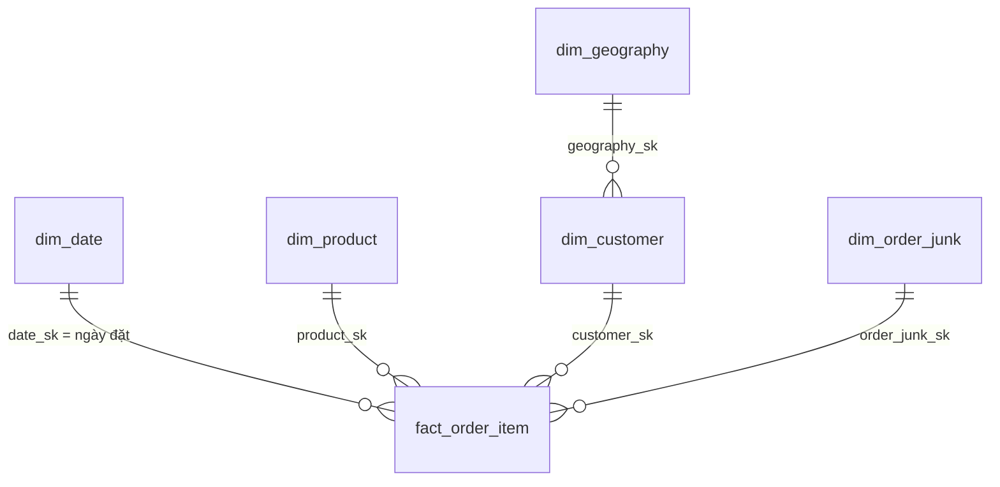

# Thiết kế star schema — doanh thu PS1–PS5 và mở rộng nghiệp vụ

Cập nhật: 2026-09-27. Đây là **bản thiết kế chuẩn**; không phải biên bản deploy.
Nguồn nghiệp vụ: [deck updated](presentations/revenue_performance_problem_statement_updated.pptx), đặc biệt quy ước slide 3.
Bằng chứng chạy lại: [star_schema_validation.ipynb](../notebooks/02_design/star_schema_validation.ipynb).
[Truy vết từng PS](star_schema_tu_ps.md) · [Roadmap](dwh_roadmap.md) · [Hướng dẫn PM/BA](dwh_huong_dan_pm_ba.md).

## 1. Bắt đầu từ nghiệp vụ, không bắt đầu từ số bảng

Câu chuyện chính: doanh thu ghi nhận theo quy ước của đề tài thay đổi thế nào, phần chênh lệch nằm ở trạng thái
đơn hàng, số đơn, số món/đơn, giá thực thu/món, nhóm hàng, khu vực hay kênh thu hút khách?

Ví dụ: một đơn có hai dòng A và B tạo **hai dòng fact**, nhưng chỉ là **một đơn N**; nếu đã giao, cả hai
dòng đóng góp vào R và Q. Nếu phân tích theo category, đơn có thể xuất hiện ở hai nhóm: không cộng số đơn
của các category để ra số đơn toàn công ty. Khi đơn chuyển sang returned, quy ước đề tài loại **toàn bộ đơn**
khỏi R, kể cả trường hợp nguồn chỉ ghi nhận trả một phần.

Thứ tự thiết kế: **quy trình nghiệp vụ → một dòng đại diện điều gì (grain) → dimension → measure → KPI**.
PS1–PS5 là các góc nhìn của cùng quy trình bán hàng, không phải năm fact khác nhau.
Nghiệp vụ mới có grain khác sẽ có fact riêng, tái sử dụng dimension phù hợp.

### Phạm vi và trạng thái

| Thành phần | Vai trò | Trạng thái |
|---|---|---|
| Lõi bán hàng: fact_order_item + 5 dimension liên quan | Đủ chi tiết cho PS1–PS5 | Có trong dbt/local |
| Reporting: 1 view chi tiết + 4 rpt_* | Định nghĩa KPI dùng chung cho app/BI | Có trong dbt/local |
| 6 fact còn lại + promotion/bridge | Nghiệp vụ khác hoặc dữ liệu tham chiếu | Có trong dbt/local; không xóa vì ngoài PS |
| CAGR theo giai đoạn, bảng điểm đổi hướng PS2 | Kết quả phân tích có tham số | Chưa triển khai/chưa chốt ranh giới |
| Snowflake production, app code, Kafka | Đích phát triển | Không được coi là đã deploy |

Đợt sửa này chỉ thay thiết kế, sơ đồ và bằng chứng; không đổi model dbt, không rebuild warehouse.
Chi tiết DDL và kiểm chứng lịch sử được giữ tại [phụ lục snapshot](star_schema_snapshot_reference.md);
nếu xung đột về mục tiêu/KPI/trạng thái, dùng tài liệu này và code hiện hành.

## 2. Grain và khóa của lõi bán hàng

| Thành phần | Một dòng là | Khóa / quan hệ |
|---|---|---|
| fact_order_item | Một dòng hàng trong đơn | PK order_item_sk; unique (order_id, line_number) |
| dim_date | Một ngày lịch | date_sk = YYYYMMDD; full_date unique |
| dim_product | Một sản phẩm trong snapshot hiện tại | product_sk; product_id là business key |
| dim_customer | Một khách trong snapshot hiện tại | customer_sk; customer_id là business key |
| dim_geography | Một mã vùng trong nguồn hiện tại | geography_sk; zip là business key của snapshot |
| dim_order_junk | Một tổ hợp trạng thái, phương thức thanh toán, thiết bị, nguồn đơn | order_junk_sk; unique tổ hợp 4 thuộc tính |

`order_id` là degenerate dimension trên dòng hàng. `line_number` được tái dựng theo thứ tự nguồn trong đơn.
`(order_id, product_id)` **không unique**; `(order_id, line_number)` mới là khóa ghép hợp lệ của snapshot.
Surrogate key giúp tham chiếu gọn, không phải vì mọi khóa tự nhiên đều không tồn tại.

Fact lưu tất cả trạng thái để giữ được G và phân rã G → R. Các measure gốc:
`quantity`, `unit_price`, `gross_amount = quantity × unit_price`, `discount_amount`,
`net_amount = gross_amount − discount_amount`. `cogs_amount` vẫn tồn tại nhưng không phải KPI chính của 5 PS.
Không dùng `dim_product.current_price` để tính lại doanh thu quá khứ.

### Quan hệ vật lý lõi



Geography là **outrigger qua customer**, không có geography_sk trực tiếp trên fact_order_item.
Do đó đây là mô hình chiều thiên star có một outrigger, không tuyên bố là pure star.
Region hiện mô tả vùng của khách trong snapshot, không tự đổi nghĩa thành vùng giao hàng.
Tên nền tảng **Snowflake** không bắt buộc mô hình phải là snowflake schema.

[Sơ đồ lõi](design/diagrams/star_schema_core.png) · [Toàn cảnh](design/diagrams/star_schema_overview.png) ·
[Bus matrix](design/diagrams/star_schema_bus_matrix.png) · [PDF 3 trang](design/diagrams/star_schema_diagrams.pdf) ·
[ERD vật lý đầy đủ](design/star_schema.mmd).

## 3. Hợp đồng KPI: cùng định nghĩa ở mọi công cụ

Tất cả kỳ của PS1–PS5 dùng **ngày đặt hàng** và trạng thái có trong snapshot đang phân tích.
R là định nghĩa phân tích của đề tài, không khẳng định đó là dòng tiền thu vào theo ngày thanh toán
hay doanh thu ghi nhận kế toán.

| Ký hiệu | Định nghĩa ở đúng tập lọc và grain báo cáo | Cộng tính |
|---|---|---|
| G | SUM(gross_amount), mọi trạng thái | Cộng qua các tập dòng không giao nhau |
| R | SUM(net_amount), chỉ order_status = delivered | Cộng qua các tập dòng không giao nhau |
| Q | SUM(quantity), chỉ delivered | Như R |
| N | COUNT DISTINCT order_id, chỉ delivered | Không cộng tùy ý qua category; cộng được qua kỳ ngày đặt không giao nhau |
| C | COUNT DISTINCT customer_sk, chỉ delivered | Không cộng qua tháng, nhóm hàng hoặc các tập có chung khách |
| U | Q/N | Tính lại tử/mẫu |
| P | R/Q | Giá thực thu bình quân mỗi món; tính lại tử/mẫu |
| F | N/C | Tính lại tử/mẫu |
| AOV | R/N = U × P | Tính lại tử/mẫu |

Mẫu số bằng 0 → NULL, không tự thay bằng 0. Khi triển khai SCD2, C phải đếm **định danh khách bền vững**
(`customer_id` hoặc durable key), không đếm số phiên bản customer_sk.

Đối soát PS1:

```text
G − R = gross_cancelled + gross_returned
      + gross_created_paid_shipped + discount_delivered
```

Đơn returned đã bị loại khỏi R: không trừ thêm refund_amount.
R từ fact đối chiếu với `payments.csv` của đơn delivered; G đối chiếu `sales.csv`.
`fact_order.payment_value` và `fact_daily_sales.revenue` được dẫn xuất từ dòng hàng trong dbt:
đối chiếu chúng là kiểm tra nội bộ, **không thay thế đối chứng từ CSV độc lập**.

### Lịch phân tích

- Phân tích chính: 10 năm đủ **2013–2022**; YoY năm bắt đầu 2014.
- 2012 giữ để tham khảo và làm lịch sử rolling, không so năm thiếu với năm đủ.
- YoY tháng bắt đầu 08/2013; rolling 12 tháng đủ đầu tiên kết thúc 07/2013
  (08/2012–07/2013). Tháng 07/2012 thiếu ba ngày đầu.
- Chỉ số tháng = R tháng / (R năm / 12), chỉ áp dụng năm đủ.
- Cuối tháng: ngày >= 26; share = R ngày >=26 / R tháng; kỳ vọng lịch = (D−25)/D.
- `month_start_date`, `days_in_month` đã có trong dim_date; chẵn/lẻ năm có thể dẫn xuất.
- Dữ liệu `sample_submission.csv` là **mẫu nộp bài**, không phải dự báo đã huấn luyện.
  `fact_daily_sales.is_actual = false` chỉ tách vùng mẫu; không đủ để chứng minh forecast thật.

## 4. Lớp reporting phục vụ PS1–PS5

| Model hiện có | Grain | Vai trò |
|---|---|---|
| int_reporting_order_items | Một dòng hàng | Join dimension một-một theo FK, giữ đủ trạng thái và measure |
| rpt_revenue_monthly | Một tháng | PS1, PS2, PS3: R/G, YoY, rolling, seasonality, cuối tháng |
| rpt_revenue_yearly | Một năm | PS1, PS2, PS4, PS5: R/G, N/U/P, C/F, phân rã |
| rpt_revenue_segment_yearly | Một chiều × một nhóm × một năm | PS5: category, region, acquisition_channel là 3 lát cắt riêng |
| rpt_august_parity | Một dòng cho cửa sổ phân tích | PS3: bình quân index tháng 8 năm lẻ / năm chẵn − 1 |

Không cộng ba `dimension_name` của segment_yearly với nhau. Báo cáo được lọc nhiều chiều hoặc khoảng ngày
tùy chọn phải tính lại từ detail ở đúng grain; không cộng C năm/tháng hoặc lấy AVG của các tỷ lệ đã tổng hợp.

PS4 dùng phân rã tuần tự **N → U → P**, với 0 là năm trước, 1 là năm sau:

```text
ΔR_N = (N1−N0) × U0 × P0
ΔR_U = N1 × (U1−U0) × P0
ΔR_P = N1 × U1 × (P1−P0)
ΔR   = ΔR_N + ΔR_U + ΔR_P

ΔN_C = (C1−C0) × F0
ΔN_F = C1 × (F1−F0)
ΔN   = ΔN_C + ΔN_F
```

Đây là quy tắc phân bổ số học, phụ thuộc thứ tự, **không chứng minh nguyên nhân**.
C giảm nghĩa là ít khách có đơn delivered trong kỳ hơn; chưa đủ kết luận churn.

### Phần còn thiếu của PS2

CAGR theo giai đoạn: `(R_end / R_start) ** (1 / (end_year − start_year)) − 1`,
chỉ cho hai năm đủ, end_year > start_year và R_start > 0.
Mốc giai đoạn và điểm đổi hướng do BA phân tích/chấp thuận, không mặc định một ranh giới vào dim_date.
**PM/BA đã chốt ngày 2026-09-27** 4 giai đoạn: A 2013→2016 tăng, B 2016→2018 chững/giảm nhẹ, C 2018→2019 sập,
D 2019→2022 đi ngang; hai điểm đổi hướng ở cuối 2016 và cuối 2018. Quy tắc và số liệu:
[hướng dẫn PM/BA §4 — PS2](dwh_huong_dan_pm_ba.md#ps2-4-giai-đoạn-doanh-thu-pmba-chốt-ngày-2026-09-27).
Đề xuất lớp phân tích có tham số `start_year, end_year, method, analysis_version`;
không cần thêm fact hoặc dimension chỉ để chứa một câu trả lời PS2.
Đã triển khai ngày 2026-09-27 bằng seed `ps2_phases` + `rpt_revenue_phase` + `rpt_revenue_turning_point`, khóa bằng test `assert_rpt_phase`.
Bổ sung 2026-09-28: tháng đổi hướng do dữ liệu tự tìm, seed `ps2_direction_rule` + `rpt_revenue_direction` + `rpt_revenue_direction_change`, test `assert_rpt_direction`.

## 5. Bus matrix: thêm nghiệp vụ bằng fact mới

**D**: FK trực tiếp; **I**: truy cập gián tiếp qua dòng hàng/khách; **B**: bridge M:N; **—**: không áp dụng.
I không đồng nghĩa đã có FK trên fact, cũng không cho phép join nhiều fact detail rồi SUM.

| Quy trình / fact | Grain | Date và vai trò | Customer | Geography | Product | Promotion | Order junk | Trạng thái |
|---|---|---|---|---|---|---|---|---|
| Bán hàng / fact_order_item | Dòng hàng của đơn | D: đặt hàng | D | I | D | B | D | Có; lõi PS |
| Vòng đời đơn / fact_order | Đơn | D: đặt, gửi, giao | D | I | — | — | D | Có; snapshot tích lũy |
| Trả hàng / fact_return | return_id | D: ngày trả | I | I | I | — | I | Có; sự kiện trả |
| Đánh giá / fact_review | review_id | D: ngày đánh giá | I | I | I | — | I | Có; sự kiện đánh giá |
| Tồn kho / fact_inventory_snapshot | Sản phẩm × mốc cuối tháng | D: snapshot | — | — | D | — | — | Có; periodic snapshot |
| Tổng gross / fact_daily_sales | Ngày | D: ngày bán | — | — | — | — | — | Có; aggregate/tham chiếu |
| Web / fact_web_traffic | Ngày trong nguồn hiện tại | D: ngày traffic | — | — | — | — | — | Có; tổng hợp ngày |
| Thanh toán / fact_payment_event | Một payment event có ID ổn định | D: ngày thanh toán | D nếu định danh được | I nếu cùng nghĩa vùng khách | — | — | — | **Đề xuất**, chưa có event source |

`fact_payment_event` là ví dụ mở rộng, không suy diễn rằng `payments.csv` hiện tại chứa event history.
`dim_order_junk` chứa ngữ nghĩa của **đơn hàng**, không tái sử dụng máy móc cho trạng thái thanh toán hoặc tồn kho.
Khuyến mãi qua bridge chỉ cho biết liên kết; nếu muốn doanh thu theo promotion phải có quy tắc
phân bổ trọng số được duyệt, hoặc lọc bằng EXISTS để giữ nguyên grain.

### Hợp đồng conformed dimension

1. **Định danh:** cùng business entity, business key và bảng ánh xạ surrogate key; không tự tạo lại dim_customer riêng cho mỗi fact.
2. **Thuộc tính:** cùng kiểu dữ liệu, chuẩn hóa, tập giá trị và ngữ nghĩa (acquisition_channel của khách khác order_source của đơn).
3. **Lịch sử:** cùng quy tắc Type 1/Type 2 và phép tra phiên bản tại thời điểm sự kiện; không trộn “vùng hiện tại” với “vùng tại lúc mua”.
4. **Vai trò:** một dim_date dùng cho ngày đặt/gửi/giao/trả, nhưng báo cáo phải ghi rõ vai trò đang so sánh.
5. **Thiếu/đến muộn:** thiết kế tương lai dùng unknown member và hàng đợi xử lý late-arriving dimension,
   kèm tỷ lệ lỗi/đối soát; không silently drop fact vì INNER JOIN không tìm thấy key.
6. **Quản trị:** mỗi fact mới phải công bố grain, PK/unique key, FK, metric, tính cộng được, nguồn và kiểm thử trước khi publish.

Dimension mới chỉ cần khi có một trục nghiệp vụ thực sự mới (ví dụ warehouse hoặc payment status),
không phải vì thêm một dashboard.

### Nối nhiều fact an toàn (drill-across)

Ví dụ bán hàng ngày × sản phẩm và tồn kho cuối tháng × sản phẩm: tổng hợp bán hàng về
**tháng × sản phẩm**, chọn đúng snapshot tồn cuối tháng, rồi mới nối hai tập đã unique ở grain chung.
Không SUM stock_on_hand qua thời gian; không cộng/AVG fill_rate hay days_of_supply một cách tùy ý.
Nếu trả hàng chỉ có product gián tiếp, enrich fact_return qua đúng một order_item trước, rồi aggregate riêng
theo ngày trả × product; sales aggregate riêng theo ngày đặt × product. Nối sau tổng hợp không có nghĩa
doanh thu ngày đó và refund ngày đó thuộc cùng đơn.

Web traffic chỉ có ngày để căn chỉnh với doanh thu; không có customer/order FK trong nguồn.
Cùng ngày không chứng minh chuyển đổi phiên truy cập → đơn, hoặc tác động nhân quả của traffic.
Một dimension chung không tự làm hai fact khác grain nối an toàn.

## 6. Snapshot hiện tại và thiết kế production sau này

| Vấn đề | Hiện tại | Hợp đồng cần có trước incremental/production |
|---|---|---|
| Surrogate key | ROW_NUMBER khi full rebuild | Persistent key mapping/sequence; không đánh lại key làm hỏng FK |
| line_number | Thứ tự dòng trong file nguồn | ID dòng ổn định từ source hoặc manifest lưu thứ tự nguồn; replay không đổi identity |
| Dimension history | Type 1, snapshot thuộc tính hiện có | Chỉ SCD2 khi có thay đổi được capture; effective_from/to, current flag, as-of lookup |
| Giá sản phẩm | Giá bán thực nằm trong fact | Không dựng lịch sử dimension giả từ current_price; cogs hiện tại không phải bằng chứng giá vốn lịch sử |
| Trạng thái đơn | Trạng thái tại snapshot extract | Event ID/version, dedup, idempotent merge, xử lý event muộn |
| R theo order_date | Dùng trạng thái extract để phân loại dòng quá khứ | Đổi trạng thái phải tính lại ngày/tháng đặt gốc; không ghi delta sai sang ngày event |
| Tái hiện deck | CSV hiện tại | Freeze version/hash nguồn + phiên bản code/KPI + snapshot báo cáo |
| Publish | dbt build/test local | Gate chất lượng + atomic/versioned promotion; test FAIL không tự bảo đảm dashboard không thấy bảng dở |
| Triển khai | Local PostgreSQL/DuckDB | Snowflake: staging/test/prod, quyền tối thiểu, secrets, scheduler, cost guardrails, phục hồi/replay |

Thêm Kafka sau khi pipeline chính ổn định. CSV tĩnh có thể replay để demo kỹ thuật nhưng phải ghi là
**mô phỏng**, không gọi đó là dữ liệu kinh doanh realtime thật.
Không suy diễn production-ready chỉ vì đủ sơ đồ hoặc local test PASS.

## 7. Bằng chứng và cách kiểm lại

Notebook [star_schema_validation.ipynb](../notebooks/02_design/star_schema_validation.ipynb) đọc CSV và
attach `warehouse/dbt.duckdb` **read-only**; các bảng kiểm tra chỉ ở bộ nhớ, không chạy dbt.
Notebook có manifest SHA-256 nguồn/database, key/grain, schema và join cardinality,
đối soát money kiểu decimal, lịch/KPI, phân rã, và phản ví dụ cộng distinct/join bridge.

Lần chạy 2026-09-27: **198/198 kiểm tra PASS**, toàn bộ 9 code cell đã chạy; SHA-256 của
14 CSV nguồn và database không đổi trước/sau kiểm tra. Đây là kiểm chứng snapshot local, không phải dbt build mới.

Mốc số của snapshot đang bàn giao (đối chiếu output notebook, không coi là hằng số production):

| Phạm vi | G | R |
|---|---:|---:|
| Toàn lịch sử 2012–2022 | 16,430,476,585.53 | 12,518,175,957.20 |
| 10 năm đủ 2013–2022 | Xem notebook | 11,926,403,468.90 |

Lõi có 714,669 dòng hàng. Số tiền giữ đơn vị của nguồn; chưa tự gắn một mã tiền tệ.
Bằng chứng lịch sử sâu hơn: [data_model.ipynb](../notebooks/02_design/data_model.ipynb) và
[phụ lục snapshot](star_schema_snapshot_reference.md). Số test/build trong phụ lục là lịch sử,
không thay thế kết quả chạy lần này.

Chạy từ repo root (kernel dùng môi trường .venv):

```powershell
.venv\Scripts\python.exe scripts/docs_gen/build_star_diagram.py
```

Mở notebook và Run All để kiểm dữ liệu. Không cần tài khoản Snowflake; notebook này không kiểm deployment.
