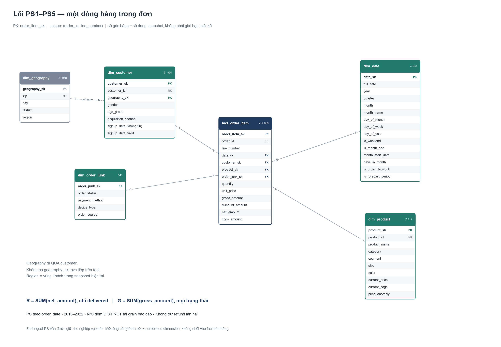
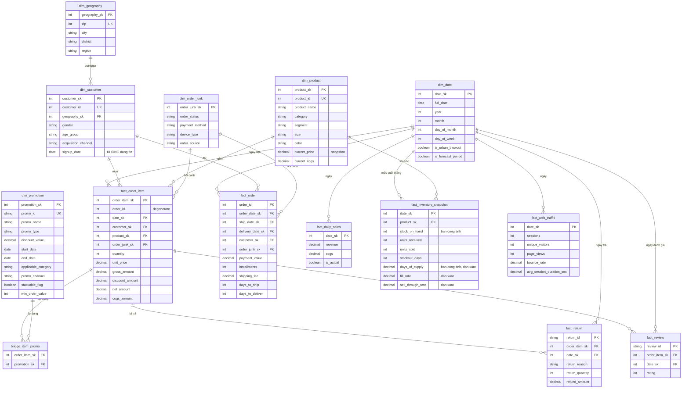

# Phụ lục snapshot — thiết kế vật lý và kiểm chứng lịch sử

> Lưu nguyên bản thiết kế trước đợt chỉnh ngày 2026-09-27 để không mất DDL và bằng chứng cũ.
> Đây không phải thiết kế nghiệp vụ chuẩn hay xác nhận trạng thái production hiện tại.
> Đọc [star_schema.md](star_schema.md) cho KPI PS1–PS5, bus matrix và hợp đồng mở rộng.
> Các dự báo, lựa chọn công cụ, giới hạn dịch vụ, số dòng/test và tham chiếu mục bên dưới là thông tin lịch sử;
> không dùng như xác nhận hiện hành. DDL dim_date bên dưới có thể chưa phản ánh cột reporting mới.

# Star Schema — Datathon 2026 Round 1

Thiết kế mô hình dữ liệu chiều (dimensional model) cho 14 file CSV nguồn.
Mọi quyết định dưới đây đều dựa trên kiểm chứng trong `notebooks/02_design/data_model.ipynb`.

> **Tài liệu song song:** `normalized_schema.md` — cùng dữ liệu, mô hình chuẩn hóa 3NF (19 bảng),
> kiểm chứng trong `notebooks/02_design/normalization.ipynb`. Hai mô hình tối ưu cho hai workload khác nhau;
> so sánh và tiêu chí chọn nằm ở `normalized_schema.md` §9.
>
> **Thứ tự đọc:** file này đi từ dữ liệu lên (bottom-up). Phần dẫn thiết kế từ nghiệp vụ, theo thứ tự
> PS → KPI → grain → fact → dimension, nằm ở `star_schema_tu_ps.md`; đọc file đó trước. Các bằng chứng dữ liệu
> ở §1–§6 dưới đây là bước kiểm chứng cho thiết kế đó.

---

## 1. Tóm tắt kiểm tra toàn vẹn

| Kiểm tra | Kết quả |
|---|---|
| Orphan FK (14 quan hệ) | **0** — dữ liệu sạch tuyệt đối |
| PK tự nhiên hợp lệ | 11/13 bảng |
| `order_items(order_id, product_id)` | ❌ **16 cặp trùng** → cần surrogate key |
| `returns`/`reviews` khớp `(order_id, product_id)` | **100%** → tham chiếu *dòng hàng*, không phải đơn |
| Bản sao phi chuẩn hóa (5 cặp cột) | **100% nhất quán** → dư thừa thuần túy, bỏ được |
| `payments.payment_value` == tổng net dòng hàng | **100%** → bảng suy ra được |

---

## 1b. Vì sao chọn star schema, không chọn snowflake

Snowflake tách dimension theo **cây phân cấp** (vd. `product → segment → category`) để bớt lặp chuỗi.
Cách đó chỉ đáng khi thỏa **cả hai** điều kiện: dimension có cây lồng nhau thật, và đủ lớn để phần
tiết kiệm bù được join thêm. Dataset này không thỏa điều kiện nào.

**1. Không có cây phân cấp để tách.** Hai dimension ứng viên đều không lồng nhau
(`notebooks/02_design/data_model.ipynb` §5.2 và §5.2b):

| Dimension | Phân cấp tưởng có | Thực tế |
|---|---|---|
| geography | zip → city → district → region | `city` và `district` đều quy về `region` nhưng **cắt chéo**: 1 city trải 7–19 district, 1 district trải 12–16 city (§5.4) |
| product | product → segment → category | 1 segment thuộc **1–2 category**, 1 category có 1–4 segment — không có cây |
| date | ngày → tháng → quý → năm | có cây, nhưng Kimball khuyên **không** tách `dim_date` (chỉ 4.566 dòng) |

Snowflake hóa geography hay product sẽ phải chọn một nhánh tùy ý và làm mất nhánh còn lại.

**2. Dimension quá nhỏ, tách ra không tiết kiệm được gì.** Thuộc tính sẽ bị tách chỉ có
42 city, 39 district, 3 region, 4 category, 8 segment. Dimension lớn nhất (`dim_customer`) có
121.930 dòng, trong khi `fact_order_item` có 714.669 dòng — dung lượng nằm ở fact, không ở dimension.

**3. Workload chỉ đọc, phục vụ phân tích và dự báo.** Dữ liệu là 14 file CSV tĩnh, không có nghiệp vụ
ghi, nên update anomaly mà snowflake giảm bớt ở đây chỉ là giả định (`normalized_schema.md` §9.6).
Cái snowflake để lại là **thêm join**: "doanh thu theo region" cần 2 join ở star, 5 join ở 3NF
(`normalized_schema.md` §9.5).

**4. Đầu chuẩn hóa tối đa đã được làm và dùng đúng chỗ.** `normalized_schema.md` (19 bảng, 3NF) chính là
snowflake ở mức cực đoan nhất. Nhóm dùng nó để **chẩn đoán** cấu trúc dữ liệu, không để truy vấn.
Hai mô hình nằm trên cùng một trục:

```text
3NF (19 bảng) ──── snowflake ──── STAR (14 bảng) ──── One Big Table (1 bảng)
chẩn đoán cấu trúc                 phân tích / BI       feature cho model
```

**Về `dim_geography → dim_customer`:** đây là một *outrigger* (Kimball), không phải snowflake —
`dim_geography` phẳng ở grain = zip, không tách tiếp thành bảng city/district/region. Nếu muốn
star thuần, gộp thẳng `city/district/region` vào `dim_customer` như §5.4 đề xuất.

---

## 2. Sơ đồ ERD

Bản vẽ để trình bày (sinh bằng `scripts/docs_gen/build_star_diagram.py`, gộp PDF ở `docs/design/diagrams/star_schema_diagrams.pdf`):

| Hình | Nội dung |
|---|---|
| [`star_schema_core.png`](design/diagrams/star_schema_core.png) | Ngôi sao lõi: `fact_order_item` ở tâm, đủ cột, kèm outrigger và bridge |
| [`star_schema_overview.png`](design/diagrams/star_schema_overview.png) | Toàn cảnh 7 fact dùng chung 6 dimension (fact constellation) |
| [`star_schema_bus_matrix.png`](design/diagrams/star_schema_bus_matrix.png) | Bus matrix: fact nào nối dimension nào, grain và loại fact |



ERD dạng mermaid (bản rút gọn bên dưới; bản **đủ cột theo DDL §7**, kèm chú thích và 3 vai trò
ngày của `fact_order`, nằm ở [`docs/design/star_schema.mmd`](design/star_schema.mmd) — song song với `docs/design/normalized_schema.mmd`):



---

## 3. Ánh xạ nguồn → đích (14 file CSV → 14 bảng)

| File nguồn | Bảng đích | Ghi chú |
|---|---|---|
| `customers.csv` | `dim_customer` | 1:1; bỏ `city` (trùng `geography`) |
| `geography.csv` | `dim_geography` | 1:1 |
| `products.csv` | `dim_product` | 1:1; `price`/`cogs` → giá trị *hiện tại* |
| `promotions.csv` | `dim_promotion` | 1:1 |
| `orders.csv` | `fact_order` + `dim_order_junk` | 4 cột cardinality thấp → junk dim; bỏ `zip` |
| `order_items.csv` | `fact_order_item` + `bridge_item_promo` | `promo_id`/`promo_id_2` → bridge |
| `payments.csv` | **hấp thụ** vào `fact_order` | chỉ `installments` sống sót — xem §5.2 |
| `shipments.csv` | **hấp thụ** vào `fact_order` | `ship_date`/`delivery_date` → 2 FK ngày + 2 lag; `shipping_fee` → measure |
| `returns.csv` | `fact_return` | FK trỏ dòng hàng |
| `reviews.csv` | `fact_review` | bỏ `customer_id`, `review_title` |
| `inventory.csv` | `fact_inventory_snapshot` | bỏ 3 cột thuộc tính SP + `reorder_flag` |
| `web_traffic.csv` | `fact_web_traffic` | 1:1 |
| `sales.csv` | `fact_daily_sales` (`is_actual=TRUE`) | aggregate fact |
| `sample_submission.csv` | `fact_daily_sales` (`is_actual=FALSE`) | 548 dòng dự báo |
| *(sinh mới)* | `dim_date` | không có file nguồn — sinh từ dải ngày |

**Không file nguồn nào bị bỏ.** Hai file (`payments`, `shipments`) không có bảng riêng vì
quan hệ 1:1 / 1:0..1 với `orders` — chúng trở thành cột của `fact_order`.

---

## 4. Bảng fact — grain và loại

| Bảng | Grain | Loại fact | Số dòng |
|---|---|---|---|
| `fact_order_item` | 1 dòng hàng trong đơn | Transaction | 714.669 |
| `fact_order` | 1 đơn hàng | **Accumulating snapshot** (đặt → giao → nhận) | 646.945 |
| `fact_daily_sales` | 1 ngày | **Aggregate/summary** (suy ra từ `fact_order_item`) | 4.381 |
| `fact_inventory_snapshot` | 1 (cuối tháng × sản phẩm) | **Periodic snapshot** — *bán cộng tính* | 60.247 |
| `fact_return` | 1 dòng trả hàng | Transaction | 39.939 |
| `fact_review` | 1 đánh giá | Transaction | 113.551 |
| `fact_web_traffic` | 1 ngày | Transaction | 3.652 |

**Bán cộng tính (semi-additive):** `stock_on_hand` và `days_of_supply` **không được SUM qua nhiều ngày** —
chỉ cộng được theo sản phẩm trong *cùng một* mốc snapshot. Qua thời gian phải dùng AVG hoặc lấy mốc cuối.

**Measure dẫn xuất giữ có chủ ý:** 5 cột cuối của `fact_inventory_snapshot` (`days_of_supply`,
`fill_rate`, `sell_through_rate`, `stockout_flag`, `overstock_flag`) đều **tính được** từ
`stock_on_hand` / `units_sold` / `stockout_days`, khớp 100% trên cả 60.247 dòng — công thức ở
`normalized_schema.md` §5. Mô hình chuẩn hóa bỏ hết; ở đây **giữ lại** để khỏi tính lại mỗi truy vấn.
Đó là phi chuẩn hóa có chủ đích (§9.5 của tài liệu kia), không phải bỏ sót — nhưng ETL phải **tính**
chúng theo công thức, đừng chép thẳng từ `inventory.csv`.

---

## 5. Các quyết định thiết kế và bằng chứng

### 5.1 `fact_order_item` bắt buộc dùng surrogate key

16 cặp `(order_id, product_id)` xuất hiện 2 lần — cùng sản phẩm, cùng đơn, nhưng **giá và số lượng khác nhau**:

```text
order_id  product_id  quantity  unit_price
   14280         976         1     4019.47
   14280         976         2     3937.99
```

→ khóa tổ hợp không hợp lệ. Dùng `order_item_sk` tự tăng. `order_id` giữ lại làm **degenerate dimension**.

**Hệ quả:** `returns` và `reviews` khớp `(order_id, product_id)` 100%, nhưng với 16 khóa trùng này thì
join theo khóa tự nhiên là **nhập nhằng**. Khi ETL phải gán `order_item_sk` bằng thứ tự dòng ổn định
(ví dụ thêm `line_number` theo thứ tự xuất hiện trong file nguồn) rồi mới join.

### 5.2 Bỏ bảng `payments` — nó suy ra được

- `payments.payment_value` == tổng `(quantity × unit_price − discount_amount)` của đơn: **khớp 100%**
- `payments.payment_method` == `orders.payment_method`: **lệch 0/646.945**

→ chỉ `installments` là thông tin mới. Gộp vào `fact_order`, xóa bảng `payments`.

> ⚠️ Lưu ý ngữ nghĩa: `payments` dùng giá trị **net** (đã trừ discount), nhưng
> `sales.csv` lại tính Revenue theo **gross** (chưa trừ discount). Hai định nghĩa doanh thu
> khác nhau cùng tồn tại trong nguồn — phải chọn và ghi rõ trong metric layer.

### 5.3 Không có ship-to dimension

`orders.zip` == `customers.zip` ở **cả 646.945 đơn** (lệch 0). Đây là bản sao phi chuẩn hóa,
**không phải địa chỉ giao hàng riêng**. Vì vậy:

- không có role-playing dimension cho địa chỉ giao
- `dim_geography` chỉ tiếp cận qua `dim_customer`
- bỏ cột `orders.zip`

### 5.4 `dim_geography` phẳng — không có phân cấp duy nhất

39.948 zip → chỉ 42 city, 39 district, 3 region. Kiểm tra phân cấp:

| Quan hệ | Nested? |
|---|---|
| district → region | ✅ có (1:1) |
| city → region | ✅ có (1:1) |
| city → district | ❌ 1 city trải 7–19 district |
| district → city | ❌ 1 district trải 12–16 city |

→ `city` và `district` **đều roll-up về region nhưng cắt chéo nhau**, không lồng nhau.
Không tồn tại một cây snowflake duy nhất. Giữ `dim_geography` **phẳng ở grain = zip**
(lý do chọn star thay vì snowflake: xem §1b).

*Phương án thực dụng:* vì chỉ có 42/39/3 giá trị, có thể denormalize thẳng `city/district/region`
vào `dim_customer` và bỏ hẳn `dim_geography` — tiết kiệm một join, chi phí lưu trữ không đáng kể.

### 5.5 `dim_order_junk` — 540 dòng

`order_status`(6) × `payment_method`(5) × `device_type`(3) × `order_source`(6) = 540 tổ hợp,
và **cả 540 tổ hợp đều xuất hiện** trong dữ liệu. Gộp thành 1 junk dimension thay vì 4 dimension rời.

*(Việc đủ 540/540 tổ hợp với phân bố đều là dấu hiệu dữ liệu được sinh tổng hợp.)*

### 5.6 `review_title` **không** phải junk dimension

> ⚠️ **ĐÃ SỬA — mục này từng ghi sai chiều phụ thuộc.** Xem `normalized_schema.md` §4.3.
> Chiều đúng là `review_title → rating` (0 vi phạm/18 title), **không phải** `rating → review_title`
> (5 vi phạm/5 rating — mỗi rating dùng 3–4 title khác nhau).
> Hệ quả: bảng tra cứu phải khóa theo **title** và có **18 dòng**, không phải `dim_rating` 5 dòng.

`review_title` (18 giá trị) không phải chiều độc lập: **0/18 title xuất hiện ở nhiều hơn 1 rating**,
nên mỗi title xác định đúng một rating. Hoặc bỏ cột, hoặc tách bảng
`review_title_label(review_title PK, rating)` — 18 dòng.

### 5.7 Chiến lược SCD

| Dimension | Kiểu | Lý do |
|---|---|---|
| `dim_product` | **Type 1** + giá lưu trong fact | `unit_price` khớp `products.price` chỉ **0,03%**; trung vị **88 giá khác nhau/sản phẩm** (max 7.777). Đáng lẽ cần Type 2, **nhưng nguồn không có cột effective date nào** để dựng lịch sử. `products.price` chỉ là snapshot hiện tại. |
| `dim_customer` | **Type 1 vì bắt buộc** | `signup_date` không dùng được: **73,8% đơn phát sinh TRƯỚC ngày signup**, độ lệch trung vị 1.468 ngày. Không có lịch sử thuộc tính nào trong nguồn. |
| `dim_geography` | Type 1 | tĩnh |
| `dim_promotion` | Type 1 | có sẵn `start_date`/`end_date` làm hiệu lực |

### 5.8 `bridge_item_promo` cho quan hệ M:N

`order_items` có 2 cột `promo_id`, `promo_id_2` — đây là M:N bị nhét vào cột lặp (vi phạm 1NF).
Chuẩn hóa thành bridge table.

*Thực tế:* `promo_id` có giá trị ở 38,7% dòng; `promo_id_2` chỉ **206 dòng (0,03%)** với đúng 2 giá trị.
Bridge là đúng về mặt thiết kế dù dữ liệu hiện tại gần như không dùng cột thứ hai.

**Khóa chính `(order_item_sk, promotion_sk)` đã được kiểm chứng là không thể đụng độ:**
trong 206 dòng có `promo_id_2`, số dòng có `promo_id == promo_id_2` là **0**, và `promo_id`
luôn khác NULL khi `promo_id_2` có giá trị. Vậy kích thước bridge = 276.316 + 206 = **276.522** dòng.

Hai cặp promo đồng thời duy nhất xuất hiện đều nằm trong **cửa sổ chồng lấn** của hai đợt khuyến mãi:

| Cặp | Số dòng | Chồng lấn |
|---|---|---|
| `PROMO-0013` (Fall Launch 2015) + `PROMO-0015` (Urban Blowout 2015) | 132 | 30/08 – 02/09/2015 |
| `PROMO-0023` (Fall Launch 2017) + `PROMO-0025` (Urban Blowout 2017) | 74 | 30/08 – 02/10/2017 |

→ `promo_id_2` không phải cột tùy tiện: nó chỉ xuất hiện khi hai promo `stackable` trùng thời gian.
Đây là bằng chứng thêm cho việc dùng bridge table thay vì 2 cột lặp.

### 5.9 `fact_daily_sales` là aggregate fact — và là bảng duy nhất vượt 2022

Đã chứng minh (xem `notebooks/01_exploration/eda.ipynb`) `sales.csv` **suy ra chính xác** từ `fact_order_item`:

```sql
revenue = SUM(gross_amount)   -- TẤT CẢ đơn, KHÔNG trừ discount
cogs    = SUM(cogs_amount)
```

sai số tương đối 2e-16. Đây là **bảng tổng hợp**, không phải nguồn sự thật độc lập.

Nhưng nó là fact **duy nhất phải mở rộng quá 2022-12-31** để chứa 548 dòng dự báo
(2023-01-01 → 2024-07-01). Dùng cờ `is_actual` để phân biệt thực tế và dự báo.

---

## 6. Vấn đề chất lượng dữ liệu → quy tắc kiểm tra khi load

| # | Vấn đề | Mức độ | Xử lý đề xuất |
|---|---|---|---|
| 1 | **`products.price` có 2 hệ đơn vị**: 688 SP giá 9–984, 1.724 SP giá 1.007–40.950. Cùng `(name, size, color)` xuất hiện ở cả hai (12.596 vs 34,03). Xen kẽ theo `product_id`, không thành khối. **Nhưng ranh giới thật là 100, không phải 1000** — xem ghi chú bên dưới bảng | 🔴 Cao | **Lỗi dữ liệu, không phải trục phân tích.** Đừng tạo thuộc tính `price_tier`. Đặt rule cảnh báo khi load ở ngưỡng `price < 100`. **Cờ `dim_product.price_anomaly` chỉ dùng để LỌC khi load và audit — không được GROUP BY** |
| 2 | **`signup_date` sinh ngẫu nhiên**: 73,8% đơn trước ngày đăng ký | 🔴 Cao | Không dùng tính tenure/cohort. Đánh dấu không đáng tin trong catalog |
| 3 | **`inventory.units_sold` không khớp đơn hàng thực** (khớp 2,85%) | 🟠 Trung bình | Coi `fact_inventory_snapshot` là nguồn độc lập, **không reconcile** với `fact_order_item` |
| 4 | **`orders.order_status` vs `returns` mâu thuẫn**: 36.142 đơn status `returned` nhưng bảng `returns` chỉ phủ 36.062 đơn | 🟠 Trung bình | Chọn 1 nguồn sự thật; ghi rõ trong metric layer |
| 5 | **524 đơn `delivered` không có bản ghi shipment** (+11 `shipped`, 29 `returned`) | 🟡 Thấp | Rule kiểm tra tính đầy đủ |
| 6 | `shipping_fee` 0–32 trong khi giá trị đơn ~30.000 | 🟡 Thấp | Đơn vị không nhất quán — ghi chú, đừng cộng chung |
| 7 | `inventory.reorder_flag` chỉ 1 giá trị; `order_items.promo_id_2` rỗng 99,97% | 🟡 Thấp | Cột chết — loại khỏi mô hình |
| 8 | `bounce_rate` ≈ 0,005 (phi thực tế) | 🟡 Thấp | Không xây metric trên đó |
| 9 | ~~1 dòng `return_quantity` > số lượng đã mua~~ → **cảnh báo giả**: chỉ xuất hiện khi join `returns` với `order_items` bằng `(order_id, product_id)`, vốn **không phải khóa** | 🟢 Nhỏ | **Không** chặn khi load. Gán `line_number` theo thứ tự nguồn rồi join — 0 vi phạm / 39.939 (`normalized_schema.md` §2.1, §8) |
| 10 | `reviews.customer_id` dư thừa (suy được từ `order_id`, lệch 0) | 🟢 Nhỏ | Bỏ cột |

> **Ngưỡng của `price_anomaly` là 100, không phải 1000.** Ngưỡng 1000 gộp nhầm hai quần thể
> khác hẳn nhau (`notebooks/02_design/data_model.ipynb` §8.1):
>
> | Lát cắt | Số SKU | Từng bán? | Đóng góp |
> |---|---:|---|---|
> | `price < 100` | 654 | **0 SKU nào** | 0% số dòng, 0% doanh thu — đây mới là lỗi dữ liệu |
> | `100 ≤ price < 1.000` | 34 (30 có giao dịch) | bán ở **đúng giá niêm yết** (trung vị `unit_price/price` = 0,976; `unit_price` trung vị 712,68) | 7,46% số dòng, 1,06% doanh thu |
>
> Nghĩa là con số "7,46% số dòng / 1,06% doanh thu" thuộc về **30 SKU hàng rẻ hợp lệ**, không phải
> về 688 SKU nghi lỗi — bản trước của mục này gán nhầm nó cho cả nhóm. Và cờ đặt ở `< 1000` sẽ
> đánh dấu 30 sản phẩm bình thường là lỗi dữ liệu.
>
> **Về `dim_product.price_anomaly`:** đây là cờ *chất lượng dữ liệu*, không phải thuộc tính phân tích.
> Nó tồn tại để lọc/audit lúc load, và **không được dùng làm khóa GROUP BY** — nếu gom nhóm theo nó,
> bạn đang biến một lỗi dữ liệu thành một chiều phân tích giả.
> Nếu môi trường của bạn không kiểm soát được việc này, hãy chuyển cờ sang một bảng audit riêng
> (`dq_product_flag`) thay vì để trong dimension.

---

## 7. DDL

```sql
-- ========== DIMENSIONS ==========
CREATE TABLE dim_date (
    date_sk             INTEGER      PRIMARY KEY,   -- YYYYMMDD
    full_date           DATE         NOT NULL UNIQUE,
    year                SMALLINT     NOT NULL,
    quarter             SMALLINT     NOT NULL,
    month               SMALLINT     NOT NULL,
    month_name          VARCHAR(12)  NOT NULL,
    day_of_month        SMALLINT     NOT NULL,
    day_of_week         SMALLINT     NOT NULL,      -- 0=T2
    day_of_year         SMALLINT     NOT NULL,
    is_weekend          BOOLEAN      NOT NULL,
    is_month_end        BOOLEAN      NOT NULL,
    -- cờ nghiệp vụ rút ra từ EDA
    is_urban_blowout    BOOLEAN      NOT NULL,      -- năm lẻ, 30/07–02/09
    is_forecast_period  BOOLEAN      NOT NULL       -- >= 2023-01-01
);
-- phủ 2012-01-01 → 2024-07-01 (4.566 dòng)

CREATE TABLE dim_geography (
    geography_sk  INTEGER     PRIMARY KEY,
    zip           INTEGER     NOT NULL UNIQUE,
    city          VARCHAR(64) NOT NULL,
    district      VARCHAR(32) NOT NULL,
    region        VARCHAR(16) NOT NULL
);   -- 39.948 dòng; city/district KHÔNG lồng nhau

CREATE TABLE dim_customer (
    customer_sk         INTEGER     PRIMARY KEY,
    customer_id         INTEGER     NOT NULL UNIQUE,
    geography_sk        INTEGER     NOT NULL REFERENCES dim_geography,
    gender              VARCHAR(16) NOT NULL,
    age_group           VARCHAR(16) NOT NULL,
    acquisition_channel VARCHAR(32) NOT NULL,
    signup_date         DATE,                       -- KHÔNG đáng tin, xem §6 muc 2
    signup_date_valid   BOOLEAN     NOT NULL
);   -- 121.930 dòng, SCD Type 1

CREATE TABLE dim_product (
    product_sk    INTEGER       PRIMARY KEY,
    product_id    INTEGER       NOT NULL UNIQUE,
    product_name  VARCHAR(64)   NOT NULL,           -- KHÔNG unique
    category      VARCHAR(32)   NOT NULL,
    segment       VARCHAR(32)   NOT NULL,
    size          VARCHAR(4)    NOT NULL,
    color         VARCHAR(16)   NOT NULL,
    current_price DECIMAL(14,4) NOT NULL,           -- snapshot, KHÔNG phải giá lịch sử
    current_cogs  DECIMAL(14,4) NOT NULL,
    price_anomaly BOOLEAN       NOT NULL            -- current_price < 100, xem §6 muc 1
);   -- 2.412 dòng, SCD Type 1

CREATE TABLE dim_promotion (
    promotion_sk        INTEGER       PRIMARY KEY,
    promo_id            VARCHAR(16)   NOT NULL UNIQUE,
    promo_name          VARCHAR(64)   NOT NULL,
    promo_type          VARCHAR(16)   NOT NULL,
    discount_value      DECIMAL(10,2) NOT NULL,
    start_date          DATE          NOT NULL,
    end_date            DATE          NOT NULL,
    applicable_category VARCHAR(32),                -- NULL = mọi category
    promo_channel       VARCHAR(24)   NOT NULL,
    stackable_flag      BOOLEAN       NOT NULL,
    min_order_value     INTEGER       NOT NULL
);   -- 50 dòng

CREATE TABLE dim_order_junk (
    order_junk_sk  INTEGER     PRIMARY KEY,
    order_status   VARCHAR(16) NOT NULL,
    payment_method VARCHAR(24) NOT NULL,
    device_type    VARCHAR(12) NOT NULL,
    order_source   VARCHAR(24) NOT NULL,
    UNIQUE (order_status, payment_method, device_type, order_source)
);   -- 540 dòng (đủ tích Descartes)

-- ========== FACTS ==========
CREATE TABLE fact_order_item (
    order_item_sk   BIGINT        PRIMARY KEY,      -- BẮT BUỘC: (order_id,product_id) có 16 cặp trùng
    order_id        INTEGER       NOT NULL,         -- degenerate dimension
    line_number     SMALLINT      NOT NULL,         -- để join lại returns/reviews ổn định
    date_sk         INTEGER       NOT NULL REFERENCES dim_date,
    customer_sk     INTEGER       NOT NULL REFERENCES dim_customer,
    product_sk      INTEGER       NOT NULL REFERENCES dim_product,
    order_junk_sk   INTEGER       NOT NULL REFERENCES dim_order_junk,
    quantity        SMALLINT      NOT NULL,
    unit_price      DECIMAL(14,4) NOT NULL,         -- giá TẠI THỜI ĐIỂM BÁN
    gross_amount    DECIMAL(16,4) NOT NULL,         -- quantity * unit_price
    discount_amount DECIMAL(16,4) NOT NULL,
    net_amount      DECIMAL(16,4) NOT NULL,         -- gross - discount
    cogs_amount     DECIMAL(16,4) NOT NULL,         -- quantity * dim_product.current_cogs
    UNIQUE (order_id, line_number)
);   -- 714.669 dòng

CREATE TABLE fact_order (                            -- accumulating snapshot
    order_id         INTEGER       PRIMARY KEY,
    order_date_sk    INTEGER       NOT NULL REFERENCES dim_date,
    ship_date_sk     INTEGER       REFERENCES dim_date,   -- NULL nếu chưa gửi
    delivery_date_sk INTEGER       REFERENCES dim_date,
    customer_sk      INTEGER       NOT NULL REFERENCES dim_customer,
    order_junk_sk    INTEGER       NOT NULL REFERENCES dim_order_junk,
    payment_value    DECIMAL(16,4) NOT NULL,        -- == SUM(net_amount), giữ để đối soát
    installments     SMALLINT      NOT NULL,        -- thông tin DUY NHẤT mới từ payments
    shipping_fee     DECIMAL(10,2),
    days_to_ship     SMALLINT,                      -- lag đo được
    days_to_deliver  SMALLINT
);   -- 646.945 dòng

CREATE TABLE fact_daily_sales (                      -- aggregate fact
    date_sk   INTEGER       PRIMARY KEY REFERENCES dim_date,
    revenue   DECIMAL(18,2) NOT NULL,               -- SUM(gross_amount) — KHÔNG trừ discount
    cogs      DECIMAL(18,2) NOT NULL,
    is_actual BOOLEAN       NOT NULL                -- FALSE cho 548 dòng dự báo
);   -- 3.833 thực tế + 548 dự báo = 4.381 dòng

CREATE TABLE fact_inventory_snapshot (               -- periodic snapshot, BÁN CỘNG TÍNH
    date_sk           INTEGER       NOT NULL REFERENCES dim_date,
    product_sk        INTEGER       NOT NULL REFERENCES dim_product,
    stock_on_hand     INTEGER       NOT NULL,       -- ⚠ KHÔNG SUM qua nhiều ngày
    units_received    INTEGER       NOT NULL,
    units_sold        INTEGER       NOT NULL,       -- ⚠ không khớp fact_order_item
    stockout_days     SMALLINT      NOT NULL,
    days_of_supply    DECIMAL(10,1) NOT NULL,       -- ⚠ KHÔNG SUM;  ↓ 5 cột dưới đây đều DẪN XUẤT
    fill_rate         DECIMAL(6,4)  NOT NULL,
    sell_through_rate DECIMAL(6,4)  NOT NULL,
    stockout_flag     BOOLEAN       NOT NULL,
    overstock_flag    BOOLEAN       NOT NULL,
    PRIMARY KEY (date_sk, product_sk)
);   -- 60.247 dòng, 126 mốc cuối tháng, phủ 1.624/2.412 SP
-- 5 cột cuối là measure DẪN XUẤT, giữ lại CÓ CHỦ Ý (phi chuẩn hóa, đúng tinh thần
-- normalized_schema.md §9.5) để khỏi tính lại mỗi truy vấn — không phải bỏ sót.
-- Suy được từ 4 cột trên, khớp 100% / 60.247 dòng (normalized_schema.md §5):
--   stockout_flag     = stockout_days > 0
--   days_of_supply    = ROUND(stock_on_hand/(units_sold/30), 1)
--   fill_rate         = ROUND(1 − stockout_days/30, 4)
--   sell_through_rate = ROUND(units_sold/(stock_on_hand + units_sold), 4)
--   overstock_flag    = days_of_supply > 90
-- ETL phải TÍNH lại 5 cột này, đừng chép thẳng từ inventory.csv — có công thức rồi thì
-- chép nguồn là mở đường cho hai giá trị khác nhau của cùng một đại lượng.

CREATE TABLE fact_return (
    return_id       VARCHAR(16)   PRIMARY KEY,
    order_item_sk   BIGINT        NOT NULL REFERENCES fact_order_item,
    date_sk         INTEGER       NOT NULL REFERENCES dim_date,
    return_reason   VARCHAR(32)   NOT NULL,
    return_quantity SMALLINT      NOT NULL,
    refund_amount   DECIMAL(16,2) NOT NULL
);   -- 39.939 dòng

CREATE TABLE fact_review (
    review_id     VARCHAR(16) PRIMARY KEY,
    order_item_sk BIGINT      NOT NULL REFERENCES fact_order_item,
    date_sk       INTEGER     NOT NULL REFERENCES dim_date,
    rating        SMALLINT    NOT NULL CHECK (rating BETWEEN 1 AND 5)
);   -- 113.551 dòng; bỏ customer_id (dư thừa) và review_title (FD review_title → rating, §5.6)
--   ⚠ PHI CHUẨN HÓA CÓ CHỦ ĐÍCH: mô hình 3NF làm ngược lại — `review` giữ review_title và
--   suy ra rating qua review_title_label (normalized_schema.md §4.3). Ở đây giữ `rating` vì nó
--   là measure gộp được (AVG/COUNT), còn title chỉ là nhãn.

CREATE TABLE bridge_item_promo (
    order_item_sk BIGINT  NOT NULL REFERENCES fact_order_item,
    promotion_sk  INTEGER NOT NULL REFERENCES dim_promotion,
    PRIMARY KEY (order_item_sk, promotion_sk)
);   -- ~276.522 dòng

CREATE TABLE fact_web_traffic (
    date_sk                  INTEGER      PRIMARY KEY REFERENCES dim_date,
    sessions                 INTEGER      NOT NULL,
    unique_visitors          INTEGER      NOT NULL,
    page_views               INTEGER      NOT NULL,
    bounce_rate              DECIMAL(8,5) NOT NULL,   -- ⚠ ≈0,005, phi thực tế
    avg_session_duration_sec DECIMAL(8,1) NOT NULL,
    traffic_source           VARCHAR(24)  NOT NULL    -- ⚠ 1 nhãn/ngày, KHÔNG phải phân rã
);   -- 3.652 dòng, chỉ 2013-01-01 → 2022-12-31
```

---

## 8. Cột bị loại và lý do

| Cột nguồn | Lý do loại |
|---|---|
| `orders.zip` | == `customers.zip` ở 100% dòng |
| `orders.payment_method` *hoặc* `payments.payment_method` | trùng hoàn toàn — giữ 1, đưa vào junk dim |
| `payments.*` (cả bảng) | `payment_value` suy được (100%); chỉ `installments` còn lại |
| `customers.city` | == `geography.city` qua `zip` |
| `inventory.product_name/category/segment` | trùng `products` 100% — thay bằng FK |
| `inventory.reorder_flag` | hằng số 1 giá trị |
| `order_items.promo_id_2` | rỗng 99,97% — chuyển vào bridge |
| `reviews.customer_id` | suy được từ `order_id`, lệch 0 |
| `reviews.review_title` | FD `review_title → rating` (§5.6) — mỗi title thuộc đúng 1 rating, nên `rating` giữ đủ thông tin |

---

## 9. Đã load warehouse

Đã dựng: `scripts/build/build_gold.py` đọc `silver/` (19 bảng 3NF) → `warehouse/retail.duckdb` (14 bảng star).
Các quy tắc kiểm tra ở §6 được viết thành quality gate: **53 check**, có bất kỳ check nào FAIL thì
không ghi đè file kho. Kết quả chạy ngày 2026-09-26: **53/53 PASS**. Gồm:

- số dòng của cả 14 bảng khớp §4 và §7; mỗi dòng silver sang đúng một dòng gold, JOIN không làm rơi dòng nào
- 0 FK mồ côi trên 20 quan hệ của `docs/design/star_schema.mmd`; PK/UNIQUE/FK/CHECK do DuckDB **thực thi** khi INSERT
- `fact_daily_sales` (thực tế) **khớp tuyệt đối** `sales.csv` trên 3.833/3.833 ngày, cả Revenue lẫn COGS
- 5 cột dẫn xuất tồn kho, tính lại theo công thức, khớp `inventory.csv` trên 60.247/60.247 dòng
- `is_urban_blowout` sinh theo quy tắc lịch khớp đúng các ngày của 5 promo Urban Blowout 2013–2021

Lệch so với DDL §7 (có chủ ý, ghi trong docstring của script):

| Cột | DDL §7 | Thực tế | Lý do |
|---|---|---|---|
| `current_price`, `current_cogs`, `cogs_amount` | DECIMAL | DOUBLE | `unit_cogs` nguồn là số thực thật (vd `15291.061153846153`). Ép DECIMAL thì Σ COGS/ngày lệch `sales.csv` ở chữ số thứ 2 (10/3.833 ngày) |
| `fact_daily_sales.cogs` | Σ `cogs_amount` | ROUND(Σ, 2) | `sales.csv` lưu COGS đã làm tròn 2 chữ số, độ lệch trước khi làm tròn tối đa 0,005 |
| 3 tỷ lệ tồn kho | ROUND | làm tròn kiểu numpy (nhân 10^d rồi về số chẵn) | nguồn sinh bằng pandas: 146,25 → 146,2 và 0,25625 → 0,2562. `ROUND` thường lệch 977/60.247 dòng |

Hai định nghĩa trước đây §7 còn để ngỏ, nay đã chốt trong script:
- `signup_date_valid` = `signup_date` khác NULL **và** không sau đơn đầu tiên của khách
- `days_to_ship` = ship − order; `days_to_deliver` = delivery − ship (thời gian vận chuyển)

**Chạy lại** (cần có `silver/` và `data/`): `.venv/Scripts/python.exe scripts/build/build_gold.py`.
Mất khoảng 15 giây. File `warehouse/` đã gitignore giống `silver/`, ai clone repo cũng tự dựng lại được.

---

## 10. Platform: Snowflake + dbt (production), DuckDB (dev)

Chốt ngày 2026-09-26. Khóa luận phải deploy lên production, và nhóm đi theo hướng **analytics engineer**,
nên phần transform viết bằng **dbt**: project `retail_dbt/`. Cùng một bộ model chạy trên ba target (lộ trình 4 giai đoạn: `dwh_roadmap.md`):

| Target | Vai trò | Trạng thái |
|---|---|---|
| `postgres` → PostgreSQL local (Docker Compose) | dev chính; RAW được nạp bằng `scripts/ingest/ingest_raw.py` | **đã chạy: 138/138 PASS**; marts giống từng dòng với target duckdb |
| `duckdb` → `warehouse/dbt.duckdb` | dev nhẹ: không cần Docker, build dưới 1 phút | **đã chạy: 138/138 PASS** (37 model + 101 test) |
| `snowflake` → database `RETAIL` | production: Streamlit in Snowflake, lịch chạy `dbt build` | chưa deploy. Trial 30 ngày, nên chỉ bật khi gần bảo vệ |

Lớp dbt:
- `staging/stg_*`: 14 nguồn, 1:1, ép kiểu, trim. RAW giữ mọi cột dạng chuỗi và thêm `_src_row`,
  vì line_number phải theo thứ tự nguồn (§5.1).
- `intermediate/int_*`: gán line_number, map return/review vào dòng hàng, hấp thụ payments/shipments (§3).
- `marts/`: 14 bảng star theo §7.
- `reporting/rpt_*`: KPI của 5 problem statement (quy ước R của deck), đọc từ marts. Chi tiết ở `dwh_roadmap.md`, GĐ 1.
- Cú pháp khác nhau giữa DuckDB và Snowflake (thứ trong tuần, làm tròn kiểu numpy, sinh dải ngày) nằm trong
  `macros/cross_db.sql`.

Bằng chứng:
- `dbt build --target duckdb` pass toàn bộ 101 test: PK/FK/not_null + 12 test nghiệp vụ ở `retail_dbt/tests/`,
  port từ bộ check của `scripts/build/build_gold.py` và `scripts/build/build_silver.py`, cộng 4 test `assert_rpt_*` của tầng reporting.
- So khớp chéo từng dòng (EXCEPT ALL hai chiều): 14/14 bảng marts **giống hệt** `warehouse/retail.duckdb` do
  `scripts/build/build_gold.py` dựng. line_number khớp `silver/order_item.csv`.
- Kiểm tra độ nhạy của test: cố ý đổi macro làm tròn về `round` thường thì test tồn kho FAIL đúng 977 dòng.

Vì sao chọn Snowflake + dbt, không chọn Databricks:
- Bộ công cụ chuẩn của analytics engineer.
- Snowflake có sẵn Streamlit in Snowflake (app không tự dừng) và ML (`SNOWFLAKE.ML.FORECAST`, Snowpark ML).

Ràng buộc: trial 30 ngày hoặc tới khi hết credit, và tính năng AI bị tắt cho tới khi thêm thẻ
(docs.snowflake.com, trang admin-trial-account). Vì vậy:
- phát triển trên target duckdb;
- chỉ bật trial ở bước deploy;
- ngày đầu kiểm tra ngay các tính năng ML có dùng được không.

`scripts/build/build_gold.py` (DuckDB thuần, 53 check) giữ lại làm bản đối chứng độc lập với dbt.
`archive/databricks/retail_medallion/` là bản tham khảo, không deploy.


