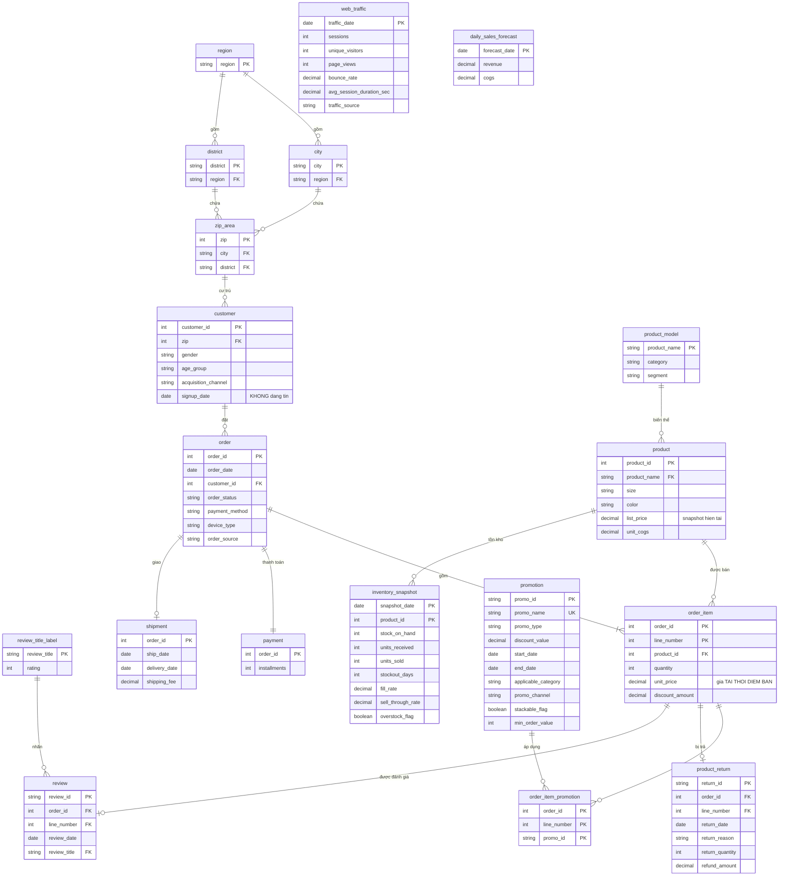

# Mô hình chuẩn hóa (1NF → 2NF → 3NF) — Datathon 2026 Round 1

Thiết kế mô hình quan hệ chuẩn hóa cho 14 file CSV nguồn, và trả lời câu hỏi
**khi nào dùng chuẩn nào**.

Mọi phụ thuộc hàm khẳng định ở đây đều được chứng minh trong `normalization.ipynb`.
Tài liệu song song: `star_schema.md` — **cùng dữ liệu, mô hình ngược lại** (§9 giải thích tại sao).

---

## 1. Hiểu dataset

14 file CSV phẳng, không có khai báo khóa, không có ràng buộc. Toàn vẹn tham chiếu thực tế
**hoàn hảo** (0 orphan trên 14 quan hệ — `data_model.ipynb` §3), nên đây là bài toán *khôi phục
cấu trúc từ dữ liệu*, không phải bài toán làm sạch.

| File | Dòng × Cột | Grain (1 dòng = ?) | Khóa tự nhiên | Phủ thời gian |
|---|---|---|---|---|
| `customers.csv` | 121.930 × 7 | 1 khách hàng | `customer_id` ✅ | — |
| `geography.csv` | 39.948 × 4 | 1 mã zip | `zip` ✅ | — |
| `products.csv` | 2.412 × 8 | 1 SKU | `product_id` ✅ | — |
| `promotions.csv` | 50 × 10 | 1 đợt khuyến mãi | `promo_id` ✅ | 2013 → 2022 |
| `orders.csv` | 646.945 × 8 | 1 đơn hàng | `order_id` ✅ | 2012-07-04 → 2022-12-31 |
| `order_items.csv` | 714.669 × 7 | 1 dòng hàng | ❌ **không có** | (theo đơn) |
| `payments.csv` | 646.945 × 4 | 1 đơn hàng | `order_id` ✅ | (theo đơn) |
| `shipments.csv` | 566.067 × 4 | 1 lô giao | `order_id` ✅ | 2012-07-04 → 2022-12-29 |
| `returns.csv` | 39.939 × 7 | 1 lần trả hàng | `return_id` ✅ | 2012-07-11 → 2022-12-31 |
| `reviews.csv` | 113.551 × 7 | 1 đánh giá | `review_id` ✅ | 2012-07-10 → 2022-12-31 |
| `inventory.csv` | 60.247 × 17 | 1 (cuối tháng × SP) | `(snapshot_date, product_id)` ✅ | 126 mốc, 2012-07 → 2022-12 |
| `web_traffic.csv` | 3.652 × 7 | 1 ngày | `date` ✅ | 2013-01-01 → 2022-12-31 |
| `sales.csv` | 3.833 × 3 | 1 ngày | `Date` ✅ | 2012-07-04 → 2022-12-31 |
| `sample_submission.csv` | 548 × 3 | 1 ngày | `Date` ✅ | 2023-01-01 → 2024-07-01 |

**Bốn cụm thực thể:**

- **Giao dịch bán** — `orders` → `order_items` → (`payments`, `shipments`, `returns`, `reviews`)
- **Danh mục** — `products`, `promotions`
- **Khách & địa lý** — `customers` → `geography`
- **Vận hành & tổng hợp** — `inventory`, `web_traffic`, `sales`, `sample_submission`

Hai điều định hình toàn bộ thiết kế:

1. **`order_items` là bảng duy nhất không có khóa tự nhiên** — mọi vấn đề 1NF bắt nguồn từ đây.
2. **Mọi bảng giao dịch dừng ở 2022-12-31**; chỉ `sample_submission` sống ở 2023–2024.
   Vùng dự báo tách biệt hoàn toàn khỏi vùng dữ liệu thật.

---

## 2. 1NF — nguyên tử, không nhóm lặp, định danh được từng dòng

### 2.1 `order_items` không có khóa tự nhiên hợp lệ

**32 dòng thuộc 16 đơn** có `(order_id, product_id)` trùng nhau — cùng đơn, cùng sản phẩm,
nhưng khác `quantity` và `unit_price`:

```text
 order_id  product_id  quantity  unit_price
    14280         976         1     4019.47
    14280         976         2     3937.99
   113379         786         6      694.34
   113379         786         1      699.37
```

Không có tổ hợp cột nào phân biệt được hai dòng này ⇒ **chưa phải một quan hệ**.
1NF đòi hỏi mỗi bộ (tuple) phải định danh được, không chỉ đòi "ô chứa giá trị nguyên tử".

**Sửa:** thêm `line_number` (tối đa 5 dòng/đơn) ⇒ PK `(order_id, line_number)`.

**Hệ quả bắt buộc cho ETL:** `returns` và `reviews` tham chiếu bằng `(order_id, product_id)`.
Với 16 cặp trùng, có **4 dòng `returns` và 2 dòng `reviews`** không xác định được trỏ vào dòng nào.
`line_number` **phải** được gán theo thứ tự xuất hiện ổn định trong file nguồn, gán **trước** khi join.

### 2.2 Nhóm lặp `promo_id` / `promo_id_2`

Một thuộc tính (khuyến mãi áp dụng) bị trải trên **hai cột đánh số** — đây là dạng vi phạm
1NF kinh điển nhất.

| | |
|---|---|
| `promo_id` có giá trị | 276.316 dòng (38,7%) |
| `promo_id_2` có giá trị | 206 dòng (0,03%) |
| dòng có `promo_id == promo_id_2` | **0** (⇒ PK bảng junction không đụng độ) |
| dòng có `promo_id_2` nhưng `promo_id` rỗng | **0** |

**Sửa:** `order_item_promotion(order_id, line_number, promo_id)` — **276.522 dòng**.

Chi phí thực tế khi *không* sửa:
- truy vấn "các dòng dùng promo X" phải `WHERE promo_id=X OR promo_id_2=X`;
- một đơn chồng 3 promo là phải **đổi schema**, không phải thêm dữ liệu.

Hai cặp promo đồng thời duy nhất trong dữ liệu đều là hai đợt khuyến mãi chồng cửa sổ thời gian
(`PROMO-0013`+`PROMO-0015`: 132 dòng; `PROMO-0023`+`PROMO-0025`: 74 dòng — xem `star_schema.md` §5.8).
Cột thứ hai không tùy tiện, nhưng cấu trúc "2 cột" vẫn sai.

### 2.3 Cột chết

`inventory.reorder_flag` chỉ có **1 giá trị duy nhất** (`0`) — không mang thông tin, loại bỏ.
(Không phải vi phạm chuẩn nào; chỉ là dọn dẹp.)

`inventory.year` / `month` khớp `snapshot_date` **100%** — đây là vi phạm **2NF**, xử lý ở §3.1.

---

## 3. 2NF — phụ thuộc bộ phận vào khóa tổ hợp

> **2NF chỉ có thể bị vi phạm khi khóa chính là tổ hợp.** Bảng có khóa đơn cột thì
> 2NF **luôn** thỏa mãn — không cần kiểm tra.

Trong 14 bảng, sau khi sửa 1NF chỉ còn **hai** bảng có khóa tổ hợp: `inventory` và `order_item`.

### 3.1 `inventory` vi phạm ở CẢ HAI vế của khóa `(snapshot_date, product_id)`

| Cột | Chỉ phụ thuộc | Bằng chứng | Xử lý |
|---|---|---|---|
| `product_name`, `category`, `segment` | `product_id` | 0 vi phạm / 1.624 SP | bỏ, thay bằng FK `product_id` |
| `year`, `month` | `snapshot_date` | 0 vi phạm / 126 mốc | bỏ, dẫn xuất từ ngày |

`category` của một sản phẩm bị lặp lại ở **mọi** mốc snapshot mà sản phẩm đó xuất hiện.
Đổi category một lần phải sửa tới 126 dòng — đúng định nghĩa *update anomaly*.

### 3.2 `order_item` KHÔNG vi phạm — kiểm cả ba cột không khóa

Cả ba cột không khóa đều đã kiểm và **không** phải phụ thuộc bộ phận:

**a) `unit_price`** — nếu phụ thuộc riêng `product_id` thì phải tách sang bảng `product`.
Thực tế: **1.509 vi phạm / 1.598 sản phẩm**, trung vị **88 giá khác nhau/sản phẩm** (tối đa 7.777).
Đây là giá **tại thời điểm bán**, cần cả khóa. Giữ trong `order_item`.

**b) `promo_id`** — nhìn qua có vẻ phụ thuộc `order_id`: **0/646.945 đơn** có nhiều hơn một
promo khác nhau. Nhưng:

- **269 đơn** có **cả** dòng mang promo lẫn dòng không mang ⇒ FD thất bại khi tính giá trị NULL;
- trong 269 đơn đó, **100%** promo có `applicable_category` khác NULL, và **100%** dòng mang promo
  có `product.category == applicable_category`.

⇒ Promo giới hạn theo category chỉ dính vào **dòng đủ điều kiện**. Khuyến mãi là thuộc tính
**cấp dòng hàng**, không phải cấp đơn. Bảng junction giữ nguyên grain dòng hàng.

*(Đây là kiểm tra duy nhất có thể lật ngược thiết kế — nếu FD `order_id → promo_id` đúng, bảng
junction sẽ phải nằm ở grain đơn.)*

**c) `discount_amount`** — `order_id → discount_amount`: **27.771 vi phạm**;
`product_id → discount_amount`: **1.455 vi phạm**. Chiết khấu phụ thuộc promo × giá trị dòng,
cần cả khóa.

*(`order_item_promotion` toàn khóa — all-key nên hiển nhiên đạt tới BCNF, không cần kiểm.
Vì vậy §3 chỉ nói tới **hai** bảng có khóa tổ hợp cần xét.)*

---

## 4. 3NF — phụ thuộc bắc cầu

3NF cấm **thuộc tính không khóa xác định thuộc tính không khóa** (`PK → A → B`).
Năm bảng vi phạm.

### 4.1 `products`: `product_id → product_name → category, segment`

| Kiểm tra | Kết quả |
|---|---|
| `product_name → category` | **0 vi phạm / 2.172 tên** |
| `product_name → segment` | **0 vi phạm / 2.172 tên** |
| 2.412 SKU ↔ 2.172 model | `(category, segment)` bị lặp thừa **240 lần** |

**Phân rã:**
```
product_model(product_name PK, category, segment)        -- 2.172 dòng
product(product_id PK, product_name FK, size, color, ...) -- 2.412 dòng
```

**Kiểm tra ngược quan trọng:** `(product_name, size, color)` có **240 dòng trùng** ⇒ **không phải khóa**.
Vậy `product_id` là định danh **cần thiết thật**, không phải surrogate trang trí:

```text
 product_id    product_name size color        price
        280 LotusWear UE-01    S   red 12596.850000
        380 LotusWear UE-01    S   red    34.036218
```

(Chênh lệch giá 370× này là vấn đề chất lượng dữ liệu đã ghi ở `star_schema.md` §6 mục 1 —
**không** phải trục phân tích.)

### 4.2 `customers` và `orders`: địa lý lặp qua hai tầng

| FD bắc cầu | Bằng chứng | Xử lý |
|---|---|---|
| `customer_id → zip → city` | `customers.city == geography.city`: lệch **0 / 121.930** | bỏ `customers.city` |
| `order_id → customer_id → zip` | `orders.zip == customers.zip`: lệch **0 / 646.945** | bỏ `orders.zip` |

Điểm thứ hai đồng thời chứng minh: **không tồn tại địa chỉ giao hàng riêng** trong dữ liệu.
`orders.zip` là bản sao phi chuẩn hóa, không phải ship-to address.

### 4.3 `reviews`: FD đi theo chiều `review_title → rating`

> ⚠️ **Sửa lại `star_schema.md` §5.6**, vốn phát biểu nhầm chiều ("`review_title` phụ thuộc hàm
> vào `rating`"). Chiều đúng là ngược lại.

| Chiều | Kết quả |
|---|---|
| `rating → review_title` | **SAI** — 5 vi phạm / 5 rating (mỗi rating có 3–4 title) |
| `review_title → rating` | **ĐÚNG** — 0 vi phạm / 18 title |

Mỗi title thuộc về đúng một rating (`"Highly recommend"` → luôn là 5), nhưng một rating dùng
nhiều title. Vậy phụ thuộc bắc cầu là `review_id → review_title → rating`.

**Phân rã:** `review_title_label(review_title PK, rating)` — 18 dòng; `review` giữ `review_title`,
`rating` suy ra qua join.

*Ghi chú thực dụng:* trong hầu hết hệ thống thật, `rating` là dữ liệu người dùng nhập và `review_title`
mới là thứ suy ra — cấu trúc ở đây là dấu vết của **dữ liệu sinh tổng hợp**. Nhưng dựa trên dữ liệu
đang có, FD chỉ chạy theo một chiều, và 3NF ép phải tách.

### 4.4 Cột sao chép từ bảng cha

| Cột | Bằng chứng | Xử lý |
|---|---|---|
| `payments.payment_method` | lệch **0 / 646.945** so với `orders` | bỏ — `order_id → orders → payment_method` |
| `reviews.customer_id` | lệch **0 / 113.551** so với `orders` | bỏ — suy ra từ `order_id` |

Sau khi bỏ `payment_method` và `payment_value` (§5), bảng `payments` **chỉ còn `installments`**.

*(`promotions.promo_name` unique 50/50 → chỉ là candidate key, **không** tạo FD bắc cầu. Giữ nguyên.)*

### 4.5 `geography` — nơi 3NF sách vở và thiết kế tốt tách nhau

Bốn FD, tất cả đều đúng tuyệt đối:

```
zip → city          (0 vi phạm / 39.948)
zip → district      (0 vi phạm / 39.948)
city → region       (0 vi phạm / 42)
district → region   (0 vi phạm / 39)
```

Nhưng `city` và `district` **cắt chéo nhau**: 1 city trải tối đa 19 district, 1 district trải tối đa
16 city. Không có cây phân cấp duy nhất.

**Phương án A — 3NF chặt (4 bảng):**
```
region(region PK)
city(city PK, region FK)              -- 42 dòng
district(district PK, region FK)      -- 39 dòng
zip_area(zip PK, city FK, district FK) -- 39.948 dòng
```

**Phương án B — phẳng ở grain zip (1 bảng):** giữ `geography(zip, city, district, region)` như nguồn.

**Đánh đổi thật, không phải đúng/sai:**

| | Phương án A | Phương án B |
|---|---|---|
| Chuẩn 3NF | ✅ đạt | ❌ `zip → city → region` là bắc cầu |
| Đổi region của một city | 1 dòng | tới ~1.000 dòng |
| Rủi ro | `region` tới được từ **cùng một zip theo hai đường** (`zip→city→region` và `zip→district→region`) mà schema **không** ép hai đường khớp nhau | dư thừa nhưng chỉ một nguồn |
| Số join để lấy region | 2–3 | 0 |

Phương án A đạt chuẩn nhưng *tạo ra* một lớp bất nhất mới mà chỉ ràng buộc ngoài schema mới chặn được.
Đây là ví dụ rõ nhất trong dataset cho thấy **3NF là công cụ, không phải mục tiêu**.

DDL §8 dùng phương án A (vì tài liệu này là bài toán chuẩn hóa); production nên cân nhắc B —
`star_schema.md` §5.4 đã lập luận cho hướng đó.

---

## 5. Dư thừa dẫn xuất — nguyên tắc RIÊNG, không phải 3NF

> Đây là chỗ hay bị gộp nhầm nhất. 3NF nói về **phụ thuộc hàm giữa các thuộc tính**.
> Cột *tính được* từ cột khác là một dạng dư thừa **khác**. Bỏ chúng vì nguyên tắc
> "không lưu cái tính được", **không phải** vì chuẩn hóa.

| Đối tượng | Kiểm chứng | Xử lý |
|---|---|---|
| `payments.payment_value` | == Σ(qty×price − discount) của đơn, khớp **100%** | bỏ |
| **toàn bộ `sales.csv`** | tái tạo từ `order_items`, sai số **2,2e-16** (Revenue) / **1,0e-08** (COGS) | **view**, không phải bảng cơ sở |
| `inventory.stockout_flag` | == `(stockout_days > 0)`, khớp **100%** | bỏ |
| `inventory.days_of_supply` | == `stock_on_hand/(units_sold/30)`, khớp **100%** | bỏ |

**Và chỗ phải dừng lại:** ba cột còn lại **không** chứng minh được là dẫn xuất từ cột giữ lại —
`fill_rate` (55,5%), `sell_through_rate` (65,9%), `overstock_flag` (93,6%).
Công thức hợp lý nhất chỉ khớp một phần ⇒ **giữ chúng làm measure độc lập, đừng đoán công thức**.

Đây là kỷ luật quan trọng: "trông giống dẫn xuất" không đủ để xóa cột. Chỉ xóa khi khớp 100%.

---

## 6. ERD — mô hình chuẩn hóa 3NF



`web_traffic` và `daily_sales_forecast` là hai bảng độc lập (không FK) — chúng ở grain ngày,
không nối vào cây giao dịch. `sales.csv` **không** xuất hiện: nó là view (§5).

---

## 7. Quy mô sau chuẩn hóa

| Bảng | Số dòng | Thay đổi so với nguồn |
|---|---:|---|
| `region` | 3 | tách từ `geography` |
| `city` | 42 | tách từ `geography` |
| `district` | 39 | tách từ `geography` |
| `zip_area` | 39.948 | `geography` còn lại |
| `customer` | 121.930 | bỏ `city` |
| `product_model` | 2.172 | **MỚI** — tách 3NF |
| `product` | 2.412 | bỏ `category`, `segment` |
| `promotion` | 50 | 1:1 |
| `order` | 646.945 | bỏ `zip` |
| `order_item` | 714.669 | **+ `line_number`**, bỏ 2 cột promo |
| `order_item_promotion` | 276.522 | **MỚI** — tách 1NF |
| `payment` | 646.945 | chỉ còn `installments` |
| `shipment` | 566.067 | 1:0..1 |
| `product_return` | 39.939 | FK trỏ dòng hàng |
| `review_title_label` | 18 | **MỚI** — tách 3NF |
| `review` | 113.551 | bỏ `customer_id`, `rating` |
| `inventory_snapshot` | 60.247 | 17 → 9 cột |
| `web_traffic` | 3.652 | 1:1 |
| `daily_sales_forecast` | 548 | `sample_submission` |
| **Tổng** | **3.235.699** | **19 bảng** (+ `sales` là view) |

Chuẩn hóa ở đây **thêm 5 bảng nhỏ** (`product_model` 2.172 + `review_title_label` 18 +
`region`/`city`/`district` 84 dòng) và 1 bảng junction, để xóa dư thừa lặp trên hàng trăm nghìn dòng.
Đổi lại: mỗi truy vấn phân tích tốn thêm 2–4 join.

---

## 8. DDL

**Mọi `CHECK` dưới đây đã được chạy thử trên dữ liệu nguồn** (`normalization.ipynb` §6):
11/12 ràng buộc **đạt** trên toàn bộ dữ liệu; ràng buộc duy nhất **thất bại** là
`return_quantity <= quantity` (1 dòng — `RET-043492`). Khai báo ràng buộc mà không kiểm
trước là cách chắc chắn nhất để pipeline chết lúc load.

```sql
-- ========== ĐỊA LÝ (3NF chặt — xem §4.5 về đánh đổi) ==========
CREATE TABLE region (
    region      VARCHAR(16) PRIMARY KEY
);                                                        -- 3 dòng

CREATE TABLE city (
    city        VARCHAR(64) PRIMARY KEY,
    region      VARCHAR(16) NOT NULL REFERENCES region
);                                                        -- 42 dòng

CREATE TABLE district (
    district    VARCHAR(32) PRIMARY KEY,
    region      VARCHAR(16) NOT NULL REFERENCES region
);                                                        -- 39 dòng

CREATE TABLE zip_area (
    zip         INTEGER     PRIMARY KEY,
    city        VARCHAR(64) NOT NULL REFERENCES city,
    district    VARCHAR(32) NOT NULL REFERENCES district
);                                                        -- 39.948 dòng
-- ⚠ region tới được theo 2 đường; cần ràng buộc ngoài schema để ép chúng khớp

-- ========== KHÁCH HÀNG ==========
CREATE TABLE customer (
    customer_id         INTEGER     PRIMARY KEY,
    zip                 INTEGER     NOT NULL REFERENCES zip_area,
    gender              VARCHAR(16) NOT NULL,
    age_group           VARCHAR(16) NOT NULL,
    acquisition_channel VARCHAR(32) NOT NULL,
    signup_date         DATE                            -- ⚠ 73,8% đơn TRƯỚC ngày này
);                                                        -- 121.930 dòng

-- ========== DANH MỤC ==========
CREATE TABLE product_model (
    product_name  VARCHAR(64) PRIMARY KEY,
    category      VARCHAR(32) NOT NULL,
    segment       VARCHAR(32) NOT NULL
);                                                        -- 2.172 dòng

CREATE TABLE product (
    product_id    INTEGER       PRIMARY KEY,
    product_name  VARCHAR(64)   NOT NULL REFERENCES product_model,
    size          VARCHAR(4)    NOT NULL,
    color         VARCHAR(16)   NOT NULL,
    list_price    DECIMAL(14,6) NOT NULL,   -- ⚠ 2 hệ đơn vị, star_schema.md §6 mục 1
    unit_cogs     DECIMAL(14,6) NOT NULL,
    CHECK (unit_cogs <= list_price)
);                                                        -- 2.412 dòng
-- (product_name, size, color) KHÔNG unique (240 trùng) ⇒ product_id là cần thiết

CREATE TABLE promotion (
    promo_id            VARCHAR(16)   PRIMARY KEY,
    promo_name          VARCHAR(64)   NOT NULL UNIQUE,
    promo_type          VARCHAR(16)   NOT NULL,
    discount_value      DECIMAL(10,2) NOT NULL,
    start_date          DATE          NOT NULL,
    end_date            DATE          NOT NULL,
    applicable_category VARCHAR(32),  -- NULL = mọi category; khớp product_model.category
    promo_channel       VARCHAR(24)   NOT NULL,
    stackable_flag      BOOLEAN       NOT NULL,
    min_order_value     INTEGER       NOT NULL,
    CHECK (end_date >= start_date)
);                                                        -- 50 dòng

-- ========== GIAO DỊCH ==========
CREATE TABLE "order" (
    order_id       INTEGER     PRIMARY KEY,
    order_date     DATE        NOT NULL,
    customer_id    INTEGER     NOT NULL REFERENCES customer,
    order_status   VARCHAR(16) NOT NULL,
    payment_method VARCHAR(24) NOT NULL,
    device_type    VARCHAR(12) NOT NULL,
    order_source   VARCHAR(24) NOT NULL
);                                                        -- 646.945 dòng; ĐÃ BỎ zip (§4.2)

CREATE TABLE order_item (
    order_id        INTEGER       NOT NULL REFERENCES "order",
    line_number     SMALLINT      NOT NULL,               -- BẮT BUỘC, xem §2.1
    product_id      INTEGER       NOT NULL REFERENCES product,
    quantity        SMALLINT      NOT NULL CHECK (quantity > 0),
    unit_price      DECIMAL(14,4) NOT NULL,               -- giá TẠI THỜI ĐIỂM BÁN
    discount_amount DECIMAL(16,4) NOT NULL DEFAULT 0,
    PRIMARY KEY (order_id, line_number)
);                                                        -- 714.669 dòng

CREATE TABLE order_item_promotion (                        -- tách nhóm lặp, §2.2
    order_id    INTEGER     NOT NULL,
    line_number SMALLINT    NOT NULL,
    promo_id    VARCHAR(16) NOT NULL REFERENCES promotion,
    PRIMARY KEY (order_id, line_number, promo_id),
    FOREIGN KEY (order_id, line_number) REFERENCES order_item
);                                                        -- 276.522 dòng

CREATE TABLE payment (
    order_id     INTEGER  PRIMARY KEY REFERENCES "order",
    installments SMALLINT NOT NULL CHECK (installments > 0)
);   -- 646.945 dòng — payment_method (§4.4) và payment_value (§5) đã bỏ

CREATE TABLE shipment (
    order_id      INTEGER       PRIMARY KEY REFERENCES "order",
    ship_date     DATE          NOT NULL,
    delivery_date DATE,
    shipping_fee  DECIMAL(10,2) NOT NULL,
    CHECK (delivery_date IS NULL OR delivery_date >= ship_date)
);   -- 566.067 dòng — 80.878 đơn KHÔNG có shipment ⇒ quan hệ 1:0..1

CREATE TABLE product_return (
    return_id       VARCHAR(16)   PRIMARY KEY,
    order_id        INTEGER       NOT NULL,
    line_number     SMALLINT      NOT NULL,
    return_date     DATE          NOT NULL,
    return_reason   VARCHAR(32)   NOT NULL,
    return_quantity SMALLINT      NOT NULL CHECK (return_quantity > 0),
    refund_amount   DECIMAL(16,2) NOT NULL,
    FOREIGN KEY (order_id, line_number) REFERENCES order_item
);   -- 39.939 dòng
-- ⚠ 1 dòng (RET-043492) có return_quantity=3 > quantity=1 ⇒ CHECK liên bảng phải
--   là trigger/assertion, và dòng này sẽ bị chặn khi load

CREATE TABLE review_title_label (                          -- tách 3NF, §4.3
    review_title VARCHAR(64) PRIMARY KEY,
    rating       SMALLINT    NOT NULL CHECK (rating BETWEEN 1 AND 5)
);                                                        -- 18 dòng

CREATE TABLE review (
    review_id    VARCHAR(16) PRIMARY KEY,
    order_id     INTEGER     NOT NULL,
    line_number  SMALLINT    NOT NULL,
    review_date  DATE        NOT NULL,
    review_title VARCHAR(64) NOT NULL REFERENCES review_title_label,
    FOREIGN KEY (order_id, line_number) REFERENCES order_item,
    UNIQUE (order_id, line_number)                         -- 1 đánh giá / dòng hàng
);   -- 113.551 dòng — rating suy ra qua join, customer_id đã bỏ (§4.4)

-- ========== VẬN HÀNH ==========
CREATE TABLE inventory_snapshot (
    snapshot_date     DATE          NOT NULL,
    product_id        INTEGER       NOT NULL REFERENCES product,
    stock_on_hand     INTEGER       NOT NULL,
    units_received    INTEGER       NOT NULL,
    units_sold        INTEGER       NOT NULL,   -- ⚠ không khớp order_item (star_schema.md §6 mục 3)
    stockout_days     SMALLINT      NOT NULL,
    fill_rate         DECIMAL(6,4)  NOT NULL,   -- GIỮ: không tính được từ cột trên (§5)
    sell_through_rate DECIMAL(6,4)  NOT NULL,   -- GIỮ
    overstock_flag    BOOLEAN       NOT NULL,   -- GIỮ
    PRIMARY KEY (snapshot_date, product_id)
);   -- 60.247 dòng; 17 → 9 cột
-- ĐÃ BỎ: product_name/category/segment (2NF), year/month (2NF),
--         stockout_flag + days_of_supply (dẫn xuất 100%), reorder_flag (chết)

CREATE TABLE web_traffic (
    traffic_date             DATE         PRIMARY KEY,
    sessions                 INTEGER      NOT NULL,
    unique_visitors          INTEGER      NOT NULL,
    page_views               INTEGER      NOT NULL,
    bounce_rate              DECIMAL(8,5) NOT NULL,   -- ⚠ ≈0,005, phi thực tế
    avg_session_duration_sec DECIMAL(8,1) NOT NULL,
    traffic_source           VARCHAR(24)  NOT NULL,   -- ⚠ 1 nhãn/ngày, KHÔNG phải phân rã
    CHECK (unique_visitors <= sessions)
);                                                        -- 3.652 dòng

CREATE TABLE daily_sales_forecast (
    forecast_date DATE          PRIMARY KEY,
    revenue       DECIMAL(18,2) NOT NULL,
    cogs          DECIMAL(18,2) NOT NULL
);                                                        -- 548 dòng (2023-01-01 → 2024-07-01)

-- ========== sales.csv = VIEW, không phải bảng (§5) ==========
CREATE VIEW daily_sales AS
SELECT o.order_date                               AS sale_date,
       SUM(oi.quantity * oi.unit_price)           AS revenue,   -- gross, KHÔNG trừ discount
       SUM(oi.quantity * p.unit_cogs)             AS cogs
FROM   order_item oi
JOIN   "order"    o ON o.order_id   = oi.order_id
JOIN   product    p ON p.product_id = oi.product_id
GROUP  BY o.order_date;
```

Danh sách 10 vấn đề chất lượng dữ liệu và quy tắc kiểm tra khi load: xem `star_schema.md` §6.

---

## 9. Khi nào dùng chuẩn nào

### 9.1 Ba chuẩn, ba câu hỏi khác nhau

| Chuẩn | Câu hỏi nó trả lời | Vi phạm trong dataset này | Tính chất |
|---|---|---|---|
| **1NF** | Mỗi dòng có định danh được không? Có nhóm lặp không? | **2 vi phạm, cùng ở `order_items`** | **Không thương lượng** |
| **2NF** | Thuộc tính có phụ thuộc *một phần* khóa tổ hợp không? | **1 bảng** — `inventory` | Chỉ tồn tại khi có khóa tổ hợp |
| **3NF** | Thuộc tính không khóa có xác định thuộc tính không khóa không? | **5 bảng** — `products`, `customers`, `orders`, `reviews`, `payments`; **+ `geography`** là judgment call (§4.5) | Mặc định cho OLTP |

### 9.1b Schema thay đổi thế nào qua từng bậc

| Bậc | Số bảng | Thay đổi so với bậc trước |
|---|---:|---|
| Nguồn (14 file CSV) | 14 | `order_items` không có khóa; `inventory` 17 cột |
| **Sau 1NF** | 15 | **+1 bảng** `order_item_promotion`; `order_item` thêm `line_number` |
| **Sau 2NF** | 15 | **+0 bảng** — chỉ chuyển cột: `inventory` 17 → 12 cột (3 cột về `product`, 2 cột về `snapshot_date`) |
| **Sau 3NF** | 20 | **+5 bảng** `product_model`, `region`, `city`, `district`, `review_title_label`; `geography` → `zip_area`; bỏ 5 cột sao chép ở `customers`/`orders`/`payments`/`reviews` |
| Sau khi bỏ dẫn xuất (§5) | **19** | `sales` → **view**; `payment` còn 2 cột; `inventory_snapshot` 12 → 9 cột |

Ba quan sát đọc thẳng từ bảng này:

- **1NF thêm bảng vì cấu trúc sai**, không phải vì dư thừa — nhóm lặp buộc phải tách.
- **2NF không thêm bảng nào.** Nó chỉ chuyển cột về đúng chủ sở hữu. Đây là lý do 2NF "rẻ" nhất
  trong ba bậc — và cũng là lý do người ta hay quên nó.
- **3NF tạo nhiều bảng nhất (+5)** và tất cả đều là bảng nhỏ (3–2.172 dòng) tra cứu thuộc tính.
  Chi phí không nằm ở lưu trữ mà ở **số join mỗi truy vấn**.

### 9.2 Dùng 1NF: luôn luôn

Không phải lựa chọn thiết kế mà là điều kiện để dữ liệu **là** một quan hệ.
Chi phí cụ thể ở dataset này:

- `order_items` không định danh được dòng ⇒ **4 dòng `returns` + 2 dòng `reviews` không biết trỏ vào đâu**.
  Đây là mất mát *thông tin*, không phải bất tiện *truy vấn*.
- 2 cột promo ⇒ mỗi truy vấn promo phải `OR` hai cột; thêm promo thứ ba phải đổi schema.

### 9.3 Dùng 2NF: chỉ khi có khóa tổ hợp

Đây là câu trả lời cấu trúc, không phải kinh nghiệm: **2NF không thể bị vi phạm nếu PK là một cột**.
Trong 14 bảng ở đây chỉ có 1 bảng vi phạm.

Vì hệ thống hiện đại hay dùng surrogate key đơn cột (`id BIGSERIAL`), 2NF thường "có sẵn miễn phí" —
đó là lý do nó ít khi xuất hiện trong thực tế. Nhưng **bảng snapshot, bảng bridge, bảng junction
mang thêm thuộc tính** thì bắt buộc có khóa tổ hợp — và đó chính là chỗ phải kiểm 2NF.
`inventory` là ví dụ mẫu: mọi thuộc tính sản phẩm bị lặp qua 126 mốc thời gian.

### 9.4 Dùng 3NF: hệ OLTP, ghi nhiều, dữ liệu là nguồn sự thật

3NF ngăn **update anomaly** — sửa một sự thật ở một chỗ, các bản sao còn lại lệch đi.
Chọn 3NF khi:

- có nghiệp vụ **ghi/sửa** (đặt hàng, cập nhật danh mục, đổi địa chỉ);
- dữ liệu là **nguồn sự thật**, không phải bản sao;
- ràng buộc toàn vẹn phải do **database** đảm bảo, không phải do pipeline.

**Không** chọn 3NF khi: workload chỉ đọc, join là nút thắt cổ chai, và người dùng cuối viết SQL
trực tiếp (mô hình 19 bảng với 4 tầng địa lý là gánh nặng nhận thức thật).

### 9.5 Punchline: cùng dataset này đã có một mô hình CỐ TÌNH vi phạm 3NF

`star_schema.md` mô tả mô hình chiều cho **chính dữ liệu này** — và nó vi phạm 3NF **có chủ đích**:

| Quyết định trong star schema | Vi phạm 3NF nào |
|---|---|
| `dim_product` mang `category`, `segment` phẳng | chính là §4.1 |
| §5.4 đề xuất gộp `city/district/region` vào `dim_customer` | chính là §4.5 |
| `dim_order_junk` gộp 4 thuộc tính cardinality thấp | phi chuẩn hóa có chủ đích |
| `fact_daily_sales` lưu sẵn số tổng hợp | chính là §5 |

Không mô hình nào sai. Chúng tối ưu cho hai thứ khác nhau:

| Tiêu chí | 3NF (tài liệu này) | Star schema (`star_schema.md`) | One Big Table |
|---|---|---|---|
| Workload | ghi nhiều, OLTP | đọc nhiều, phân tích | đọc, ML/feature |
| Số bảng | 19 | 14 | 1 |
| Join để trả lời "doanh thu theo region" | 5 | 2 | 0 |
| Rủi ro update anomaly | thấp nhất | trung bình | cao nhất |
| Chi phí lưu trữ | thấp nhất | trung bình | cao nhất |
| Người dùng cuối viết SQL được | khó | dễ | rất dễ |

### 9.6 Điều trung thực phải nói về dataset này

Dữ liệu này **chỉ đọc**: 14 file CSV tĩnh, không có nghiệp vụ ghi. Update anomaly mà 3NF ngăn chặn
ở đây là **giả định**, không phải rủi ro đang xảy ra. Không ai sẽ đổi `category` của một sản phẩm
trong 60.247 dòng `inventory`, vì không ai đổi gì cả.

Nên phát biểu chính xác là:

- **3NF là đúng nếu đây là hệ OLTP nguồn** đã sinh ra các file này — và bài tập chuẩn hóa cho thấy
  hệ nguồn đó *đáng lẽ* trông như thế nào;
- **star schema là đúng cho công việc thực tế đang làm** (dự báo Revenue/COGS theo ngày);
- **giá trị thật của việc chuẩn hóa ở đây là chẩn đoán**: nó phát hiện `order_items` không có khóa
  (ảnh hưởng tới join returns/reviews), phát hiện chiều FD của `review_title` bị ghi ngược trong
  tài liệu cũ, và tách bạch được "cột dẫn xuất" khỏi "vi phạm chuẩn".

---

## 10. Việc chưa làm

Thiết kế dừng ở mức mô hình + DDL. Chưa viết pipeline ETL, chưa load. Ba việc phải làm khi triển khai:

1. **Gán `line_number`** theo thứ tự dòng ổn định trong file nguồn — làm **trước** mọi join
   `returns`/`reviews` (§2.1).
2. **Ràng buộc liên bảng** (`return_quantity <= quantity`, tính nhất quán `region` hai đường ở §4.5)
   phải là trigger hoặc test khi load — DDL thuần không diễn đạt được.
3. **Chọn định nghĩa doanh thu**: `sales.csv` dùng **gross**, `payments` dùng **net**.
   Hai định nghĩa cùng tồn tại trong nguồn (`star_schema.md` §5.2).
